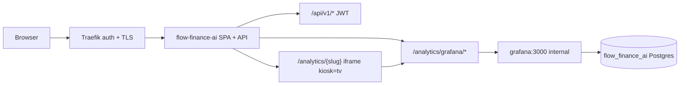

# Architecture archive pack (2026-06-08)

- Rollover trigger: `ARCH_HOT_MAX_LINES=3000, ARCH_HOT_MAX_STORY_SECTIONS=100`
- Source: `docs/engineering/architecture.md`
- Archived units (oldest first, contiguous prefix): 2
- Retained units in hot file: 8
- First archived heading: `## US-0011 — Unified analytics UI in financegnome (Grafana in-app)`
- Last archived heading: `## US-0012 — Auto-provision application database on first start`
- Verification tuple (mandatory):
  - archived_body_lines=696
  - preamble_lines=10
  - retained_body_lines=2576

---

## US-0011 — Unified analytics UI in financegnome (Grafana in-app)

**Status:** architecture complete (2026-06-02)  
**Research:** R-0054 (discovery route map; dedicated `/research` spike deferred — intake research satisfies architecture gate)  
**Decisions:** DEC-0057 (extends DEC-0012 dashboard uids, DEC-0056 internal Grafana, DEC-0006 SPA auth)  
**Spec-pack:** `docs/engineering/spec-pack/US-0011-{design-concept,crs,technical-specification}.md`  
**Depends on:** US-0010 external deploy (Grafana on `traefik` network, no public host by default), US-0002–US-0009 Grafana JSON provisioning

### System context



Operator-facing analytics today split across **React + ECharts** product pages (`/forecast`, `/wealth`, …) and **six Grafana SQL dashboards** (DEC-0012 uids). Only Wealth opens Grafana in a **new tab** via `VITE_GRAFANA_URL`. US-0011 unifies Grafana views **inside** the financegnome shell without removing the Grafana container or reimplementing SQL panels.

**Trust boundary:** Traefik `auth` (+ optional OIDC on SPA) protects the public origin. Grafana is not routable from the internet when `GRAFANA_TRAEFIK_HOST` is empty (DEC-0056). Anonymous Grafana Viewer behind the proxy is acceptable because upstream is network-isolated (DEC-0057).

### Dashboard → route map (canonical)

| Provisioned JSON | uid | React path | Iframe `src` (relative to embed base) |
|------------------|-----|------------|----------------------------------------|
| `platform-health.json` | `platform-health` | `/analytics/platform-health` | `/d/platform-health/platform-health?kiosk=tv` |
| `analytics/cashflow.json` | `cashflow` | `/analytics/cashflow` | `/d/cashflow/cashflow?kiosk=tv` |
| `analytics/subscriptions.json` | `subscriptions` | `/analytics/subscriptions` | `/d/subscriptions/subscriptions?kiosk=tv` |
| `analytics/budgets.json` | `budgets` | `/analytics/budgets` | `/d/budgets/budgets?kiosk=tv` |
| `analytics/portfolio.json` | `portfolio` | `/analytics/portfolio` | `/d/portfolio/portfolio?kiosk=tv` |
| `analytics/forecast-horizons.json` | `forecast-horizons` | `/analytics/forecast-horizons` | `/d/forecast-horizons/forecast-horizons?kiosk=tv` |

**Embed base (build-time):** `VITE_GRAFANA_EMBED_BASE` default `/analytics/grafana`  
**Full iframe URL:** ``${VITE_GRAFANA_EMBED_BASE}/d/{uid}/{slug}?kiosk=tv``

**Sidebar IA:** new **Analytics** nav group with six `NavLink`s (labels = dashboard Title). Optional **Platform Health** entry above the Analytics group or as first item in the group.

### Reverse proxy contract (DEC-0057)

| Element | Contract |
|---------|----------|
| Public prefix | `/analytics/grafana/` |
| Upstream | `GRAFANA_UPSTREAM` default `http://grafana:3000` (server env only) |
| Path handling | Strip `/analytics/grafana` prefix; forward remainder to upstream root (no `GF_SERVER_SERVE_FROM_SUB_PATH`) |
| Methods | GET, HEAD, POST (Grafana query API); OPTIONS for CORS preflight if needed |
| WebSocket | Forward `Connection: upgrade` / `Upgrade` for live panel refresh |
| Response headers | Remove or replace `X-Frame-Options: DENY/SAMEORIGIN` on proxied responses; avoid forwarding Grafana `Set-Cookie` to browser |
| Router placement | Merge **before** SPA `ServeDir` fallback in `build_router`; **outside** `/api/v1` `require_auth` middleware |
| Dev | `GRAFANA_UPSTREAM=http://localhost:3000` when Grafana published on host port |

**Alternative rejected:** `/api/v1/analytics/grafana/*` — couples embed static assets to API auth and JWT middleware (DEC-0057).

#### Grafana container environment (execute)

Add to `grafana` service `environment` (compose base + external overlay unchanged for networking):

```yaml
GF_AUTH_ANONYMOUS_ENABLED: "true"
GF_AUTH_ANONYMOUS_ORG_ROLE: Viewer
GF_SECURITY_ALLOW_EMBEDDING: "true"
```

Keep `GF_USERS_ALLOW_SIGN_UP: "false"`. Do **not** enable public Traefik router for US-0011 acceptance path.

**Alternative deferred:** Grafana auth-proxy headers mapped from OIDC — decision gate in DEC-0057 if anonymous proves insufficient on omniflow smoke.

#### Environment variables

| Variable | Scope | Default | Notes |
|----------|-------|---------|-------|
| `GRAFANA_UPSTREAM` | backend runtime | `http://grafana:3000` | Docker DNS on `traefik` / default network |
| `VITE_GRAFANA_EMBED_BASE` | frontend build | `/analytics/grafana` | Same-origin path; no trailing slash required if code normalizes |
| `VITE_GRAFANA_URL` | frontend build | — | **Deprecated** — remove Wealth external-tab usage |
| `GRAFANA_TRAEFIK_HOST` | compose overlay | empty | Optional escape hatch only; not used by embed iframes |

Document all four in `.env.example` omniflow block with DEC-0056 cross-reference.

### Frontend components (execute)

| Component | Responsibility |
|-----------|----------------|
| `AnalyticsEmbedPage` | Props: `uid`, `slug`, `title`; full-width responsive iframe; `loading`/`error` shell states |
| `App.tsx` | Six routes under `ProtectedRoute` → `/analytics/:slug` or explicit six routes |
| `AppLayout.tsx` | `analyticsNavItems` group; preserve collapsed sidebar labels |
| `WealthPage.tsx` | Primary portfolio analytics → `<Link to="/analytics/portfolio">` (AC-5) |

**Regression guard:** existing `/forecast`, `/wealth`, `/planning`, `/subscriptions`, `/alerts` ECharts flows unchanged (AC-4).

**CSP:** default same-origin iframe needs `frame-src 'self'` only when CSP meta/header added; no `GRAFANA_TRAEFIK_HOST` in `frame-src` for MVP.

### Future-chart guideline (AC-6)

Document in `docs/user-guides/US-0011.md`:

1. **Default:** new product charts → React page + REST API + ECharts (same shell, sidebar entry).
2. **Exception:** Grafana embed only for SQL-heavy ops panels tied to existing provisioning until a deliberate migration story retires the panel.
3. **Cross-links:** product pages may link to `/analytics/{slug}` as secondary “SQL view”; product page remains canonical for interactive flows (see DEC-0057 UX table).

### Acceptance mapping

| AC | Architecture anchor |
|----|---------------------|
| AC-1 Analytics sidebar + routes | Route map + `AppLayout` group |
| AC-2 In-app open (no default new tab) | iframe on `/analytics/*`; DEC-0057 proxy |
| AC-3 Traefik + auth | Edge auth on financegnome origin; proxy outside JWT |
| AC-4 ECharts regression | Out of scope for proxy changes to `/api/v1` |
| AC-5 Wealth migration | `/analytics/portfolio` replaces `VITE_GRAFANA_URL` tab |
| AC-6 Future-chart + operator guide | User guide + DEC-0057 UX table |
| AC-7 Single URL | No required `GRAFANA_TRAEFIK_HOST` |

### Risks

| Risk | Mitigation | Ref |
|------|------------|-----|
| iframe blocked by framing headers | Proxy strips/replaces `X-Frame-Options` | DEC-0057, R-0054 |
| WS/live refresh broken | Explicit upgrade in proxy; QA smoke | discovery open Q |
| Anonymous Grafana too permissive | Viewer role only; internal network; no public router | DEC-0056, DEC-0057 |
| Traefik auth + OIDC confusion | Document dev `AUTH_DEV_BYPASS` vs production | US-0010 runbook |
| Duplicate ECharts vs Grafana metrics | Canonical UX table in user guide | backlog |
| Upstream SSRF misconfig | Allowlist `grafana` host in config validation | DEC-0057 |

### Decisions (US-0011)

| ID | Topic | Summary |
|----|-------|---------|
| DEC-0057 | Analytics proxy + embed | `/analytics/grafana/` same-origin proxy; anonymous Viewer Grafana; env contract; deprecate `VITE_GRAFANA_URL` |

Full record: `decisions/DEC-0057.md`

### Out of scope (US-0011)

- Removing Grafana container or rewriting dashboard SQL to ECharts
- Public `GRAFANA_TRAEFIK_HOST` as default UX
- Grafana auth-proxy / OIDC header federation (deferred gate)
- Changing DEC-0012 panel queries or uids
- US-0010 compose/Traefik work except Grafana anonymous env vars

### Next phase

`/sprint-plan` — decompose 7 acceptance criteria; expect ~8–10 tasks (proxy, compose env, 6 routes/nav, Wealth migration, user guide, smoke test). Split only if > `SPRINT_MAX_TASKS` (12).

---

## US-0012 — Auto-provision application database on first start

**Status:** Architecture complete (2026-06-03)  
**Research:** R-0055, R-0053 §1  
**Decisions:** DEC-0058 (extends DEC-0003 startup retry, amends DEC-0056 operator DB-create preflight)  
**Depends on:** US-0010 external profile (shared `postgres` on `traefik` network)

### Problem

External PostgreSQL rejects connections to non-existent databases (`3D000`). Current startup connects directly to `DATABASE_NAME`, retries until budget exhaustion (DEC-0003), then runs migrations. Operators on omniflow run manual `CREATE DATABASE flow_finance_ai` before `compose up` (US-0010 runbook §1).

### Startup ordering (canonical)

Insert **`DbPool::ensure_database(&config)`** in `backend/src/lib.rs` before existing pool connect:

```
AppConfig::load()  [validates DATABASE_NAME allowlist]
       │
       ▼
ensure_database()  ── maintenance pool (retry: DEC-0003 startup_retry_*)
       │              ├─ pg_database existence check (parameterized)
       │              ├─ CREATE DATABASE … OWNER app_user (if absent)
       │              └─ CREATE EXTENSION timescaledb on app DB (maintenance creds)
       ▼
connect_with_retry()  ── app pool → DATABASE_NAME
       ▼
run_migrations()  ── 001 still CREATE EXTENSION IF NOT EXISTS (idempotent)
       ▼
service wiring (unchanged)
```

**Fail-closed:** bootstrap errors exit before migrations — no partial schema on privilege or TimescaleDB failure.

### Module layout

| File | Responsibility |
|------|----------------|
| `backend/src/db/bootstrap.rs` | `ensure_database`, existence check, create, extension, reason-code logging |
| `backend/src/db/mod.rs` | `pub mod bootstrap;`, re-export `ensure_database` |
| `backend/src/config/mod.rs` | Parse `DATABASE_BOOTSTRAP_URL`; `maintenance_database_url()`; `validate_database_name()` |
| `backend/src/lib.rs` | Call `ensure_database` before `connect_with_retry` |

Use short-lived `PgConnection` / single-connection pool for maintenance and extension steps — do not reuse app `PgPool` max_connections budget.

### Env contract (DEC-0058)

| Variable | Required | Purpose |
|----------|----------|---------|
| `DATABASE_HOST`, `DATABASE_PORT`, `DATABASE_NAME`, `DATABASE_USER`, `DATABASE_PASSWORD` | runtime (existing) | App connection + migrations — unchanged |
| `DATABASE_BOOTSTRAP_URL` | optional | Full postgres URL to maintenance DB (`…/postgres`); admin/superuser; env-only |

**Resolution order:**

1. `DATABASE_BOOTSTRAP_URL` set → maintenance connection only.
2. Else → derive `postgres://{USER}:{PASSWORD}@{HOST}:{PORT}/postgres` from runtime vars.

**Out of scope env:** auto-create `DATABASE_USER`; `DATABASE_URL` for bootstrap (use `DATABASE_BOOTSTRAP_URL`).

### Bootstrap sequence (idempotent)

| Step | Action | Idempotency |
|------|--------|-------------|
| 1 | Maintenance connect (`postgres` DB) | DEC-0003 retry loop |
| 2 | `SELECT 1 FROM pg_database WHERE datname = $1` | portable (R-0055) |
| 3a | Absent: `CREATE DATABASE "{name}" OWNER "{app_user}"` | never drop/recreate |
| 3b | Present: skip create | never recreate |
| 4 | Log `database_bootstrap_grants_applied` when bootstrap user ≠ app user and create ran | OWNER handles grants |
| 5 | Connect to app DB with maintenance creds → extension check/create | run on new and existing DB missing extension |
| 6 | Fail closed on privilege (`42501`) or missing TimescaleDB server files | do not proceed to migrations |
| 7 | App `connect_with_retry` → `run_migrations` | migration 001 duplicate-safe |

**Wrong-password behavior (unchanged):** bootstrap may succeed via admin URL while app connect still fails — bootstrap does not fix credential typos.

### Structured log reason codes

Tracing field **`bootstrap_reason`** — stable operator/CI contract (full table in DEC-0058). Human-readable messages cite runbook § Omniflow external deploy §1 (TimescaleDB host install); never echo bootstrap URL secrets.

### Privilege matrix

| Deployment | App role | Bootstrap path |
|------------|----------|----------------|
| Greenfield dev (`DATABASE_USER` with `CREATEDB`) | has `CREATEDB` | derived maintenance URL |
| Omniflow shared `postgres` | `finance` without `CREATEDB` | **`DATABASE_BOOTSTRAP_URL`** with admin/`postgres` superuser |
| CI / test fixture | superuser | derived or `DATABASE_BOOTSTRAP_TEST_URL` |
| DB already exists | any | skip create; extension attempt if missing |

### TimescaleDB alignment

| Layer | Owner |
|-------|-------|
| Host OS packages + `shared_preload_libraries` | Operator (R-0053 §1) — **out of scope** US-0012 |
| `CREATE EXTENSION timescaledb` on app DB | Bootstrap before migrations + migration 001 (keep) |
| Hypertables (002+) | Unchanged |

**Amends US-0010 architecture § PostgreSQL/TimescaleDB preflight:** remove manual “create database `flow_finance_ai`” as blocking step; retain TimescaleDB server install + preflight `SELECT extversion …` when extension bootstrap fails.

### Runbook delta plan (execute — docs only in architecture phase)

| Artifact | Change |
|----------|--------|
| `docs/engineering/runbook.md` § Omniflow §1 | Replace “create DB/user first” with auto-provision + `DATABASE_BOOTSTRAP_URL` when app role lacks `CREATEDB`; TimescaleDB host install block unchanged |
| `.env.example` omniflow block | Add `DATABASE_BOOTSTRAP_URL`; shrink manual SQL to TimescaleDB host-only note |
| `docs/engineering/architecture.md` US-0010 § preflight | Cross-link US-0012 (this section) |
| `decisions/DEC-0056.md` | Footnote: DB create automated by DEC-0058; TimescaleDB preflight retained |

No new Compose services.

### Test strategy

| Tier | Scope | When runs |
|------|-------|-----------|
| **Unit** | `validate_database_name` allowlist; maintenance URL builder (no secrets in debug fmt); reason-code mapping | Always (`cargo test --lib`) |
| **Integration** | `backend/tests/database_bootstrap_integration.rs` — ephemeral DB name, `ensure_database` creates DB, idempotent second call skips, optional extension assert | When `DATABASE_BOOTSTRAP_TEST_URL` or superuser `DATABASE_URL` with maintenance access set |
| **CI optional job** | `postgres:16` service — create path without TimescaleDB; separate job or manual matrix with `timescale/timescaledb` for extension-ok path | Document in runbook; not blocking default CI if integration skips |

**AC-6 mapping:** integration test proves create-if-missing without operator manual SQL; privilege-fail case via non-`CREATEDB` role + absent bootstrap URL (expect `database_bootstrap_failed_privilege`).

Wire through `tests/run-tests.sh` when test env present (same pattern as existing `DATABASE_URL` gated tests).

### Risks

| Risk | Mitigation |
|------|------------|
| Bootstrap URL secret leakage | Redact passwords in logs; `.env.example` warns never commit |
| Owner vs grant on shared host | `CREATE DATABASE … OWNER` (DEC-0058) |
| Extension privilege on shared Postgres | Maintenance creds for extension step |
| TimescaleDB missing after DB create | `database_bootstrap_failed_timescaledb` before migration panic |
| Identifier injection | Config-load allowlist |
| Duplicate failure modes with migration 001 | Bootstrap fails first with structured code |

### Decisions (US-0012)

| ID | Topic | Summary |
|----|-------|---------|
| DEC-0058 | Database bootstrap on first start | In-app `ensure_database`; optional `DATABASE_BOOTSTRAP_URL`; OWNER create; extension via maintenance creds; `bootstrap_reason` codes |

Full record: `decisions/DEC-0058.md`

### Out of scope (US-0012)

- Host TimescaleDB package install / `postgresql.conf` edits
- Auto-create PostgreSQL role (`DATABASE_USER`)
- Embedded/bundled Postgres Compose service
- Firefly database provisioning

### Next phase

`/sprint-plan` — decompose 6 acceptance criteria; expect ~7–9 tasks (bootstrap module, config, lib wiring, env/runbook docs, integration test). Single sprint under `SPRINT_MAX_TASKS` (12).

---

## BUG-0002 — Omniflow production integration defects (Firefly sync + risk-score + exchange settings)

**Status:** architecture complete (2026-06-04)  
**Discovery:** `discovery-20260604-bug0002` in `handoffs/po_to_tl.md`  
**Research:** R-0057 (PAT Bearer — no new R-xxxx), R-0001, R-0032  
**Decisions:** extends DEC-0004 (Firefly PAT), DEC-0054 (plan risk score API); **no new DEC**  
**Sprint:** `/quick` **Q0008** (recommended)  
**Acceptance:** `docs/product/acceptance.md` rows C, D, E

### Runtime proof (discovery baseline — unchanged)

| Endpoint | HTTP | Interpretation |
|----------|------|----------------|
| `/api/v1/sync/status` | 200 | Route OK; `state: failed`, `error_message` contains `401 Unauthorized` |
| `/api/v1/plans/risk-score` | 404 | Application `NOT_FOUND` when no persisted score — **not** Traefik misroute |
| `/api/v1/settings` | 200 | `bitunix: configured=true, enabled=false`; Binance `enabled=true, configured=false` |

`isolation_scope`: repo source + public HTTPS curl; no operator `.env` / PAT values read.

### Fix slices (three independent, one deploy)

```text
BUG-0002
├── C — Firefly sync (P0)
│   ├── C1 — Operator: non-empty FIREFLY_PERSONAL_ACCESS_TOKEN + compose env passthrough (ops/docs)
│   └── C2 — Code: empty PAT guard + fail-fast sync error (backend)
├── D — Plan risk-score API
│   └── D1 — 200 tagged empty-state JSON (backend + Planning UI types)
└── E — Exchange settings semantics
    ├── E1 — effective_enabled = configured() || toml.enabled (backend)
    └── E2 — optional: binance.enabled=false in default.toml (greenfield)
```

C2, D1, E1 independently deployable; **C1 gates acceptance row C** on omniflow (operator PAT).

### Sub-defect C — Firefly PAT empty-string guard

#### Problem

`config/mod.rs` applies `set_override("firefly.personal_access_token", pat)` when env var is **present but blank**, producing `Authorization: Bearer ` → Firefly **401**. Sync APIs are routable (**200** on `/api/v1/sync/status`).

#### Contract (C2 — frozen)

| Layer | Change |
|-------|--------|
| Env overlay | Apply PAT override **only when** `pat.trim().is_empty() == false` |
| `FireflyConfig` | Add `pat_configured() -> bool` (non-empty trimmed token) |
| Sync preflight | Before outbound Firefly HTTP, if sync enabled and `!pat_configured()`, fail run with stable `error_message`: `firefly_personal_access_token_missing` (human text: cite runbook PAT smoke; **no** token in logs) |
| Readiness (optional) | Extend `/health/ready` JSON with `firefly_pat_configured: bool` (names-only; no secret) |

**Ruled out:** Traefik/router fixes for sync (status **200** proves API path). Proxy/HTML rewrite (wrong layer).

**Operator (C1):** Non-empty PAT in operator `.env`; after `docker compose … up`, `printenv FIREFLY_PERSONAL_ACCESS_TOKEN` non-empty (value not logged) per runbook § Omniflow PAT table.

**Files:** `backend/src/config/mod.rs`, `backend/src/sync/mod.rs` (or shared preflight helper), `backend/src/health/mod.rs` (optional), `docs/engineering/runbook.md`, `.env.example` (comment only).

**Risks:** PAT in `.env` but not mounted in container — C1 runbook + compose cwd; guard must not block intentional empty-PAT dev if Firefly disabled — gate on `base_url` + sync scheduler active only.

### Sub-defect D — `GET /api/v1/plans/risk-score` empty-state 200

#### Problem

Handler returns **404** when `PlanRiskService::latest_for_active_plan()` is `None` (`plans.rs:546`). Route is registered; acceptance requires **200** with score or documented empty-state.

#### API contract (D1 — frozen)

**Always HTTP 200.** Tagged JSON body (serde `#[serde(tag = "status")]` or equivalent):

**Populated score** (`status: "ok"`):

```json
{
  "status": "ok",
  "score": 42,
  "band": "Medium",
  "components": {
    "balance_stress": 10.0,
    "plan_viability": 20.0,
    "crypto_volatility": 5.0,
    "ml_divergence_modifier": 0.0
  },
  "plan_computation_id": "uuid"
}
```

**Empty state** (`status: "no_score"`):

```json
{
  "status": "no_score",
  "reason": "no_active_plan"
}
```

```json
{
  "status": "no_score",
  "reason": "not_computed"
}
```

| `reason` | When |
|----------|------|
| `no_active_plan` | No `plans.is_active = true` row |
| `not_computed` | Active plan exists but no `plan_risk_scores` row for latest successful computation on active/latest version (includes post-sync-not-run and sync-blocked-by-C states) |

**Alternatives rejected:** Keep **404** for empty (fails acceptance); rename route to singular `/plan/risk-score` (breaks existing client path).

**Extends DEC-0054:** persistence/trigger unchanged; **API read path** returns empty-state instead of 404.

**Frontend:** `PlanRiskScoreResponse` discriminated union in `api.ts`; `PlanningPage` — render badge only when `status === "ok"`; no hard error on `no_score` (query succeeds).

**Files:** `backend/src/api/plans.rs`, `backend/src/plan/risk.rs` (optional helper for reason), `frontend/src/lib/api.ts`, `frontend/src/pages/PlanningPage.tsx`, `backend/tests/` or `plans` module test for 200 + `no_score`.

**Risks:** Contract drift — frozen shapes above; clients parsing flat score object break — update SPA in same PR.

### Sub-defect E — Exchange effective `enabled`

#### Problem

`settings_view()` and `mirror_enabled_at_startup()` use TOML `enabled` only. `configured()` reads env credentials. Production: Bitunix **configured=true, enabled=false** while `default.toml` has `binance.enabled=true`.

#### Contract (E1 — frozen)

```rust
fn effective_enabled(instance: &ExchangeInstanceConfig) -> bool {
    instance.configured() || instance.enabled
}
```

Apply in:

| Consumer | Behavior |
|----------|----------|
| `ExchangesConfig::settings_view()` | Each exchange row `enabled: effective_enabled(&instance)` |
| `ExchangeService::mirror_enabled_at_startup()` | `set_enabled(id, effective_enabled(...))` |

**Unchanged:** Sync still validates API keys before outbound exchange calls; effective enable does **not** bypass credential checks.

**E2 (accepted in Q0008):** Set `[exchanges.binance] enabled = false` in `backend/config/default.toml` — reduces greenfield false “Binance on” without env keys. Bybit/bitunix defaults unchanged.

**Alternatives rejected:** TOML-only operator edit (poor omniflow UX); UI-only mask (DB/API sync still wrong).

**Files:** `backend/src/config/mod.rs`, `backend/src/exchanges/service.rs`, `backend/config/default.toml` (E2), `frontend/src/pages/SettingsPage.tsx` (no change if API correct).

**Risks:** Auto-enable exchange with creds but operator intended disable — mitigated: operator can disable via Settings API/DB after mirror; document in runbook if needed.

### Task map (Q0008)

| Task | Sub | Layer | Deploy alone | Acceptance row |
|------|-----|-------|--------------|----------------|
| C1 | C | ops/docs | yes | C (operator) |
| C2 | C | backend | yes | C (code path) |
| D1 | D | backend + frontend | yes | D |
| E1 | E | backend | yes | E |
| E2 | E | config | yes | E (greenfield) |

**Count:** 5 tasks (≤ `SPRINT_MAX_TASKS` 12) → **`/quick` Q0008**, skip full `/sprint-plan` ceremony unless PO requests S00xx.

### Test strategy

| Check | Type | Pass criteria |
|-------|------|---------------|
| C — PAT guard | Unit/integration | Empty env PAT → `pat_configured() == false`; sync preflight error code set |
| C — PAT loaded | Operator | `printenv` name non-empty; manual sync success; no 401 in `last_run.error_message` |
| D — risk empty | curl / Rust test | `GET /api/v1/plans/risk-score` → **200** + `status: no_score` OR `status: ok` |
| D — Planning UI | Operator | Planning loads without query error on empty score |
| E — settings | curl | Bitunix-only env → `enabled=true, configured=true` |
| Regression | Operator | OIDC + bundled-firefly profiles per acceptance footer |

### Decisions (BUG-0002)

| Topic | Resolution |
|-------|------------|
| New DEC | **None** — behavioral fixes under DEC-0004 / DEC-0054 / exchange env pattern (R-0032) |
| Empty risk 404 | **Rejected** — D1 tagged 200 empty-state |
| Effective enabled | **E1** credentials imply intent |
| E2 default.toml | **Accepted** in Q0008 |

### Next phase

`/sprint-plan` or **`/quick` Q0008** — materialize `sprints/quick/Q0008/task.json` from task table above; then `/execute`.

---

## BUG-0003 — Omniflow production API 500 cascade, Bitunix test, Grafana SQL

**Status:** architecture complete (2026-06-05)  
**Discovery:** `discovery-20260605-bug0003` in `handoffs/po_to_tl.md`  
**Research:** R-0052 (external `DATABASE_HOST=postgres`), R-0058 (Bitunix futures auth — G2 gate only)  
**Decisions:** extends **DEC-0056** (omniflow external Postgres topology); **no new DEC**  
**Sprint:** `/quick` **Q0009** (recommended)  
**Acceptance:** `docs/product/acceptance.md` rows **F**, **G**, **H**  
**Related:** BUG-0002 OPEN (Q0008) — **do not merge**; separate deploy/verify tracks

### Runtime proof (discovery baseline — frozen)

| Probe | HTTP | Latency | Notes |
|-------|------|---------|-------|
| `GET /api/v1/settings` | 200 | ~0.08s | `database_host: host.docker.internal`, `database_mode: external` |
| `GET /api/v1/alerts/unread-count` | 500 | ~30.07s | DB timeout pattern |
| `GET /api/v1/sync/entities` | 500 | ~30.12s | |
| `GET /api/v1/sync/runs` | 500 | ~30.06s | |
| `GET /api/v1/exchanges` | 500 | ~30.06s | |
| `GET /api/v1/subscriptions` | 500 | ~30.06s | |
| `GET /api/v1/ai/audit` | 500 | ~30.06s | |
| `POST /api/v1/exchanges/bitunix/test` | 400 | &lt;0.2s | Registry gap — not DB timeout |
| `POST …/analytics/grafana/api/ds/query` | 400 | ~0.36s | `db query error` on `SELECT 1` |

Container env (names only): `DATABASE_HOST=host.docker.internal` on `flow-finance-ai` and `grafana`; `BITUNIX_API_KEY` / `BITUNIX_API_SECRET` present on backend.

`isolation_scope`: artifact + repo source + public HTTPS curl + docker logs/env names-only; **no** operator `.env` / `.env_prod` read.

### Fix slices (three sub-defects, shared deploy order)

```text
BUG-0003
├── F — DATABASE_HOST misconfiguration (P0)
│   ├── F1 — Operator: DATABASE_HOST=postgres; recreate flow-finance-ai + grafana (ops)
│   └── F2 — Docs: external-profile env guard + omniflow block in .env.example (DEC-0056 / R-0052)
├── G — Exchange connector registry gap (P0)
│   ├── G1 — ExchangeService::new uses effective_enabled() for all connectors (backend)
│   └── G2 — Conditional: R-0058 futures header-auth on fapi.bitunix.com (backend spike)
└── H — Grafana SQL / provisioning (P1)
    ├── H1 — Same as F1 (datasource ${DATABASE_HOST})
    └── H2 — Optional: dedupe duplicate dashboard UIDs in provisioning (grafana)
```

**Deploy order:** F1 before acceptance rows F/H; G1 code can ship with F2 in one PR; **G2 only if** post-deploy smoke (`G1` + `F1`) still returns auth failure with body (not `unknown exchange`). **H2** only if operator needs provisioning refresh after UID dedupe.

### Sub-defect F — `DATABASE_HOST=host.docker.internal` on external profile

#### Problem

Operator `.env` sets `DATABASE_HOST=host.docker.internal`, overriding `docker-compose.external.yml` `${DATABASE_HOST:-postgres}`. On Docker network `traefik`, `host.docker.internal` is unreachable from `flow-finance-ai` / `grafana` → SQLx pool query timeout ~30s → widespread API **500**. Settings endpoint may still return **200** (config read without DB round-trip).

#### Contract (F1 — frozen, operator)

| Step | Action |
|------|--------|
| 1 | Set `DATABASE_HOST=postgres` in operator `.env` (explicit; matches overlay default) |
| 2 | Recreate **`flow-finance-ai`** and **`grafana`** (`docker compose … up -d --force-recreate` or equivalent) |
| 3 | Verify `GET /api/v1/settings` → `database_host: postgres` |
| 4 | Smoke representative `GET /api/v1/*` — **200** within normal latency (not **500** ~30s) |

**Ruled out:** Traefik/router misroute (settings **200**); backend code change for pool host (ops/env layer per DEC-0056).

#### Contract (F2 — frozen, docs)

| Artifact | Change |
|----------|--------|
| `.env.example` | Add **omniflow external** block comment: `DATABASE_HOST=postgres` — **do not** copy greenfield `host.docker.internal` default into external deploy |
| `docs/engineering/runbook.md` § Omniflow §2 | Warning callout: wrong `DATABASE_HOST` symptom table (~30s **500**); cite overlay `${DATABASE_HOST:-postgres}`; remediation = F1 |
| Optional | Comment in `docker-compose.external.yml` above `DATABASE_HOST` line (one line, no behavior change) |

**Alternatives rejected:**

- *Change overlay to hardcode `postgres` without env* — breaks operator override for non-omniflow external hosts (DEC-0056 flexibility).
- *Backend auto-rewrite `host.docker.internal` → `postgres` in external mode* — magic env coupling; docs + operator fix preferred.

**Files (F2):** `.env.example`, `docs/engineering/runbook.md`; optional `docker-compose.external.yml` comment.

**Risks:** Operator copies full `.env.example` without reading omniflow block — F2 mitigates; F1 still required on live host before verify-work.

### Sub-defect G — Bitunix test **400** `unknown exchange`

#### Problem

Q0008 **E1** added `effective_enabled()` to `settings_view()` and `mirror_enabled_at_startup()` but **`ExchangeService::new` still gates connector registration on TOML `enabled` only** (`service.rs` L40–48). With `default.toml` `[exchanges.bitunix] enabled=false` and credentials present, settings show `enabled=true` but runtime `connectors` vec has no `bitunix` → `test_connection` returns **400** before HTTP.

```40:48:backend/src/exchanges/service.rs
        if config.binance.enabled {
            connectors.push(Arc::new(BinanceConnector::new(config.binance.clone())));
        }
        if config.bybit.enabled {
            connectors.push(Arc::new(BybitConnector::new(config.bybit.clone())));
        }
        if config.bitunix.enabled {
            connectors.push(Arc::new(BitunixConnector::new(config.bitunix.clone())));
        }
```

#### Contract (G1 — frozen)

Register each connector when **`instance.effective_enabled()`** is true (same predicate as mirror/settings):

| Connector | Registration condition |
|-----------|------------------------|
| Binance | `config.binance.effective_enabled()` |
| Bybit | `config.bybit.effective_enabled()` |
| Bitunix | `config.bitunix.effective_enabled()` |

**Unchanged:** `test_connection` still performs outbound HTTP; effective enable does not skip credential validation. Sync paths unchanged.

**Alternatives rejected:**

- *Set `bitunix.enabled=true` in default.toml only* — wrong greenfield default; does not fix binance/bybit parity.
- *Register all connectors always* — violates operator TOML disable intent when not configured.

**Files (G1):** `backend/src/exchanges/service.rs`; unit test in `backend/src/config/mod.rs` or exchanges module asserting connector count when configured + TOML disabled.

**Risks:** Auto-register with creds but operator intended disable — same as Q0008 E1; Settings API/DB can disable after mirror.

#### Contract (G2 — decision gate, conditional)

Execute **only when** after **F1 + G1** deploy:

- `POST /api/v1/exchanges/bitunix/test` returns non-**400**-unknown-exchange, **and**
- Response indicates auth/URL failure (e.g. **401**/**403** or structured error body), **not** success.

Then spike per **[R-0058](docs/engineering/research.md#r-0058--bitunix-futures-api-auth-vs-connector-implementation)**:

- Private REST host `https://fapi.bitunix.com`
- Headers: `api-key`, `nonce`, `timestamp`, `sign` (futures sign doc)
- Keep spot `openapi.bitunix.com` path for balance sync unless product expands scope

**Alternatives rejected for day one:**

- *Futures-only rewrite without smoke gate* — unnecessary if G1 fixes registry-only failure (discovery proved **&lt;0.2s** **400**).
- *CCXT* — still rejected (R-0032).

**Files (G2, if triggered):** `backend/src/exchanges/bitunix.rs`, tests against mock or documented error shapes.

**Risks:** Operator keys futures-scoped vs spot host; wrong sign algorithm — capture HTTP status/body in smoke notes; do not conflate with F until DB host fixed.

### Sub-defect H — Grafana SQL **400**

#### Problem

`grafana/provisioning/datasources/postgres.yaml` interpolates `${DATABASE_HOST}:${DATABASE_PORT}` — same wrong host as F. Duplicate dashboard UID warnings are **secondary** (provisioning write blocked; panels may still fail on host alone).

#### Contract (H1 — frozen)

**Acceptance row H** verified by **F1** smoke: `POST …/analytics/grafana/api/ds/query` → **200**; datasource reaches in-network `postgres`.

#### Contract (H2 — optional, out of Q0009 default)

Dedupe UIDs across `grafana/provisioning/dashboards/**` providers only if operator needs provisioning refresh after duplicate warnings persist post-F1.

**Files (H2):** `grafana/provisioning/dashboards/**/*.json`, provider YAML if paths collide.

**Risks:** UID rename breaks bookmarked `/d/uid` URLs — coordinate with US-0011 route map; low priority vs F1.

### Task map (Q0009)

| Task | Sub | Layer | Depends | Deploy alone | Acceptance row |
|------|-----|-------|---------|--------------|----------------|
| F1 | F | ops | — | yes | F, H (operator) |
| F2 | F | docs | — | yes | F (guardrail) |
| G1 | G | backend | — | yes | G (code) |
| G2 | G | backend spike | G1, F1 deploy + smoke | gated | G (auth path) |

**Count:** 4 tasks (3 required + 1 gated) ≤ `SPRINT_MAX_TASKS` 12 → **`/quick` Q0009**; H1 = F1 verify step; H2 deferred.

### File touch list (frozen)

| Path | Task | Change |
|------|------|--------|
| `backend/src/exchanges/service.rs` | G1 | `effective_enabled()` in `new()` |
| `backend/src/config/mod.rs` or `backend/tests/` | G1 | Regression test: configured + TOML disabled → connector registered |
| `backend/src/exchanges/bitunix.rs` | G2 | Futures header-auth (conditional) |
| `.env.example` | F2 | Omniflow `DATABASE_HOST=postgres` warning block |
| `docs/engineering/runbook.md` | F2 | § Omniflow mis-host symptom + remediation |
| `docker-compose.external.yml` | F2 | Optional one-line comment (no behavior) |
| `grafana/provisioning/dashboards/**` | H2 | Optional UID dedupe (not in Q0009 default) |
| Operator `.env` on host | F1 | `DATABASE_HOST=postgres` (not committed) |

**No touch:** Traefik labels, analytics proxy (DEC-0057), JWT stack, Firefly PAT (BUG-0002), `docker-compose.external.yml` default expression (already correct).

### Test strategy

| Check | Type | Pass criteria |
|-------|------|---------------|
| F — DB host | Operator + curl | Settings `database_host: postgres`; sample GETs **200** &lt;2s |
| F — guardrail | Doc review | Omniflow block warns against `host.docker.internal` |
| G — registry | Rust unit / integration | Configured bitunix + TOML `enabled=false` → connector in `new()` map |
| G — test API | Operator curl | `POST …/bitunix/test` not **400** unknown exchange |
| G2 — auth | Operator (gated) | Documented auth error or **200** test payload |
| H — Grafana SQL | Operator | `POST …/ds/query` **200** after F1 |
| Regression | Operator | Acceptance footer: OIDC + bundled-firefly |

### Decisions (BUG-0003)

| Topic | Resolution |
|-------|------------|
| New DEC | **None** — ops/docs under DEC-0056 + R-0052; G1 completes Q0008 E1 parity in `ExchangeService::new` |
| Hardcode postgres in compose | **Rejected** — keep `${DATABASE_HOST:-postgres}` |
| G2 futures auth | **Gated** — R-0058 spike only after G1+F1 smoke |
| H2 UID dedupe | **Deferred** — optional follow-up |
| Merge with BUG-0002 | **Rejected** — separate bugs and sprints (Q0008 vs Q0009) |

### Next phase

**`/quick` Q0009** — sprint-plan complete (`sprint.json`, `tasks.md`, `uat.md`); operator **F1** before verify-work; next `/plan-verify` → `/execute`.

---

