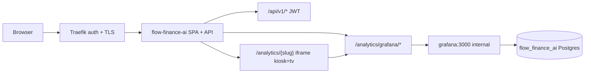

# Architecture

## Overview

Flow Finance AI is a self-hosted analytics layer on Firefly III. **US-0001** delivers the deployable platform foundation: Docker Compose stack, external PostgreSQL mirror, read-only Firefly connector, OIDC-protected React UI shell, sync scheduler, and minimal Grafana provisioning. No forecasting, subscription detection, or analytics dashboards in this story.

**Firefly read-only guarantee (explicit):** The Firefly Connector issues **HTTP GET requests only** to Firefly `/api/v1/*` endpoints. No POST, PUT, PATCH, or DELETE calls are permitted. Enforcement is via a typed HTTP client wrapper with method allowlist, integration-test assertion on outbound traffic, and optional audit log of every Firefly request (method, path, timestamp). Firefly remains the sole transaction source of truth; Flow Finance AI never mutates Firefly data (per R-0001, DEC-0004).

---

## BUG-0009 — Grafana empty panels & missing account value overview

**Status:** architecture complete (2026-06-06)  
**Discovery:** `discovery-20260606-bug0009` in `handoffs/po_to_tl.md`  
**Research:** [R-0064](research.md#r-0064--bug-0009-grafana-panel-emptiness-vs-cross-account-overview-gap)  
**Decisions:** **DEC-0068** (Grafana analytics provisioning contract — variable default, portfolio overview, ML empty-state); extends **DEC-0009** (per-account scope), **DEC-0049** (ML default off), **DEC-0055** (Dashboard 5 ML panels), **DEC-0057** (unified analytics embed), **DEC-0065** (negative wealth visibility)  
**Sprint:** `/quick` **Q0016** recommended (6 tasks, under `SPRINT_MAX_TASKS=12`)  
**Acceptance:** `docs/product/acceptance.md` — BUG-0009 rows **(Y)**, **(Z)**  
**Related:** BUG-0004 DONE (datasource/UNION ruled out); BUG-0010 DONE (wealth totals); **US-0013** OPEN (ML enablement — out of scope for Y2); US-0011 DONE (embed routes)

### Symptom chain (frozen)

Operator on US-0010 external profile post-BUG-0004: 922+ transactions synced; Grafana analytics dashboards appear **empty** on cashflow/forecast at default load; portfolio account breakdown shows **1 of 3** accounts; no cross-account overview in analytics iframe.

| Sub | Root cause | Effect |
|-----|------------|--------|
| **Y1** | `$account_id` variable `ORDER BY name` → first row acct **116** (Cash wallet, zero forecast) | Cashflow + forecast-horizons panels flat zero at default load |
| **Y2** | ML panels hard-bind `model_kind='ml_enhanced'` — **0** computations on omniflow (DEC-0049) | Forecast-horizons ML section blank; reported as "empty panels" |
| **Y3** | Datasource/UNION regression | **Ruled out** — `POST /analytics/grafana/api/ds/query` **200** for all probed panels |
| **Z1** | Portfolio breakdown SQL: global `LIMIT 1` on cross-join with `jsonb_array_elements` | Latest snapshot truncated to **1 arbitrary account row** |
| **Z2** | No dedicated cross-account overview panel in analytics provisioning | AC Z unmet — React `/wealth` exists but outside Grafana iframe |

**Not transport/SQL regression:** Postgres datasource OK; portfolio total stat **-3395.75**; subscriptions **3/6**; UNION pie **200**.

`isolation_scope`: artifact + repo source + discovery public curl probes (R-0064); no host `.env` / secrets read.

### Fix contract (DEC-0068)

Provisioning-only fix — **no backend or React code required** unless sprint-plan adds optional Z3 docs copy.

```text
BUG-0009
├── Z1 — Portfolio breakdown SQL (P0)
│   └── portfolio.json: latest-snapshot subquery + LATERAL unnest; remove global LIMIT 1
├── Z2 — Cross-account overview (P0)
│   └── portfolio.json: stat row visibility + "All accounts" table (Z1 SQL); portfolio dashboard only
├── Y1 — $account_id default (P0)
│   └── cashflow.json + forecast-horizons.json: ORDER BY ABS(balance) DESC; omit saved current
├── Y2 — ML empty-state (P1)
│   └── forecast-horizons.json: text banner + noValue on ML panels; US-0013 boundary preserved
├── T1 — SQL + provisioning tests (P1)
│   └── fixtures: breakdown 3-row; variable query order; optional JSON snapshot
└── V1 — verify-work omniflow (P1)
    └── Y3/Z3: default-load cashflow non-empty; portfolio overview 3 rows; six routes smoke
```

**Out of scope:** US-0013 ML sidecar enablement; React `/forecast` API reorder (optional follow-up); seventh analytics landing dashboard; Grafana dynamic hide rules; backend changes.

**Execute order (frozen):** Z1 → Z2 → Y1 → Y2 → V1 (T1 parallel with Z1/Y1).

### Z1 — Portfolio breakdown SQL fix (frozen)

**Problem:** Panel id 5 (`portfolio.json` L142) applies `LIMIT 1` after cross-join — PostgreSQL returns one row from latest snapshot's account array, not the full list.

**Broken pattern (reject):**

```sql
SELECT elem->>'name' AS name, ...
FROM net_worth_snapshots, jsonb_array_elements(payload->'accounts') AS elem
ORDER BY snapshot_date DESC LIMIT 1
```

**Contract — subquery isolate snapshot, then unnest:**

```sql
SELECT
  elem->>'name' AS name,
  elem->>'account_role' AS role,
  elem->>'currency' AS currency,
  (elem->>'balance')::float AS balance
FROM (
  SELECT payload
  FROM net_worth_snapshots
  ORDER BY snapshot_date DESC
  LIMIT 1
) latest
CROSS JOIN LATERAL jsonb_array_elements(latest.payload->'accounts') AS elem
ORDER BY ABS((elem->>'balance')::float) DESC
```

| Rule | Detail |
|------|--------|
| Snapshot selection | Single latest row by `snapshot_date DESC` in subquery only |
| Unnest | `CROSS JOIN LATERAL jsonb_array_elements` on isolated `payload` |
| Sort | `ABS(balance) DESC` — aligns with overview prominence; negative Giro valid per DEC-0065 |
| Empty payload | Zero rows — valid post-sync empty-state |

**Alternatives rejected:** `DISTINCT ON (snapshot_date)` — unnecessary complexity; moving `LIMIT 1` into subquery only without LATERAL — still wrong if applied to outer join incorrectly.

**Files:** `grafana/provisioning/dashboards/analytics/portfolio.json` (panel id 5; Z2 reuses same SQL)

**Risks:** Mixed-currency without FX — native balances shown (existing `mixed_currency` warning stat handles expectation).

### Z2 — Cross-account overview panel (frozen)

**Problem:** AC Z requires operator cross-account value overview **in analytics** — Grafana summary panel/table or documented equivalent. React `/wealth` is supplementary only (Z3 docs), not sole fix.

**Contract — portfolio dashboard only:**

| Panel | Action |
|-------|--------|
| Stat row (existing) | Verify `total_eur`, `account_count`, mixed-currency warning visible above fold in kiosk embed (`DEC-0057`) |
| Table "All accounts (latest snapshot)" | Upgrade panel id 5 title/copy; use Z1 SQL; columns: name, role, currency, balance |
| Optional `% of Firefly subtotal` | SQL `pct_of_firefly` column when subtotal non-zero; show `—` when zero |
| Grid placement | Overview table immediately below stat row (`y` reposition); performance charts move down |
| Supplementary Z3 | Optional text panel: "Detailed wealth analysis → `/wealth`" — **not** AC Z substitute |

**Alternatives rejected:**

| Alternative | Why |
|-------------|-----|
| Overview on every dashboard | Provisioning duplication + drift (R-0064 §4) |
| Seventh "Overview" dashboard + sidebar | US-0011 scope expansion |
| React `/wealth` link only | Fails AC Z as primary fix |
| Grafana dynamic hide/show rules | Grafana 11 complexity; overkill for static provisioning |

**Files:** `grafana/provisioning/dashboards/analytics/portfolio.json`; optional `docs/user-guides/` Z3 copy only

**Risks:** Cashflow-first operators miss overview until sidebar navigation — mitigate via portfolio sidebar label hint in Z3 docs; not a code blocker.

### Y1 — `$account_id` variable default (frozen)

**Problem:** Both `cashflow.json` and `forecast-horizons.json` use `ORDER BY name` — Grafana picks first alphabetical row (acct **116**, zero forecast) when no `current` block is set.

**Contract — mirror balance sort (no backend change):**

```sql
SELECT a.firefly_id AS __value, a.name AS __text
FROM accounts a
WHERE a.type = 'asset'
ORDER BY ABS(COALESCE(a.balance, 0)) DESC, a.name ASC
```

| Rule | Detail |
|------|--------|
| Dashboards | `cashflow.json`, `forecast-horizons.json` — both account-scoped |
| `current` block | **Omit** from provisioning JSON — never bake operator-specific IDs |
| `refresh` | Keep `1` (on dashboard load) — already present |
| Tie-break | `name ASC` when ABS balances equal |
| All-zero deploy | Falls back to alphabetical — same as today; document in panel description |

**Alternatives rejected:**

| Alternative | Why |
|-------------|-----|
| First non-zero forecast subquery | Heavier; fails before first recompute (R-0064 §2) |
| Hardcoded `current` in JSON | Breaks other deployments |
| React localStorage → iframe `?var-account_id=` | US-0011 embed contract change — defer |
| Backend `/forecast/accounts` reorder alone | Does not fix Grafana embed |

**Files:** `grafana/provisioning/dashboards/analytics/cashflow.json`, `forecast-horizons.json` (templating `account_id`)

**Risks:** Multiple funded accounts — ABS picks largest magnitude; acceptable household MVP; manual Grafana save may bake `current` — runbook warning in V1.

### Y2 — ML panel empty-state (frozen)

**Problem:** `forecast-horizons` ML panels query `model_kind='ml_enhanced'` — zero rows on omniflow baseline-only profile (DEC-0049). Dashboard description alone insufficient — operators report blank charts as defect.

**Contract — banner + noValue (not hide, not US-0013):**

| Element | Action |
|---------|--------|
| Text panel | Row above ML section: *"ML forecast not enabled on this deployment. Baseline DEC-0007 forecast is authoritative. Enable via US-0013."* — aligned with DEC-0066 React copy |
| ML time-series panels | `fieldConfig.defaults.noValue` → `"ML unavailable"` |
| ML stat panels | Same `noValue` where applicable |
| `$forecast_variant` | **Unchanged** — default stays `baseline` |
| Dynamic hide rules | **Reject** — Grafana 11 show/hide complexity |

**Scope boundary:** US-0013 owns ML **enablement**; BUG-0009 closes **honest empty-state** only.

**Files:** `grafana/provisioning/dashboards/analytics/forecast-horizons.json`

**Risks:** ML charts still visually empty below banner — acceptable until US-0013; banner sets expectation.

### Task map (sprint-plan input)

| Order | Task | Layer | Acceptance | Est. |
|-------|------|-------|------------|------|
| 1 | **Z1** breakdown SQL subquery | grafana `portfolio.json` | **(Z)** | 1h |
| 2 | **Z2** overview table + grid layout | grafana `portfolio.json` | **(Z)** | 1.5h |
| 3 | **Y1** variable query ABS(balance) | grafana `cashflow.json`, `forecast-horizons.json` | **(Y)** | 1h |
| 4 | **Y2** ML banner + noValue | grafana `forecast-horizons.json` | **(Y)** | 1h |
| 5 | **T1** SQL fixtures + provisioning snapshot | tests | **(Y)(Z)** | 1.5h |
| 6 | **V1** verify-work omniflow | uat / operator smoke | **(Y)(Z)** | 1h |

**Total estimate:** ~7h (provisioning + tests; no backend deploy dependency beyond image rebuild for Grafana JSON).

**Deploy order:** Z1+Z2+Y1+Y2+T1 single PR → Grafana provisioning reload (container restart or provisioning poll) → V1 smoke on `financegnome.omniflow.cc`.

### Test strategy (frozen — maps acceptance Y/Z)

| Check | Type | Pass criteria |
|-------|------|---------------|
| Z1 — breakdown rows | SQL fixture | 3-account snapshot JSON → query returns **3 rows** (not 1) |
| Z2 — overview visible | Provisioning review | Portfolio table titled for all accounts; stat row present |
| Y1 — variable order | SQL fixture / snapshot | ABS(balance) DESC picks funded account (114) over zero wallet (116) |
| Y1 — default load | Operator smoke | `/analytics/cashflow` kiosk — no manual variable change → non-flat series |
| Y2 — ML banner | Provisioning review | Text panel present; ML panels have `noValue` |
| Y3 — datasource regression | Operator smoke | ds/query **200** for portfolio/subscriptions/budgets (unchanged) |
| Z3 — six routes | Operator smoke | All `/analytics/{slug}` routes render (US-0011 regression) |
| V1 — AC closure | verify-work | Rows **(Y)** and **(Z)** pass; `/wealth` documented supplementary |

### Decisions (BUG-0009)

| Topic | Resolution |
|-------|------------|
| Variable default | **DEC-0068** — `ORDER BY ABS(COALESCE(balance,0)) DESC, name`; omit `current` |
| Portfolio breakdown SQL | **DEC-0068** — latest-snapshot subquery + `LATERAL jsonb_array_elements` |
| Overview placement | **DEC-0068** — portfolio dashboard only; reject seventh dashboard |
| AC Z equivalence | Stat row + all-accounts table satisfies Z; `/wealth` supplementary (Z3) |
| ML empty-state | **DEC-0068** — banner + `noValue`; reject dynamic hide; US-0013 owns enablement |
| React API reorder | Optional follow-up — out of BUG-0009 execute |

### Next phase

**`/sprint-plan`** — quick sprint **Q0016**, 6 tasks (Z1, Z2, Y1, Y2, T1, V1).

---

## BUG-0012 — Forecast monthly Income/Fixed buckets always zero

**Status:** architecture complete (2026-06-05)  
**Discovery:** `discovery-20260605-bug0012` in `handoffs/archive/po-to-tl-pack-20260605-b.md`  
**Research:** [R-0063](research.md#r-0063--bug-0012-forecast-monthly-bucket-component-attribution)  
**Decisions:** **DEC-0067** (component-level monthly bucket attribution); extends **DEC-0007** (category→bucket map), **DEC-0013** (recurrence core / `category_ids`)  
**Sprint:** `/quick` recommended (4–6 tasks)  
**Acceptance:** `docs/product/acceptance.md` — BUG-0012 rows **(AG)**, **(AH)**  
**Related:** BUG-0006 DONE (`category_id` ingest); BUG-0010 DONE (balance mirror); **US-0015** OPEN (AI buckets — out of scope); **US-0013** OPEN (ML — unchanged)

### Symptom chain (frozen)

Operator on US-0010 external profile post-BUG-0010: Full Firefly sync + forecast recompute; `/forecast` Monthly tab (or `GET /api/v1/forecast/monthly`) shows **Income: 0** and **Fixed: 0** while mirror holds categorized salary/income and rent/utilities/subscription-class rows.

| Sub | Gap | Effect |
|-----|-----|--------|
| **AG** | `categorize_delta` routes Income only when **net daily `delta >= 0`** | Funded-account days net-negative → Income permanently **0** |
| **AH** | `map_category(None, …)` for all `delta < 0` | Recurring rent/utilities due-days → **Variable** only → Fixed **0** |
| Both | `category_names` loaded in `service.rs` but unused in projection | DEC-0007 TOML `[forecast.category_buckets]` never applied |
| Both | `RecurringPattern` lacks `category_id` | `RecurrenceGroup.category_ids` dropped at detect |

**Read path OK:** API + `ForecastPage` Monthly tab display only — fix is projection **write** path (`project_account` → `forecast_cashflow_monthly`).

`isolation_scope`: artifact + repo source only; no host `.env` / secrets read.

### Fix contract (DEC-0067)

Replace single `categorize_delta(net_delta)` with **per-component monthly accumulation**; preserve daily balance math.

```text
BUG-0012
├── AG1 — Component monthly attribution (P0)
│   └── project.rs: rolling + each recurring due → separate bucket; balance += delta unchanged
├── AH1 — RecurringPattern category carry (P0)
│   └── types.rs + recurring.rs: category_id from RecurrenceGroup.mode; subscription override lookup
├── T1 — Unit tests AG/AH (P0)
│   └── project.rs: salary+rent scenario; same-day mixed; Variable regression
├── D1 — Operator TOML checklist (P1)
│   └── runbook omniflow: extend [forecast.category_buckets] for non-English labels
└── V1 — Operator verify (P1)
    └── verify-work smoke rows AG/AH on financegnome.omniflow.cc
```

**Out of scope:** ML buckets (US-0013); AI category inference (US-0015); fuzzy name matching; transaction-sum balance recompute; frontend changes (cards already bind API fields).

### AG1 — Component monthly attribution (frozen)

**Problem:** One net delta per day collapses same-day salary + rent into a single bucket by sign.

**Contract — daily loop in `project_account`:**

```rust
// Balance path (UNCHANGED)
let delta = rolling.daily_rate + recurring_due_sum;
balance += delta;

// Monthly map (NEW — per component)
accumulate_bucket(&mut monthly_map, month_key, Bucket::Variable, rolling.daily_rate);
for due in recurring_dues_today {
    let bucket = resolve_bucket(due.pattern.category_id, &category_names, config);
    accumulate_bucket(&mut monthly_map, month_key, bucket, due.amount);
}
```

| Component | Bucket rule | Rationale |
|-----------|-------------|-----------|
| `rolling.daily_rate` | **Variable** (sign preserved in amount) | DEC-0007 variable residual layer; positive misc inflow is uncategorized → not Income |
| Recurring due | `category_id` → name → `map_category(name, config)` | DEC-0007 TOML map |
| Unmapped name | **Variable** | Existing `map_category` default |
| Transfers | Excluded | DEC-0007 |

**`free_cashflow`:** recompute daily from component sums: `income - fixed_costs - variable_costs` (existing formula).

**Alternatives rejected:** net-delta sign fix only; dominant-category rebucketing; full tx replay (R-0063).

**Files:** `backend/src/forecast/project.rs`, `backend/src/forecast/categories.rs` (helper `resolve_bucket` if extracted)

**Risks:** Variable total decreases when fixed moves out — intended; regression test required.

### AH1 — RecurringPattern category carry (frozen)

**Problem:** `detect_patterns` drops `RecurrenceGroup.category_ids` already collected in `recurrence/detect.rs`.

**Contract:**

| Step | Rule |
|------|------|
| Schema | `RecurringPattern { …, category_id: Option<String> }` |
| Detect | Mode of non-null `category_ids` in group; tie-break: latest tx `date` |
| Subscription override | Inherit from replaced heuristic `category_id`; else lookup latest mirror tx with matching normalized `payee_key` |
| Projection | Due-day bucket uses `pattern.category_id` — not description or net sign |

**Category resolution chain (frozen):**

```text
category_id (mirror / group mode)
  → category_names: HashMap<firefly_id, name>
  → map_category(lowercase_trim(name), config)
  → Bucket::{Income, Fixed, Variable}
```

**TOML keys match lowercased category name**, not Firefly id (`default.toml`: `salary`, `rent`, …).

**Files:** `backend/src/forecast/types.rs`, `backend/src/forecast/recurring.rs`, `backend/src/forecast/project.rs` (`apply_subscription_override`)

**Risks:** German/custom labels miss default keys — operator TOML extension (D1); not a code defect.

### D1 — Operator TOML alignment doc (frozen)

**Problem:** Omniflow Firefly categories may use non-English names (`Gehalt`, `Miete Nebenkosten`) absent from `default.toml`.

**Contract:** Add runbook § Omniflow checklist:

1. List mirror category **names** for income/fixed rows used in acceptance month.
2. Add matching keys under `[forecast.category_buckets]` in operator TOML (lowercase name = key).
3. Recompute forecast after config change.
4. Re-smoke AG/AH.

**No code change** to `default.toml` in bug scope — operator-owned config on external profile.

**Files:** `docs/engineering/runbook.md` (omniflow section)

### Task map (sprint-plan input)

| Order | Task | Layer | Acceptance |
|-------|------|-------|------------|
| 1 | **AH1** category carry + override lookup | backend forecast/recurring | **AH** (enables fixed routing) |
| 2 | **AG1** component monthly attribution | backend project | **AG**, **AH** |
| 3 | **T1** unit tests | backend tests | **AG**, **AH** |
| 4 | **D1** runbook TOML checklist | docs | operator AG/AH on omniflow |
| 5 | **V1** verify-work | uat | **AG**, **AH** |

**Deploy order:** AH1 + AG1 + T1 in one PR; D1 docs same PR or follow-up; operator Full sync + recompute before V1.

### Test strategy (frozen — maps acceptance AG/AH)

| Check | Type | Pass criteria |
|-------|------|---------------|
| AG — income | Unit (`project.rs`) | Salary recurring with `category_id` → income bucket → first forecast month `income > 0` |
| AH — fixed | Unit | Rent recurring with `category_id` → fixed bucket → `fixed_costs > 0` |
| Mixed same-day | Unit | Salary due + rent due same day → both buckets non-zero; `balance` path unchanged |
| Variable regression | Unit | Discretionary coffee recurring → Variable; rejected fingerprint excluded |
| `map_category` wiring | Unit | `category_names` + TOML key resolution |
| Subscription override | Unit | Confirmed override inherits/lookup `category_id` |
| Integration | Optional post-BUG-0006 | DB fixture → recompute → monthly API |
| V1 | Operator | AG/AH on `financegnome.omniflow.cc` after deploy + TOML if needed |

### Decisions (BUG-0012)

| Topic | Resolution |
|-------|------------|
| Monthly attribution model | **DEC-0067** — component-level; net-delta `categorize_delta` rejected |
| Rolling residual bucket | **Variable** (positive and negative) |
| Unmapped categories | **Variable** default |
| Positive rolling → Income | **Rejected** — Income via categorized recurring only |
| Daily balance / horizons | **Unchanged** |
| AI / fuzzy mapping | **US-0015** — out of scope |

### Next phase

**`/sprint-plan`** — quick sprint 4–6 tasks after architecture.

---

## BUG-0005 — Exchange sync multi-product (Bitunix futures)

**Status:** architecture complete (2026-06-05)  
**Discovery:** `discovery-20260605-bug0005` in `handoffs/po_to_tl.md`  
**Research:** [R-0058](research.md#r-0058--bitunix-futures-api-auth-vs-connector-implementation), [R-0059](research.md#r-0059--exchange-multi-product-sync-scope-bitunix-futures)  
**Decisions:** **DEC-0062** (dual REST auth); **DEC-0063** (`effective_enabled_futures`); **DEC-0064** (wallet vs position wealth accounting); extends **DEC-0037** (connector trait), **DEC-0038** (PnL/wealth boundary), **DEC-0039** (FX), **DEC-0041** (exchanges sync phase)  
**Sprint:** `/quick` **Q0012** (recommended)  
**Acceptance:** `docs/product/acceptance.md` rows **M**, **N**, **O**  
**Related:** BUG-0003 G2 fulfilled separately (registry); BUG-0004 DONE — wealth pipeline ready; do not merge BUG-0006

### Symptom chain (frozen)

Operator on US-0010 external profile: Bitunix credentials configured; spot test **200**; post-sync holdings and wealth crypto slice **empty or spot-only**. Three connector gaps; wealth under-report is downstream, not a separate aggregation bug:

| Sub | Gap | Effect |
|-----|-----|--------|
| **M** | `sync_balances` → `/api/spot/v1/user/account` only; all rows `product_type: "spot"` | Futures/margin wallet never ingested |
| **N** | `enabled_futures=false` default; `sync_positions`/`sync_funding` no-op stubs; spot query-sign client incompatible with `fapi.bitunix.com` header auth | Futures REST never called |
| **O** | `WealthService` sums all holdings `market_value_eur` — spot-only DB rows | `crypto.subtotal_eur` under-reports operator futures exposure |

`isolation_scope`: artifact + repo source reads + public curl probes (R-0058/R-0059); no host `.env` / `.env_prod` secrets read.

### Fix slices

```text
BUG-0005
├── N — Futures REST infrastructure (P0, first)
│   ├── N1 — Header-auth HTTP client + futures_base_url config (DEC-0062)
│   └── N3 — effective_enabled_futures policy + settings exposure (DEC-0063)
├── M — Futures wallet ingestion (P0)
│   └── M1 — sync_balances futures account path → product_type futures
├── N — Positions + connectivity (P0)
│   ├── N2 — sync_positions via get_pending_positions → product_type linear (DEC-0064)
│   └── N4 — Dual-path test_connection (spot + futures sub-status)
└── O — Operator verify (P1)
    └── O1 — omniflow probes rows M/N/O (post deploy + exchange sync)
```

**Deploy order:** N1 + N3 + M1 + N2 + N4 in one PR (backend config + connector); deploy image; operator **manual exchange sync**; O1 verify-work.

**Deferred (out of sprint):** `sync_funding` implementation; Bybit `product_type` relabeling; Binance futures balance completeness; multi margin-coin iteration beyond USDT.

### Endpoint map (frozen)

| Purpose | Host | Method | Path | Auth |
|---------|------|--------|------|------|
| Spot balance (existing) | `openapi.bitunix.com` | GET | `/api/spot/v1/user/account` | Query `timestamp` + `sign` (`bitunix_sign`) |
| Futures wallet | `fapi.bitunix.com` | GET | `/api/v1/futures/account?marginCoin=USDT` | Headers per DEC-0062 |
| Open positions | `fapi.bitunix.com` | GET | `/api/v1/futures/position/get_pending_positions` | Headers per DEC-0062 |

Config: add `futures_base_url = "https://fapi.bitunix.com"` to `[exchanges.bitunix]` in `default.toml` and `BitunixConfig`.

### N1 — Futures header-auth client — DEC-0062 (frozen)

**Problem:** Shipped `signed_get` builds spot query-string auth (`bitunix_sign` on query + `sign` param). Futures private REST requires header auth on `fapi.bitunix.com` per [R-0058](research.md#r-0058--bitunix-futures-api-auth-vs-connector-implementation) and [official sign doc](https://www.bitunix.com/api-docs/futures/common/sign.html).

**Contract:**

| Concern | Spot path (unchanged) | Futures path (new) |
|---------|----------------------|-------------------|
| Base URL | `spot_base_url` | `futures_base_url` |
| Sign input | Query string incl. `timestamp` | `digest = SHA256(nonce + timestamp + api-key + queryParams + body)` |
| Sign output | `bitunix_sign(secret, query)` → query param | `sign = SHA256(hex(digest) + secretKey)` → header |
| Headers | `api-key` only | `api-key`, `nonce` (32 chars), `timestamp` (ms), `sign` |
| HTTP | GET via `ExchangeHttpClient::get_with_backoff` | Same client; GET-only audit unchanged (DEC-0037) |

**Implementation:**

1. Add `bitunix_futures_sign(secret, nonce, timestamp_ms, api_key, query_params, body) -> String` in `backend/src/exchanges/http.rs`.
2. Add `BitunixConnector::futures_signed_get(path, query) -> Result<Value, ExchangeError>` — generate 32-char nonce (e.g. alphanumeric), ms timestamp, empty body for GET.
3. Add `futures_base_url: String` to `BitunixConfig` with default `https://fapi.bitunix.com`.
4. **Do not** reuse `bitunix_sign` for futures — different canonical string (R-0058).

**Alternatives rejected:**

- *Single client with host sniffing* — fragile; explicit dual-path matches Binance spot/fapi split pattern.
- *CCXT* — rejected (DEC-0037 / R-0032).
- *Futures-only rewrite* — rejected; spot path works on omniflow; preserve regression when futures opt-out.

**Files:** `backend/src/exchanges/http.rs`, `backend/src/exchanges/bitunix.rs`, `backend/src/config/mod.rs`, `backend/config/default.toml`

**Risks:** Sign canonical string drift vs Bitunix doc — unit test with published fixture; API error bodies may leak key hints — log status only.

### N3 — effective_enabled_futures policy — DEC-0063 (frozen)

**Problem:** `enabled_futures = false` in `default.toml` gates all futures sync despite operator credentials present; settings expose raw TOML flag → operator sees `enabled_futures: false` while expecting multi-product sync.

**Contract:**

```rust
// BitunixConfig
pub fn effective_enabled_futures(&self) -> bool {
    // Env override (highest priority)
    if let Ok(v) = std::env::var("BITUNIX_ENABLED_FUTURES") {
        if matches!(v.to_ascii_lowercase().as_str(), "false" | "0" | "no") {
            return false;
        }
        if matches!(v.to_ascii_lowercase().as_str(), "true" | "1" | "yes") {
            return true;
        }
    }
    if self.enabled_futures {
        return true;
    }
    // Auto-enable when exchange effectively enabled with credentials
    self.effective_enabled() && self.credentials().is_some()
}
```

| Surface | Expose |
|---------|--------|
| `GET /api/v1/settings` → `exchanges.bitunix.enabled_futures` | **`effective_enabled_futures()`** (runtime truth) |
| TOML `enabled_futures` | Remains `false` default — explicit opt-in still works |
| Env `BITUNIX_ENABLED_FUTURES` | Document in `.env.example`; explicit opt-out for spot-only operators |

**Gate usage:** `sync_balances` futures branch, `sync_positions`, `sync_funding` stub guard, and N4 futures probe all use `effective_enabled_futures()` — not raw `enabled_futures`.

**Alternatives rejected:**

- *TOML default flip to `true`* — breaks spot-only deploys without env; effective override is safer.
- *Require manual operator flag only* — rejected; root cause is silent default blocking ingestion (acceptance **N**).

**Files:** `backend/src/config/mod.rs`, `backend/config/default.toml`, settings view assembly, `.env.example`

**Risks:** Operator with spot-only intent must set `BITUNIX_ENABLED_FUTURES=false` — document in runbook; auto-enable only when credentials present limits blast radius.

### M1 — Futures wallet balance ingestion (frozen)

**Problem:** `sync_balances` (`bitunix.rs` L77–119) calls spot account only; all holdings tagged `product_type: "spot"`.

**Contract:**

When `effective_enabled_futures()`:

1. Call `futures_signed_get("/api/v1/futures/account", "marginCoin=USDT")`.
2. Parse wallet fields from `data` (tolerate nested `account` object per API variance):
   - Margin coin asset (default **USDT** MVP — single coin per discovery defer list)
   - Equity quantity from `available` + `frozen` + `margin` or `accountEquity` / `totalEquity` (use first present numeric field; log warn on ambiguity)
3. Emit `ExchangeHolding` per non-zero margin coin:

| Field | Value |
|-------|-------|
| `asset` | Margin coin symbol (e.g. `USDT`) |
| `quantity` | Wallet equity qty |
| `product_type` | `"futures"` |
| `market_value_usd` | `quantity` for stablecoins; else None pending FX |
| `unrealized_pnl` | From API field if present (`unrealizedPnl` / `crossUnPnl`) |
| `payload` | Raw JSON fragment |

4. **Append** to spot holdings from existing spot path (do not replace spot sync).
5. When `effective_enabled_futures()` is false, spot-only path unchanged (regression).

**Alternatives rejected:**

- *Positions-only, skip wallet* — fails acceptance **M** (margin account balances).
- *Multi margin-coin loop* — deferred; USDT-only MVP.

**Files:** `backend/src/exchanges/bitunix.rs`

**Risks:** API field rename — defensive parsing + fixture tests; zero wallet with open positions still valid (N2 covers exposure rows).

### N2 — sync_positions — DEC-0064 (frozen)

**Problem:** `sync_positions` (`bitunix.rs` L122–129) returns `Ok(vec![])` even when `enabled_futures` true.

**Contract:**

When `effective_enabled_futures()`:

1. `futures_signed_get("/api/v1/futures/position/get_pending_positions", "")`.
2. For each open position with non-zero size:

| Field | Value |
|-------|-------|
| `asset` | Symbol / pair identifier from API |
| `quantity` | `abs(position size)` |
| `product_type` | `"linear"` (Binance parity) |
| `market_value_usd` | **`None`** (DEC-0064 — avoid double-count with wallet equity) |
| `unrealized_pnl` | From API unrealized field |
| `payload` | Raw position JSON |

3. Push symbols to `state.active_symbols` for trade sync watermark (existing pattern).
4. When futures disabled via `effective_enabled_futures()`, return `Ok(vec![])` unchanged.

**Wealth accounting (DEC-0064):**

- **Wealth crypto subtotal** sums `market_value_eur` on holdings — futures **wallet** rows (M1) contribute; **linear** position rows do not (null market value → excluded from subtotal, visible in holdings list / PnL via DEC-0038 portfolio engine).
- Aligns with Binance pattern: spot balances priced; positions carry unrealized PnL without duplicating wallet equity.

**Alternatives rejected:**

- *Price positions into wealth subtotal* — double-counts wallet equity that already embeds unrealized PNL.
- *Skip positions, wallet only* — fails acceptance **M** when operator holds open contracts.

**Files:** `backend/src/exchanges/bitunix.rs`

**Risks:** Operator sees holdings_count > 0 but subtotal from wallet only — acceptable; O1 verifies combined spot + futures visibility.

### N4 — Dual-path test_connection (frozen)

**Problem:** `test_connection` probes spot only; message `"Spot balance read OK"` masks futures auth failure.

**Contract:**

1. Always probe spot (`/api/spot/v1/user/account`) — existing behavior.
2. When `effective_enabled_futures()`, additionally probe futures account (`/api/v1/futures/account?marginCoin=USDT`).
3. Compose `ConnectionTest.message`:

| Spot | Futures | `ok` | Message pattern |
|------|---------|------|-----------------|
| OK | OK | `true` | `Spot: OK; Futures: OK` |
| OK | fail | `true` | `Spot: OK; Futures: {err}` (partial — acceptance **N** allows read-only key scope) |
| fail | * | `false` | `Spot: {err}` (futures skipped or appended) |

4. `latency_ms` = total elapsed for both probes.
5. **Do not** extend `ConnectionTest` struct — message string sufficient for MVP (alternatives rejected: structured sub-status JSON — heavier API churn).

**Files:** `backend/src/exchanges/bitunix.rs`

**Risks:** Partial OK may hide misconfigured futures keys — O1 + settings `enabled_futures` effective flag surfaces runtime truth.

### O1 — Operator verify-work (frozen)

**Precondition:** Deploy N1–N4; operator runs **manual exchange sync** on `financegnome.omniflow.cc`.

| Row | Probe | Pass |
|-----|-------|------|
| **M** | `GET /api/v1/exchanges` → bitunix holdings after sync | ≥1 holding with `product_type` ∈ `{futures, linear}` when operator has futures exposure |
| **N** | `POST /api/v1/exchanges/bitunix/test` | **200**; message mentions Futures; settings `enabled_futures: true` (effective) |
| **O** | `GET /api/v1/wealth` | `crypto.subtotal_eur` reflects futures wallet rows; bitunix `holdings_count` > 0 when exposure exists |
| Regression | footer | OIDC + bundled-firefly checks |

**Files:** `sprints/quick/Q0012/uat.md`

**Operator gate:** Exchange sync required before O1 (not Full Firefly sync — unlike BUG-0004).

### Task map (Q0012)

| Order | Task | Layer | Acceptance |
|-------|------|-------|------------|
| 1 | **N1** futures header-auth client (DEC-0062) | backend exchanges | **N** |
| 2 | **N3** effective_enabled_futures (DEC-0063) | backend config | **N** |
| 3 | **M1** futures wallet ingestion | backend bitunix | **M** |
| 4 | **N2** sync_positions (DEC-0064) | backend bitunix | **M**, **N** |
| 5 | **N4** dual-path test_connection | backend bitunix | **N** |
| 6 | **O1** verify-work omniflow probes | verify-work | **M**, **N**, **O** |

**Count:** 6 tasks (≤ `SPRINT_MAX_TASKS` 12) → **`/quick` Q0012**; no split.

### Test strategy

| Check | Type | Pass criteria |
|-------|------|---------------|
| N1 | Unit | Futures sign canonical string matches fixture; spot sign unchanged |
| N1 | Mock HTTP | Futures GET receives `api-key`, `nonce`, `timestamp`, `sign` headers |
| N3 | Unit | Creds present + TOML false → effective true; env `false` → false |
| M1 | Mock HTTP | Account JSON → holding `product_type: "futures"` |
| N2 | Mock HTTP | Positions JSON → holding `product_type: "linear"`, `market_value_usd: None` |
| N4 | Unit | Spot OK + futures fail → `ok: true`, message contains both |
| Regression | Unit | `effective_enabled_futures()` false → spot-only sync unchanged |
| O1 | verify-work | Omniflow rows M/N/O + regression footer |

### Frozen boundaries

- No merge with BUG-0006 transaction ingest
- No `sync_funding` implementation this sprint
- USDT margin coin only — no multi-coin config loop
- Read-only GET-only connector guarantee unchanged (DEC-0037)
- Do not modify Binance/Bybit connectors except import patterns as reference

---

## BUG-0004 — Post-sync pipeline empty analytics

**Status:** architecture complete (2026-06-05)  
**Discovery:** `discovery-20260605-bug0004` in `handoffs/po_to_tl.md`  
**Research:** [R-0061](research.md#r-0061--post-sync-analytics-pipeline-empty-data-paths)  
**Decisions:** **DEC-0060** (Firefly account balance parse); **DEC-0061** (subscription payee key fallbacks); extends **DEC-0002** (upsert backfill), **DEC-0014** (confidence tiers), **DEC-0041** (exchanges sync phase)  
**Sprint:** `/quick` **Q0011** (recommended)  
**Acceptance:** `docs/product/acceptance.md` rows **I**, **J**, **K**, **L**  
**Related:** BUG-0006 Q0010 (transaction sign/date may improve subscription expense filter — coordinate, do not merge); BUG-0005 OPEN — separate track

### Symptom chain (frozen)

Operator on US-0010 external profile: 922+ transactions synced; post-recovery stack healthy. Four independent wiring gaps produce empty analytics and misleading sync status:

| Sub | Gap | Effect |
|-----|-----|--------|
| **I** | `RunMode::ExchangesOnly` never calls `finish_sync_run` | DB `sync_runs` stuck `running`; status UI misleading |
| **J** | Payee grouping uses normalized `description` only; detection Full-sync only | Long bank-memo keys; 0 confirmed until operator action; empty UX on confirmed-only tabs |
| **K** | Invalid `UNION ALL` SQL in portfolio pie panel | Grafana ds/query **500** `syntax error at or near "UNION"` |
| **L1** | Account `current_balance` parsed with `.as_f64()` only | Firefly string balances → mirror `accounts.balance` **NULL** |
| **L2** | Wealth query `balance >= 0` excludes NULL | `GET /api/v1/wealth` → `accounts: []` |
| **L3** | Forecast `starting_balance = balance.unwrap_or(0.0)` | Flat **0.00** series despite recompute rows |

`isolation_scope`: artifact + repo source reads + public curl probes (R-0061); no host `.env` / `.env_prod` secrets read.

### Fix slices

```text
BUG-0004
├── I — Sync lifecycle (P0)
│   └── I1 — finish_sync_run on ExchangesOnly terminal path
├── K — Grafana SQL (P0, no backend deploy dependency)
│   └── K1 — Portfolio pie UNION subquery wrap
├── L — Wealth / forecast data path (P0, ordered)
│   ├── L1 — Parse Firefly account current_balance string/number (DEC-0060)
│   └── L2 — Wealth asset query includes NULL balances (COALESCE)
├── J — Subscriptions (P1)
│   ├── J1 — Payee key fallbacks (DEC-0061)
│   └── J2 — Empty-state UX: pending count + detection thresholds
└── L3 — Operator verify (P1)
    └── L3 — omniflow probes rows I–L (post Full sync + recompute)
```

**Deploy order:** I1 + K1 + L1 + L2 + J1 + J2 in one PR (backend + Grafana JSON + frontend); operator runs **manual Full Firefly sync** to backfill account balances (DEC-0002 upsert) before L3 verify. Exchange-only sync after I1 fixes terminal status but does **not** run subscription detection — document in J2 empty-state.

### I1 — Exchange sync terminal status (frozen)

**Problem:** `execute_run` calls `finish_sync_run` only on `RunMode::Full` Firefly path (`sync/mod.rs` L236–257). `ExchangesOnly` (`manual_exchanges`, `scheduled_exchanges`) runs `run_exchanges_and_alerts` then clears in-memory `active_run` without persisting terminal status.

**Contract:**

| Event | Action |
|-------|--------|
| `run_exchanges_and_alerts` returns `Ok(())` | `finish_sync_run(pool, run_id, "success", None)` |
| `run_exchanges_and_alerts` returns `Err(e)` | `finish_sync_run(pool, run_id, "failed", Some(&e.to_string()))`; propagate error; clear phase + active_run (mirror Full error path) |

Apply in `execute_run` **after** `run_exchanges_and_alerts` when `mode == RunMode::ExchangesOnly`, **or** unconditionally at end of `execute_run` for both modes (Full already finished Firefly phase earlier — do **not** double-finish Full run).

**Recommended implementation:** At end of `execute_run`, if `mode == RunMode::ExchangesOnly`, call `finish_sync_run` based on `run_exchanges_and_alerts` result. Full mode keeps existing Firefly-phase finish only.

**Stuck historical rows (decision gate):** **Rejected** one-shot SQL migration marking orphaned `running` rows `failed` on deploy — out of scope; I1 fixes forward path only. Operators may ignore stale rows or manual cleanup.

**Files:** `backend/src/sync/mod.rs`

**Risks:** Double `finish_sync_run` if refactor breaks Full/ExchangesOnly guard — unit test both modes.

### K1 — Portfolio Grafana UNION SQL (frozen)

**Problem:** Panel id **8** in `portfolio.json` L80:

```sql
SELECT ... ORDER BY snapshot_date DESC LIMIT 1 UNION ALL SELECT ... ORDER BY ... LIMIT 1
```

PostgreSQL requires each `ORDER BY`/`LIMIT` branch wrapped in parentheses.

**Contract:** Rewrite as:

```sql
(SELECT 'Firefly' AS metric, COALESCE(firefly_value_eur, total_eur)::float AS value
 FROM net_worth_snapshots ORDER BY snapshot_date DESC LIMIT 1)
UNION ALL
(SELECT 'Crypto', COALESCE(crypto_value_eur, 0)::float
 FROM net_worth_snapshots ORDER BY snapshot_date DESC LIMIT 1)
```

**Alternatives rejected:** Single-row pivot with `MAX(snapshot_date)` subquery — valid but higher churn; subquery wrap is minimal fix.

**Verify:** `POST /analytics/grafana/api/ds/query` with portfolio pie raw SQL → **200** (acceptance **K**).

**Files:** `grafana/provisioning/dashboards/analytics/portfolio.json`

**Risks:** Other panels with similar UNION pattern — scan analytics folder in execute; out of scope unless probe fails.

### L1 — Account balance parse — DEC-0060 (frozen)

**Problem:** `sync_accounts` passes `item["attributes"]["current_balance"].as_f64()` (`firefly/mod.rs` L261). Firefly API returns balance as **JSON string** (e.g. `"1234.56"`) → NULL mirror balances.

**Contract:** Reuse existing `parse_split_amount(value: &Value) -> Option<f64>` (already handles number + trimmed string) for `current_balance`. Pass result to `upsert_account`.

**Re-sync backfill:** DEC-0002 upsert on next **Full** sync — no SQL migration. Operator must trigger Full sync post-deploy before L3 wealth/forecast probes.

**Alternatives rejected:** Separate `parse_account_balance` helper — duplicates `parse_split_amount`; read balance from `payload` at query time — spreads parse logic.

**Files:** `backend/src/firefly/mod.rs`

**Risks:** Locale-specific decimal commas — Firefly uses dot decimals per R-0001; log warn on parse failure.

### L2 — Wealth NULL balance filter (frozen)

**Problem:** `load_asset_accounts` filters `AND balance >= 0` (`wealth/repository.rs` L36). SQL NULL comparisons exclude all NULL-balance asset rows even when account should contribute `0` to net worth.

**Contract:** Replace predicate with:

```sql
AND COALESCE(balance, 0) >= 0
```

Service layer already uses `a.balance.unwrap_or(0.0)` for aggregation (`wealth/service.rs`). Negative balances (credit/overdraft asset accounts) remain excluded.

**Downstream:** Forecast `starting_balance = account.balance.unwrap_or(0.0)` (`forecast/service.rs` L105) populates non-zero series once L1 backfills balances; L2 ensures accounts appear in wealth API before backfill completes.

**Files:** `backend/src/wealth/repository.rs`

**Risks:** Including NULL-as-zero before L1 backfill shows zero balances — acceptable interim vs empty `accounts: []`.

### J1 — Payee key fallbacks — DEC-0061 (frozen)

**Problem:** `by_payee()` keys only on `payee_key(description)` (`recurrence/group.rs` L17). Firefly journals often carry merchant identity in split/counterparty fields while `description` is generic bank text.

**Contract:** Add `extract_payee_source(tx: &TransactionRow) -> Option<String>` with **first non-empty** after normalization:

| Priority | Source |
|----------|--------|
| 1 | `tx.description` |
| 2 | First split `counterparty_name` from `payload.attributes.transactions[0]` |
| 3 | First split `destination_name` from same path |
| 4 | Top-level `payload.attributes.external_url` **rejected** — not stable merchant key |

Apply `payee_key()` to chosen source string. Skip row when all sources empty.

**Expense filter unchanged:** `amount < 0` (or `amount >= 0` skip) + `is_transfer` skip + min amount 0.01 — aligns with DEC-0014 tiers after BUG-0006 Q3 sign fix on same mirror rows.

**Detection trigger unchanged:** Full sync only (DEC-0018) — J2 documents this.

**Alternatives rejected:** Mirror dedicated `payee_name` column — heavier migration; regex on description only — insufficient for bank memos.

**Files:** `backend/src/recurrence/group.rs` (new helper + `by_payee`); optional unit tests in `recurrence/normalize.rs`

**Risks:** Over-merging distinct merchants sharing counterparty — monitor via confidence tiers; operator confirm/reject unchanged.

### J2 — Subscriptions empty-state UX (frozen)

**Problem:** Operator perceives "empty subscriptions" when **0 confirmed** despite **11 pending** patterns; Standing orders tab filters `status=confirmed` + `kind=standing_order`; All tab empty only when API returns `[]`.

**Contract:**

| Condition | UI behavior |
|-----------|-------------|
| `patterns.length === 0` (API empty) | Empty card: link to Sync Status; copy documents thresholds: **≥3** matching expenses, **≥60%** confidence (DEC-0014), payee key from description + counterparty fallbacks (DEC-0061); note detection runs on **Full Firefly sync** only |
| `pending_count > 0` && current tab shows no rows (e.g. Standing orders) | Banner: "{n} pattern(s) pending review" with link/button to **Pending review** tab |
| Pending tab | Unchanged confirm/reject flow |

**Files:** `frontend/src/pages/SubscriptionsPage.tsx`

**Risks:** Copy-only fix does not auto-confirm — acceptance **J** allows documented thresholds OR surfaced patterns; J1+J2 together satisfy "or documents detection thresholds".

### Task map (Q0011)

| Order | Task | Layer | Acceptance |
|-------|------|-------|------------|
| 1 | **I1** finish_sync_run ExchangesOnly | backend sync | **I** |
| 2 | **K1** portfolio UNION SQL | Grafana JSON | **K** |
| 3 | **L1** account balance parse (DEC-0060) | backend firefly | **L** |
| 4 | **L2** wealth NULL filter | backend wealth | **L** |
| 5 | **J1** payee key fallbacks (DEC-0061) | backend recurrence | **J** |
| 6 | **J2** subscriptions empty-state UX | frontend | **J** |
| 7 | **L3** verify-work omniflow probes | verify-work | **I–L** |

**Count:** 7 tasks (≤ `SPRINT_MAX_TASKS` 12) → **`/quick` Q0011**; no split.

### Test strategy

| Check | Type | Pass criteria |
|-------|------|---------------|
| I1 | Unit | ExchangesOnly mock run → `finish_sync_run` called with `success`; error path → `failed` |
| K1 | Fixture / manual | Portfolio pie SQL executes without UNION syntax error |
| L1 | Unit | String `"1234.56"` and number `1234.56` → same `f64` on upsert |
| L2 | Unit / integration | NULL balance asset row returned by `load_asset_accounts` |
| J1 | Unit | Fixture payload with counterparty_name only → grouped payee key |
| J2 | Component / manual | Empty + pending scenarios render threshold copy and pending banner |
| L3 | Operator | Post Full sync: sync status terminal; portfolio ds/query 200; wealth non-empty; forecast non-zero for funded account; subscriptions pending/confirmed UX |

**Post-deploy operator steps:** Deploy Q0011 → **manual Full Firefly sync** (account balance backfill) → optional manual exchange sync (I1 probe) → L3 verify-work.

### Decisions (BUG-0004)

| Topic | Resolution |
|-------|------------|
| Account balance parse | **DEC-0060** — reuse `parse_split_amount` for `current_balance` |
| Payee key source | **DEC-0061** — description → counterparty_name → destination_name |
| Re-sync backfill | **Upsert on next Full sync** (DEC-0002) — no migration script |
| Stuck `running` rows | **Forward fix only (I1)** — no deploy-time cleanup |
| Merge with BUG-0006 | **Rejected** — separate Q0010 track; coordinate transaction sign for J1 expense filter |

### Next phase

**`/sprint-plan` Q0011** — validate `sprints/quick/Q0011/task.json`; then `/plan-verify` → `/execute`.

---

## BUG-0006 — AI `get_transactions` empty despite synced mirror rows

**Status:** architecture complete (2026-06-05)  
**Discovery:** `discovery-20260605-bug0006` in `handoffs/po_to_tl.md`  
**Research:** [R-0060](research.md#r-0060--ai-get_transactions-empty-aggregates-vs-mirror-sync)  
**Decisions:** **DEC-0059** (Firefly mirror amount sign normalization); extends **DEC-0002** (sync upsert backfill), **DEC-0032** (aggregate-only privacy)  
**Sprint:** `/quick` **Q0010** (recommended)  
**Acceptance:** `docs/product/acceptance.md` rows **P**, **Q**, **R**  
**Related:** BUG-0002–0005 OPEN — **do not merge**; separate deploy/verify tracks

### Symptom chain (frozen)

Operator: 922 transactions synced; AI Chat `get_transactions` (~23:30:13) → German “no expenses in categories / data unavailable”. Root cause is **three mirror ingest gaps** + **one aggregate contract gap** (not LLM-only):

| Sub | Gap | Effect on tool output |
|-----|-----|------------------------|
| **Q** | `category_id` never written | `by_category` rows with `category_name: null` |
| **Q2** | ISO datetime fails `%Y-%m-%d` parse → `date` NULL | Period filter returns **zero rows** |
| **Q3** | Positive Firefly amounts; SQL uses `amount < 0` for outflow | `total_outflow: 0`, `transaction_count > 0` |
| **R** | No period totals / `period_status` | LLM interprets empty arrays as “no data” |
| **P** | Downstream narrative | Fixed by Q/Q2/Q3/R + operator verify |

`isolation_scope`: artifact + repo source reads; no local `DATABASE_URL` probe; no host `.env` / `.env_prod` secrets read.

### Fix slices

```text
BUG-0006
├── Q — Mirror ingest (P0, ordered)
│   ├── Q1 — Extract `category_id` from first split; extend `upsert_transaction`
│   ├── Q2 — Parse ISO datetime dates → `NaiveDate` (date component only)
│   └── Q3 — Normalize amount sign per DEC-0059 before upsert
├── R — Aggregate contract (P0)
│   └── R1 — Period totals + `uncategorized_transaction_count` + `period_status`
└── P — Operator verify (P1)
    └── P1 — E2E on financegnome.omniflow.cc + SQL probe checklist
```

**Deploy order:** Q1 → Q2 → Q3 → R1 in one backend PR (ingest before aggregates); trigger **manual Firefly sync** (or wait for scheduled sync) to backfill existing ~922 rows via DEC-0002 upsert — **no SQL migration script**.

### Firefly ingest contract (frozen)

Single mirror row per Firefly journal (unchanged): **first split** in `attributes.transactions[]` drives scalar columns; full journal in `payload` JSONB.

| Mirror column | Firefly source | Contract |
|---------------|----------------|----------|
| `firefly_id` | top-level `id` | unchanged |
| `account_id` | first split `source_id` | unchanged |
| `date` | first split `date` (or attrs `date`) | **Q2:** accept `YYYY-MM-DD` **or** ISO-8601/RFC3339 datetime; persist **date component only** (`NaiveDate`). Parse order: strict date → RFC3339 → first-10-char prefix fallback. NULL only when all parses fail (log `warn`). |
| `category_id` | first split `category_id` (string) | **Q1:** extract and upsert; NULL when absent in payload |
| `amount` | first split `amount` + `type` | **Q3 / DEC-0059:** store **signed** EUR magnitude (see below) |
| `description` | first split `description` | unchanged |
| `payload` | full journal `item` | unchanged (read-only GET per DEC-0004) |

**Re-sync backfill (decision gate):** Rely on `ON CONFLICT (firefly_id) DO UPDATE` + DEC-0002 7-day overlap watermark — existing rows refresh on next sync. **Rejected:** one-off SQL backfill script (operator burden); changing aggregate SQL to read unsigned amounts from `payload` (duplicates logic across forecast/subscriptions/alerts).

**Files (ingest):** `backend/src/firefly/mod.rs`, `backend/src/db/mod.rs` (`upsert_transaction` adds `category_id` bind).

**Risks:** First-split-only model misses destination-leg category on some transfers — acceptable MVP; full journal still in `payload`. ISO parse edge cases (timezone midnight) — use date component of parsed instant only.

### Amount sign normalization — DEC-0059

Firefly split API stores **positive** `amount`; direction is split `type`. All mirror consumers (`TransactionsRepository`, subscriptions, forecast, alerts) treat **`amount < 0` as outflow**.

Normalize in `sync_transactions` **before** `upsert_transaction`:

| Split `type` | Stored `amount` |
|--------------|-----------------|
| `withdrawal` | `-abs(amount)` |
| `deposit` | `+abs(amount)` |
| `transfer` | `-abs(amount)` on ingested source leg (first split) |
| missing / unknown | `-abs(amount)` when raw `amount > 0`, else raw value; `tracing::debug` |

**Alternatives rejected:**

- *Negate withdrawal only, leave transfer/deposit positive* — leaves Q3 failure for mixed ledgers.
- *Account-role heuristic (source vs destination)* — heavier; first-split + `type` sufficient for household aggregates.
- *Rewrite all aggregate SQL to `ABS(amount)` + payload `type`* — cross-cutting; violates single normalization point.

**Risks:** Transfer sign on first leg may mis-classify rare journals — monitor via `period_status`; payload retains audit trail. Subscription/forecast recompute after backfill may shift — expected correction.

### `TransactionAggregates` API contract — R1 (frozen)

Extend `backend/src/transactions/types.rs` and assemble in `TransactionsService::aggregates` (plus `GetTransactionsTool` passthrough). **Privacy:** new fields are numeric aggregates only — **no change** to `PrivacyLayer` (`DEC-0032`); `raw_rows` still gated by `allow_raw_transactions`.

**New top-level fields** (always present in tool JSON):

| Field | Type | Semantics |
|-------|------|-----------|
| `total_transaction_count` | `i64` | `COUNT(*)` where `date` in `[period_start, period_end]` inclusive |
| `total_outflow` | `f64` | `SUM(ABS(amount))` where `amount < 0` |
| `total_inflow` | `f64` | `SUM(amount)` where `amount > 0` |
| `uncategorized_transaction_count` | `i64` | rows in period with `category_id IS NULL` |
| `period_status` | enum (snake_case JSON) | LLM empty-state hint (see below) |

**`period_status` enum** — mutually exclusive, evaluated in **priority order**:

| Value | Condition |
|-------|-----------|
| `no_rows_in_period` | `total_transaction_count == 0` |
| `rows_zero_outflow` | count > 0 and `total_outflow == 0.0` |
| `rows_uncategorized` | count > 0 and `uncategorized_transaction_count == total_transaction_count` |
| `rows_with_outflow` | count > 0 and `total_outflow > 0.0` |

**`by_category` presentation:** Keep SQL `GROUP BY category_id`. Rows with `category_id IS NULL` map to `category_name: "Uncategorized"` in service assembly (not DB join). **Rejected:** top-level count only without NULL bucket in `by_category` — LLM needs labeled bucket under aggregate-only mode.

**Existing fields unchanged:** `period_start`, `period_end`, `group_by`, `by_category`, `by_month`, `raw_rows` (null when `allow_raw_transactions=false`).

**Repository:** add `period_summary(start, end) -> (count, outflow, inflow, uncategorized_count)`; reuse outflow/inflow CASE expressions from `aggregates_by_category` for consistency.

**Files (R1):** `backend/src/transactions/types.rs`, `repository.rs`, `service.rs`, `backend/src/ai/tools/transactions.rs` (schema description optional).

**Risks:** LLM may still misread if `period_status` ignored — mitigated by explicit totals; tool description update optional in execute. Floating-point totals — use same `float8` SUM semantics as existing aggregates.

### Task map (Q0010)

| Order | Task | Layer | Acceptance |
|-------|------|-------|------------|
| 1 | **Q1** category sync | backend ingest | **Q** |
| 2 | **Q2** ISO date parse | backend ingest | **Q** (dates in period) |
| 3 | **Q3** amount sign (DEC-0059) | backend ingest | **Q** + outflow sums |
| 4 | **R1** aggregate contract | backend transactions + AI tool | **R** |
| 5 | **P1** operator E2E + SQL probe | verify-work | **P** |

**Count:** 5 tasks (≤ `SPRINT_MAX_TASKS` 12) → **`/quick` Q0010**; no split.

### Test strategy

| Check | Type | Pass criteria |
|-------|------|---------------|
| Q1 | Unit | Fixture split JSON → `category_id` persisted on upsert |
| Q2 | Unit | ISO datetime string → non-NULL `NaiveDate` |
| Q3 | Unit | `withdrawal`/`deposit`/`transfer` → expected sign |
| R1 | Integration | Fixture mirror rows → JSON with totals + correct `period_status` |
| Privacy | Unit | `allow_raw_transactions=false` → new fields present; `raw_rows` absent; PrivacyLayer unchanged |
| P1 | Operator | Chat spending question uses non-empty aggregates; SQL probe matches tool totals |

**Post-deploy operator step:** Manual Firefly sync after deploy to backfill ~922 rows before P1 verify.

### Decisions (BUG-0006)

| Topic | Resolution |
|-------|------------|
| Amount sign | **DEC-0059** — normalize at ingest from split `type` |
| Re-sync backfill | **Upsert on next sync** (DEC-0002) — no migration script |
| Uncategorized bucket | **Top-level count + `by_category` "Uncategorized" label** |
| Privacy | **Aggregate-only** — DEC-0032 unchanged |
| Merge with BUG-0004 | **Rejected** |

### Next phase

**`/sprint-plan` Q0010** — materialize `sprints/quick/Q0010/task.json` from task table; then `/plan-verify` → `/execute`.

---

## BUG-0007 — AI merchant/category discovery fails despite mirror data

**Status:** architecture complete (2026-06-07)  
**Discovery:** `discovery-20260607-bug0007` in `handoffs/po_to_tl.md`  
**Research:** [R-0065](research.md#r-0065--bug-0007-ai-merchant-category-discovery-tool-contracts-vs-rag)  
**Decision:** **DEC-0069** (A′ + E + F bundle)  
**Sprint:** `/quick` **Q0017** (recommended)  
**Acceptance:** `docs/product/acceptance.md` rows **S**, **T**, **U** (note **V** — RAG deferred, not acceptance gate)  
**Related:** BUG-0006 DONE (mirror ingest); BUG-0008 OPEN — coordinate only; US-0015 OPEN — bucket mapping out of scope

### Symptom chain (frozen)

Operator on US-0010 external profile: 922 transactions synced (2025-06-05…2026-05-22), 75 categories, 12 subscription patterns with named merchants. AI Chat fails subscription enumeration (**S**), merchant/category queries (**T**), and cross-signal fusion (**U**).

| Sub | Verdict | Root cause |
|-----|---------|------------|
| **S** | CONFIRMED | Tool returns `display_name`; LLM does not enumerate; follow-up passes `Counterparty-*` as enum filters |
| **T** | SPLIT | **T-a:** Amazon Jan–Oct 2023 — true empty (mirror starts 2025-06-05). **T-b:** Keywords passed as `category_id`; no name-search dimension |
| **U** | CONFIRMED | Aggregate-only + redaction + prompt bias — no fusion path without user-supplied merchant names |
| **V** | NOTE | No RAG layer — defer; not acceptance gate |

`isolation_scope`: artifact + repo source reads; live omniflow probes (discovery); no host `.env` / `.env_prod` secrets read.

### Fix slices (DEC-0069)

```text
BUG-0007
├── A′ — Category search on get_transactions (P0)
│   ├── A1 — Repository: ILIKE category name resolve + mirror MIN/MAX bounds
│   └── A2 — Service + tool schema/response extensions
├── F — get_subscriptions schema (P0)
│   └── F1 — kind enum, merchant_names[], patterns_count, Counterparty guard
├── E — Orchestrator + audit (P0)
│   ├── E1 — SYSTEM_PROMPT rules (enumerate, category_search, bounds, enums)
│   └── E2 — audit.result_rows population
└── V1 — Operator verify (P1)
    └── V1 — AI Chat probes S/T/U on financegnome.omniflow.cc
```

**Deploy order:** (A1 → A2 → F1 → E1 → E2) single backend PR → deploy → V1 verify. **No** Firefly re-sync required (intelligence-layer only).

### A′ — `get_transactions.category_search` contract (frozen)

Extends BUG-0006 `TransactionAggregates` — see **DEC-0069 § A′** for full field table.

| Concern | Contract |
|---------|----------|
| **Param name** | `category_search` (not `category_name_query`) |
| **Resolution** | `categories.name ILIKE '%keyword%'`; cap **10** matches; union-filter aggregates |
| **Precedence** | `category_search` wins when both `category_id` + search supplied |
| **Mirror bounds** | `mirror_date_bounds { min, max }` on **every** response — global mirror date range |
| **Empty keyword match** | `category_matches: []`, `search_attempted: true`, existing `period_status` |
| **Privacy** | DEC-0032 unchanged; no `raw_rows`; no payee/description search |

**Omniflow proof (frozen):** `category_search: "amazon"` → id **47** (`Shopping - Amazon`, 1079.35 €); `"strom"` → id **146** (`Wohnen - Stromkosten`, 465.53 €).

**Alternatives rejected:**

| Alternative | Why |
|-------------|-----|
| Seventh `get_categories` tool | Six-tool AC footer |
| Payee aggregates (`group_by: merchant`) | Counterparty redaction → unreadable labels (R-0065 §6) |
| RAG / vector search | No infra; epic scope (note V) |
| `allow_raw_transactions` default flip | Privacy regression; supplementary only |

**Files:** `backend/src/transactions/{repository,service,types}.rs`, `backend/src/ai/tools/transactions.rs`.

### F — `get_subscriptions` contract (frozen)

| Concern | Contract |
|---------|----------|
| **`kind` enum** | `subscription` \| `standing_order` in OpenAI schema |
| **Enum guard** | Reject `Counterparty-*` prefix in `status`/`kind` → InvalidArgs |
| **Response** | Add `patterns_count`, `merchant_names[]` (deduped display_name order) |
| **`patterns[]`** | Unchanged per-field shape |
| **REST API** | **No change** — enrichment in AI tool wrapper only (BUG-0008 isolation) |

**Files:** `backend/src/ai/tools/subscriptions.rs` (primary); `SubscriptionService::list_patterns` behavior unchanged.

### E — Orchestrator + audit contract (frozen)

| Concern | Contract |
|---------|----------|
| **SYSTEM_PROMPT** | Four rules: enumerate subscriptions; use category_search for keywords; cite mirror_date_bounds on empty period; never Counterparty-* enums |
| **audit.result_rows** | `get_transactions`: bucket count or total_transaction_count; `get_subscriptions`: patterns_count |
| **Schema descriptions** | Enrich `category_id` + `category_search` parameter docs |
| **Local providers** | No `tool_choice: required` (DEC-0045) |

**Files:** `backend/src/ai/orchestrator.rs`.

### BUG-0008 coordination (note only)

Shared `SubscriptionService` — BUG-0007 execute is **additive AI JSON only**. Do **not** change alert unread count, `/subscriptions` list filters, or detection thresholds. See DEC-0069 coordination table.

### Task map (Q0017)

| Order | Task | Layer | Est. | Acceptance |
|-------|------|-------|------|------------|
| 1 | **A1** category search SQL + mirror bounds | backend transactions | 3h | **T**, **U** |
| 2 | **A2** tool schema + response assembly | backend AI tool | 2h | **T**, **U** |
| 3 | **F1** subscriptions schema + response + guard | backend AI tool | 2h | **S** |
| 4 | **E1** SYSTEM_PROMPT + audit result_rows | backend orchestrator | 2h | **S**, **T**, **U** |
| 5 | **E2** parameter schema descriptions | backend AI tools | 0.5h | **T**, **S** |
| 6 | **T1** unit/integration tests | backend tests | 3h | regression |
| 7 | **V1** operator AI Chat verify | verify-work | 1h | **S**, **T**, **U** |

**Count:** 7 tasks (≤ `SPRINT_MAX_TASKS` 12) → **`/quick` Q0017**; no split.  
**Total estimate:** ~13.5h (dev ~12.5h + operator V1 ~1h).

### Test strategy

| Check | Type | Pass criteria |
|-------|------|---------------|
| A1 | Unit | ILIKE resolves Strom/Amazon fixture categories; bounds query returns min/max |
| A2 | Integration | Tool JSON includes `category_matches`, `mirror_date_bounds`, `search_attempted` |
| F1 | Unit | Counterparty-* args rejected; `merchant_names` deduped; kind enum in schema |
| E1 | Unit | Audit insert receives non-NULL `result_rows` for both tools |
| Privacy | Unit | Six-tool registry count; `allow_raw_transactions=false` → no `raw_rows` |
| V1 | Operator | Chat lists subscription names; Strom/Amazon amounts; 2023 Amazon cites bounds |

### Decisions (BUG-0007)

| Topic | Resolution |
|-------|------------|
| Category resolution | **DEC-0069 A′** — `category_search` on `get_transactions` |
| Mirror empty-state | **DEC-0069** — `mirror_date_bounds` on every tool response |
| Subscription enumeration | **DEC-0069 F** — schema + `merchant_names` |
| Orchestrator / audit | **DEC-0069 E** — prompt rules + `result_rows` |
| Six-tool registry | **Preserved** — no seventh tool |
| RAG (V) | **Deferred** — document only |
| BUG-0008 | **Coordinate** — additive AI JSON only |

### Next phase

**`/sprint-plan` Q0017** — materialize `sprints/quick/Q0017/task.json` from task table; then `/plan-verify` → `/execute`.

---

## BUG-0010 — Forecast wrong numbers, empty wealth, misleading ML skip

**Status:** architecture complete (2026-06-05)  
**Discovery:** `discovery-20260605-bug0010` in `handoffs/po_to_tl.md`  
**Research:** [R-0062](research.md#r-0062--firefly-account-balance-mirror-vs-forecastwealth-inputs)  
**Decisions:** **DEC-0065** (negative asset wealth visibility); **DEC-0066** (ML disabled metadata); extends **DEC-0060** (balance parse), **DEC-0007** (forecast algorithm), **DEC-0049** (ML default off), **DEC-0025** (net worth aggregation)  
**Sprint:** `/quick` **Q0013**  
**Acceptance:** `docs/product/acceptance.md` — BUG-0010 rows **AA**, **AB**, **AC** (AC3 → **US-0013** epic)  
**Related:** BUG-0004 Q0011 (DEC-0060/L2 partial — residual wrong numbers); BUG-0009 (Grafana — separate); US-0013 (ML production on omniflow)

### Symptom chain (frozen)

Operator on US-0010 external profile post-BUG-0004: 922+ transactions synced; forecast shows **-25365.78** 3-month end balance; wealth **total_eur: 0**; forecast UI **"ML skipped: ML forecast unavailable"** despite ML never configured.

| Sub | Gap | Effect |
|-----|-----|--------|
| **AA** | Mirror `accounts.balance` wrong or stale vs Firefly `current_balance`; negative start drives DEC-0007 drift | Forecast series from **-3395.75** → implausible -25k end |
| **AB** | `load_asset_accounts` excludes `balance < 0`; zero-balance accounts dominate sum | Giro 114 absent; `total_eur: 0.0`; snapshots written but zero |
| **AC** | ML phase skipped when disabled → null `ml_skipped_reason`; UI default skip copy | Misleading "ML skipped" when profile is baseline-only by design |

**Math check (frozen):** -3395.75 + ~90d outflows ≈ -25365 — DEC-0007 behaves correctly given inputs. Fix is **inputs + visibility + honest ML posture**, not projection rewrite.

`isolation_scope`: artifact + repo source + public curl probes (R-0062); no host `.env` / `.env_prod` secrets read.

### Fix slices

```text
BUG-0010
├── AA — Balance mirror + forecast inputs (P0)
│   ├── AA1 — Trust Firefly current_balance ingest + sync diagnostics (extends DEC-0060)
│   └── AA3 — Warn when starting_balance <= 0 with tx history (API meta + UI)
├── AB — Wealth visibility (P0)
│   ├── AB1 — Include negative-balance asset accounts (DEC-0065)
│   └── AB2 — Zero-total empty-state with operator guidance
├── AC — ML posture (P0)
│   ├── AC1 — sidecar_disabled metadata on baseline (DEC-0066)
│   └── AC2 — UI three-state ML copy (not enabled / skipped / available)
└── V1 — Operator verify (P1)
    └── V1 — Full Firefly sync gate + omniflow probes AA/AB/AC
```

**Out of scope:** AC3 (US-0013 — stats-forecast on external profile); Grafana emptiness (BUG-0009); transaction-sign re-ingest (BUG-0006 DONE).

**Deploy order:** AA1 + AB1 + AC1 + AA3 + AB2 + AC2 in one PR (backend + frontend); operator **manual Full Firefly sync** + forecast recompute before V1 verify.

### AA1 — Account balance mirror ingest (frozen)

**Problem:** DEC-0060 fixed string parse but omniflow still shows wrong/zero mirror balances. Discovery confirms non-NULL values (-3395.75, 0.0) — parse works; issue is **source fidelity or stale sync**, not `.as_f64()`.

**Contract:**

| Step | Action |
|------|--------|
| Canonical field | `attributes.current_balance` via existing `parse_split_amount` (DEC-0060) — **no alternate field** |
| Payload | Full account `item` already stored in `payload` JSONB — ensure `account_role`, `active`, `include_net_worth`, `opening_balance` available for diagnostics |
| Sync diagnostics | On each account upsert, emit structured log `balance_ingest` with `firefly_id`, `name`, `raw_current_balance`, `parsed_balance`, `account_role` |
| Stale mirror gate | Document: account rows refresh only on **Full** Firefly sync (`sync_accounts` in Full path) — exchange-only runs do **not** update balances |
| Mismatch probe (execute) | Optional dev-only or sync-summary: compare parsed value against Firefly raw string; warn on parse failure |

**Alternatives rejected:**

| Alternative | Why |
|-------------|------|
| Recompute balance from mirrored transactions | Duplicates Firefly ledger; heavy; violates read-only mirror model |
| Use `opening_balance` instead of `current_balance` | Opening balance is historical snapshot only per Firefly docs |
| Negate asset balances at ingest | Would break signed forecast/wealth semantics |

**If Firefly source matches mirror after Full sync:** AA3 + AB2 surface data-quality guidance (reconcile in Firefly) — not an ingest code bug.

**Files:** `backend/src/firefly/mod.rs`

**Risks:** Operator expects funded accounts but Firefly ledger shows overdraft — product shows truthful negative numbers + warnings, not silent -25k.

### AA3 — Negative starting balance warning (frozen)

**Problem:** Forecast silently projects from negative `starting_balance` producing implausible milestones without operator signal.

**Contract:**

| Surface | Field / behavior |
|---------|------------------|
| `GET /api/v1/forecast/meta` | Add optional `balance_warnings: [{ account_id, starting_balance, reason: "negative_starting_balance" }]` when any asset account used in latest baseline has `balance <= 0` **and** `COUNT(transactions WHERE account_id = …) > 0` |
| `GET /api/v1/forecast/daily` (optional) | Per-account `starting_balance_warning: true` when condition met |
| `ForecastPage.tsx` | Banner when meta warnings present: "Starting balance is zero or negative — verify Firefly account balances or reconcile before trusting long-term forecast." |

**Alternatives rejected:** Hard-block forecast when negative — breaks legitimate overdraft scenarios; warning only.

**Files:** `backend/src/forecast/service.rs`, `backend/src/api/forecast.rs`, `frontend/src/pages/ForecastPage.tsx`

**Risks:** Extra DB query per recompute — cache in baseline metadata JSON to avoid repeat on read path.

### AB1 — Wealth negative account visibility — DEC-0065 (frozen)

**Problem:** `load_asset_accounts` filters `COALESCE(balance, 0) >= 0` (`wealth/repository.rs` L36). Acct 114 (negative Giro) excluded; 115/116 at 0 → `total_eur: 0`.

**Contract:**

```sql
-- Remove >= 0 predicate; keep active + include_net_worth filters
WHERE type = 'asset'
  AND COALESCE((payload->>'active')::boolean, true) = true
  AND COALESCE((payload->>'include_net_worth')::boolean, true) = true
```

| API field | Semantics |
|-----------|-----------|
| `AccountWealthRow.is_overdrawn` | `true` when `balance < 0` |
| `firefly.subtotal_eur` | Signed sum of included account balances |
| `total_eur` | Firefly subtotal + crypto (unchanged composition) |

**UI:** Overdrawn rows show amber badge / negative styling; `% of total` uses signed household sum (existing window fn).

**Alternatives rejected:** Separate liability model — US epic scope; clamp to zero — distorts net worth.

**Files:** `backend/src/wealth/repository.rs`, `backend/src/wealth/types.rs`, `backend/src/wealth/service.rs`, `frontend/src/pages/WealthPage.tsx`

**Risks:** Headline total dominated by overdraft — mitigated by AB2 guidance + per-row flag.

### AB2 — Wealth zero-total empty-state (frozen)

**Problem:** `total_eur == 0` with synced accounts present gives no operator guidance.

**Contract:** When `GET /api/v1/wealth` returns `accounts.length > 0` **and** `total_eur == 0` (or all balances zero), UI shows callout:

- "Account balances may be stale — trigger **Full Firefly sync** from Settings."
- Link to Firefly reconciliation docs (external).
- If any `is_overdrawn`, note signed total may be negative after AB1.

**Files:** `frontend/src/pages/WealthPage.tsx`

**Risks:** Copy-only; no backend change required beyond AB1 fields.

### AB3 — Snapshot re-verify (operator, frozen)

**Not a code task.** After AA1 deploy + **Full Firefly sync**, exchange-triggered snapshot upsert should reflect corrected mirror balances. Validated in **V1** via `GET /api/v1/wealth`, `GET /api/v1/wealth/history`, and non-zero or honestly negative `total_eur`.

### AC1 — ML disabled metadata — DEC-0066 (frozen)

**Problem:** When `forecast_ml.enabled = false`, sync skips ML block (`sync/mod.rs` L292–313) without `record_skip_on_baseline`. Meta returns `ml_skipped_reason: null`.

**Contract:**

| Path | Behavior |
|------|----------|
| Sync (Full path, post-baseline) | When `!config.forecast_ml.enabled`, call `forecast_ml.record_skip_on_baseline(baseline_id, &ForecastMlError::Disabled)` |
| Meta API | If config disabled and baseline metadata lacks `ml_skipped_reason`, derive `"sidecar_disabled"` in response (transitional stale rows) |

**Canonical reason codes (unchanged):** `sidecar_disabled`, `sidecar_unavailable`, `insufficient_history`, `sidecar_error`.

**Alternatives rejected:** New `ml_status: "unconfigured"` — use existing `skipped` + `sidecar_disabled`.

**Files:** `backend/src/sync/mod.rs`, `backend/src/api/forecast.rs`

**Risks:** Double-record on recompute — `merge_metadata` idempotent patch.

### AC2 — Forecast UI ML posture (frozen)

**Problem:** `ForecastPage.tsx` L47–53: `mlSkipReason` defaults to `"ML forecast unavailable"`; explain panel always says "ML skipped" when `!mlAvailable`.

**Contract — three UI states:**

| State | Condition | Copy (frozen intent) |
|-------|-----------|----------------------|
| **ML available** | `ml_computation_id` + `ml_status === "success"` | Existing model/seasonal copy |
| **ML not enabled** | `ml_skipped_reason === "sidecar_disabled"` (or meta derive) | "ML forecast is not enabled on this deployment. Baseline DEC-0007 forecast is authoritative." |
| **ML skipped** | Other non-null `ml_skipped_reason` | "ML skipped: {reason}. Baseline DEC-0007 forecast remains authoritative." |
| **Baseline only (legacy null)** | No ML id, null reason, ML enabled in config | "Baseline-only forecast — ML has not run yet." |

**Remove:** Default "ML forecast unavailable" as skip reason when reason is null and ML disabled.

**Long-term mode toggles:** Disable `ml_enhanced` / `compare` when not ML available (existing); tooltip cites correct state label.

**Files:** `frontend/src/pages/ForecastPage.tsx`, `frontend/src/lib/api.ts` (types if needed)

**Risks:** None — copy-only + reason wiring.

### Task map (Q0013)

| Order | Task | Layer | Acceptance |
|-------|------|-------|------------|
| 1 | **AA1** balance mirror diagnostics | backend firefly | **AA** |
| 2 | **AB1** negative wealth visibility | backend wealth + types | **AB** |
| 3 | **AC1** sidecar_disabled metadata | backend sync + forecast meta | **AC** |
| 4 | **AA3** negative start warning | backend forecast + frontend banner | **AA** |
| 5 | **AB2** wealth zero-total empty-state | frontend wealth | **AB** |
| 6 | **AC2** ML three-state UI | frontend forecast | **AC** |
| 7 | **V1** verify-work omniflow | uat / probes | **AA**, **AB**, **AC** |

**Operator gate (AA2 / AB3):** Manual **Full Firefly sync** after deploy required before V1 — account balance backfill via DEC-0002 upsert + baseline/wealth recompute.

### Test strategy

| Check | Type | Pass criteria |
|-------|------|---------------|
| AA1 | Unit | String/number `current_balance` → parsed upsert; `balance_ingest` log fields |
| AB1 | Unit/integration | Negative balance asset row included; `is_overdrawn: true` |
| AC1 | Unit | Disabled config → baseline metadata `ml_skipped_reason: sidecar_disabled` |
| AA3 | Unit | Negative start + tx count → meta warning |
| AC2 | Component/manual | Three copy states render per reason |
| V1 | Operator | Plausible forecast start OR explicit warning; wealth non-empty/honest total; ML not-enabled copy |

### Decisions (BUG-0010)

| Topic | Resolution |
|-------|------------|
| Negative asset wealth | **DEC-0065** — include with `is_overdrawn`, signed sum |
| ML disabled metadata | **DEC-0066** — persist + meta derive `sidecar_disabled` |
| Balance source | Trust Firefly `current_balance` (DEC-0060 parse) — no tx recompute |
| ML production on omniflow | **US-0013** (AC3) — out of scope |
| Merge with BUG-0009/0011 | **Rejected** |

### Next phase

**`/plan-verify` Q0013** — then `/execute`.

---

## US-0008 — Local & self-hosted AI provider support

**Status:** architecture complete (2026-06-02)  
**Research:** R-0038, R-0039, R-0040, R-0041, R-0042 (extends R-0027, R-0029, R-0030, R-0035, DEC-0031–DEC-0036)  
**Decisions:** DEC-0043, DEC-0044, DEC-0045, DEC-0046, DEC-0047, DEC-0048  
**Spec-pack:** `docs/engineering/spec-pack/US-0008-{design-concept,crs,technical-specification}.md`  
**Depends on:** US-0006 AI Tool Layer (six tools, PrivacyLayer, orchestrator loop, SSE chat, audit log) — **frozen at tool layer (AC4)**

### System context

```text
┌──────────────────────────────────────────────────────────────────────────────┐
│  Browser — ChatPanel (header Sheet + /chat)                                  │
│            Settings AI & Privacy: provider table + Test AI provider button   │
│            Badges: Privacy (US-0006) + Local vs Cloud provider (US-0008)     │
└───────────────────────────────┬──────────────────────────────────────────────┘
                                │ JWT Bearer (SSE unchanged)
                                ▼
┌──────────────────────────────────────────────────────────────────────────────┐
│  flow-finance-ai (Axum)                                                       │
│                                                                               │
│  AiService (startup)                                                          │
│    build_provider(&AiConfig) ──▶ Arc<dyn AiProvider>                         │
│         │                                                                     │
│  POST /api/v1/chat/stream ──▶ AiOrchestrator (&dyn AiProvider)             │
│         │                         │                                           │
│         │                         ├─▶ AiTool registry (6 tools) — FROZEN   │
│         │                         ├─▶ PrivacyLayer — FROZEN                   │
│         │                         ├─▶ truncate 8 KB — FROZEN                  │
│         │                         └─▶ ai_tool_audit (+ provider col)         │
│         │                                                                     │
│  GET /api/v1/settings ──▶ ai.provider_label, is_local, provider_configured   │
│  POST /api/v1/ai/test ──▶ minimal chat/completions (no tools)                │
└───────────────────────────────┬──────────────────────────────────────────────┘
                                │ HTTPS to configured base_url only
                ┌───────────────┼───────────────┐
                ▼               ▼               ▼
         api.openai.com   ollama:11434/v1   host.docker.internal:1234/v1
         (provider=       (Compose full      (LM Studio /
          openai)          profile)           openai_compatible)
```

**AC4 boundary:** Provider swap is **HTTP client layer only**. No changes to tool registry, PrivacyLayer, orchestrator tool loop semantics, six tool implementations, or chat SSE event contract (except additive `warning` event per DEC-0046).

### Components

#### 1. Provider factory (`backend/src/ai/provider.rs`)

Extend stub trait into full HTTP abstraction (**DEC-0043**, **R-0040**).

| Type | Responsibility |
|------|----------------|
| `AiProviderKind` | Enum: `OpenAi`, `Ollama`, `OpenAiCompatible` parsed from TOML `provider` |
| `OpenAiCompatibleProvider` | Single reqwest implementor; `{base_url}/chat/completions`; optional bearer |
| `build_provider` | Factory: resolve URL, auth, flags; return `Arc<dyn AiProvider>` |
| `ProviderError` | Config validation, HTTP, parse errors |

**Trait contract:**

```rust
pub trait AiProvider: Send + Sync {
    fn name(&self) -> &str;              // "openai" | "ollama" | "openai_compatible"
    fn is_configured(&self) -> bool;
    fn is_local(&self) -> bool;
    fn display_label(&self) -> &str;     // "Cloud · OpenAI" | "Local · Ollama" | "Local · Compatible"
    fn omit_tool_choice(&self) -> bool;
    fn default_temperature(&self) -> f32;
    async fn chat_completion(&self, req: ChatCompletionRequest) -> Result<ChatCompletionResponse, ProviderError>;
    async fn chat_completion_stream(&self, req: ChatCompletionRequest) -> Result<reqwest::Response, ProviderError>;
}
```

**Factory preset resolution (DEC-0044):**

| Mode | `base_url` | API key | `omit_tool_choice` | `is_local` |
|------|------------|---------|-------------------|------------|
| `openai` | `https://api.openai.com/v1` | **required** | `false` | `false` |
| `ollama` | default `http://ollama:11434/v1` | optional | `true` | `true` |
| `openai_compatible` | TOML **required** | optional | `true` | `true` |

Bearer sent only when `api_key_env` resolves to non-empty string (R-0038, R-0039 dummy-key pattern for LM Studio).

**Alternative considered:** Separate `OllamaProvider` type — rejected (duplicate HTTP; R-0040).

#### 2. Orchestrator injection (minimal refactor)

`AiOrchestrator` methods change from `&OpenAiProvider` to `&dyn AiProvider` (**DEC-0043**). Chat handlers use `state.ai.provider()` built at startup — not per-request construction.

**Request building changes only:**

```rust
let mut req = ChatCompletionRequest { /* messages, tools, stream, max_tokens */ };
if !provider.omit_tool_choice() {
    req.tool_choice = Some("auto".into());
}
req.temperature = Some(provider.default_temperature());
```

**Tool rounds:** non-streaming (`stream: false`) — unchanged US-0006. Final assistant pass: streaming SSE — unchanged R-0029.

**Local fallback (DEC-0046, R-0041):** when `is_local` and response has text but no `tool_calls` → return text + SSE `warning`; optional single nudge retry when `[ai] local_tool_nudge_retry = true`. **Never** fallback to OpenAI (AC5).

**Frozen (no edits):** `registry.execute`, `PrivacyLayer::redact_tool_result`, tool schema generation, max 5 rounds, parallel tool execution, audit redaction rules.

#### 3. Config extension (`[ai]` TOML)

```toml
[ai]
provider = "openai"                    # openai | ollama | openai_compatible
base_url = ""                          # required for openai_compatible
model = "gpt-4o-mini"                  # or qwen2.5:14b
api_key_env = "OPENAI_API_KEY"         # optional for local
temperature = 0.7                      # default 0.7 openai / 0.3 local (override)
local_tool_nudge_retry = true          # local-only soft retry (DEC-0046)
# unchanged: max_tool_rounds, max_completion_tokens, max_tool_result_bytes,
#            request_timeout_secs, rate_limit_per_min, audit_retention_*
```

**Env overrides (optional):** `AI_PROVIDER`, `AI_BASE_URL`, `AI_MODEL`.

**Startup validation:** fail fast on invalid combo; log resolved provider label.

**Operator examples:**

```toml
# Ollama in Compose full profile
provider = "ollama"
model = "qwen2.5:14b"
api_key_env = "OLLAMA_API_KEY"   # optional; set OLLAMA_API_KEY=ollama if client requires bearer

# LM Studio on host
provider = "openai_compatible"
base_url = "http://host.docker.internal:1234/v1"
model = "local-model-id"
api_key_env = "LMSTUDIO_API_KEY"  # dummy value ok
```

#### 4. Settings API + test endpoint (**DEC-0047**, **R-0042**)

| Method | Path | Purpose |
|--------|------|---------|
| GET | `/api/v1/settings` | Extended `ai` status object (see below) |
| POST | `/api/v1/ai/test` | Minimal completion test — no tools, no audit row |

**Settings `ai` view (secrets excluded):**

```json
{
  "provider": "ollama",
  "provider_label": "Local · Ollama",
  "base_url": "http://ollama:11434/v1",
  "model": "qwen2.5:14b",
  "is_local": true,
  "provider_configured": true
}
```

Replace legacy `openai_configured: bool` with `provider_configured` (execute may alias during migration).

**Test request/response:**

```json
// POST /api/v1/ai/test  (optional body)
{ "prompt": "Reply OK." }

// 200
{ "ok": true, "latency_ms": 842, "model": "qwen2.5:14b", "provider": "ollama", "sample": "OK" }

// 200 (failure)
{ "ok": false, "error": "connection refused" }
```

Mirrors US-0007 exchange test-connection UX (R-0035).

#### 5. React Settings + Chat UI

| Surface | Change |
|---------|--------|
| **Settings AI & Privacy** | Provider table: Provider, Model, Base URL, Status badge; **Test AI provider** button (TanStack Query mutation) |
| **ChatPanel header** | Provider badge: `Local · Ollama` / `Cloud · OpenAI` / `Local · Compatible` from settings query |
| **Misconfigured state** | When `provider_configured=false`: disable input + Alert (same pattern as missing OpenAI key) |
| **Privacy badge** | Unchanged US-0006 |
| **Tool transparency** | Unchanged; optional subtle warning when SSE `warning` + empty tools row |

Read-only TOML display retained — restart required to switch provider (DEC-0044).

#### 6. Docker Compose `full` profile (**R-0038**)

Existing `ollama` service on profile `[full]` — no conditional YAML branching (Compose cannot env-branch `depends_on`).

**Operator wiring (document in user guide + runbook):**

```bash
docker compose --profile full up -d
docker compose --profile full exec ollama ollama pull qwen2.5:14b
```

TOML:

```toml
[ai]
provider = "ollama"
model = "qwen2.5:14b"
```

**Document:** when `provider = "ollama"`, operator must use `--profile full`. Optional manual `depends_on: ollama` snippet for startup ordering — not injected automatically.

**Recommended models:**

| Tag | Use | VRAM (Q4 approx) |
|-----|-----|------------------|
| `llama3.1:8b` | Dev / fast iteration | ~5.5 GB |
| `qwen2.5:14b` | Prod default | ~9.5 GB |
| `qwen2.5:7b` | Minimum GPU | ~5 GB |

**Host-run servers (R-0039):** LM Studio `http://host.docker.internal:1234/v1`; LocalAI `http://localai:8080/v1`; vLLM requires `--enable-auto-tool-choice --tool-call-parser <family>` — document in user guide.

#### 7. Migration `008_ai_audit_provider.sql` (**DEC-0048**, **R-0042**)

```sql
ALTER TABLE ai_tool_audit ADD COLUMN IF NOT EXISTS provider TEXT;
CREATE INDEX IF NOT EXISTS ai_tool_audit_provider
  ON ai_tool_audit (provider, created_at DESC);
```

Populate from `AiProvider::name()` on each tool audit insert. Enables operator filter by provider in Settings audit table.

#### 8. AC5 network isolation verification (**DEC-0048**, **R-0042**)

**CI (required):** wiremock guard on `https://api.openai.com` — zero matches when `provider=ollama` with mocked local base URL. Orchestrator integration test with mocked `tool_calls` response.

**Operator UAT:** Compose full profile + example US-0006 query; optional tcpdump — not CI gate.

### Backend module layout

| Module | Change |
|--------|--------|
| `ai::provider` | Trait extension, `OpenAiCompatibleProvider`, `build_provider` factory |
| `ai::orchestrator` | `&dyn AiProvider`; omit `tool_choice`; local fallback; temperature |
| `ai::{registry,privacy,tools}` | **No changes** |
| `ai::service` | Hold `Arc<dyn AiProvider>` at startup |
| `api::chat` | Use injected provider |
| `api::ai` (new) | `POST /api/v1/ai/test` |
| `api::mod` | Extend settings AI view |
| `config` | `AiConfig` + validation |
| `migrations/008_*` | Audit `provider` column |

### Risks

| Risk | Mitigation | Ref |
|------|------------|-----|
| Ollama `tool_choice` unsupported | Omit field when `omit_tool_choice=true` | R-0038, DEC-0045 |
| vLLM misconfiguration | Test endpoint + user guide for server flags | R-0039 |
| Local model skips tools | Graceful text + SSE warning + optional nudge | R-0041, DEC-0046 |
| LM Studio host unreachable | `host.docker.internal:host-gateway` docs | R-0039, R-0005 |
| Orchestrator refactor scope | Trait-object only; freeze tool/privacy modules | R-0040, AC4 |
| Hallucinated numbers without tools | System prompt + tool transparency + badge | R-0041 |
| AC5 false confidence | Wiremock OpenAI guard in CI | R-0042, DEC-0048 |
| Context window vs 8 KB payloads | Unchanged summarization; six tools within budget | DEC-0035, R-0041 |
| Model not pulled | Test endpoint surfaces connection error | R-0038 |
| Scope creep (model pull UI) | Explicitly out of backlog | discovery |

### Decisions (US-0008)

| ID | Topic | Summary |
|----|-------|---------|
| DEC-0043 | Provider factory | Unified `OpenAiCompatibleProvider` + `build_provider`; trait-object orchestrator |
| DEC-0044 | Provider modes | `openai \| ollama \| openai_compatible` + `base_url`; restart to switch |
| DEC-0045 | Local HTTP quirks | Omit `tool_choice` for local; temperature 0.3 default |
| DEC-0046 | Local tool fallback | Graceful text + SSE warning; optional single nudge; no OpenAI fallback |
| DEC-0047 | Settings + test API | Provider status fields; `POST /api/v1/ai/test`; chat badge UX |
| DEC-0048 | Audit + AC5 | Migration 008 `provider` column; wiremock isolation test |

Full records: `decisions/DEC-0043.md` … `decisions/DEC-0048.md`

### Out of scope (US-0008)

- Model fine-tuning; GPU orchestration beyond Compose profiles
- In-app model catalog / pull UI
- Runtime provider switching without restart
- User message pre-redaction (DEC-0032 deferral)
- Token vault / NER rehydration (DEC-0032)
- Changes to six tools, PrivacyLayer defaults, or audit retention semantics
- ML forecasts (US-0009)
- Any write to Firefly III

### Next phase

`/sprint-plan` — S0008 task decomposition against 5 acceptance criteria.

---

## US-0009 — Advanced forecasting with ML & risk assessment

**Status:** architecture complete (2026-06-01)  
**Research:** R-0043, R-0044, R-0045, R-0046, R-0047, R-0048, R-0049, R-0050, R-0051 (extends R-0006, R-0007, R-0008, R-0022, DEC-0007, DEC-0010, DEC-0011, DEC-0023)  
**Decisions:** DEC-0049, DEC-0050, DEC-0051, DEC-0052, DEC-0053, DEC-0054, DEC-0055  
**Spec-pack:** `docs/engineering/spec-pack/US-0009-{design-concept,crs,technical-specification}.md`  
**Depends on:** US-0002 baseline Forecast Engine (DEC-0007), US-0004 Plan Engine, US-0005 alert/plan-viability semantics (R-0022), US-0007 portfolio snapshots, Grafana Dashboard 5 (DEC-0012)

### System context

```text
┌──────────────────────────────────────────────────────────────────────────────┐
│  Browser — /forecast Long-term: Baseline | ML | Compare + band chart         │
│            /forecast Monthly: seasonal callout                               │
│            /planning Scenarios + Compare: risk score badge (0–100)           │
│            /wealth Crypto: portfolio outlook 3/6/12 mo                       │
└───────────────────────────────┬──────────────────────────────────────────────┘
                                │ JWT Bearer
                                ▼
┌──────────────────────────────────────────────────────────────────────────────┐
│  flow-finance-ai (Axum)                                                       │
│                                                                               │
│  Sync mutex (extends DEC-0010)                                               │
│    subscriptions → forecast (baseline DEC-0007)                              │
│      └─ plan refresh hook (DEC-0023, baseline computation_id)                │
│    → forecast_ml (NEW)                                                       │
│      ├─ ForecastMlService → stats sidecar HTTP                               │
│      ├─ portfolio weekly forecast (R-0047)                                   │
│      └─ PlanRiskService refresh (R-0048)                                     │
│    → exchanges → alerts (baseline computation_id unchanged)                  │
│                                                                               │
│  GET /forecast/long-term?variant=baseline|ml_enhanced                        │
│  GET /forecast/compare?account_id=&horizon=                                  │
│  GET /forecast/meta (+ ml_status, paired ids)                                │
│  GET /plan/risk-score (active plan)                                          │
│  GET /wealth/portfolio-forecast                                              │
└───────────────────────────────┬──────────────────────────────────────────────┘
                                │ POST /v1/forecast (60s timeout)
                                ▼
┌──────────────────────────────────────────────────────────────────────────────┐
│  stats-forecast (Python FastAPI + StatsForecast) — Compose profile [full]    │
│  AutoETS / MSTL / SeasonalNaive + level=[90] intervals + cross_validation    │
└───────────────────────────────┬──────────────────────────────────────────────┘
                                │
                                ▼
┌──────────────────────────────────────────────────────────────────────────────┐
│  External PostgreSQL + TimescaleDB                                           │
│  forecast_computations.model_kind (baseline | ml_enhanced)                   │
│  forecast_balance_daily.balance_p10 / balance_p90 (ML rows only)             │
│  forecast_portfolio_weekly (hypertable)                                      │
│  plan_risk_scores                                                            │
└───────────────────────────────┬──────────────────────────────────────────────┘
                                │ SQL datasource
                                ▼
┌──────────────────────────────────────────────────────────────────────────────┐
│  Grafana Dashboard 5 (uid forecast-horizons) — $forecast_variant variable    │
│  band panel, seasonal stat, portfolio row, risk score stat                   │
└──────────────────────────────────────────────────────────────────────────────┘
```

**Baseline authority (DEC-0050):** Alerts, plan hook (DEC-0023), AI `get_forecast` default, and Grafana default variant remain **`model_kind=baseline`**. ML is an optional overlay — never replaces DEC-0007 computations.

### Components

#### 1. StatsForecast sidecar (`stats-forecast/`, Compose `full` profile)

Python FastAPI service calling Nixtla StatsForecast (**DEC-0049**, **R-0044**).

| Aspect | Design |
|--------|--------|
| Image | `python:3.11-slim` + `statsforecast` + `numba` (~180–250 MB pull; ~80–120 MB RSS idle) |
| Compose | Service `stats-forecast`, `profiles: [full]`, port `8090`, env `STATS_FORECAST_URL=http://stats-forecast:8090` |
| Default | **`[forecast_ml] enabled = false`** — minimal/standard profiles baseline-only; no error when sidecar absent |
| Health | `GET /health` — backend gates ML pass on reachability |
| Timeout | Backend HTTP client **60s** hard cap; log `duration_ms` per call |

**Sidecar contract:**

```json
POST /v1/forecast
{
  "series_id": "household",
  "freq": "MS",
  "points": [{"ds": "2024-01-01", "y": 1200.0}],
  "horizon": 24,
  "level": [90],
  "model": "auto"
}

→ {
  "model_family": "AutoETS",
  "seasonal_periods": [12],
  "seasonal_strength": 0.42,
  "forecasts": [{"ds": "2025-01-01", "y": 1180.0, "y_lo": 950.0, "y_hi": 1410.0}],
  "backtest_wmape": 0.18,
  "low_confidence": false
}
```

**Alternative considered:** Embedded Rust `augurs` — rejected (incomplete seasonal ETS, no cross_validation parity; R-0044). Subprocess CLI — rejected (ops fragility).

#### 2. ML overlay service (`backend/src/forecast_ml/`)

Rust module orchestrating sidecar calls and persisting ML computation rows (**DEC-0050**, **R-0043**, **R-0045**).

| Step | Behavior |
|------|----------|
| 1. Gate | Skip when `!config.forecast_ml.enabled`, sidecar unhealthy, or monthly points < `min_monthly_points` (default 12) |
| 2. Series build | Monthly net-cashflow per account + household aggregate from mirror aggregates (freq `MS`) |
| 3. Model ladder | AutoETS(`season_length=12`) for 12–23 mo; MSTL when ≥24 mo + `seasonal_strength ≥ 0.35`; SeasonalNaive fallback with `low_confidence=true` (**DEC-0051**) |
| 4. Overlay | Integrate monthly ML net-cashflow deltas onto **baseline daily balance path** — do not replace DEC-0007 day mechanics |
| 5. Bands | Map sidecar `y_lo`/`y_hi` → `balance_p10`/`balance_p90` on `forecast_balance_daily` (**DEC-0053**, R-0046) |
| 6. Persist | Insert `forecast_computations` with `model_kind=ml_enhanced`, `paired_baseline_id`, metadata JSON |
| 7. Portfolio | When ≥8 weekly `crypto_value_eur` points — second sidecar call (freq `W`); persist `forecast_portfolio_weekly` (R-0047) |
| 8. Risk | Trigger `PlanRiskService::compute` after ML (divergence modifier may change; R-0048) |

**Metadata JSON (computation row):**

```json
{
  "ml_status": "success",
  "ml_skipped_reason": null,
  "model_family": "MSTL+AutoETS",
  "seasonal_periods": [12],
  "seasonal_detected": true,
  "seasonal_strength": 0.42,
  "backtest_wmape": 0.21,
  "low_confidence": false,
  "portfolio_forecast_skipped": false
}
```

Skip reasons: `insufficient_history`, `sidecar_disabled`, `sidecar_unavailable`, `sidecar_error`.

#### 3. Migration `009_forecast_ml.sql` (**R-0049**, **DEC-0050**)

```sql
ALTER TABLE forecast_computations
  ADD COLUMN IF NOT EXISTS model_kind TEXT NOT NULL DEFAULT 'baseline',
  ADD COLUMN IF NOT EXISTS paired_baseline_id UUID REFERENCES forecast_computations(id);

CREATE INDEX IF NOT EXISTS idx_forecast_computations_kind_computed
  ON forecast_computations (model_kind, computed_at DESC)
  WHERE status = 'success';

ALTER TABLE forecast_balance_daily
  ADD COLUMN IF NOT EXISTS balance_p10 NUMERIC(18,2),
  ADD COLUMN IF NOT EXISTS balance_p90 NUMERIC(18,2);

CREATE TABLE IF NOT EXISTS forecast_portfolio_weekly (
  ts TIMESTAMPTZ NOT NULL,
  computation_id UUID NOT NULL REFERENCES forecast_computations(id) ON DELETE CASCADE,
  value_eur NUMERIC(18,2) NOT NULL,
  value_p10 NUMERIC(18,2),
  value_p90 NUMERIC(18,2)
);
SELECT create_hypertable('forecast_portfolio_weekly', 'ts',
  chunk_time_interval => INTERVAL '30 days', if_not_exists => TRUE);

CREATE TABLE IF NOT EXISTS plan_risk_scores (
  plan_computation_id UUID PRIMARY KEY REFERENCES plan_computations(id) ON DELETE CASCADE,
  score SMALLINT NOT NULL CHECK (score BETWEEN 0 AND 100),
  band TEXT NOT NULL,
  components JSONB NOT NULL DEFAULT '{}',
  computed_at TIMESTAMPTZ NOT NULL DEFAULT NOW()
);
```

**Retention (DEC-0011):** keep last **5 successful per `model_kind`** — cascade deletes portfolio weekly rows.

**Latest queries (backward compatible):**

```sql
-- Baseline (existing Grafana + alerts — unchanged default)
SELECT id FROM forecast_computations
WHERE status = 'success' AND model_kind = 'baseline'
ORDER BY computed_at DESC LIMIT 1;

-- ML
SELECT id FROM forecast_computations
WHERE status = 'success' AND model_kind = 'ml_enhanced'
ORDER BY computed_at DESC LIMIT 1;
```

#### 4. Sync `forecast_ml` phase (**DEC-0052**, **R-0050**)

Extends sync mutex after baseline forecast, before exchanges:

```text
1. sync → 2. subscriptions → 3. forecast (baseline)
     └─ inline: active plan refresh (DEC-0023, baseline computation_id)
   → 4. forecast_ml (NEW sub-phase)
     └─ portfolio forecast + risk score refresh
   → 5. exchanges → 6. alerts → clear mutex
```

**Implementation sketch (`backend/src/sync/mod.rs`):**

```rust
let baseline_id = forecast.recompute(run_id, ctx).await?;
// plan hook uses baseline_id (unchanged DEC-0023)
if config.forecast_ml.enabled {
    *self.phase.lock().await = Some("forecast_ml".into());
    if let Err(e) = forecast_ml.recompute(run_id, baseline_id).await {
        warn!(?e, %run_id, "ML forecast skipped; baseline unaffected");
        forecast_ml.record_skip_on_baseline(baseline_id, &e).await;
    }
}
self.run_exchanges_and_alerts(run_id, baseline_id).await?;
```

**Failure semantics:**

| Outcome | Sync status | Baseline | ML row |
|---------|-------------|----------|--------|
| Baseline fails | may succeed with stale | failed/stale | skipped |
| ML fails | **success** (if ingest + baseline OK) | success | skip metadata on baseline; **no failed ML row** (R-0050) |
| Sidecar down | success | success | `ml_skipped_reason=sidecar_unavailable` |

Sync Status UI: phase `"forecast_ml"` displays sub-label **"ML forecast…"** when active.

**Latency budget:** baseline + ML + portfolio **<30s combined** on reference hardware; sidecar timeout 60s.

#### 5. Config (`[forecast_ml]` TOML)

```toml
[forecast_ml]
enabled = false
sidecar_url = "http://stats-forecast:8090"
min_monthly_points = 12
min_portfolio_weeks = 8
interval_level = 90
sidecar_timeout_secs = 60
mstl_min_months = 24
mstl_seasonal_strength_threshold = 0.35
wmape_low_confidence_threshold = 0.35
```

**Env override:** `FORECAST_ML_ENABLED`, `STATS_FORECAST_URL`.

Operator enablement (full profile):

```bash
docker compose --profile full up -d
# TOML: [forecast_ml] enabled = true
```

#### 6. REST API — `variant` param and compare (**DEC-0053**, **R-0046**)

| Method | Path | Change |
|--------|------|--------|
| GET | `/api/v1/forecast/long-term` | Add `variant=baseline\|ml_enhanced` (default `baseline`); ML adds `balance_p10`, `balance_p90` per point + explainability fields |
| GET | `/api/v1/forecast/compare` | **New** — both series + delta at horizon end + ML bands |
| GET | `/api/v1/forecast/meta` | Extend: `baseline_computation_id`, `ml_computation_id`, `ml_status`, `ml_skipped_reason`, `seasonal_detected` |
| GET | `/api/v1/forecast/monthly` | Add optional `seasonal` metadata block from latest ML computation when present |
| GET | `/api/v1/plan/risk-score` | **New** — active plan score + `components` breakdown |
| GET | `/api/v1/wealth/portfolio-forecast` | **New** — 3/6/12 mo EUR outlook from `forecast_portfolio_weekly` |

**Long-term response (ML variant excerpt):**

```json
{
  "variant": "ml_enhanced",
  "model_family": "AutoETS",
  "seasonal_periods": [12],
  "backtest_wmape": 0.21,
  "low_confidence": false,
  "series": [
    { "date": "2026-07-01", "balance": "4200.00", "balance_p10": "3800.00", "balance_p90": "4600.00" }
  ],
  "end_balance": "4500.00",
  "end_balance_p10": "4100.00",
  "end_balance_p90": "4900.00"
}
```

**Horizons:** long-term API accepts **6, 12, 24** months for ML (extends existing 3/6/12/24 — ML bands primary on 6–24 per AC2).

**`get_forecast` AI tool:** add optional `variant` query param (default `baseline`); include band summary at horizon end when `ml_enhanced` — **no new tool** (display extension only).

#### 7. React compare UI (`/forecast` Long-term tab)

| Element | Design |
|---------|--------|
| **Segmented control** | **Baseline** \| **ML-enhanced** \| **Compare** (ToggleGroup / Tabs) |
| **Baseline mode** | Existing DEC-0007 line chart (unchanged) |
| **ML mode** | Line + area band (`balance_p10`–`balance_p90`); dim opacity when `low_confidence` |
| **Compare mode** | Dual lines (baseline blue, ML orange) + ML band shading; stat row **delta at horizon end** |
| **Horizon pills** | 6 / 12 / 24 months (ML primary); 3 mo baseline-only fallback |
| **Explainability** | Collapsible **"How this forecast works"** — `model_family`, `seasonal_periods`, `backtest_wmape`, skip reason when ML unavailable |
| **Monthly tab** | Seasonal callout badge when `seasonal_detected=true` in meta |

TanStack Query keys include `variant` and `horizon`. When ML skipped, Compare tab disabled with tooltip citing `ml_skipped_reason`.

#### 8. Plan risk score (`/planning`) (**DEC-0054**, **R-0048**)

Deterministic **0–100** weighted index — not ML classifier.

**Formula:**

```
raw = 0.45*balance_stress + 0.40*plan_viability + 0.15*crypto_volatility + ml_divergence_modifier
risk_score = clamp(round(raw), 0, 100)
```

| Component | Weight | Source |
|-------------|--------|--------|
| Balance stress | 45% | Count of projected month-ends < €0 in next 6 months on active plan overlay |
| Plan viability | 40% | R-0022 rules (month-end < 0 → 80; consecutive → 100) without firing alerts |
| Crypto volatility | 15% | CV of last 12 weekly `crypto_value_eur` changes; **0 weight** when no exchanges |
| ML divergence | ±5 cap | ML 6mo p10 below scarcity threshold while baseline 6mo end above |

**UI bands:** 0–29 Low (green), 30–59 Medium (amber), 60–100 High (red).

**Surfaces:** Planning **Scenarios** tab badge on active plan; **Compare** tab risk column per version. Tooltip shows `components` JSON breakdown. **Not** a new Alert type (avoid duplicate inbox noise with plan_viability alerts).

**Compute trigger:** after active plan refresh (DEC-0023) and again after ML pass when divergence modifier may change.

#### 9. Portfolio outlook (`/wealth` Crypto tab) (**R-0047**)

When US-0007 exchange snapshots exist and portfolio forecast succeeded:

| Element | Design |
|---------|--------|
| Stat row | Projected EUR value at **3 / 6 / 12 months** |
| Source | `forecast_portfolio_weekly` linked to latest `ml_enhanced` computation |
| FX warning | Banner when >20% crypto value has incomplete FX (R-0034) — forecast still shown with `low_confidence` |
| Empty state | Hidden when `portfolio_forecast_skipped` or <8 weekly points |

#### 10. Grafana Dashboard 5 extensions (**DEC-0055**, **R-0051**)

Extend `grafana/provisioning/dashboards/analytics/forecast-horizons.json` — **`uid: forecast-horizons` unchanged** (DEC-0012).

**Template variable:**

```json
{
  "name": "forecast_variant",
  "type": "custom",
  "options": [
    {"text": "Baseline", "value": "baseline"},
    {"text": "ML Enhanced", "value": "ml_enhanced"}
  ],
  "current": {"value": "baseline"}
}
```

**Panel computation subquery (all panels):**

```sql
SELECT id FROM forecast_computations
WHERE status = 'success' AND model_kind = '$forecast_variant'
ORDER BY computed_at DESC LIMIT 1
```

**New panels (AC5):**

| Panel | Type | Notes |
|-------|------|-------|
| Confidence band path | timeseries | `balance`, `balance_p10`, `balance_p90`; hidden when variant=baseline |
| Seasonal detected | stat | `metadata->>'seasonal_detected'` from ml_enhanced computation |
| Baseline vs ML end balance | stat row | Side-by-side fixed-variant subqueries |
| Portfolio 3/6/12 mo | stat row | `forecast_portfolio_weekly` at horizon offsets; N/A when empty |
| Active plan risk score | stat | Join `plan_risk_scores` to latest active plan computation |

**Compare overlay:** timeseries with two targets — baseline (blue) + ml_enhanced (orange); band fill on ML target only.

### Backend module layout

| Module | Change |
|--------|--------|
| `forecast_ml::service` | Sidecar client, series build, overlay integration, skip metadata |
| `forecast_ml::sidecar` | HTTP client + request/response types |
| `forecast::repository` | `latest_successful_by_kind`, band column inserts, retention per kind |
| `plan::risk` | `PlanRiskService` deterministic score + upsert |
| `wealth::portfolio_forecast` | Read path for Crypto tab + API |
| `sync/mod.rs` | `forecast_ml` phase between baseline and exchanges |
| `api::forecast` | `variant` param, `/compare`, extended `/meta` |
| `api::plan` | `/risk-score` endpoint |
| `api::wealth` | `/portfolio-forecast` endpoint |
| `ai::tools::get_forecast` | Optional `variant` param |
| `migrations/009_*` | Schema per R-0049 |
| `stats-forecast/` | New Python sidecar service + Dockerfile |

### Risks

| Risk | Mitigation | Ref |
|------|------------|-----|
| Sidecar optional runtime | `[forecast_ml] enabled=false` default; graceful skip metadata | R-0044, DEC-0049 |
| Mutex latency growth | 30s combined budget; 60s sidecar timeout; log sub-phase ms | R-0050, DEC-0052 |
| Sparse history instability | ≥12 mo gate; WMAPE >0.35 → `low_confidence`; MSTL only ≥24 mo | R-0045, DEC-0051 |
| Symmetric prediction intervals | Document as prediction intervals; dim bands when low_confidence | R-0046 |
| Baseline authority drift | Alerts/plan/AI default locked to baseline; code review gate | DEC-0050, DEC-0023 |
| ML/baseline divergence confusion | Compare UI + delta stat row mandatory | discovery AC6 |
| FX incomplete crypto | Warning banner; do not hard-skip forecast | R-0034, R-0047 |
| numba JIT cold start | First sync after deploy may spike; acceptable inside mutex once | R-0044 |
| Grafana empty ML panels | Dashboard description note; variant default baseline | R-0051 |
| MLOps scope creep | No training UI, cloud APIs, or new AI tools | backlog |
| Risk score over-trust | Component breakdown tooltip; not alert duplicate | R-0048, DEC-0054 |

### Decisions (US-0009)

| ID | Topic | Summary |
|----|-------|---------|
| DEC-0049 | StatsForecast sidecar | Python FastAPI in Compose `full`; `[forecast_ml] enabled=false` default |
| DEC-0050 | ML overlay model_kind | Layered overlay; baseline authoritative; `paired_baseline_id` linkage |
| DEC-0051 | Seasonal model ladder | AutoETS 12–23 mo; MSTL ≥24 mo + strength; SeasonalNaive fallback |
| DEC-0052 | Sync forecast_ml phase | After baseline + plan hook; ML failure never fails sync |
| DEC-0053 | API variant + bands | `variant` query param; compare endpoint; nullable p10/p90 columns |
| DEC-0054 | Plan risk score | Deterministic 0–100 weighted index; `plan_risk_scores` table |
| DEC-0055 | Grafana Dashboard 5 | `$forecast_variant`; band + seasonal + portfolio + risk panels |

Full records: `decisions/DEC-0049.md` … `decisions/DEC-0055.md`

### Out of scope (US-0009)

- External cloud ML APIs (OpenAI/Azure ML/SageMaker)
- GPU training pipelines; in-app model training UI; MLOps
- Embedded Rust `augurs` primary path (deferred spike)
- Replacing DEC-0007 baseline engine or US-0003 subscription heuristics
- New AI chat tools (only `get_forecast` variant extension)
- New Grafana dashboards beyond Dashboard 5 extensions
- Real-time trading signals; tax optimization
- Per-asset portfolio forecasts (household crypto EUR series only)

### Next phase

`/sprint-plan` — decompose 6 acceptance criteria (expect ≥10 tasks; single sprint unless separable deploy paths found).

---

## US-0010 — External Firefly/Postgres & Traefik deployment on omniflow host

**Status:** architecture complete (2026-06-02)  
**Research:** R-0052, R-0053 (extends R-0004, R-0005)  
**Decisions:** DEC-0056  
**Depends on:** US-0001 Compose profiles, external DB wiring, Grafana provisioning

### System context (omniflow external profile)

```text
┌─────────────────────────────────────────────────────────────────────────────┐
│  Operator browser ──HTTPS──► Traefik (host stack, network traefik)          │
│         │ basic-auth middleware `auth`                                       │
│         ▼                                                                    │
│  https://financegnome.omniflow.cc ──► flow-finance-ai:8080 (no host ports)  │
└─────────────────────────────────────────────────────────────────────────────┘
         │
         │  finance_goblin project (profile external + overlay merge only)
         │
         ├── flow-finance-ai ──GET──► firefly:8080 (host container, DNS on traefik)
         │                      └──► postgres:5432 / flow_finance_ai (TimescaleDB)
         │
         └── grafana (internal-only default — traefik network, no public router)

Host stacks (read-only alignment — not modified by finance_goblin):
  /workdir/firefly/docker-compose.yml     → container `firefly`, Host finance.omniflow.cc
  /workdir/services/docker-compose.yml    → container `postgres`
  /workdir/networking/docker-compose.yml  → Traefik, middleware `auth`, certresolver myresolver
```

**Scope:** deployment wiring only — no application feature changes, no host stack edits in-repo.

### Compose architecture (DEC-0056)

#### Two-file merge pattern

| File | Role |
|------|------|
| `docker-compose.yml` | Base stack: images, healthchecks, profiles, dev defaults (`host.docker.internal`) |
| `docker-compose.external.yml` | Merge overlay only: external `traefik` network, in-network DNS overrides, Traefik labels, port `!reset` |

**Canonical omniflow invocation:**

```bash
docker compose -f docker-compose.yml -f docker-compose.external.yml --profile external up -d
```

Operator `.env` may set `COMPOSE_FILE=docker-compose.yml:docker-compose.external.yml` and `COMPOSE_PROFILES=external`.

**Alternative considered:** env-conditional single compose — rejected (overlay keeps Traefik labels out of local minimal runs; discovery 2026-06-01).

#### Profile model (post `bundled-firefly` split)

| Profile | Services | Use case |
|---------|----------|----------|
| `minimal` | `flow-finance-ai`, `grafana` | Dev/CI baseline **without** bundled Firefly |
| `bundled-firefly` | `firefly-iii` | Greenfield Firefly container alongside minimal |
| `standard` | minimal + bundled-firefly + `redis` | Extended dev |
| `full` | standard + `ollama`, `stats-forecast` | ML/AI sidecar path (remap `STATS_FORECAST_PORT=8091` on omniflow — host 8090 taken) |
| `external` | `flow-finance-ai`, `grafana` | Omniflow attach — **no** `firefly-iii`, **no** `postgres` |
| `oidc` | Authentik stack | Unchanged; optional |

**Greenfield dev (replaces prior `--profile minimal` alone):**

```bash
docker compose --profile minimal --profile bundled-firefly up --build
```

**Profile union rule:** Compose profiles are a union. **Never** combine `external` with `minimal`, `standard`, `full`, or `bundled-firefly` on omniflow — CI must assert `minimal+external` does not list `firefly-iii` after split.

#### External overlay contract

**`flow-finance-ai` overrides:**

| Aspect | Base default | External overlay |
|--------|--------------|------------------|
| Host ports | `${FLOW_PORT:-8080}:8080` | `ports: !reset []` |
| Networks | implicit default | `traefik` (external) |
| `DATABASE_HOST` | `host.docker.internal` | `postgres` |
| `FIREFLY_BASE_URL` | `http://firefly-iii:8080` | `http://firefly:8080` |
| Traefik | none | router `financegnome` (see below) |

**`grafana` overrides:**

| Aspect | Base default | External overlay |
|--------|--------------|------------------|
| Host ports | `${GRAFANA_PORT:-3000}:3000` | `ports: !reset []` (execute) |
| Networks | implicit default | `traefik` (external) |
| Public Traefik router | none | only when `${GRAFANA_TRAEFIK_HOST}` non-empty (opt-in) |

**Forbidden in overlay:** new `postgres`, `firefly`, or `firefly-iii` service definitions (AC-1).

#### Traefik routing (env-parameterized)

Fixed router/service id **`financegnome`** — must not collide with host `firefly` router (R-0052).

```yaml
labels:
  - traefik.enable=true
  - traefik.docker.network=traefik
  - traefik.http.routers.financegnome.rule=Host(`${TRAEFIK_HOST:-financegnome.omniflow.cc}`)
  - traefik.http.routers.financegnome.entrypoints=websecure
  - traefik.http.routers.financegnome.tls=true
  - traefik.http.routers.financegnome.tls.certresolver=myresolver
  - traefik.http.routers.financegnome.middlewares=${TRAEFIK_MIDDLEWARE:-auth}
  - traefik.http.services.financegnome.loadbalancer.server.port=8080
```

Reuse host global basic-auth middleware **`auth`** (`credentials.passwd` on Traefik container — out of scope). TLS via existing `myresolver` wildcard `*.omniflow.cc`.

**Public Firefly UI** remains `https://finance.omniflow.cc` (unchanged). Connector uses in-container `http://firefly:8080`.

#### PostgreSQL / TimescaleDB preflight

Flow Finance AI requires TimescaleDB (migration `001_initial.sql` → `CREATE EXTENSION timescaledb`; US-0002+ hypertables). Shared host container `postgres:latest` does **not** guarantee extension availability (R-0053 §1).

**Operator steps before first `compose up`:**

1. Create database `flow_finance_ai` and role `finance` on shared `postgres` (grants documented in `.env.example`).
2. Verify server packages + `shared_preload_libraries = 'timescaledb'` + Postgres restart if extension missing.
3. On `flow_finance_ai`: `CREATE EXTENSION IF NOT EXISTS timescaledb CASCADE;`
4. Preflight SQL: `SELECT extversion FROM pg_extension WHERE extname='timescaledb';` — non-null required.

**Failure mode:** backend migration panic; `/health` never OK until fixed. Firefly DB on same container does **not** imply TimescaleDB on `flow_finance_ai`.

**Alternative considered:** skip extension in migration 001 for external mode — rejected (breaks US-0002–US-0009; violates released architecture).

#### Environment variables (operator `.env` — names only)

| Variable | External mode | Notes |
|----------|---------------|-------|
| `DATABASE_HOST` | `postgres` | Overlay default |
| `DATABASE_PASSWORD` | required | `${DATABASE_PASSWORD:?}` in compose |
| `FIREFLY_BASE_URL` | `http://firefly:8080` | Overlay default |
| `FIREFLY_PERSONAL_ACCESS_TOKEN` | required for health/sync | Server-side only |
| `COMPOSE_FILE` | `docker-compose.yml:docker-compose.external.yml` | Optional convenience |
| `COMPOSE_PROFILES` | `external` | Must not combine with other profiles |
| `TRAEFIK_HOST` | default `financegnome.omniflow.cc` | Optional override |
| `TRAEFIK_MIDDLEWARE` | default `auth` | Host Traefik middleware name |
| `GRAFANA_TRAEFIK_HOST` | empty (internal-only) | Set only for optional public Grafana |
| `GRAFANA_ADMIN_PASSWORD` | operator-set | Replace weak base default |
| `STATS_FORECAST_PORT` | `8091` if `full` on same host | Host 8090 used by `firefly_product_manager` |
| `FIREFLY_APP_KEY`, `FIREFLY_DB_*` | only when `bundled-firefly` profile | Not required for external |
| `VITE_OIDC_*`, `OIDC_*` | when auth enabled | See OIDC section |

No literal passwords in committed YAML. Traefik basic-auth credentials remain on host Traefik stack only.

#### OIDC on public URL (document-only)

SPA (`frontend/src/auth/oidc.ts`) defaults `redirect_uri` to `${window.location.origin}/callback` when `VITE_OIDC_REDIRECT_URI` unset — works for omniflow without rebuild if IdP allows.

**Operator IdP registration (out of scope to automate):**

| Setting | Value |
|---------|-------|
| Redirect URI | `https://financegnome.omniflow.cc/callback` |
| Post-logout redirect | `https://financegnome.omniflow.cc/` |
| Web origin / CORS | `https://financegnome.omniflow.cc` |

AC-6 smoke may use `AUTH_DEV_BYPASS=true`; auth-on deployments must register IdP URIs explicitly. Traefik basic-auth and OIDC are orthogonal (edge vs app session).

#### CI / config guard (R-0053 §7)

Extend compose config check (no live `docker up` required):

```bash
export DATABASE_PASSWORD=ci FIREFLY_APP_KEY=base64:32RandomCharactersMinimumRequired== \
       FIREFLY_DB_PASSWORD=ci AUTHENTIK_SECRET_KEY=ci
services=$(docker compose -f docker-compose.yml -f docker-compose.external.yml \
  --profile external config --services | sort)
# expect: flow-finance-ai, grafana only
docker compose --profile minimal --profile bundled-firefly config --services
# guard: minimal+external must NOT include firefly-iii after bundled-firefly split
```

Wire through `tests/run-tests.sh` or `scripts/compose-config-check.sh`; CI reads `TEST_COMMAND` from runbook.

#### Operator smoke test (AC-6)

Eight-step checklist on Debian host — full table in `docs/engineering/runbook.md` (omniflow section). Record pass/fail per step; **never commit operator credentials**.

Key pass criteria: TimescaleDB version non-null; `http://firefly:8080/api/v1/about` from traefik network; backend `/health` OK; `https://financegnome.omniflow.cc/health` with basic-auth → 200; unauthenticated → 401; no `firefly-iii` in project services.

### Risks

| Risk | Mitigation | Ref |
|------|------------|-----|
| TimescaleDB missing on shared Postgres | Operator preflight block; fail-fast migrations | R-0053 §1, R-0004 |
| Profile union starts duplicate Firefly | `bundled-firefly` split + CI guard + runbook warning | DEC-0056, R-0053 §2 |
| Traefik router name collision | Fixed router id `financegnome` | R-0052 |
| Grafana admin exposed | Internal-only default; `!reset` ports; opt-in host only | DEC-0056, R-0053 §4 |
| Hardcoded Traefik host | `TRAEFIK_HOST` / `TRAEFIK_MIDDLEWARE` defaults | DEC-0056 |
| Compose `!reset` unsupported | Document Compose ≥2.24 minimum | R-0053 |
| OIDC misconfig masked by dev bypass | Smoke documents auth-off vs auth-on paths | R-0053 §5 |
| Port 8090 conflict with host service | `STATS_FORECAST_PORT=8091` when using `full` | R-0052 |
| Weak Grafana defaults | Require operator `GRAFANA_ADMIN_PASSWORD` in external docs | backlog discovery |

### Decisions (US-0010)

| ID | Topic | Summary |
|----|-------|---------|
| DEC-0056 | Omniflow external deploy | `bundled-firefly` split; two-file overlay contract; env Traefik labels; Grafana internal-only default |

Full record: `decisions/DEC-0056.md`

### Out of scope (US-0010)

- Editing host Firefly/Postgres/Traefik compose files in-repo
- Changing Firefly version or migrating Firefly data
- Modifying Traefik ACME/DNS or replacing host `auth` middleware
- OIDC IdP provisioning (redirect URI documentation only)
- Application code changes (connector, sync, UI features unchanged)

### Next phase

`/sprint-plan` — decompose 6 acceptance criteria (infra-only; expect smaller task count than feature stories; no sprint split unless >12 tasks).

---

## US-0011 — Unified analytics UI in financegnome (Grafana in-app)

**Status:** architecture complete (2026-06-02)  
**Research:** R-0054 (discovery route map; dedicated `/research` spike deferred — intake research satisfies architecture gate)  
**Decisions:** DEC-0057 (extends DEC-0012 dashboard uids, DEC-0056 internal Grafana, DEC-0006 SPA auth)  
**Spec-pack:** `docs/engineering/spec-pack/US-0011-{design-concept,crs,technical-specification}.md`  
**Depends on:** US-0010 external deploy (Grafana on `traefik` network, no public host by default), US-0002–US-0009 Grafana JSON provisioning

### System context



Operator-facing analytics today split across **React + ECharts** product pages (`/forecast`, `/wealth`, …) and **six Grafana SQL dashboards** (DEC-0012 uids). Only Wealth opens Grafana in a **new tab** via `VITE_GRAFANA_URL`. US-0011 unifies Grafana views **inside** the financegnome shell without removing the Grafana container or reimplementing SQL panels.

**Trust boundary:** Traefik `auth` (+ optional OIDC on SPA) protects the public origin. Grafana is not routable from the internet when `GRAFANA_TRAEFIK_HOST` is empty (DEC-0056). Anonymous Grafana Viewer behind the proxy is acceptable because upstream is network-isolated (DEC-0057).

### Dashboard → route map (canonical)

| Provisioned JSON | uid | React path | Iframe `src` (relative to embed base) |
|------------------|-----|------------|----------------------------------------|
| `platform-health.json` | `platform-health` | `/analytics/platform-health` | `/d/platform-health/platform-health?kiosk=tv` |
| `analytics/cashflow.json` | `cashflow` | `/analytics/cashflow` | `/d/cashflow/cashflow?kiosk=tv` |
| `analytics/subscriptions.json` | `subscriptions` | `/analytics/subscriptions` | `/d/subscriptions/subscriptions?kiosk=tv` |
| `analytics/budgets.json` | `budgets` | `/analytics/budgets` | `/d/budgets/budgets?kiosk=tv` |
| `analytics/portfolio.json` | `portfolio` | `/analytics/portfolio` | `/d/portfolio/portfolio?kiosk=tv` |
| `analytics/forecast-horizons.json` | `forecast-horizons` | `/analytics/forecast-horizons` | `/d/forecast-horizons/forecast-horizons?kiosk=tv` |

**Embed base (build-time):** `VITE_GRAFANA_EMBED_BASE` default `/analytics/grafana`  
**Full iframe URL:** ``${VITE_GRAFANA_EMBED_BASE}/d/{uid}/{slug}?kiosk=tv``

**Sidebar IA:** new **Analytics** nav group with six `NavLink`s (labels = dashboard Title). Optional **Platform Health** entry above the Analytics group or as first item in the group.

### Reverse proxy contract (DEC-0057)

| Element | Contract |
|---------|----------|
| Public prefix | `/analytics/grafana/` |
| Upstream | `GRAFANA_UPSTREAM` default `http://grafana:3000` (server env only) |
| Path handling | Strip `/analytics/grafana` prefix; forward remainder to upstream root (no `GF_SERVER_SERVE_FROM_SUB_PATH`) |
| Methods | GET, HEAD, POST (Grafana query API); OPTIONS for CORS preflight if needed |
| WebSocket | Forward `Connection: upgrade` / `Upgrade` for live panel refresh |
| Response headers | Remove or replace `X-Frame-Options: DENY/SAMEORIGIN` on proxied responses; avoid forwarding Grafana `Set-Cookie` to browser |
| Router placement | Merge **before** SPA `ServeDir` fallback in `build_router`; **outside** `/api/v1` `require_auth` middleware |
| Dev | `GRAFANA_UPSTREAM=http://localhost:3000` when Grafana published on host port |

**Alternative rejected:** `/api/v1/analytics/grafana/*` — couples embed static assets to API auth and JWT middleware (DEC-0057).

#### Grafana container environment (execute)

Add to `grafana` service `environment` (compose base + external overlay unchanged for networking):

```yaml
GF_AUTH_ANONYMOUS_ENABLED: "true"
GF_AUTH_ANONYMOUS_ORG_ROLE: Viewer
GF_SECURITY_ALLOW_EMBEDDING: "true"
```

Keep `GF_USERS_ALLOW_SIGN_UP: "false"`. Do **not** enable public Traefik router for US-0011 acceptance path.

**Alternative deferred:** Grafana auth-proxy headers mapped from OIDC — decision gate in DEC-0057 if anonymous proves insufficient on omniflow smoke.

#### Environment variables

| Variable | Scope | Default | Notes |
|----------|-------|---------|-------|
| `GRAFANA_UPSTREAM` | backend runtime | `http://grafana:3000` | Docker DNS on `traefik` / default network |
| `VITE_GRAFANA_EMBED_BASE` | frontend build | `/analytics/grafana` | Same-origin path; no trailing slash required if code normalizes |
| `VITE_GRAFANA_URL` | frontend build | — | **Deprecated** — remove Wealth external-tab usage |
| `GRAFANA_TRAEFIK_HOST` | compose overlay | empty | Optional escape hatch only; not used by embed iframes |

Document all four in `.env.example` omniflow block with DEC-0056 cross-reference.

### Frontend components (execute)

| Component | Responsibility |
|-----------|----------------|
| `AnalyticsEmbedPage` | Props: `uid`, `slug`, `title`; full-width responsive iframe; `loading`/`error` shell states |
| `App.tsx` | Six routes under `ProtectedRoute` → `/analytics/:slug` or explicit six routes |
| `AppLayout.tsx` | `analyticsNavItems` group; preserve collapsed sidebar labels |
| `WealthPage.tsx` | Primary portfolio analytics → `<Link to="/analytics/portfolio">` (AC-5) |

**Regression guard:** existing `/forecast`, `/wealth`, `/planning`, `/subscriptions`, `/alerts` ECharts flows unchanged (AC-4).

**CSP:** default same-origin iframe needs `frame-src 'self'` only when CSP meta/header added; no `GRAFANA_TRAEFIK_HOST` in `frame-src` for MVP.

### Future-chart guideline (AC-6)

Document in `docs/user-guides/US-0011.md`:

1. **Default:** new product charts → React page + REST API + ECharts (same shell, sidebar entry).
2. **Exception:** Grafana embed only for SQL-heavy ops panels tied to existing provisioning until a deliberate migration story retires the panel.
3. **Cross-links:** product pages may link to `/analytics/{slug}` as secondary “SQL view”; product page remains canonical for interactive flows (see DEC-0057 UX table).

### Acceptance mapping

| AC | Architecture anchor |
|----|---------------------|
| AC-1 Analytics sidebar + routes | Route map + `AppLayout` group |
| AC-2 In-app open (no default new tab) | iframe on `/analytics/*`; DEC-0057 proxy |
| AC-3 Traefik + auth | Edge auth on financegnome origin; proxy outside JWT |
| AC-4 ECharts regression | Out of scope for proxy changes to `/api/v1` |
| AC-5 Wealth migration | `/analytics/portfolio` replaces `VITE_GRAFANA_URL` tab |
| AC-6 Future-chart + operator guide | User guide + DEC-0057 UX table |
| AC-7 Single URL | No required `GRAFANA_TRAEFIK_HOST` |

### Risks

| Risk | Mitigation | Ref |
|------|------------|-----|
| iframe blocked by framing headers | Proxy strips/replaces `X-Frame-Options` | DEC-0057, R-0054 |
| WS/live refresh broken | Explicit upgrade in proxy; QA smoke | discovery open Q |
| Anonymous Grafana too permissive | Viewer role only; internal network; no public router | DEC-0056, DEC-0057 |
| Traefik auth + OIDC confusion | Document dev `AUTH_DEV_BYPASS` vs production | US-0010 runbook |
| Duplicate ECharts vs Grafana metrics | Canonical UX table in user guide | backlog |
| Upstream SSRF misconfig | Allowlist `grafana` host in config validation | DEC-0057 |

### Decisions (US-0011)

| ID | Topic | Summary |
|----|-------|---------|
| DEC-0057 | Analytics proxy + embed | `/analytics/grafana/` same-origin proxy; anonymous Viewer Grafana; env contract; deprecate `VITE_GRAFANA_URL` |

Full record: `decisions/DEC-0057.md`

### Out of scope (US-0011)

- Removing Grafana container or rewriting dashboard SQL to ECharts
- Public `GRAFANA_TRAEFIK_HOST` as default UX
- Grafana auth-proxy / OIDC header federation (deferred gate)
- Changing DEC-0012 panel queries or uids
- US-0010 compose/Traefik work except Grafana anonymous env vars

### Next phase

`/sprint-plan` — decompose 7 acceptance criteria; expect ~8–10 tasks (proxy, compose env, 6 routes/nav, Wealth migration, user guide, smoke test). Split only if > `SPRINT_MAX_TASKS` (12).

---

## US-0012 — Auto-provision application database on first start

**Status:** Architecture complete (2026-06-03)  
**Research:** R-0055, R-0053 §1  
**Decisions:** DEC-0058 (extends DEC-0003 startup retry, amends DEC-0056 operator DB-create preflight)  
**Depends on:** US-0010 external profile (shared `postgres` on `traefik` network)

### Problem

External PostgreSQL rejects connections to non-existent databases (`3D000`). Current startup connects directly to `DATABASE_NAME`, retries until budget exhaustion (DEC-0003), then runs migrations. Operators on omniflow run manual `CREATE DATABASE flow_finance_ai` before `compose up` (US-0010 runbook §1).

### Startup ordering (canonical)

Insert **`DbPool::ensure_database(&config)`** in `backend/src/lib.rs` before existing pool connect:

```
AppConfig::load()  [validates DATABASE_NAME allowlist]
       │
       ▼
ensure_database()  ── maintenance pool (retry: DEC-0003 startup_retry_*)
       │              ├─ pg_database existence check (parameterized)
       │              ├─ CREATE DATABASE … OWNER app_user (if absent)
       │              └─ CREATE EXTENSION timescaledb on app DB (maintenance creds)
       ▼
connect_with_retry()  ── app pool → DATABASE_NAME
       ▼
run_migrations()  ── 001 still CREATE EXTENSION IF NOT EXISTS (idempotent)
       ▼
service wiring (unchanged)
```

**Fail-closed:** bootstrap errors exit before migrations — no partial schema on privilege or TimescaleDB failure.

### Module layout

| File | Responsibility |
|------|----------------|
| `backend/src/db/bootstrap.rs` | `ensure_database`, existence check, create, extension, reason-code logging |
| `backend/src/db/mod.rs` | `pub mod bootstrap;`, re-export `ensure_database` |
| `backend/src/config/mod.rs` | Parse `DATABASE_BOOTSTRAP_URL`; `maintenance_database_url()`; `validate_database_name()` |
| `backend/src/lib.rs` | Call `ensure_database` before `connect_with_retry` |

Use short-lived `PgConnection` / single-connection pool for maintenance and extension steps — do not reuse app `PgPool` max_connections budget.

### Env contract (DEC-0058)

| Variable | Required | Purpose |
|----------|----------|---------|
| `DATABASE_HOST`, `DATABASE_PORT`, `DATABASE_NAME`, `DATABASE_USER`, `DATABASE_PASSWORD` | runtime (existing) | App connection + migrations — unchanged |
| `DATABASE_BOOTSTRAP_URL` | optional | Full postgres URL to maintenance DB (`…/postgres`); admin/superuser; env-only |

**Resolution order:**

1. `DATABASE_BOOTSTRAP_URL` set → maintenance connection only.
2. Else → derive `postgres://{USER}:{PASSWORD}@{HOST}:{PORT}/postgres` from runtime vars.

**Out of scope env:** auto-create `DATABASE_USER`; `DATABASE_URL` for bootstrap (use `DATABASE_BOOTSTRAP_URL`).

### Bootstrap sequence (idempotent)

| Step | Action | Idempotency |
|------|--------|-------------|
| 1 | Maintenance connect (`postgres` DB) | DEC-0003 retry loop |
| 2 | `SELECT 1 FROM pg_database WHERE datname = $1` | portable (R-0055) |
| 3a | Absent: `CREATE DATABASE "{name}" OWNER "{app_user}"` | never drop/recreate |
| 3b | Present: skip create | never recreate |
| 4 | Log `database_bootstrap_grants_applied` when bootstrap user ≠ app user and create ran | OWNER handles grants |
| 5 | Connect to app DB with maintenance creds → extension check/create | run on new and existing DB missing extension |
| 6 | Fail closed on privilege (`42501`) or missing TimescaleDB server files | do not proceed to migrations |
| 7 | App `connect_with_retry` → `run_migrations` | migration 001 duplicate-safe |

**Wrong-password behavior (unchanged):** bootstrap may succeed via admin URL while app connect still fails — bootstrap does not fix credential typos.

### Structured log reason codes

Tracing field **`bootstrap_reason`** — stable operator/CI contract (full table in DEC-0058). Human-readable messages cite runbook § Omniflow external deploy §1 (TimescaleDB host install); never echo bootstrap URL secrets.

### Privilege matrix

| Deployment | App role | Bootstrap path |
|------------|----------|----------------|
| Greenfield dev (`DATABASE_USER` with `CREATEDB`) | has `CREATEDB` | derived maintenance URL |
| Omniflow shared `postgres` | `finance` without `CREATEDB` | **`DATABASE_BOOTSTRAP_URL`** with admin/`postgres` superuser |
| CI / test fixture | superuser | derived or `DATABASE_BOOTSTRAP_TEST_URL` |
| DB already exists | any | skip create; extension attempt if missing |

### TimescaleDB alignment

| Layer | Owner |
|-------|-------|
| Host OS packages + `shared_preload_libraries` | Operator (R-0053 §1) — **out of scope** US-0012 |
| `CREATE EXTENSION timescaledb` on app DB | Bootstrap before migrations + migration 001 (keep) |
| Hypertables (002+) | Unchanged |

**Amends US-0010 architecture § PostgreSQL/TimescaleDB preflight:** remove manual “create database `flow_finance_ai`” as blocking step; retain TimescaleDB server install + preflight `SELECT extversion …` when extension bootstrap fails.

### Runbook delta plan (execute — docs only in architecture phase)

| Artifact | Change |
|----------|--------|
| `docs/engineering/runbook.md` § Omniflow §1 | Replace “create DB/user first” with auto-provision + `DATABASE_BOOTSTRAP_URL` when app role lacks `CREATEDB`; TimescaleDB host install block unchanged |
| `.env.example` omniflow block | Add `DATABASE_BOOTSTRAP_URL`; shrink manual SQL to TimescaleDB host-only note |
| `docs/engineering/architecture.md` US-0010 § preflight | Cross-link US-0012 (this section) |
| `decisions/DEC-0056.md` | Footnote: DB create automated by DEC-0058; TimescaleDB preflight retained |

No new Compose services.

### Test strategy

| Tier | Scope | When runs |
|------|-------|-----------|
| **Unit** | `validate_database_name` allowlist; maintenance URL builder (no secrets in debug fmt); reason-code mapping | Always (`cargo test --lib`) |
| **Integration** | `backend/tests/database_bootstrap_integration.rs` — ephemeral DB name, `ensure_database` creates DB, idempotent second call skips, optional extension assert | When `DATABASE_BOOTSTRAP_TEST_URL` or superuser `DATABASE_URL` with maintenance access set |
| **CI optional job** | `postgres:16` service — create path without TimescaleDB; separate job or manual matrix with `timescale/timescaledb` for extension-ok path | Document in runbook; not blocking default CI if integration skips |

**AC-6 mapping:** integration test proves create-if-missing without operator manual SQL; privilege-fail case via non-`CREATEDB` role + absent bootstrap URL (expect `database_bootstrap_failed_privilege`).

Wire through `tests/run-tests.sh` when test env present (same pattern as existing `DATABASE_URL` gated tests).

### Risks

| Risk | Mitigation |
|------|------------|
| Bootstrap URL secret leakage | Redact passwords in logs; `.env.example` warns never commit |
| Owner vs grant on shared host | `CREATE DATABASE … OWNER` (DEC-0058) |
| Extension privilege on shared Postgres | Maintenance creds for extension step |
| TimescaleDB missing after DB create | `database_bootstrap_failed_timescaledb` before migration panic |
| Identifier injection | Config-load allowlist |
| Duplicate failure modes with migration 001 | Bootstrap fails first with structured code |

### Decisions (US-0012)

| ID | Topic | Summary |
|----|-------|---------|
| DEC-0058 | Database bootstrap on first start | In-app `ensure_database`; optional `DATABASE_BOOTSTRAP_URL`; OWNER create; extension via maintenance creds; `bootstrap_reason` codes |

Full record: `decisions/DEC-0058.md`

### Out of scope (US-0012)

- Host TimescaleDB package install / `postgresql.conf` edits
- Auto-create PostgreSQL role (`DATABASE_USER`)
- Embedded/bundled Postgres Compose service
- Firefly database provisioning

### Next phase

`/sprint-plan` — decompose 6 acceptance criteria; expect ~7–9 tasks (bootstrap module, config, lib wiring, env/runbook docs, integration test). Single sprint under `SPRINT_MAX_TASKS` (12).

---

## BUG-0002 — Omniflow production integration defects (Firefly sync + risk-score + exchange settings)

**Status:** architecture complete (2026-06-04)  
**Discovery:** `discovery-20260604-bug0002` in `handoffs/po_to_tl.md`  
**Research:** R-0057 (PAT Bearer — no new R-xxxx), R-0001, R-0032  
**Decisions:** extends DEC-0004 (Firefly PAT), DEC-0054 (plan risk score API); **no new DEC**  
**Sprint:** `/quick` **Q0008** (recommended)  
**Acceptance:** `docs/product/acceptance.md` rows C, D, E

### Runtime proof (discovery baseline — unchanged)

| Endpoint | HTTP | Interpretation |
|----------|------|----------------|
| `/api/v1/sync/status` | 200 | Route OK; `state: failed`, `error_message` contains `401 Unauthorized` |
| `/api/v1/plans/risk-score` | 404 | Application `NOT_FOUND` when no persisted score — **not** Traefik misroute |
| `/api/v1/settings` | 200 | `bitunix: configured=true, enabled=false`; Binance `enabled=true, configured=false` |

`isolation_scope`: repo source + public HTTPS curl; no operator `.env` / PAT values read.

### Fix slices (three independent, one deploy)

```text
BUG-0002
├── C — Firefly sync (P0)
│   ├── C1 — Operator: non-empty FIREFLY_PERSONAL_ACCESS_TOKEN + compose env passthrough (ops/docs)
│   └── C2 — Code: empty PAT guard + fail-fast sync error (backend)
├── D — Plan risk-score API
│   └── D1 — 200 tagged empty-state JSON (backend + Planning UI types)
└── E — Exchange settings semantics
    ├── E1 — effective_enabled = configured() || toml.enabled (backend)
    └── E2 — optional: binance.enabled=false in default.toml (greenfield)
```

C2, D1, E1 independently deployable; **C1 gates acceptance row C** on omniflow (operator PAT).

### Sub-defect C — Firefly PAT empty-string guard

#### Problem

`config/mod.rs` applies `set_override("firefly.personal_access_token", pat)` when env var is **present but blank**, producing `Authorization: Bearer ` → Firefly **401**. Sync APIs are routable (**200** on `/api/v1/sync/status`).

#### Contract (C2 — frozen)

| Layer | Change |
|-------|--------|
| Env overlay | Apply PAT override **only when** `pat.trim().is_empty() == false` |
| `FireflyConfig` | Add `pat_configured() -> bool` (non-empty trimmed token) |
| Sync preflight | Before outbound Firefly HTTP, if sync enabled and `!pat_configured()`, fail run with stable `error_message`: `firefly_personal_access_token_missing` (human text: cite runbook PAT smoke; **no** token in logs) |
| Readiness (optional) | Extend `/health/ready` JSON with `firefly_pat_configured: bool` (names-only; no secret) |

**Ruled out:** Traefik/router fixes for sync (status **200** proves API path). Proxy/HTML rewrite (wrong layer).

**Operator (C1):** Non-empty PAT in operator `.env`; after `docker compose … up`, `printenv FIREFLY_PERSONAL_ACCESS_TOKEN` non-empty (value not logged) per runbook § Omniflow PAT table.

**Files:** `backend/src/config/mod.rs`, `backend/src/sync/mod.rs` (or shared preflight helper), `backend/src/health/mod.rs` (optional), `docs/engineering/runbook.md`, `.env.example` (comment only).

**Risks:** PAT in `.env` but not mounted in container — C1 runbook + compose cwd; guard must not block intentional empty-PAT dev if Firefly disabled — gate on `base_url` + sync scheduler active only.

### Sub-defect D — `GET /api/v1/plans/risk-score` empty-state 200

#### Problem

Handler returns **404** when `PlanRiskService::latest_for_active_plan()` is `None` (`plans.rs:546`). Route is registered; acceptance requires **200** with score or documented empty-state.

#### API contract (D1 — frozen)

**Always HTTP 200.** Tagged JSON body (serde `#[serde(tag = "status")]` or equivalent):

**Populated score** (`status: "ok"`):

```json
{
  "status": "ok",
  "score": 42,
  "band": "Medium",
  "components": {
    "balance_stress": 10.0,
    "plan_viability": 20.0,
    "crypto_volatility": 5.0,
    "ml_divergence_modifier": 0.0
  },
  "plan_computation_id": "uuid"
}
```

**Empty state** (`status: "no_score"`):

```json
{
  "status": "no_score",
  "reason": "no_active_plan"
}
```

```json
{
  "status": "no_score",
  "reason": "not_computed"
}
```

| `reason` | When |
|----------|------|
| `no_active_plan` | No `plans.is_active = true` row |
| `not_computed` | Active plan exists but no `plan_risk_scores` row for latest successful computation on active/latest version (includes post-sync-not-run and sync-blocked-by-C states) |

**Alternatives rejected:** Keep **404** for empty (fails acceptance); rename route to singular `/plan/risk-score` (breaks existing client path).

**Extends DEC-0054:** persistence/trigger unchanged; **API read path** returns empty-state instead of 404.

**Frontend:** `PlanRiskScoreResponse` discriminated union in `api.ts`; `PlanningPage` — render badge only when `status === "ok"`; no hard error on `no_score` (query succeeds).

**Files:** `backend/src/api/plans.rs`, `backend/src/plan/risk.rs` (optional helper for reason), `frontend/src/lib/api.ts`, `frontend/src/pages/PlanningPage.tsx`, `backend/tests/` or `plans` module test for 200 + `no_score`.

**Risks:** Contract drift — frozen shapes above; clients parsing flat score object break — update SPA in same PR.

### Sub-defect E — Exchange effective `enabled`

#### Problem

`settings_view()` and `mirror_enabled_at_startup()` use TOML `enabled` only. `configured()` reads env credentials. Production: Bitunix **configured=true, enabled=false** while `default.toml` has `binance.enabled=true`.

#### Contract (E1 — frozen)

```rust
fn effective_enabled(instance: &ExchangeInstanceConfig) -> bool {
    instance.configured() || instance.enabled
}
```

Apply in:

| Consumer | Behavior |
|----------|----------|
| `ExchangesConfig::settings_view()` | Each exchange row `enabled: effective_enabled(&instance)` |
| `ExchangeService::mirror_enabled_at_startup()` | `set_enabled(id, effective_enabled(...))` |

**Unchanged:** Sync still validates API keys before outbound exchange calls; effective enable does **not** bypass credential checks.

**E2 (accepted in Q0008):** Set `[exchanges.binance] enabled = false` in `backend/config/default.toml` — reduces greenfield false “Binance on” without env keys. Bybit/bitunix defaults unchanged.

**Alternatives rejected:** TOML-only operator edit (poor omniflow UX); UI-only mask (DB/API sync still wrong).

**Files:** `backend/src/config/mod.rs`, `backend/src/exchanges/service.rs`, `backend/config/default.toml` (E2), `frontend/src/pages/SettingsPage.tsx` (no change if API correct).

**Risks:** Auto-enable exchange with creds but operator intended disable — mitigated: operator can disable via Settings API/DB after mirror; document in runbook if needed.

### Task map (Q0008)

| Task | Sub | Layer | Deploy alone | Acceptance row |
|------|-----|-------|--------------|----------------|
| C1 | C | ops/docs | yes | C (operator) |
| C2 | C | backend | yes | C (code path) |
| D1 | D | backend + frontend | yes | D |
| E1 | E | backend | yes | E |
| E2 | E | config | yes | E (greenfield) |

**Count:** 5 tasks (≤ `SPRINT_MAX_TASKS` 12) → **`/quick` Q0008**, skip full `/sprint-plan` ceremony unless PO requests S00xx.

### Test strategy

| Check | Type | Pass criteria |
|-------|------|---------------|
| C — PAT guard | Unit/integration | Empty env PAT → `pat_configured() == false`; sync preflight error code set |
| C — PAT loaded | Operator | `printenv` name non-empty; manual sync success; no 401 in `last_run.error_message` |
| D — risk empty | curl / Rust test | `GET /api/v1/plans/risk-score` → **200** + `status: no_score` OR `status: ok` |
| D — Planning UI | Operator | Planning loads without query error on empty score |
| E — settings | curl | Bitunix-only env → `enabled=true, configured=true` |
| Regression | Operator | OIDC + bundled-firefly profiles per acceptance footer |

### Decisions (BUG-0002)

| Topic | Resolution |
|-------|------------|
| New DEC | **None** — behavioral fixes under DEC-0004 / DEC-0054 / exchange env pattern (R-0032) |
| Empty risk 404 | **Rejected** — D1 tagged 200 empty-state |
| Effective enabled | **E1** credentials imply intent |
| E2 default.toml | **Accepted** in Q0008 |

### Next phase

`/sprint-plan` or **`/quick` Q0008** — materialize `sprints/quick/Q0008/task.json` from task table above; then `/execute`.

---

## BUG-0003 — Omniflow production API 500 cascade, Bitunix test, Grafana SQL

**Status:** architecture complete (2026-06-05)  
**Discovery:** `discovery-20260605-bug0003` in `handoffs/po_to_tl.md`  
**Research:** R-0052 (external `DATABASE_HOST=postgres`), R-0058 (Bitunix futures auth — G2 gate only)  
**Decisions:** extends **DEC-0056** (omniflow external Postgres topology); **no new DEC**  
**Sprint:** `/quick` **Q0009** (recommended)  
**Acceptance:** `docs/product/acceptance.md` rows **F**, **G**, **H**  
**Related:** BUG-0002 OPEN (Q0008) — **do not merge**; separate deploy/verify tracks

### Runtime proof (discovery baseline — frozen)

| Probe | HTTP | Latency | Notes |
|-------|------|---------|-------|
| `GET /api/v1/settings` | 200 | ~0.08s | `database_host: host.docker.internal`, `database_mode: external` |
| `GET /api/v1/alerts/unread-count` | 500 | ~30.07s | DB timeout pattern |
| `GET /api/v1/sync/entities` | 500 | ~30.12s | |
| `GET /api/v1/sync/runs` | 500 | ~30.06s | |
| `GET /api/v1/exchanges` | 500 | ~30.06s | |
| `GET /api/v1/subscriptions` | 500 | ~30.06s | |
| `GET /api/v1/ai/audit` | 500 | ~30.06s | |
| `POST /api/v1/exchanges/bitunix/test` | 400 | &lt;0.2s | Registry gap — not DB timeout |
| `POST …/analytics/grafana/api/ds/query` | 400 | ~0.36s | `db query error` on `SELECT 1` |

Container env (names only): `DATABASE_HOST=host.docker.internal` on `flow-finance-ai` and `grafana`; `BITUNIX_API_KEY` / `BITUNIX_API_SECRET` present on backend.

`isolation_scope`: artifact + repo source + public HTTPS curl + docker logs/env names-only; **no** operator `.env` / `.env_prod` read.

### Fix slices (three sub-defects, shared deploy order)

```text
BUG-0003
├── F — DATABASE_HOST misconfiguration (P0)
│   ├── F1 — Operator: DATABASE_HOST=postgres; recreate flow-finance-ai + grafana (ops)
│   └── F2 — Docs: external-profile env guard + omniflow block in .env.example (DEC-0056 / R-0052)
├── G — Exchange connector registry gap (P0)
│   ├── G1 — ExchangeService::new uses effective_enabled() for all connectors (backend)
│   └── G2 — Conditional: R-0058 futures header-auth on fapi.bitunix.com (backend spike)
└── H — Grafana SQL / provisioning (P1)
    ├── H1 — Same as F1 (datasource ${DATABASE_HOST})
    └── H2 — Optional: dedupe duplicate dashboard UIDs in provisioning (grafana)
```

**Deploy order:** F1 before acceptance rows F/H; G1 code can ship with F2 in one PR; **G2 only if** post-deploy smoke (`G1` + `F1`) still returns auth failure with body (not `unknown exchange`). **H2** only if operator needs provisioning refresh after UID dedupe.

### Sub-defect F — `DATABASE_HOST=host.docker.internal` on external profile

#### Problem

Operator `.env` sets `DATABASE_HOST=host.docker.internal`, overriding `docker-compose.external.yml` `${DATABASE_HOST:-postgres}`. On Docker network `traefik`, `host.docker.internal` is unreachable from `flow-finance-ai` / `grafana` → SQLx pool query timeout ~30s → widespread API **500**. Settings endpoint may still return **200** (config read without DB round-trip).

#### Contract (F1 — frozen, operator)

| Step | Action |
|------|--------|
| 1 | Set `DATABASE_HOST=postgres` in operator `.env` (explicit; matches overlay default) |
| 2 | Recreate **`flow-finance-ai`** and **`grafana`** (`docker compose … up -d --force-recreate` or equivalent) |
| 3 | Verify `GET /api/v1/settings` → `database_host: postgres` |
| 4 | Smoke representative `GET /api/v1/*` — **200** within normal latency (not **500** ~30s) |

**Ruled out:** Traefik/router misroute (settings **200**); backend code change for pool host (ops/env layer per DEC-0056).

#### Contract (F2 — frozen, docs)

| Artifact | Change |
|----------|--------|
| `.env.example` | Add **omniflow external** block comment: `DATABASE_HOST=postgres` — **do not** copy greenfield `host.docker.internal` default into external deploy |
| `docs/engineering/runbook.md` § Omniflow §2 | Warning callout: wrong `DATABASE_HOST` symptom table (~30s **500**); cite overlay `${DATABASE_HOST:-postgres}`; remediation = F1 |
| Optional | Comment in `docker-compose.external.yml` above `DATABASE_HOST` line (one line, no behavior change) |

**Alternatives rejected:**

- *Change overlay to hardcode `postgres` without env* — breaks operator override for non-omniflow external hosts (DEC-0056 flexibility).
- *Backend auto-rewrite `host.docker.internal` → `postgres` in external mode* — magic env coupling; docs + operator fix preferred.

**Files (F2):** `.env.example`, `docs/engineering/runbook.md`; optional `docker-compose.external.yml` comment.

**Risks:** Operator copies full `.env.example` without reading omniflow block — F2 mitigates; F1 still required on live host before verify-work.

### Sub-defect G — Bitunix test **400** `unknown exchange`

#### Problem

Q0008 **E1** added `effective_enabled()` to `settings_view()` and `mirror_enabled_at_startup()` but **`ExchangeService::new` still gates connector registration on TOML `enabled` only** (`service.rs` L40–48). With `default.toml` `[exchanges.bitunix] enabled=false` and credentials present, settings show `enabled=true` but runtime `connectors` vec has no `bitunix` → `test_connection` returns **400** before HTTP.

```40:48:backend/src/exchanges/service.rs
        if config.binance.enabled {
            connectors.push(Arc::new(BinanceConnector::new(config.binance.clone())));
        }
        if config.bybit.enabled {
            connectors.push(Arc::new(BybitConnector::new(config.bybit.clone())));
        }
        if config.bitunix.enabled {
            connectors.push(Arc::new(BitunixConnector::new(config.bitunix.clone())));
        }
```

#### Contract (G1 — frozen)

Register each connector when **`instance.effective_enabled()`** is true (same predicate as mirror/settings):

| Connector | Registration condition |
|-----------|------------------------|
| Binance | `config.binance.effective_enabled()` |
| Bybit | `config.bybit.effective_enabled()` |
| Bitunix | `config.bitunix.effective_enabled()` |

**Unchanged:** `test_connection` still performs outbound HTTP; effective enable does not skip credential validation. Sync paths unchanged.

**Alternatives rejected:**

- *Set `bitunix.enabled=true` in default.toml only* — wrong greenfield default; does not fix binance/bybit parity.
- *Register all connectors always* — violates operator TOML disable intent when not configured.

**Files (G1):** `backend/src/exchanges/service.rs`; unit test in `backend/src/config/mod.rs` or exchanges module asserting connector count when configured + TOML disabled.

**Risks:** Auto-register with creds but operator intended disable — same as Q0008 E1; Settings API/DB can disable after mirror.

#### Contract (G2 — decision gate, conditional)

Execute **only when** after **F1 + G1** deploy:

- `POST /api/v1/exchanges/bitunix/test` returns non-**400**-unknown-exchange, **and**
- Response indicates auth/URL failure (e.g. **401**/**403** or structured error body), **not** success.

Then spike per **[R-0058](docs/engineering/research.md#r-0058--bitunix-futures-api-auth-vs-connector-implementation)**:

- Private REST host `https://fapi.bitunix.com`
- Headers: `api-key`, `nonce`, `timestamp`, `sign` (futures sign doc)
- Keep spot `openapi.bitunix.com` path for balance sync unless product expands scope

**Alternatives rejected for day one:**

- *Futures-only rewrite without smoke gate* — unnecessary if G1 fixes registry-only failure (discovery proved **&lt;0.2s** **400**).
- *CCXT* — still rejected (R-0032).

**Files (G2, if triggered):** `backend/src/exchanges/bitunix.rs`, tests against mock or documented error shapes.

**Risks:** Operator keys futures-scoped vs spot host; wrong sign algorithm — capture HTTP status/body in smoke notes; do not conflate with F until DB host fixed.

### Sub-defect H — Grafana SQL **400**

#### Problem

`grafana/provisioning/datasources/postgres.yaml` interpolates `${DATABASE_HOST}:${DATABASE_PORT}` — same wrong host as F. Duplicate dashboard UID warnings are **secondary** (provisioning write blocked; panels may still fail on host alone).

#### Contract (H1 — frozen)

**Acceptance row H** verified by **F1** smoke: `POST …/analytics/grafana/api/ds/query` → **200**; datasource reaches in-network `postgres`.

#### Contract (H2 — optional, out of Q0009 default)

Dedupe UIDs across `grafana/provisioning/dashboards/**` providers only if operator needs provisioning refresh after duplicate warnings persist post-F1.

**Files (H2):** `grafana/provisioning/dashboards/**/*.json`, provider YAML if paths collide.

**Risks:** UID rename breaks bookmarked `/d/uid` URLs — coordinate with US-0011 route map; low priority vs F1.

### Task map (Q0009)

| Task | Sub | Layer | Depends | Deploy alone | Acceptance row |
|------|-----|-------|---------|--------------|----------------|
| F1 | F | ops | — | yes | F, H (operator) |
| F2 | F | docs | — | yes | F (guardrail) |
| G1 | G | backend | — | yes | G (code) |
| G2 | G | backend spike | G1, F1 deploy + smoke | gated | G (auth path) |

**Count:** 4 tasks (3 required + 1 gated) ≤ `SPRINT_MAX_TASKS` 12 → **`/quick` Q0009**; H1 = F1 verify step; H2 deferred.

### File touch list (frozen)

| Path | Task | Change |
|------|------|--------|
| `backend/src/exchanges/service.rs` | G1 | `effective_enabled()` in `new()` |
| `backend/src/config/mod.rs` or `backend/tests/` | G1 | Regression test: configured + TOML disabled → connector registered |
| `backend/src/exchanges/bitunix.rs` | G2 | Futures header-auth (conditional) |
| `.env.example` | F2 | Omniflow `DATABASE_HOST=postgres` warning block |
| `docs/engineering/runbook.md` | F2 | § Omniflow mis-host symptom + remediation |
| `docker-compose.external.yml` | F2 | Optional one-line comment (no behavior) |
| `grafana/provisioning/dashboards/**` | H2 | Optional UID dedupe (not in Q0009 default) |
| Operator `.env` on host | F1 | `DATABASE_HOST=postgres` (not committed) |

**No touch:** Traefik labels, analytics proxy (DEC-0057), JWT stack, Firefly PAT (BUG-0002), `docker-compose.external.yml` default expression (already correct).

### Test strategy

| Check | Type | Pass criteria |
|-------|------|---------------|
| F — DB host | Operator + curl | Settings `database_host: postgres`; sample GETs **200** &lt;2s |
| F — guardrail | Doc review | Omniflow block warns against `host.docker.internal` |
| G — registry | Rust unit / integration | Configured bitunix + TOML `enabled=false` → connector in `new()` map |
| G — test API | Operator curl | `POST …/bitunix/test` not **400** unknown exchange |
| G2 — auth | Operator (gated) | Documented auth error or **200** test payload |
| H — Grafana SQL | Operator | `POST …/ds/query` **200** after F1 |
| Regression | Operator | Acceptance footer: OIDC + bundled-firefly |

### Decisions (BUG-0003)

| Topic | Resolution |
|-------|------------|
| New DEC | **None** — ops/docs under DEC-0056 + R-0052; G1 completes Q0008 E1 parity in `ExchangeService::new` |
| Hardcode postgres in compose | **Rejected** — keep `${DATABASE_HOST:-postgres}` |
| G2 futures auth | **Gated** — R-0058 spike only after G1+F1 smoke |
| H2 UID dedupe | **Deferred** — optional follow-up |
| Merge with BUG-0002 | **Rejected** — separate bugs and sprints (Q0008 vs Q0009) |

### Next phase

**`/quick` Q0009** — sprint-plan complete (`sprint.json`, `tasks.md`, `uat.md`); operator **F1** before verify-work; next `/plan-verify` → `/execute`.
