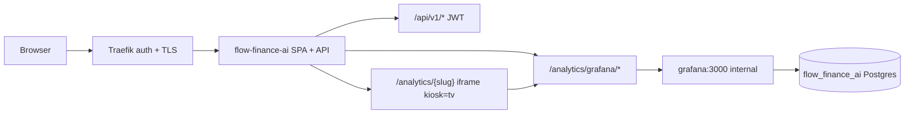

# Architecture

## Overview

Flow Finance AI is a self-hosted analytics layer on Firefly III. **US-0001** delivers the deployable platform foundation: Docker Compose stack, external PostgreSQL mirror, read-only Firefly connector, OIDC-protected React UI shell, sync scheduler, and minimal Grafana provisioning. No forecasting, subscription detection, or analytics dashboards in this story.

**Firefly read-only guarantee (explicit):** The Firefly Connector issues **HTTP GET requests only** to Firefly `/api/v1/*` endpoints. No POST, PUT, PATCH, or DELETE calls are permitted. Enforcement is via a typed HTTP client wrapper with method allowlist, integration-test assertion on outbound traffic, and optional audit log of every Firefly request (method, path, timestamp). Firefly remains the sole transaction source of truth; Flow Finance AI never mutates Firefly data (per R-0001, DEC-0004).

---

## US-0010 — External Firefly/Postgres & Traefik deployment on omniflow host

**Status:** architecture complete (2026-06-02)  
**Research:** R-0052, R-0053 (extends R-0004, R-0005)  
**Decisions:** DEC-0056  
**Depends on:** US-0001 Compose profiles, external DB wiring, Grafana provisioning

### System context (omniflow external profile)

```text
┌─────────────────────────────────────────────────────────────────────────────┐
│  Operator browser ──HTTPS──► Traefik (host stack, network traefik)          │
│         │ basic-auth middleware `auth`                                       │
│         ▼                                                                    │
│  https://financegnome.omniflow.cc ──► flow-finance-ai:8080 (no host ports)  │
└─────────────────────────────────────────────────────────────────────────────┘
         │
         │  finance_goblin project (profile external + overlay merge only)
         │
         ├── flow-finance-ai ──GET──► firefly:8080 (host container, DNS on traefik)
         │                      └──► postgres:5432 / flow_finance_ai (TimescaleDB)
         │
         └── grafana (internal-only default — traefik network, no public router)

Host stacks (read-only alignment — not modified by finance_goblin):
  /workdir/firefly/docker-compose.yml     → container `firefly`, Host finance.omniflow.cc
  /workdir/services/docker-compose.yml    → container `postgres`
  /workdir/networking/docker-compose.yml  → Traefik, middleware `auth`, certresolver myresolver
```

**Scope:** deployment wiring only — no application feature changes, no host stack edits in-repo.

### Compose architecture (DEC-0056)

#### Two-file merge pattern

| File | Role |
|------|------|
| `docker-compose.yml` | Base stack: images, healthchecks, profiles, dev defaults (`host.docker.internal`) |
| `docker-compose.external.yml` | Merge overlay only: external `traefik` network, in-network DNS overrides, Traefik labels, port `!reset` |

**Canonical omniflow invocation:**

```bash
docker compose -f docker-compose.yml -f docker-compose.external.yml --profile external up -d
```

Operator `.env` may set `COMPOSE_FILE=docker-compose.yml:docker-compose.external.yml` and `COMPOSE_PROFILES=external`.

**Alternative considered:** env-conditional single compose — rejected (overlay keeps Traefik labels out of local minimal runs; discovery 2026-06-01).

#### Profile model (post `bundled-firefly` split)

| Profile | Services | Use case |
|---------|----------|----------|
| `minimal` | `flow-finance-ai`, `grafana` | Dev/CI baseline **without** bundled Firefly |
| `bundled-firefly` | `firefly-iii` | Greenfield Firefly container alongside minimal |
| `standard` | minimal + bundled-firefly + `redis` | Extended dev |
| `full` | standard + `ollama`, `stats-forecast` | ML/AI sidecar path (remap `STATS_FORECAST_PORT=8091` on omniflow — host 8090 taken) |
| `external` | `flow-finance-ai`, `grafana` | Omniflow attach — **no** `firefly-iii`, **no** `postgres` |
| `oidc` | Authentik stack | Unchanged; optional |

**Greenfield dev (replaces prior `--profile minimal` alone):**

```bash
docker compose --profile minimal --profile bundled-firefly up --build
```

**Profile union rule:** Compose profiles are a union. **Never** combine `external` with `minimal`, `standard`, `full`, or `bundled-firefly` on omniflow — CI must assert `minimal+external` does not list `firefly-iii` after split.

#### External overlay contract

**`flow-finance-ai` overrides:**

| Aspect | Base default | External overlay |
|--------|--------------|------------------|
| Host ports | `${FLOW_PORT:-8080}:8080` | `ports: !reset []` |
| Networks | implicit default | `traefik` (external) |
| `DATABASE_HOST` | `host.docker.internal` | `postgres` |
| `FIREFLY_BASE_URL` | `http://firefly-iii:8080` | `http://firefly:8080` |
| Traefik | none | router `financegnome` (see below) |

**`grafana` overrides:**

| Aspect | Base default | External overlay |
|--------|--------------|------------------|
| Host ports | `${GRAFANA_PORT:-3000}:3000` | `ports: !reset []` (execute) |
| Networks | implicit default | `traefik` (external) |
| Public Traefik router | none | only when `${GRAFANA_TRAEFIK_HOST}` non-empty (opt-in) |

**Forbidden in overlay:** new `postgres`, `firefly`, or `firefly-iii` service definitions (AC-1).

#### Traefik routing (env-parameterized)

Fixed router/service id **`financegnome`** — must not collide with host `firefly` router (R-0052).

```yaml
labels:
  - traefik.enable=true
  - traefik.docker.network=traefik
  - traefik.http.routers.financegnome.rule=Host(`${TRAEFIK_HOST:-financegnome.omniflow.cc}`)
  - traefik.http.routers.financegnome.entrypoints=websecure
  - traefik.http.routers.financegnome.tls=true
  - traefik.http.routers.financegnome.tls.certresolver=myresolver
  - traefik.http.routers.financegnome.middlewares=${TRAEFIK_MIDDLEWARE:-auth}
  - traefik.http.services.financegnome.loadbalancer.server.port=8080
```

Reuse host global basic-auth middleware **`auth`** (`credentials.passwd` on Traefik container — out of scope). TLS via existing `myresolver` wildcard `*.omniflow.cc`.

**Public Firefly UI** remains `https://finance.omniflow.cc` (unchanged). Connector uses in-container `http://firefly:8080`.

#### PostgreSQL / TimescaleDB preflight

Flow Finance AI requires TimescaleDB (migration `001_initial.sql` → `CREATE EXTENSION timescaledb`; US-0002+ hypertables). Shared host container `postgres:latest` does **not** guarantee extension availability (R-0053 §1).

**Operator steps before first `compose up`:**

1. Create database `flow_finance_ai` and role `finance` on shared `postgres` (grants documented in `.env.example`).
2. Verify server packages + `shared_preload_libraries = 'timescaledb'` + Postgres restart if extension missing.
3. On `flow_finance_ai`: `CREATE EXTENSION IF NOT EXISTS timescaledb CASCADE;`
4. Preflight SQL: `SELECT extversion FROM pg_extension WHERE extname='timescaledb';` — non-null required.

**Failure mode:** backend migration panic; `/health` never OK until fixed. Firefly DB on same container does **not** imply TimescaleDB on `flow_finance_ai`.

**Alternative considered:** skip extension in migration 001 for external mode — rejected (breaks US-0002–US-0009; violates released architecture).

#### Environment variables (operator `.env` — names only)

| Variable | External mode | Notes |
|----------|---------------|-------|
| `DATABASE_HOST` | `postgres` | Overlay default |
| `DATABASE_PASSWORD` | required | `${DATABASE_PASSWORD:?}` in compose |
| `FIREFLY_BASE_URL` | `http://firefly:8080` | Overlay default |
| `FIREFLY_PERSONAL_ACCESS_TOKEN` | required for health/sync | Server-side only |
| `COMPOSE_FILE` | `docker-compose.yml:docker-compose.external.yml` | Optional convenience |
| `COMPOSE_PROFILES` | `external` | Must not combine with other profiles |
| `TRAEFIK_HOST` | default `financegnome.omniflow.cc` | Optional override |
| `TRAEFIK_MIDDLEWARE` | default `auth` | Host Traefik middleware name |
| `GRAFANA_TRAEFIK_HOST` | empty (internal-only) | Set only for optional public Grafana |
| `GRAFANA_ADMIN_PASSWORD` | operator-set | Replace weak base default |
| `STATS_FORECAST_PORT` | `8091` if `full` on same host | Host 8090 used by `firefly_product_manager` |
| `FIREFLY_APP_KEY`, `FIREFLY_DB_*` | only when `bundled-firefly` profile | Not required for external |
| `VITE_OIDC_*`, `OIDC_*` | when auth enabled | See OIDC section |

No literal passwords in committed YAML. Traefik basic-auth credentials remain on host Traefik stack only.

#### OIDC on public URL (document-only)

SPA (`frontend/src/auth/oidc.ts`) defaults `redirect_uri` to `${window.location.origin}/callback` when `VITE_OIDC_REDIRECT_URI` unset — works for omniflow without rebuild if IdP allows.

**Operator IdP registration (out of scope to automate):**

| Setting | Value |
|---------|-------|
| Redirect URI | `https://financegnome.omniflow.cc/callback` |
| Post-logout redirect | `https://financegnome.omniflow.cc/` |
| Web origin / CORS | `https://financegnome.omniflow.cc` |

AC-6 smoke may use `AUTH_DEV_BYPASS=true`; auth-on deployments must register IdP URIs explicitly. Traefik basic-auth and OIDC are orthogonal (edge vs app session).

#### CI / config guard (R-0053 §7)

Extend compose config check (no live `docker up` required):

```bash
export DATABASE_PASSWORD=ci FIREFLY_APP_KEY=base64:32RandomCharactersMinimumRequired== \
       FIREFLY_DB_PASSWORD=ci AUTHENTIK_SECRET_KEY=ci
services=$(docker compose -f docker-compose.yml -f docker-compose.external.yml \
  --profile external config --services | sort)
# expect: flow-finance-ai, grafana only
docker compose --profile minimal --profile bundled-firefly config --services
# guard: minimal+external must NOT include firefly-iii after bundled-firefly split
```

Wire through `tests/run-tests.sh` or `scripts/compose-config-check.sh`; CI reads `TEST_COMMAND` from runbook.

#### Operator smoke test (AC-6)

Eight-step checklist on Debian host — full table in `docs/engineering/runbook.md` (omniflow section). Record pass/fail per step; **never commit operator credentials**.

Key pass criteria: TimescaleDB version non-null; `http://firefly:8080/api/v1/about` from traefik network; backend `/health` OK; `https://financegnome.omniflow.cc/health` with basic-auth → 200; unauthenticated → 401; no `firefly-iii` in project services.

### Risks

| Risk | Mitigation | Ref |
|------|------------|-----|
| TimescaleDB missing on shared Postgres | Operator preflight block; fail-fast migrations | R-0053 §1, R-0004 |
| Profile union starts duplicate Firefly | `bundled-firefly` split + CI guard + runbook warning | DEC-0056, R-0053 §2 |
| Traefik router name collision | Fixed router id `financegnome` | R-0052 |
| Grafana admin exposed | Internal-only default; `!reset` ports; opt-in host only | DEC-0056, R-0053 §4 |
| Hardcoded Traefik host | `TRAEFIK_HOST` / `TRAEFIK_MIDDLEWARE` defaults | DEC-0056 |
| Compose `!reset` unsupported | Document Compose ≥2.24 minimum | R-0053 |
| OIDC misconfig masked by dev bypass | Smoke documents auth-off vs auth-on paths | R-0053 §5 |
| Port 8090 conflict with host service | `STATS_FORECAST_PORT=8091` when using `full` | R-0052 |
| Weak Grafana defaults | Require operator `GRAFANA_ADMIN_PASSWORD` in external docs | backlog discovery |

### Decisions (US-0010)

| ID | Topic | Summary |
|----|-------|---------|
| DEC-0056 | Omniflow external deploy | `bundled-firefly` split; two-file overlay contract; env Traefik labels; Grafana internal-only default |

Full record: `decisions/DEC-0056.md`

### Out of scope (US-0010)

- Editing host Firefly/Postgres/Traefik compose files in-repo
- Changing Firefly version or migrating Firefly data
- Modifying Traefik ACME/DNS or replacing host `auth` middleware
- OIDC IdP provisioning (redirect URI documentation only)
- Application code changes (connector, sync, UI features unchanged)

### Next phase

`/sprint-plan` — decompose 6 acceptance criteria (infra-only; expect smaller task count than feature stories; no sprint split unless >12 tasks).

---

## US-0011 — Unified analytics UI in financegnome (Grafana in-app)

**Status:** architecture complete (2026-06-02)  
**Research:** R-0054 (discovery route map; dedicated `/research` spike deferred — intake research satisfies architecture gate)  
**Decisions:** DEC-0057 (extends DEC-0012 dashboard uids, DEC-0056 internal Grafana, DEC-0006 SPA auth)  
**Spec-pack:** `docs/engineering/spec-pack/US-0011-{design-concept,crs,technical-specification}.md`  
**Depends on:** US-0010 external deploy (Grafana on `traefik` network, no public host by default), US-0002–US-0009 Grafana JSON provisioning

### System context



Operator-facing analytics today split across **React + ECharts** product pages (`/forecast`, `/wealth`, …) and **six Grafana SQL dashboards** (DEC-0012 uids). Only Wealth opens Grafana in a **new tab** via `VITE_GRAFANA_URL`. US-0011 unifies Grafana views **inside** the financegnome shell without removing the Grafana container or reimplementing SQL panels.

**Trust boundary:** Traefik `auth` (+ optional OIDC on SPA) protects the public origin. Grafana is not routable from the internet when `GRAFANA_TRAEFIK_HOST` is empty (DEC-0056). Anonymous Grafana Viewer behind the proxy is acceptable because upstream is network-isolated (DEC-0057).

### Dashboard → route map (canonical)

| Provisioned JSON | uid | React path | Iframe `src` (relative to embed base) |
|------------------|-----|------------|----------------------------------------|
| `platform-health.json` | `platform-health` | `/analytics/platform-health` | `/d/platform-health/platform-health?kiosk=tv` |
| `analytics/cashflow.json` | `cashflow` | `/analytics/cashflow` | `/d/cashflow/cashflow?kiosk=tv` |
| `analytics/subscriptions.json` | `subscriptions` | `/analytics/subscriptions` | `/d/subscriptions/subscriptions?kiosk=tv` |
| `analytics/budgets.json` | `budgets` | `/analytics/budgets` | `/d/budgets/budgets?kiosk=tv` |
| `analytics/portfolio.json` | `portfolio` | `/analytics/portfolio` | `/d/portfolio/portfolio?kiosk=tv` |
| `analytics/forecast-horizons.json` | `forecast-horizons` | `/analytics/forecast-horizons` | `/d/forecast-horizons/forecast-horizons?kiosk=tv` |

**Embed base (build-time):** `VITE_GRAFANA_EMBED_BASE` default `/analytics/grafana`  
**Full iframe URL:** ``${VITE_GRAFANA_EMBED_BASE}/d/{uid}/{slug}?kiosk=tv``

**Sidebar IA:** new **Analytics** nav group with six `NavLink`s (labels = dashboard Title). Optional **Platform Health** entry above the Analytics group or as first item in the group.

### Reverse proxy contract (DEC-0057)

| Element | Contract |
|---------|----------|
| Public prefix | `/analytics/grafana/` |
| Upstream | `GRAFANA_UPSTREAM` default `http://grafana:3000` (server env only) |
| Path handling | Strip `/analytics/grafana` prefix; forward remainder to upstream root (no `GF_SERVER_SERVE_FROM_SUB_PATH`) |
| Methods | GET, HEAD, POST (Grafana query API); OPTIONS for CORS preflight if needed |
| WebSocket | Forward `Connection: upgrade` / `Upgrade` for live panel refresh |
| Response headers | Remove or replace `X-Frame-Options: DENY/SAMEORIGIN` on proxied responses; avoid forwarding Grafana `Set-Cookie` to browser |
| Router placement | Merge **before** SPA `ServeDir` fallback in `build_router`; **outside** `/api/v1` `require_auth` middleware |
| Dev | `GRAFANA_UPSTREAM=http://localhost:3000` when Grafana published on host port |

**Alternative rejected:** `/api/v1/analytics/grafana/*` — couples embed static assets to API auth and JWT middleware (DEC-0057).

#### Grafana container environment (execute)

Add to `grafana` service `environment` (compose base + external overlay unchanged for networking):

```yaml
GF_AUTH_ANONYMOUS_ENABLED: "true"
GF_AUTH_ANONYMOUS_ORG_ROLE: Viewer
GF_SECURITY_ALLOW_EMBEDDING: "true"
```

Keep `GF_USERS_ALLOW_SIGN_UP: "false"`. Do **not** enable public Traefik router for US-0011 acceptance path.

**Alternative deferred:** Grafana auth-proxy headers mapped from OIDC — decision gate in DEC-0057 if anonymous proves insufficient on omniflow smoke.

#### Environment variables

| Variable | Scope | Default | Notes |
|----------|-------|---------|-------|
| `GRAFANA_UPSTREAM` | backend runtime | `http://grafana:3000` | Docker DNS on `traefik` / default network |
| `VITE_GRAFANA_EMBED_BASE` | frontend build | `/analytics/grafana` | Same-origin path; no trailing slash required if code normalizes |
| `VITE_GRAFANA_URL` | frontend build | — | **Deprecated** — remove Wealth external-tab usage |
| `GRAFANA_TRAEFIK_HOST` | compose overlay | empty | Optional escape hatch only; not used by embed iframes |

Document all four in `.env.example` omniflow block with DEC-0056 cross-reference.

### Frontend components (execute)

| Component | Responsibility |
|-----------|----------------|
| `AnalyticsEmbedPage` | Props: `uid`, `slug`, `title`; full-width responsive iframe; `loading`/`error` shell states |
| `App.tsx` | Six routes under `ProtectedRoute` → `/analytics/:slug` or explicit six routes |
| `AppLayout.tsx` | `analyticsNavItems` group; preserve collapsed sidebar labels |
| `WealthPage.tsx` | Primary portfolio analytics → `<Link to="/analytics/portfolio">` (AC-5) |

**Regression guard:** existing `/forecast`, `/wealth`, `/planning`, `/subscriptions`, `/alerts` ECharts flows unchanged (AC-4).

**CSP:** default same-origin iframe needs `frame-src 'self'` only when CSP meta/header added; no `GRAFANA_TRAEFIK_HOST` in `frame-src` for MVP.

### Future-chart guideline (AC-6)

Document in `docs/user-guides/US-0011.md`:

1. **Default:** new product charts → React page + REST API + ECharts (same shell, sidebar entry).
2. **Exception:** Grafana embed only for SQL-heavy ops panels tied to existing provisioning until a deliberate migration story retires the panel.
3. **Cross-links:** product pages may link to `/analytics/{slug}` as secondary “SQL view”; product page remains canonical for interactive flows (see DEC-0057 UX table).

### Acceptance mapping

| AC | Architecture anchor |
|----|---------------------|
| AC-1 Analytics sidebar + routes | Route map + `AppLayout` group |
| AC-2 In-app open (no default new tab) | iframe on `/analytics/*`; DEC-0057 proxy |
| AC-3 Traefik + auth | Edge auth on financegnome origin; proxy outside JWT |
| AC-4 ECharts regression | Out of scope for proxy changes to `/api/v1` |
| AC-5 Wealth migration | `/analytics/portfolio` replaces `VITE_GRAFANA_URL` tab |
| AC-6 Future-chart + operator guide | User guide + DEC-0057 UX table |
| AC-7 Single URL | No required `GRAFANA_TRAEFIK_HOST` |

### Risks

| Risk | Mitigation | Ref |
|------|------------|-----|
| iframe blocked by framing headers | Proxy strips/replaces `X-Frame-Options` | DEC-0057, R-0054 |
| WS/live refresh broken | Explicit upgrade in proxy; QA smoke | discovery open Q |
| Anonymous Grafana too permissive | Viewer role only; internal network; no public router | DEC-0056, DEC-0057 |
| Traefik auth + OIDC confusion | Document dev `AUTH_DEV_BYPASS` vs production | US-0010 runbook |
| Duplicate ECharts vs Grafana metrics | Canonical UX table in user guide | backlog |
| Upstream SSRF misconfig | Allowlist `grafana` host in config validation | DEC-0057 |

### Decisions (US-0011)

| ID | Topic | Summary |
|----|-------|---------|
| DEC-0057 | Analytics proxy + embed | `/analytics/grafana/` same-origin proxy; anonymous Viewer Grafana; env contract; deprecate `VITE_GRAFANA_URL` |

Full record: `decisions/DEC-0057.md`

### Out of scope (US-0011)

- Removing Grafana container or rewriting dashboard SQL to ECharts
- Public `GRAFANA_TRAEFIK_HOST` as default UX
- Grafana auth-proxy / OIDC header federation (deferred gate)
- Changing DEC-0012 panel queries or uids
- US-0010 compose/Traefik work except Grafana anonymous env vars

### Next phase

`/sprint-plan` — decompose 7 acceptance criteria; expect ~8–10 tasks (proxy, compose env, 6 routes/nav, Wealth migration, user guide, smoke test). Split only if > `SPRINT_MAX_TASKS` (12).

---

## US-0012 — Auto-provision application database on first start

**Status:** Architecture complete (2026-06-03)  
**Research:** R-0055, R-0053 §1  
**Decisions:** DEC-0058 (extends DEC-0003 startup retry, amends DEC-0056 operator DB-create preflight)  
**Depends on:** US-0010 external profile (shared `postgres` on `traefik` network)

### Problem

External PostgreSQL rejects connections to non-existent databases (`3D000`). Current startup connects directly to `DATABASE_NAME`, retries until budget exhaustion (DEC-0003), then runs migrations. Operators on omniflow run manual `CREATE DATABASE flow_finance_ai` before `compose up` (US-0010 runbook §1).

### Startup ordering (canonical)

Insert **`DbPool::ensure_database(&config)`** in `backend/src/lib.rs` before existing pool connect:

```
AppConfig::load()  [validates DATABASE_NAME allowlist]
       │
       ▼
ensure_database()  ── maintenance pool (retry: DEC-0003 startup_retry_*)
       │              ├─ pg_database existence check (parameterized)
       │              ├─ CREATE DATABASE … OWNER app_user (if absent)
       │              └─ CREATE EXTENSION timescaledb on app DB (maintenance creds)
       ▼
connect_with_retry()  ── app pool → DATABASE_NAME
       ▼
run_migrations()  ── 001 still CREATE EXTENSION IF NOT EXISTS (idempotent)
       ▼
service wiring (unchanged)
```

**Fail-closed:** bootstrap errors exit before migrations — no partial schema on privilege or TimescaleDB failure.

### Module layout

| File | Responsibility |
|------|----------------|
| `backend/src/db/bootstrap.rs` | `ensure_database`, existence check, create, extension, reason-code logging |
| `backend/src/db/mod.rs` | `pub mod bootstrap;`, re-export `ensure_database` |
| `backend/src/config/mod.rs` | Parse `DATABASE_BOOTSTRAP_URL`; `maintenance_database_url()`; `validate_database_name()` |
| `backend/src/lib.rs` | Call `ensure_database` before `connect_with_retry` |

Use short-lived `PgConnection` / single-connection pool for maintenance and extension steps — do not reuse app `PgPool` max_connections budget.

### Env contract (DEC-0058)

| Variable | Required | Purpose |
|----------|----------|---------|
| `DATABASE_HOST`, `DATABASE_PORT`, `DATABASE_NAME`, `DATABASE_USER`, `DATABASE_PASSWORD` | runtime (existing) | App connection + migrations — unchanged |
| `DATABASE_BOOTSTRAP_URL` | optional | Full postgres URL to maintenance DB (`…/postgres`); admin/superuser; env-only |

**Resolution order:**

1. `DATABASE_BOOTSTRAP_URL` set → maintenance connection only.
2. Else → derive `postgres://{USER}:{PASSWORD}@{HOST}:{PORT}/postgres` from runtime vars.

**Out of scope env:** auto-create `DATABASE_USER`; `DATABASE_URL` for bootstrap (use `DATABASE_BOOTSTRAP_URL`).

### Bootstrap sequence (idempotent)

| Step | Action | Idempotency |
|------|--------|-------------|
| 1 | Maintenance connect (`postgres` DB) | DEC-0003 retry loop |
| 2 | `SELECT 1 FROM pg_database WHERE datname = $1` | portable (R-0055) |
| 3a | Absent: `CREATE DATABASE "{name}" OWNER "{app_user}"` | never drop/recreate |
| 3b | Present: skip create | never recreate |
| 4 | Log `database_bootstrap_grants_applied` when bootstrap user ≠ app user and create ran | OWNER handles grants |
| 5 | Connect to app DB with maintenance creds → extension check/create | run on new and existing DB missing extension |
| 6 | Fail closed on privilege (`42501`) or missing TimescaleDB server files | do not proceed to migrations |
| 7 | App `connect_with_retry` → `run_migrations` | migration 001 duplicate-safe |

**Wrong-password behavior (unchanged):** bootstrap may succeed via admin URL while app connect still fails — bootstrap does not fix credential typos.

### Structured log reason codes

Tracing field **`bootstrap_reason`** — stable operator/CI contract (full table in DEC-0058). Human-readable messages cite runbook § Omniflow external deploy §1 (TimescaleDB host install); never echo bootstrap URL secrets.

### Privilege matrix

| Deployment | App role | Bootstrap path |
|------------|----------|----------------|
| Greenfield dev (`DATABASE_USER` with `CREATEDB`) | has `CREATEDB` | derived maintenance URL |
| Omniflow shared `postgres` | `finance` without `CREATEDB` | **`DATABASE_BOOTSTRAP_URL`** with admin/`postgres` superuser |
| CI / test fixture | superuser | derived or `DATABASE_BOOTSTRAP_TEST_URL` |
| DB already exists | any | skip create; extension attempt if missing |

### TimescaleDB alignment

| Layer | Owner |
|-------|-------|
| Host OS packages + `shared_preload_libraries` | Operator (R-0053 §1) — **out of scope** US-0012 |
| `CREATE EXTENSION timescaledb` on app DB | Bootstrap before migrations + migration 001 (keep) |
| Hypertables (002+) | Unchanged |

**Amends US-0010 architecture § PostgreSQL/TimescaleDB preflight:** remove manual “create database `flow_finance_ai`” as blocking step; retain TimescaleDB server install + preflight `SELECT extversion …` when extension bootstrap fails.

### Runbook delta plan (execute — docs only in architecture phase)

| Artifact | Change |
|----------|--------|
| `docs/engineering/runbook.md` § Omniflow §1 | Replace “create DB/user first” with auto-provision + `DATABASE_BOOTSTRAP_URL` when app role lacks `CREATEDB`; TimescaleDB host install block unchanged |
| `.env.example` omniflow block | Add `DATABASE_BOOTSTRAP_URL`; shrink manual SQL to TimescaleDB host-only note |
| `docs/engineering/architecture.md` US-0010 § preflight | Cross-link US-0012 (this section) |
| `decisions/DEC-0056.md` | Footnote: DB create automated by DEC-0058; TimescaleDB preflight retained |

No new Compose services.

### Test strategy

| Tier | Scope | When runs |
|------|-------|-----------|
| **Unit** | `validate_database_name` allowlist; maintenance URL builder (no secrets in debug fmt); reason-code mapping | Always (`cargo test --lib`) |
| **Integration** | `backend/tests/database_bootstrap_integration.rs` — ephemeral DB name, `ensure_database` creates DB, idempotent second call skips, optional extension assert | When `DATABASE_BOOTSTRAP_TEST_URL` or superuser `DATABASE_URL` with maintenance access set |
| **CI optional job** | `postgres:16` service — create path without TimescaleDB; separate job or manual matrix with `timescale/timescaledb` for extension-ok path | Document in runbook; not blocking default CI if integration skips |

**AC-6 mapping:** integration test proves create-if-missing without operator manual SQL; privilege-fail case via non-`CREATEDB` role + absent bootstrap URL (expect `database_bootstrap_failed_privilege`).

Wire through `tests/run-tests.sh` when test env present (same pattern as existing `DATABASE_URL` gated tests).

### Risks

| Risk | Mitigation |
|------|------------|
| Bootstrap URL secret leakage | Redact passwords in logs; `.env.example` warns never commit |
| Owner vs grant on shared host | `CREATE DATABASE … OWNER` (DEC-0058) |
| Extension privilege on shared Postgres | Maintenance creds for extension step |
| TimescaleDB missing after DB create | `database_bootstrap_failed_timescaledb` before migration panic |
| Identifier injection | Config-load allowlist |
| Duplicate failure modes with migration 001 | Bootstrap fails first with structured code |

### Decisions (US-0012)

| ID | Topic | Summary |
|----|-------|---------|
| DEC-0058 | Database bootstrap on first start | In-app `ensure_database`; optional `DATABASE_BOOTSTRAP_URL`; OWNER create; extension via maintenance creds; `bootstrap_reason` codes |

Full record: `decisions/DEC-0058.md`

### Out of scope (US-0012)

- Host TimescaleDB package install / `postgresql.conf` edits
- Auto-create PostgreSQL role (`DATABASE_USER`)
- Embedded/bundled Postgres Compose service
- Firefly database provisioning

### Next phase

`/sprint-plan` — decompose 6 acceptance criteria; expect ~7–9 tasks (bootstrap module, config, lib wiring, env/runbook docs, integration test). Single sprint under `SPRINT_MAX_TASKS` (12).

---

## BUG-0002 — Omniflow production integration defects (Firefly sync + risk-score + exchange settings)

**Status:** architecture complete (2026-06-04)  
**Discovery:** `discovery-20260604-bug0002` in `handoffs/po_to_tl.md`  
**Research:** R-0057 (PAT Bearer — no new R-xxxx), R-0001, R-0032  
**Decisions:** extends DEC-0004 (Firefly PAT), DEC-0054 (plan risk score API); **no new DEC**  
**Sprint:** `/quick` **Q0008** (recommended)  
**Acceptance:** `docs/product/acceptance.md` rows C, D, E

### Runtime proof (discovery baseline — unchanged)

| Endpoint | HTTP | Interpretation |
|----------|------|----------------|
| `/api/v1/sync/status` | 200 | Route OK; `state: failed`, `error_message` contains `401 Unauthorized` |
| `/api/v1/plans/risk-score` | 404 | Application `NOT_FOUND` when no persisted score — **not** Traefik misroute |
| `/api/v1/settings` | 200 | `bitunix: configured=true, enabled=false`; Binance `enabled=true, configured=false` |

`isolation_scope`: repo source + public HTTPS curl; no operator `.env` / PAT values read.

### Fix slices (three independent, one deploy)

```text
BUG-0002
├── C — Firefly sync (P0)
│   ├── C1 — Operator: non-empty FIREFLY_PERSONAL_ACCESS_TOKEN + compose env passthrough (ops/docs)
│   └── C2 — Code: empty PAT guard + fail-fast sync error (backend)
├── D — Plan risk-score API
│   └── D1 — 200 tagged empty-state JSON (backend + Planning UI types)
└── E — Exchange settings semantics
    ├── E1 — effective_enabled = configured() || toml.enabled (backend)
    └── E2 — optional: binance.enabled=false in default.toml (greenfield)
```

C2, D1, E1 independently deployable; **C1 gates acceptance row C** on omniflow (operator PAT).

### Sub-defect C — Firefly PAT empty-string guard

#### Problem

`config/mod.rs` applies `set_override("firefly.personal_access_token", pat)` when env var is **present but blank**, producing `Authorization: Bearer ` → Firefly **401**. Sync APIs are routable (**200** on `/api/v1/sync/status`).

#### Contract (C2 — frozen)

| Layer | Change |
|-------|--------|
| Env overlay | Apply PAT override **only when** `pat.trim().is_empty() == false` |
| `FireflyConfig` | Add `pat_configured() -> bool` (non-empty trimmed token) |
| Sync preflight | Before outbound Firefly HTTP, if sync enabled and `!pat_configured()`, fail run with stable `error_message`: `firefly_personal_access_token_missing` (human text: cite runbook PAT smoke; **no** token in logs) |
| Readiness (optional) | Extend `/health/ready` JSON with `firefly_pat_configured: bool` (names-only; no secret) |

**Ruled out:** Traefik/router fixes for sync (status **200** proves API path). Proxy/HTML rewrite (wrong layer).

**Operator (C1):** Non-empty PAT in operator `.env`; after `docker compose … up`, `printenv FIREFLY_PERSONAL_ACCESS_TOKEN` non-empty (value not logged) per runbook § Omniflow PAT table.

**Files:** `backend/src/config/mod.rs`, `backend/src/sync/mod.rs` (or shared preflight helper), `backend/src/health/mod.rs` (optional), `docs/engineering/runbook.md`, `.env.example` (comment only).

**Risks:** PAT in `.env` but not mounted in container — C1 runbook + compose cwd; guard must not block intentional empty-PAT dev if Firefly disabled — gate on `base_url` + sync scheduler active only.

### Sub-defect D — `GET /api/v1/plans/risk-score` empty-state 200

#### Problem

Handler returns **404** when `PlanRiskService::latest_for_active_plan()` is `None` (`plans.rs:546`). Route is registered; acceptance requires **200** with score or documented empty-state.

#### API contract (D1 — frozen)

**Always HTTP 200.** Tagged JSON body (serde `#[serde(tag = "status")]` or equivalent):

**Populated score** (`status: "ok"`):

```json
{
  "status": "ok",
  "score": 42,
  "band": "Medium",
  "components": {
    "balance_stress": 10.0,
    "plan_viability": 20.0,
    "crypto_volatility": 5.0,
    "ml_divergence_modifier": 0.0
  },
  "plan_computation_id": "uuid"
}
```

**Empty state** (`status: "no_score"`):

```json
{
  "status": "no_score",
  "reason": "no_active_plan"
}
```

```json
{
  "status": "no_score",
  "reason": "not_computed"
}
```

| `reason` | When |
|----------|------|
| `no_active_plan` | No `plans.is_active = true` row |
| `not_computed` | Active plan exists but no `plan_risk_scores` row for latest successful computation on active/latest version (includes post-sync-not-run and sync-blocked-by-C states) |

**Alternatives rejected:** Keep **404** for empty (fails acceptance); rename route to singular `/plan/risk-score` (breaks existing client path).

**Extends DEC-0054:** persistence/trigger unchanged; **API read path** returns empty-state instead of 404.

**Frontend:** `PlanRiskScoreResponse` discriminated union in `api.ts`; `PlanningPage` — render badge only when `status === "ok"`; no hard error on `no_score` (query succeeds).

**Files:** `backend/src/api/plans.rs`, `backend/src/plan/risk.rs` (optional helper for reason), `frontend/src/lib/api.ts`, `frontend/src/pages/PlanningPage.tsx`, `backend/tests/` or `plans` module test for 200 + `no_score`.

**Risks:** Contract drift — frozen shapes above; clients parsing flat score object break — update SPA in same PR.

### Sub-defect E — Exchange effective `enabled`

#### Problem

`settings_view()` and `mirror_enabled_at_startup()` use TOML `enabled` only. `configured()` reads env credentials. Production: Bitunix **configured=true, enabled=false** while `default.toml` has `binance.enabled=true`.

#### Contract (E1 — frozen)

```rust
fn effective_enabled(instance: &ExchangeInstanceConfig) -> bool {
    instance.configured() || instance.enabled
}
```

Apply in:

| Consumer | Behavior |
|----------|----------|
| `ExchangesConfig::settings_view()` | Each exchange row `enabled: effective_enabled(&instance)` |
| `ExchangeService::mirror_enabled_at_startup()` | `set_enabled(id, effective_enabled(...))` |

**Unchanged:** Sync still validates API keys before outbound exchange calls; effective enable does **not** bypass credential checks.

**E2 (accepted in Q0008):** Set `[exchanges.binance] enabled = false` in `backend/config/default.toml` — reduces greenfield false “Binance on” without env keys. Bybit/bitunix defaults unchanged.

**Alternatives rejected:** TOML-only operator edit (poor omniflow UX); UI-only mask (DB/API sync still wrong).

**Files:** `backend/src/config/mod.rs`, `backend/src/exchanges/service.rs`, `backend/config/default.toml` (E2), `frontend/src/pages/SettingsPage.tsx` (no change if API correct).

**Risks:** Auto-enable exchange with creds but operator intended disable — mitigated: operator can disable via Settings API/DB after mirror; document in runbook if needed.

### Task map (Q0008)

| Task | Sub | Layer | Deploy alone | Acceptance row |
|------|-----|-------|--------------|----------------|
| C1 | C | ops/docs | yes | C (operator) |
| C2 | C | backend | yes | C (code path) |
| D1 | D | backend + frontend | yes | D |
| E1 | E | backend | yes | E |
| E2 | E | config | yes | E (greenfield) |

**Count:** 5 tasks (≤ `SPRINT_MAX_TASKS` 12) → **`/quick` Q0008**, skip full `/sprint-plan` ceremony unless PO requests S00xx.

### Test strategy

| Check | Type | Pass criteria |
|-------|------|---------------|
| C — PAT guard | Unit/integration | Empty env PAT → `pat_configured() == false`; sync preflight error code set |
| C — PAT loaded | Operator | `printenv` name non-empty; manual sync success; no 401 in `last_run.error_message` |
| D — risk empty | curl / Rust test | `GET /api/v1/plans/risk-score` → **200** + `status: no_score` OR `status: ok` |
| D — Planning UI | Operator | Planning loads without query error on empty score |
| E — settings | curl | Bitunix-only env → `enabled=true, configured=true` |
| Regression | Operator | OIDC + bundled-firefly profiles per acceptance footer |

### Decisions (BUG-0002)

| Topic | Resolution |
|-------|------------|
| New DEC | **None** — behavioral fixes under DEC-0004 / DEC-0054 / exchange env pattern (R-0032) |
| Empty risk 404 | **Rejected** — D1 tagged 200 empty-state |
| Effective enabled | **E1** credentials imply intent |
| E2 default.toml | **Accepted** in Q0008 |

### Next phase

`/sprint-plan` or **`/quick` Q0008** — materialize `sprints/quick/Q0008/task.json` from task table above; then `/execute`.

---

## BUG-0003 — Omniflow production API 500 cascade, Bitunix test, Grafana SQL

**Status:** architecture complete (2026-06-05)  
**Discovery:** `discovery-20260605-bug0003` in `handoffs/po_to_tl.md`  
**Research:** R-0052 (external `DATABASE_HOST=postgres`), R-0058 (Bitunix futures auth — G2 gate only)  
**Decisions:** extends **DEC-0056** (omniflow external Postgres topology); **no new DEC**  
**Sprint:** `/quick` **Q0009** (recommended)  
**Acceptance:** `docs/product/acceptance.md` rows **F**, **G**, **H**  
**Related:** BUG-0002 OPEN (Q0008) — **do not merge**; separate deploy/verify tracks

### Runtime proof (discovery baseline — frozen)

| Probe | HTTP | Latency | Notes |
|-------|------|---------|-------|
| `GET /api/v1/settings` | 200 | ~0.08s | `database_host: host.docker.internal`, `database_mode: external` |
| `GET /api/v1/alerts/unread-count` | 500 | ~30.07s | DB timeout pattern |
| `GET /api/v1/sync/entities` | 500 | ~30.12s | |
| `GET /api/v1/sync/runs` | 500 | ~30.06s | |
| `GET /api/v1/exchanges` | 500 | ~30.06s | |
| `GET /api/v1/subscriptions` | 500 | ~30.06s | |
| `GET /api/v1/ai/audit` | 500 | ~30.06s | |
| `POST /api/v1/exchanges/bitunix/test` | 400 | &lt;0.2s | Registry gap — not DB timeout |
| `POST …/analytics/grafana/api/ds/query` | 400 | ~0.36s | `db query error` on `SELECT 1` |

Container env (names only): `DATABASE_HOST=host.docker.internal` on `flow-finance-ai` and `grafana`; `BITUNIX_API_KEY` / `BITUNIX_API_SECRET` present on backend.

`isolation_scope`: artifact + repo source + public HTTPS curl + docker logs/env names-only; **no** operator `.env` / `.env_prod` read.

### Fix slices (three sub-defects, shared deploy order)

```text
BUG-0003
├── F — DATABASE_HOST misconfiguration (P0)
│   ├── F1 — Operator: DATABASE_HOST=postgres; recreate flow-finance-ai + grafana (ops)
│   └── F2 — Docs: external-profile env guard + omniflow block in .env.example (DEC-0056 / R-0052)
├── G — Exchange connector registry gap (P0)
│   ├── G1 — ExchangeService::new uses effective_enabled() for all connectors (backend)
│   └── G2 — Conditional: R-0058 futures header-auth on fapi.bitunix.com (backend spike)
└── H — Grafana SQL / provisioning (P1)
    ├── H1 — Same as F1 (datasource ${DATABASE_HOST})
    └── H2 — Optional: dedupe duplicate dashboard UIDs in provisioning (grafana)
```

**Deploy order:** F1 before acceptance rows F/H; G1 code can ship with F2 in one PR; **G2 only if** post-deploy smoke (`G1` + `F1`) still returns auth failure with body (not `unknown exchange`). **H2** only if operator needs provisioning refresh after UID dedupe.

### Sub-defect F — `DATABASE_HOST=host.docker.internal` on external profile

#### Problem

Operator `.env` sets `DATABASE_HOST=host.docker.internal`, overriding `docker-compose.external.yml` `${DATABASE_HOST:-postgres}`. On Docker network `traefik`, `host.docker.internal` is unreachable from `flow-finance-ai` / `grafana` → SQLx pool query timeout ~30s → widespread API **500**. Settings endpoint may still return **200** (config read without DB round-trip).

#### Contract (F1 — frozen, operator)

| Step | Action |
|------|--------|
| 1 | Set `DATABASE_HOST=postgres` in operator `.env` (explicit; matches overlay default) |
| 2 | Recreate **`flow-finance-ai`** and **`grafana`** (`docker compose … up -d --force-recreate` or equivalent) |
| 3 | Verify `GET /api/v1/settings` → `database_host: postgres` |
| 4 | Smoke representative `GET /api/v1/*` — **200** within normal latency (not **500** ~30s) |

**Ruled out:** Traefik/router misroute (settings **200**); backend code change for pool host (ops/env layer per DEC-0056).

#### Contract (F2 — frozen, docs)

| Artifact | Change |
|----------|--------|
| `.env.example` | Add **omniflow external** block comment: `DATABASE_HOST=postgres` — **do not** copy greenfield `host.docker.internal` default into external deploy |
| `docs/engineering/runbook.md` § Omniflow §2 | Warning callout: wrong `DATABASE_HOST` symptom table (~30s **500**); cite overlay `${DATABASE_HOST:-postgres}`; remediation = F1 |
| Optional | Comment in `docker-compose.external.yml` above `DATABASE_HOST` line (one line, no behavior change) |

**Alternatives rejected:**

- *Change overlay to hardcode `postgres` without env* — breaks operator override for non-omniflow external hosts (DEC-0056 flexibility).
- *Backend auto-rewrite `host.docker.internal` → `postgres` in external mode* — magic env coupling; docs + operator fix preferred.

**Files (F2):** `.env.example`, `docs/engineering/runbook.md`; optional `docker-compose.external.yml` comment.

**Risks:** Operator copies full `.env.example` without reading omniflow block — F2 mitigates; F1 still required on live host before verify-work.

### Sub-defect G — Bitunix test **400** `unknown exchange`

#### Problem

Q0008 **E1** added `effective_enabled()` to `settings_view()` and `mirror_enabled_at_startup()` but **`ExchangeService::new` still gates connector registration on TOML `enabled` only** (`service.rs` L40–48). With `default.toml` `[exchanges.bitunix] enabled=false` and credentials present, settings show `enabled=true` but runtime `connectors` vec has no `bitunix` → `test_connection` returns **400** before HTTP.

```40:48:backend/src/exchanges/service.rs
        if config.binance.enabled {
            connectors.push(Arc::new(BinanceConnector::new(config.binance.clone())));
        }
        if config.bybit.enabled {
            connectors.push(Arc::new(BybitConnector::new(config.bybit.clone())));
        }
        if config.bitunix.enabled {
            connectors.push(Arc::new(BitunixConnector::new(config.bitunix.clone())));
        }
```

#### Contract (G1 — frozen)

Register each connector when **`instance.effective_enabled()`** is true (same predicate as mirror/settings):

| Connector | Registration condition |
|-----------|------------------------|
| Binance | `config.binance.effective_enabled()` |
| Bybit | `config.bybit.effective_enabled()` |
| Bitunix | `config.bitunix.effective_enabled()` |

**Unchanged:** `test_connection` still performs outbound HTTP; effective enable does not skip credential validation. Sync paths unchanged.

**Alternatives rejected:**

- *Set `bitunix.enabled=true` in default.toml only* — wrong greenfield default; does not fix binance/bybit parity.
- *Register all connectors always* — violates operator TOML disable intent when not configured.

**Files (G1):** `backend/src/exchanges/service.rs`; unit test in `backend/src/config/mod.rs` or exchanges module asserting connector count when configured + TOML disabled.

**Risks:** Auto-register with creds but operator intended disable — same as Q0008 E1; Settings API/DB can disable after mirror.

#### Contract (G2 — decision gate, conditional)

Execute **only when** after **F1 + G1** deploy:

- `POST /api/v1/exchanges/bitunix/test` returns non-**400**-unknown-exchange, **and**
- Response indicates auth/URL failure (e.g. **401**/**403** or structured error body), **not** success.

Then spike per **[R-0058](docs/engineering/research.md#r-0058--bitunix-futures-api-auth-vs-connector-implementation)**:

- Private REST host `https://fapi.bitunix.com`
- Headers: `api-key`, `nonce`, `timestamp`, `sign` (futures sign doc)
- Keep spot `openapi.bitunix.com` path for balance sync unless product expands scope

**Alternatives rejected for day one:**

- *Futures-only rewrite without smoke gate* — unnecessary if G1 fixes registry-only failure (discovery proved **&lt;0.2s** **400**).
- *CCXT* — still rejected (R-0032).

**Files (G2, if triggered):** `backend/src/exchanges/bitunix.rs`, tests against mock or documented error shapes.

**Risks:** Operator keys futures-scoped vs spot host; wrong sign algorithm — capture HTTP status/body in smoke notes; do not conflate with F until DB host fixed.

### Sub-defect H — Grafana SQL **400**

#### Problem

`grafana/provisioning/datasources/postgres.yaml` interpolates `${DATABASE_HOST}:${DATABASE_PORT}` — same wrong host as F. Duplicate dashboard UID warnings are **secondary** (provisioning write blocked; panels may still fail on host alone).

#### Contract (H1 — frozen)

**Acceptance row H** verified by **F1** smoke: `POST …/analytics/grafana/api/ds/query` → **200**; datasource reaches in-network `postgres`.

#### Contract (H2 — optional, out of Q0009 default)

Dedupe UIDs across `grafana/provisioning/dashboards/**` providers only if operator needs provisioning refresh after duplicate warnings persist post-F1.

**Files (H2):** `grafana/provisioning/dashboards/**/*.json`, provider YAML if paths collide.

**Risks:** UID rename breaks bookmarked `/d/uid` URLs — coordinate with US-0011 route map; low priority vs F1.

### Task map (Q0009)

| Task | Sub | Layer | Depends | Deploy alone | Acceptance row |
|------|-----|-------|---------|--------------|----------------|
| F1 | F | ops | — | yes | F, H (operator) |
| F2 | F | docs | — | yes | F (guardrail) |
| G1 | G | backend | — | yes | G (code) |
| G2 | G | backend spike | G1, F1 deploy + smoke | gated | G (auth path) |

**Count:** 4 tasks (3 required + 1 gated) ≤ `SPRINT_MAX_TASKS` 12 → **`/quick` Q0009**; H1 = F1 verify step; H2 deferred.

### File touch list (frozen)

| Path | Task | Change |
|------|------|--------|
| `backend/src/exchanges/service.rs` | G1 | `effective_enabled()` in `new()` |
| `backend/src/config/mod.rs` or `backend/tests/` | G1 | Regression test: configured + TOML disabled → connector registered |
| `backend/src/exchanges/bitunix.rs` | G2 | Futures header-auth (conditional) |
| `.env.example` | F2 | Omniflow `DATABASE_HOST=postgres` warning block |
| `docs/engineering/runbook.md` | F2 | § Omniflow mis-host symptom + remediation |
| `docker-compose.external.yml` | F2 | Optional one-line comment (no behavior) |
| `grafana/provisioning/dashboards/**` | H2 | Optional UID dedupe (not in Q0009 default) |
| Operator `.env` on host | F1 | `DATABASE_HOST=postgres` (not committed) |

**No touch:** Traefik labels, analytics proxy (DEC-0057), JWT stack, Firefly PAT (BUG-0002), `docker-compose.external.yml` default expression (already correct).

### Test strategy

| Check | Type | Pass criteria |
|-------|------|---------------|
| F — DB host | Operator + curl | Settings `database_host: postgres`; sample GETs **200** &lt;2s |
| F — guardrail | Doc review | Omniflow block warns against `host.docker.internal` |
| G — registry | Rust unit / integration | Configured bitunix + TOML `enabled=false` → connector in `new()` map |
| G — test API | Operator curl | `POST …/bitunix/test` not **400** unknown exchange |
| G2 — auth | Operator (gated) | Documented auth error or **200** test payload |
| H — Grafana SQL | Operator | `POST …/ds/query` **200** after F1 |
| Regression | Operator | Acceptance footer: OIDC + bundled-firefly |

### Decisions (BUG-0003)

| Topic | Resolution |
|-------|------------|
| New DEC | **None** — ops/docs under DEC-0056 + R-0052; G1 completes Q0008 E1 parity in `ExchangeService::new` |
| Hardcode postgres in compose | **Rejected** — keep `${DATABASE_HOST:-postgres}` |
| G2 futures auth | **Gated** — R-0058 spike only after G1+F1 smoke |
| H2 UID dedupe | **Deferred** — optional follow-up |
| Merge with BUG-0002 | **Rejected** — separate bugs and sprints (Q0008 vs Q0009) |

### Next phase

**`/quick` Q0009** — sprint-plan complete (`sprint.json`, `tasks.md`, `uat.md`); operator **F1** before verify-work; next `/plan-verify` → `/execute`.

---

## US-0016 — Root README for operators and contributors (living documentation)

**Status:** Architecture complete (2026-06-08)  
**Discovery:** `discovery-20260608-us0016` in `handoffs/po_to_tl.md`  
**Research:** [R-0066](research.md#r-0066--root-readme-split-layout-and-living-doc-maintenance), [R-0067](research.md#r-0067--us-0016-root-readme-research-template-parity-product-status-maintenance-hooks)  
**Decisions:** **DEC-0070** (template parity posture, Product status placement, maintenance hooks); extends doc-profile split layout (US-0077 / runbook § documentation profile validation)  
**Sprint:** Single sprint recommended (~6–8 tasks) under `SPRINT_MAX_TASKS` (12)  
**Acceptance:** `docs/product/acceptance.md` § US-0016 (6 rows)  
**Spec-pack:** `docs/engineering/spec-pack/US-0016-{design-concept,crs,technical-specification}.md` (`SPEC_PACK_MODE=1`)  
**User-guide:** No per-story guide required; root README links `docs/user-guides/` when `USER_GUIDE_MODE=1` (`docs/user-guides/US-xxxx.md` schema per US-0032)

### Problem

Root `README.md` is **missing**. First clone fails `validate_doc_profile.py` with `README.md missing`. Operators and contributors lack a single entry document for product purpose, compose Quickstart, and doc navigation. The living-doc promise requires curated status updates at phase boundaries without per-commit automation or backlog duplication.

`isolation_scope`: artifact + repo source only; no host `.env` / secrets read.

### Architecture contract (DEC-0070)

```text
US-0016
├── R1 — Root README split layout (P0)
│   └── README.md: 5 user H2s + ## Contributing; Flow Finance AI content
├── R2 — Product status subsection (P0)
│   └── ### Product status under ## Purpose; 8 bullets max; backlog link
├── R3 — Related documentation + compose (P0)
│   └── user-guides, runbook, spec paths; minimal/bundled-firefly/external commands
├── R4 — Validator + CI gate (P0)
│   └── validate_doc_profile --no-template-parity until template/ ships
├── R5 — Runbook maintenance hooks (P0)
│   └── § README maintenance (US-0016); release + refresh-context checklist
├── R6 — Developer shard pointer (P1)
│   └── docs/developer/README.md workflow note
└── T1 — Template flip gate (deferred)
    └── Drop --no-template-parity when full template/ tree lands (out of US-0016 default execute)
```

**Out of scope:** Full `template/` installer mirror; auto-README on every commit; its-magic framework manual; application code changes.

### R1 — Split layout (frozen)

Active profile: `DOC_AUDIENCE_PROFILE=both`, `DOC_DETAIL_LEVEL=balanced` (merged scratchpad).

| Surface | Required elements |
|---------|-------------------|
| Root `README.md` | H2: `Purpose`, `Quickstart`, `Examples`, `Limitations`, `Related documentation` (exact titles per `doc_profile_lib.USER_KEY_TO_H2`) |
| Root pointer | `## Contributing` → [`docs/developer/README.md`](docs/developer/README.md) |
| Forbidden in root | Any `DEV_*` H2 titles (`doc_profile_lib.dev_h2_forbidden_in_root`) |
| Developer shard | `DEV_PREREQS`, `DEV_WORKFLOW`, `DEV_QUALITY_GATES`, `DEV_ARCHITECTURE` in `docs/developer/README.md` only |

**H2 budget:** `count_profile_root_h2s` counts required `USER_*` titles only — `## Contributing` and extra H2s do not consume budget ([R-0067](research.md#r-0067--us-0016-root-readme-research-template-parity-product-status-maintenance-hooks) §2). For `(both, balanced)`: 5 required user H2s vs budget 8.

**Content sources ([R-0066](research.md#r-0066--root-readme-split-layout-and-living-doc-maintenance)):**

| Section | Source |
|---------|--------|
| Purpose | Product value proposition; link backlog for history |
| Quickstart | Compose profiles from `.env.example` (minimal, bundled-firefly, external omniflow) |
| Examples | Sync + analytics routes; copy-paste friendly |
| Limitations | Known sharp edges; unsupported envs |
| Related documentation | `docs/user-guides/`, `docs/engineering/runbook.md`, architecture/decisions index, spec-pack paths when `SPEC_PACK_MODE=1` |

**Alternatives rejected:** DEV_* sections in root; dedicated `## Product status` H2; nesting status under Related documentation ([R-0067](research.md#r-0067--us-0016-root-readme-research-template-parity-product-status-maintenance-hooks)).

### R2 — Product status (frozen)

| Contract | Value |
|----------|-------|
| Placement | `### Product status` immediately under `## Purpose` |
| Format | `{US-xxxx\|BUG-xxxx} — {one-line outcome}` |
| Order | Reverse-chronological (newest first) |
| Cap | **8** bullets — drop oldest |
| History | Link `docs/product/backlog.md`; never duplicate acceptance tables |

**Anti-patterns:** Full backlog dump; secrets; placeholder stubs left after release.

### R3 — Template parity posture (frozen)

| Repo state | Command | AC-6 |
|------------|---------|------|
| `template/` **absent** (current) | `python scripts/validate_doc_profile.py --repo . --no-template-parity` | Satisfied vacuously ("when tree exists") |
| `template/` **present** | Default (no flag) | Requires `template/README.md` + `template/docs/developer/README.md` parity |

**Rejected:** Partial stub `template/README.md` only — parity requires dev shard ([R-0067](research.md#r-0067--us-0016-root-readme-research-template-parity-product-status-maintenance-hooks) §1).

**Flip gate:** Remove `--no-template-parity` in the **same change set** that adds the full `template/` mirror. Document in runbook § README maintenance.

### R4 — Maintenance hooks (frozen)

Phase-boundary updates only — not per-commit ([R-0066](research.md#r-0066--root-readme-split-layout-and-living-doc-maintenance), [R-0067](research.md#r-0067--us-0016-root-readme-research-template-parity-product-status-maintenance-hooks) §3).

#### Release (`/release`)

After backlog reconciliation (≈ step 10), before runbook readiness (≈ step 14):

1. For each **US** or **BUG** in target sprint → **DONE** / **CLOSED**, append one Product status bullet.
2. Trim to 8 most recent entries.
3. Run `python scripts/validate_doc_profile.py --repo . --no-template-parity` — non-zero → fail closed; remediation → runbook § README maintenance.

#### Refresh-context (`/refresh-context`)

After backlog status reconciliation:

1. If closures since prior refresh, verify Product status includes closed id(s); update if missing.
2. If README or doc-profile surfaces touched, run validator with `--no-template-parity`.

#### Developer shard

One sentence in `docs/developer/README.md` § Workflow or Quality gates pointing to runbook § README maintenance.

#### Runbook (execute)

New subsection **`README maintenance (US-0016)`** under § documentation profile validation — embed hooks above; document both validator commands and template flip gate.

### File touch list (frozen)

| Path | Task | Change |
|------|------|--------|
| `README.md` | R1–R2 | Create; split layout + Product status + content |
| `docs/developer/README.md` | R6 | Workflow pointer to README maintenance |
| `docs/engineering/runbook.md` | R5 | § README maintenance (US-0016) |
| `tests/run-tests.sh` or CI doc gate | R4 | `validate_doc_profile --no-template-parity` |
| `.env.example` | R1 | Reference only for Quickstart content (no structural change required) |

**No touch:** Application source, compose behavior, `template/` tree (deferred).

### Validation strategy

| Check | Type | Pass criteria |
|-------|------|---------------|
| AC-1 Split layout | `validate_doc_profile.py` | All required user H2s present with non-stub content |
| AC-2 Contributing | Validator + manual | `## Contributing` present; zero DEV_* H2 in root |
| AC-3 Related docs | Manual + optional-mode warnings | user-guides, runbook, compose commands; spec crosslink when `SPEC_PACK_MODE=1` |
| AC-4 Validator | CI + local | Exit 0 with `--no-template-parity` |
| AC-5 Runbook | Doc review | § README maintenance with release + refresh hooks |
| AC-6 Template | Vacuous | N/A until `template/` exists |

### Risks

| Risk | Mitigation |
|------|------------|
| Stale Product status | Release fail-closed validator + refresh-context verify ([R-0067](research.md#r-0067--us-0016-root-readme-research-template-parity-product-status-maintenance-hooks) §3) |
| `--no-template-parity` left on after template ships | DEC-0070 flip gate + runbook note |
| Scope creep (backlog dump) | 8-bullet cap + backlog link ([R-0066](research.md#r-0066--root-readme-split-layout-and-living-doc-maintenance)) |
| Operator confusion (two validator commands | Runbook documents both; architecture cites current posture |

### Decisions (US-0016)

| ID | Topic | Summary |
|----|-------|---------|
| DEC-0070 | Root README living documentation | `--no-template-parity` until full `template/`; `### Product status` under Purpose; release + refresh-context hooks |

Full record: `decisions/DEC-0070.md`

### Acceptance mapping

| AC | Architecture slice | Verify |
|----|-------------------|--------|
| AC-1 | R1 | Validator + content review |
| AC-2 | R1 | No DEV_* in root; Contributing pointer |
| AC-3 | R1, R3 | Related docs + compose commands |
| AC-4 | R4 | `validate_doc_profile --no-template-parity` exit 0 |
| AC-5 | R5 | Runbook § README maintenance |
| AC-6 | T1 (deferred) | Vacuous until `template/` lands |

### Next phase

`/sprint-plan` — decompose 6 acceptance criteria; expect ~6–8 tasks (README content, Product status seed, runbook hooks, dev shard pointer, CI validator flag). Single sprint under `SPRINT_MAX_TASKS` (12).

---

## BUG-0008 — Subscription alerts vs list mismatch & under-detection

**Status:** architecture complete (2026-06-08)  
**Discovery:** `discovery-20260608-bug0008` in `handoffs/po_to_tl.md`  
**Research:** [R-0068](research.md#r-0068--bug-0008-subscription-alert-dedup-unread-count-contract-orphan-lifecycle), [R-0069](research.md#r-0069--bug-0008-detection-recall-levers-ai-path-boundary); addenda R-0009–R-0013  
**Decisions:** **DEC-0071** (W bundle); **DEC-0072** (X Phase 1 recall)  
**Sprint:** `/quick` **Q0018** (recommended)  
**Acceptance:** `docs/product/acceptance.md` rows **W**, **X**  
**Spec-pack:** `docs/engineering/spec-pack/BUG-0008-{design-concept,crs,technical-specification}.md`  
**User guide:** `docs/user-guides/BUG-0008.md`  
**Related:** BUG-0004 DONE (J partial — 11 pending baseline); BUG-0007 DONE (coordinate — additive AI JSON only); US-0003 subscription engine; US-0005 unified alerts boundary

### Symptom chain (frozen)

Operator on US-0010 external profile: 922+ transactions synced; subscription alerts unread count diverges from `/subscriptions` list; detection recall below operator expectation.

| Sub | Verdict | Root cause |
|-----|---------|------------|
| **W** | CONFIRMED | Bare `insert_alert` every sync — no fingerprint dedup; banner = raw alert list length (83 unread vs 6 pending live) |
| **X** | CONFIRMED | Payee-only grouping fragments SEPA memos; 365-day window; `category_ids` unused; hardcoded min_emit 60 |

**Live probe (2026-06-08):** 6 pending, 12 total patterns, 83 unread `new_detection` alerts, unified `/api/v1/alerts/unread-count` = 0 (US-0005 — not operator symptom).

`isolation_scope`: artifact + repo source reads; public omniflow API probes (discovery/research); no host `.env` / `.env_prod` secrets read.

### Sequencing (mandatory)

```text
BUG-0008
├── W — DEC-0071 (P0, execute first)
│   ├── W1 — Migration: fingerprint column + partial unique index + backfill dedupe
│   ├── W2 — Repository: insert_alert → upsert_alert (ON CONFLICT)
│   ├── W3 — Detection: emit alert only on new pending or tier increase
│   ├── W4 — API: GET /api/v1/subscriptions/alerts/unread-count
│   ├── W5 — Lifecycle: mark-read orphans on confirm/reject/inactive
│   ├── W6 — Frontend: banner + toast from unread-count API
│   └── W7 — Tests: dedup, reconciled count, lifecycle
└── X — DEC-0072 Phase 1 (P0, after W1–W3 minimum)
    ├── X1 — Payee normalization (SEPA token strip, entity suffix collapse)
    ├── X2 — Transfer-type counterparty priority guard
    ├── X3 — detection_window_days 365 → 730 (config)
    ├── X4 — Integration tests (forecast + subscription regression)
    └── X5 — (Phase 2 gate) Category-aware grouping ≥70% threshold — same sprint if capacity
```

**Rule:** W dedup before X recall threshold tuning. X without W re-amplifies alert spam (discovery risk #1).

**Deploy order:** (W1 → W2 → W3) backend migration + repository → (W4 → W5) API + lifecycle → W6 frontend → (X1 → X2 → X3) recurrence core → X4 tests → optional X5 → operator verify. Single backend PR acceptable if W slices land before X in commit order.

### W — Alert dedup & unread count (DEC-0071)

#### Fingerprint contract (frozen)

| `alert_type` | Fingerprint |
|--------------|-------------|
| `new_detection` | `sub_alert:new_detection:{pattern_id}` |
| `price_change` | `sub_alert:price_change:{pattern_id}:{direction}:{round(new_amount,2)}` |
| `interval_change` | `sub_alert:interval_change:{pattern_id}:{interval_days}` |

Partial unique: `(fingerprint) WHERE read_at IS NULL`. Upsert updates `body`, `sync_run_id`, `created_at` on conflict.

**Files:** `backend/migrations/`, `backend/src/subscriptions/{repository,detection}.rs`.

#### Unread-count API (frozen)

`GET /api/v1/subscriptions/alerts/unread-count` — see **DEC-0071 §2** for response schema.

| UI surface | Field | Reject |
|------------|-------|--------|
| `/subscriptions` banner | `unread_new_detection` | Raw `alerts.length` |
| Post-sync toast | sessionStorage delta on `unread_new_detection` | List poll without dedup |
| Header bell badge | _(unchanged)_ | Combined subscription + unified count |

**Files:** `backend/src/subscriptions/{routes,service}.rs`, `frontend/src/pages/SubscriptionsPage.tsx`.

#### Orphan lifecycle (frozen)

| Event | SQL action |
|-------|------------|
| confirm / reject / inactive | Mark-read unread alerts for `pattern_id` |

**Files:** `backend/src/subscriptions/service.rs` (confirm/reject handlers).

#### BUG-0007 coordinate (frozen)

- **New route only** — no `list_patterns` filter changes
- Additive JSON on existing routes forbidden unless coordinate table updated
- AI tool wrappers unchanged

### X — Detection recall Phase 1 (DEC-0072)

#### Normalization rules (frozen)

| Rule | Example |
|------|---------|
| Strip SEPA reference tokens | `SVWZ+`, card suffixes |
| Collapse legal suffixes | `GmbH`, `AB` |
| Transfer-type guard regex | `SVWZ\|UEBERWEISUNG\|Lastschrift` → prefer `counterparty_name` |

**Files:** `backend/src/recurrence/{normalize,group}.rs`, `backend/src/subscriptions/detection.rs`.

#### Config change (frozen)

`detection_window_days`: **365 → 730** in `backend/config/default.toml`.

#### Phase 2 gate (optional same sprint)

When ≥**70%** txs in payee group share `category_id`, secondary grouping key `cat:{category_id}`. Execute only after Phase 1 probe shows recall gain without W violation.

#### AI boundary (frozen)

| Path | Verdict |
|------|---------|
| In-pipeline LLM | **Reject** |
| Async enrichment job | **Defer** — document in release notes |
| Acceptance **X** footer | Rule improvements in architecture/release notes |

**min_emit_confidence** stays **60** hardcoded until W closed + operator FP review — do not wire to TOML in BUG-0008 execute unless Phase 2 gate opens.

### Task map (Q0018)

| Order | Task | Layer | Est. | Acceptance |
|-------|------|-------|------|------------|
| 1 | **W1** fingerprint migration + backfill | backend migration | 3h | **W** |
| 2 | **W2** upsert_alert repository | backend subscriptions | 2h | **W** |
| 3 | **W3** detection emit gate | backend detection | 2h | **W** |
| 4 | **W4** unread-count API route | backend API | 2h | **W** |
| 5 | **W5** orphan lifecycle hooks | backend service | 1.5h | **W** |
| 6 | **W6** frontend banner + toast | frontend | 2h | **W** |
| 7 | **W7** backend unit/integration tests | backend tests | 3h | **W** regression |
| 8 | **X1** payee normalization | backend recurrence | 3h | **X** |
| 9 | **X2** transfer counterparty priority | backend recurrence | 2h | **X** |
| 10 | **X3** detection window config | backend config | 0.5h | **X** |
| 11 | **X4** forecast + subscription integration tests | backend tests | 2h | **X** regression |
| 12 | **V1** operator verify omniflow | verify-work | 1h | **W**, **X** |

**Count:** 12 tasks (= `SPRINT_MAX_TASKS` 12) → **`/quick` Q0018**; no split. Phase 2 category grouping (**X5**) deferred to follow-up quick if sprint at capacity — recommend execute X5 only if W7+X4 complete under estimate.

**Total estimate:** ~24h (dev ~23h + operator V1 ~1h).

### Test strategy

| Check | Type | Pass criteria |
|-------|------|---------------|
| W1 | Migration | Backfill dedupes duplicates; partial unique index present |
| W2 | Unit | ON CONFLICT upsert; no duplicate unread fingerprints |
| W3 | Unit | No alert on unchanged pending pattern resync |
| W4 | Integration | `reconciled: true` when counts align; JOIN guard |
| W5 | Unit | confirm/reject mark-read orphans |
| W6 | Frontend | Banner uses unread-count; not list length |
| X1–X2 | Unit | SEPA fixture merges under single payee key |
| X3 | Config | 730-day window loads from TOML |
| X4 | Integration | Forecast recurring unaffected or improved |
| Privacy | Regression | OIDC + bundled-firefly deploy smoke |
| V1 | Operator | Banner count ≤ pending; patterns > 12 baseline |

### Decisions (BUG-0008)

| ID | Topic | Summary |
|----|-------|---------|
| DEC-0071 | W bundle | Fingerprint dedup + unread-count API + orphan lifecycle + US-0005-only bell |
| DEC-0072 | X Phase 1 | Normalization + counterparty priority + 730-day window; Phase 2 gated; AI deferred |

Full records: `decisions/DEC-0071.md`, `decisions/DEC-0072.md`

### Risks

| Risk | Mitigation |
|------|------------|
| X before W | Frozen task order; W1–W3 before X1 |
| Over-merge (X2) | Transfer-type guard only |
| Forecast regression | X4 integration tests (DEC-0013 shared core) |
| Partial unique + NULL backfill | W1 backfill before NOT NULL |
| BUG-0007 coordinate | Additive unread-count route only |

### Acceptance mapping

| Row | Architecture slice | Verify |
|-----|-------------------|--------|
| **W** | W1–W7 | Reconciled unread-count vs pending; no 33-vs-11 class mismatch |
| **X** | X1–X4 (+ optional X5) | Patterns > 12 baseline; no alert spam (`unread_new_detection <= pending_patterns`) |

Static intake numbers are snapshots — test reconciled semantics and relative recall gain.

### Next phase

**`/sprint-plan` Q0018** — materialize `sprints/quick/Q0018/task.json` from task table; W-before-X task order frozen; then `/plan-verify` → `/execute`.

---

## BUG-0013 — Omniflow analytics regression cluster (budgets MTD, crypto pricing)

**Status:** architecture complete (2026-06-08)  
**Discovery:** `discovery-20260608-bug0013` in `handoffs/po_to_tl.md`  
**Research:** [R-0076](research.md#r-0076--omniflow-analytics-regression-hypotheses-post-us-0015) §5–7, [R-0077](research.md#r-0077--bug-0013-grafana-embed-failed-to-fetch-annotation-runner)  
**Decisions:** **DEC-0079** (AL MTD SQL); **DEC-0080** (AN/AK Bitunix valuation); extends **DEC-0064**, **DEC-0038**, **DEC-0039**; **no DEC-0064 amend** this sprint  
**Sprint:** `/quick` **Q0020** (recommended)  
**Acceptance:** `docs/product/acceptance.md` rows **AI**–**AN** (execute scope: **AL**, **AK**, **AN**; **AI**/**AJ**/**AM** waived or ops-only)  
**Related:** US-0015 DONE (not root cause); BUG-0005 DONE (DEC-0064 ingest — valuation gap residual); BUG-0009/0010 DONE (AI refuted on live probe)

### Symptom chain (frozen)

Operator post-US-0015 cluster on `financegnome.omniflow.cc` decomposes to **two confirmed code defects** and **four non-code items** — not a single US-0015 regression.

| Sub | Verdict | Root cause | Execute |
|-----|---------|------------|---------|
| **AI** | REFUTED (ops/stale) | Baseline forecast non-zero acct **114** after Full sync + recompute | **V1** re-smoke only |
| **AJ** | REFUTED (expected empty) | 0 price-change events in 90d | Optional **AJ1** copy |
| **AK** | CONFIRMED | Linear holdings unpriced → crypto **€0**; performance % needs snapshot history | **AN1** + optional **AK2** |
| **AL** | CONFIRMED | MTD planned sums 730 future plan days (no upper date bound) | **AL1** |
| **AM** | NOT REPRODUCED | curl ds/query + annotations **200** | Waived per **R-0077** |
| **AN** | CONFIRMED | Same as AK — sync OK, EUR valuation missing | **AN1** |

**Live probe (2026-06-08):** acct 114 forecast non-zero; budgets MTD **−150337.6** / actual **0**; Bitunix **7** linear rows all `market_value_eur` NULL; exchange sync success `18:29:40Z`.

`isolation_scope`: artifact + repo source reads; public omniflow curl probes (discovery/research); **no** host `.env` / `.env_prod` secrets read.

### Operator gates (mandatory before V1)

1. **BACKEND_FRONTEND_DEPLOY** — US-0015 image live on omniflow.
2. **Full Firefly sync** — not exchanges-only (wealth snapshot + forecast freshness).
3. **Forecast recompute** — baseline panels on `$account_id=114`.

### Fix slices

```text
BUG-0013
├── AL — DEC-0079 (P0, Grafana-only)
│   └── AL1 — MTD panel id 5: planned CTE `<= CURRENT_DATE`; optional mid-month footnote
├── AN/AK — DEC-0080 (P0, backend)
│   ├── AN1a — bitunix.rs: wallet `data[]` parse + `unrealizedPNL` field keys
│   ├── AN1b — pnl.rs: futures wallet EUR via stablecoin path; linear unrealized USDT→EUR
│   └── AN1c — bitunix.rs tests: array wallet mock + linear unrealized persist
├── Optional UX (P2 — sprint capacity)
│   ├── AJ1 — subscriptions price-changes empty-state copy
│   └── AK2 — portfolio performance % min-snapshot footnote
└── V1 — verify-work omniflow smoke (AL + AN acceptance rows)
```

**Deploy order:** AL1 (Grafana JSON) + AN1 (backend) in one release; operator **Full sync** after deploy; V1 probes.

**Out of scope:** US-0013 ML overlay; MetaMask extension noise; AM1 unless HAR non-200; DEC-0064 exposure_eur display (tier 2 gate).

### AL1 — Budgets MTD upper bound (DEC-0079)

#### Problem

Panel id **5** `planned` CTE:

```sql
... AND pdc.ts >= date_trunc('month', CURRENT_DATE)
```

Missing `<= CURRENT_DATE` → sums entire future plan horizon within dashboard time range.

#### Contract (frozen)

| CTE | SQL addition |
|-----|--------------|
| `planned` | `AND pdc.ts::date <= CURRENT_DATE` |
| `actual` | unchanged |
| Deviation row | `(SELECT total FROM actual) - (SELECT total FROM planned)` with capped planned |

**Files:** `grafana/provisioning/dashboards/analytics/budgets.json` panel **5** `rawSql` only.

**Alternatives rejected:** `$__timeFilter` on summary (includes future); backend MTD view (over-engineered for SQL bug).

**Risks:** UTC `CURRENT_DATE` vs operator TZ — consistent with existing deviation chart UTC usage.

### AN1 — Bitunix futures valuation (DEC-0080)

#### Problem chain

1. Wallet API returns `data: [{...}]` — `parse_futures_wallet` reads `data.account` → **no wallet row**.
2. `recompute_pnl` → `holding_value_eur` → `fx.to_eur(qty, "INJUSDT")` → `Unpriced` → `continue` skips unrealized conversion.
3. Wealth `crypto.subtotal_eur` = sum `market_value_eur` — all NULL → **€0**.

#### Wallet parse contract (AN1a — frozen)

```text
data = body["data"]
account = if data.is_array() → first object with marginCoin/available
          else → data["account"] ?? data
equity = accountEquity | (available + margin + frozen)
asset  = marginCoin | "USDT"
market_value_usd = Some(equity) when asset in {USDT, USDC}
product_type = "futures"
```

Add **`unrealizedPNL`** to position and wallet `parse_f64_field` key lists.

**Test:** Mock array-shaped `data: [{ marginCoin: "USDT", available: "250", ... }]` — assert futures wallet row.

#### Valuation contract (AN1b — frozen)

| `product_type` | Subtotal (`market_value_eur`) | `unrealized_pnl_eur` |
|----------------|------------------------------|----------------------|
| `futures` | `fx.to_eur(quantity, asset)` | from wallet if present |
| `linear` | **skip** — not in `crypto_value_eur` sum | parse payload unrealized; `fx.to_eur(pnl, "USDT")`; **do not** flag `fx_incomplete` for symbol |
| `spot` | existing path | existing path |

**Reject:** Price linear notional into `market_value_eur` (DEC-0064 double-count).

**Files:** `backend/src/exchanges/bitunix.rs`, `backend/src/portfolio/pnl.rs`.

**Deferred tier 2:** `ExchangePriceBook` population in `portfolio/service.rs` (spot tickers).

#### Acceptance mapping (AK/AN)

| Check | Post-AN1 expectation |
|-------|---------------------|
| `GET /api/v1/wealth` `crypto.subtotal_eur` | **> 0** when USDT futures wallet equity &gt; 0 |
| `holdings_top` | Non-empty when wallet priced |
| `unrealized_pnl_eur` on linear rows | Populated from exchange payload |
| Grafana portfolio crypto stat | Non-zero after sync + recompute |
| Performance % | May remain NULL until ≥2 snapshots (**AK2** docs only) |

### AM — Embed Failed to fetch (waived)

Per **R-0077**: curl **200** on ds/query + annotations; console `handleAnnotationQueryRunnerError` likely annotation cancel or WS cosmetic. **No AM1 execute** unless operator HAR shows non-200. Optional: disable built-in dashboard annotation on budgets (P2).

### Task table (sprint-plan input)

| ID | Sub | Task | Files | Priority |
|----|-----|------|-------|----------|
| **AL1** | AL | MTD planned `<= CURRENT_DATE` + optional footnote | `budgets.json` | P0 |
| **AN1** | AN/AK | Wallet parse + pnl linear unrealized EUR + tests | `bitunix.rs`, `pnl.rs` | P0 |
| **AJ1** | AJ | Price-changes empty-state copy | `subscriptions.json` | P2 optional |
| **AK2** | AK | Performance % min-snapshot panel note | `portfolio.json` | P2 optional |
| **V1** | all | verify-work smoke post deploy + Full sync | acceptance AI–AN | P0 |

**Count:** 3 mandatory (AL1, AN1, V1) + 2 optional → **`/quick` Q0020** (≤ `SPRINT_MAX_TASKS` 12).

### Codebase map (BUG-0013 slice)

| Path | Role | Touch |
|------|------|-------|
| `grafana/.../budgets.json` | MTD summary SQL | AL1 |
| `backend/src/exchanges/bitunix.rs` | Wallet/position parse | AN1a,c |
| `backend/src/portfolio/pnl.rs` | EUR valuation loop | AN1b |
| `backend/src/wealth/service.rs` | Crypto subtotal read | verify only |
| `backend/src/fx/service.rs` | USDT→EUR stable path | used by AN1b |

**`/sprint-plan`** — materialize `sprints/quick/Q0020/` from task table; then `/plan-verify` → `/execute`.

---

## BUG-0011 — Planning mode broken (empty plan, compare sums, plan-vs-actual 404)

**Status:** architecture complete (2026-06-08)  
**Discovery:** `discovery-20260608-bug0011` in `handoffs/archive/po-to-tl-pack-20260606-b.md`  
**Research:** [R-0070](research.md#r-0070--bug-0011-planning-mode-compare-delta-empty-state-api-first-run-ux); addenda [R-0015](research.md#r-0015--plan-engine-delta-overlay-on-forecast-baseline), [R-0016](research.md#r-0016--plan-scenario-versioning-immutable-snapshots-vs-editable-drafts), [R-0017](research.md#r-0017--plan-vs-ist-daily-computation--aggregation-grain), [R-0020](research.md#r-0020--grafana-dashboard-3-budgets-planistdeviation-provisioning)  
**Decisions:** **DEC-0073** (AE overlay-only compare delta); **DEC-0074** (AF 200 `no_active_plan`)  
**Sprint:** `/quick` **Q0019** (recommended)  
**Acceptance:** `docs/product/acceptance.md` rows **AD**, **AE**, **AF**  
**Spec-pack:** `docs/engineering/spec-pack/BUG-0011-{design-concept,crs,technical-specification}.md`  
**User guide:** `docs/user-guides/BUG-0011.md`  
**Related:** US-0004 DONE (plan engine); US-0014 OPEN (holistic UX epic — deferred); BUG-0004 superseded 404 note

**ID coordination:** US-0090 caveman compression forward-refs renumbered **DEC-0073 → DEC-0075** (runbook + scripts); BUG-0011 owns DEC-0073/DEC-0074.

### Symptom chain (frozen)

Operator on US-0010 external profile: `/planning` unusable — empty plan click no-op, Compare shows illogical negatives on zero-adjustment plans, Plan vs Actual tab broken by 404.

| Sub | Verdict | Root cause |
|-----|---------|------------|
| **AD** | CONFIRMED | No add-adjustment UI; first-run empty state Leasing-only; Custom Apply silent no-op |
| **AE** | CONFIRMED | `version_metrics` / `project_adjustments_in_memory` sum full `planned_net`, not overlay delta |
| **AF** | CONFIRMED | `NoActivePlan` → HTTP 404; `pvaQuery` no guided empty state (contrast risk-score 200 `no_score`) |

`isolation_scope`: artifact + repo source reads; no host `.env` / `.env_prod` secrets read.

### Sequencing (mandatory)

```text
BUG-0011
├── AE — DEC-0073 (backend compare metric, execute first)
│   ├── AE1 — monthly_overlay_delta_sum helper (overlay.rs / project.rs)
│   ├── AE2 — repository version_metrics + service in-memory path
│   └── AE3 — compare metric unit tests (zero overlay → 0.00)
├── AF — DEC-0074 (after AE1 helper frozen)
│   ├── AF1 — PlanVsActualApiResponse tagged enum; route 200 no_active_plan
│   └── AF2 — PVA tab guided empty state (mirror risk-score)
└── AD — execute (parallel after AF1 API contract frozen)
    ├── AD1 — first-run empty state + Create empty plan (POST template=custom)
    ├── AD2 — inline add/edit adjustment form (POST/PATCH)
    ├── AD3 — Custom Apply toast + query invalidation
    └── AD4 — compare help footnote + post-create Set active banner
→ T1 — integration tests (compare + plan-vs-actual)
→ V1 — operator OIDC /planning three-tab smoke
```

**Rule:** AE overlay helper before AF API shape freeze; AD PVA UX after AF1; Grafana Dashboard 3 **unchanged** (R-0020).

### AE — Overlay-only compare delta (DEC-0073)

#### Metric contract (frozen)

| Field | Formula | Empty plan |
|-------|---------|------------|
| `monthly_delta_sum` | Sum `build_overlay_deltas` for current month through `min(today, month_end)` | **0.00** when adjustments empty |
| `projected_month_end_balance` | Full scenario `planned_balance` at month-end horizon | May be negative (baseline forecast) — not zeroed |

**Files:** `backend/src/plan/{overlay,project,repository,service}.rs`.

**Endpoint scope:** `/compare` + React Compare tab only — not Grafana `budgets` panels.

#### Impact table (non-empty plans)

| Template | Before (bug) | After (correct) |
|----------|--------------|-----------------|
| Custom / Current, 0 lines | ~full forecast net | **0.00** delta |
| Leasing (+€300/mo) | baseline + leasing | **~-300/mo** overlay |
| Savings mode | baseline-dominated | net overlay (removals + cut) |

Release note mandatory — numbers shift for all plans (R-0016 alignment).

### AF — Plan-vs-actual empty API (DEC-0074)

#### API contract (frozen)

Mirror `RiskScoreApiResponse` pattern in `backend/src/api/plans.rs`:

```json
{ "status": "no_active_plan", "reason": "no_active_plan" }
```

HTTP **200** when no active plan; existing `ok` payload unchanged when active.

**Reject:** 404 via `plan_error_status`; auto-activate on create; 200 + empty `rows` only.

#### Frontend contract (frozen)

| Surface | Behavior |
|---------|----------|
| `pvaQuery` | `retry: false`; branch on `status` |
| `no_active_plan` | Guided card — create plan + Set active CTA |
| `ok` | Existing chart/table |

**Files:** `backend/src/api/plans.rs`, `backend/src/plan/types.rs`, `frontend/src/pages/PlanningPage.tsx`.

### AD — First-run + add-line UX (execute scope, no DEC)

| Gap | Fix |
|-----|-----|
| Empty state Leasing-only | Template card grid + **Create empty plan** (`POST { name, template: "custom" }`) |
| No POST wiring | Inline form above table → `add_adjustment` / `update_adjustment` |
| Custom Apply silent | Toast "Custom plan ready — add lines below" |
| Set active reminder | Inline banner after first create |

Bound to **US-0014** for wizard/tooltip polish — out of BUG-0011 scope.

### Codebase map (planning slice)

| Path | Role | BUG-0011 touch |
|------|------|----------------|
| `backend/src/plan/overlay.rs` | `build_overlay_deltas` | AE1 helper |
| `backend/src/plan/repository.rs` | `version_metrics`, `build_compare_metrics` | AE2 |
| `backend/src/plan/service.rs` | `plan_vs_actual`, `project_adjustments_in_memory` | AE2, AF1 |
| `backend/src/api/plans.rs` | routes, `plan_error_status`, `risk_score` pattern | AF1 |
| `frontend/src/pages/PlanningPage.tsx` | Scenarios / Compare / PVA tabs | AD1–AD4, AF2 |
| `grafana/provisioning/dashboards/analytics/budgets.json` | Dashboard 3 | **No change** |

### Task map (Q0019)

| Order | Task | Layer | Est. | Acceptance |
|-------|------|-------|------|------------|
| 1 | **AE1** overlay delta helper | backend plan | 2h | **AE** |
| 2 | **AE2** wire repository + service compare paths | backend plan | 2h | **AE** |
| 3 | **AE3** compare metric unit tests | backend tests | 2h | **AE** |
| 4 | **AF1** tagged PVA API 200 `no_active_plan` | backend API | 2h | **AF** |
| 5 | **AF2** PVA guided empty state | frontend | 2h | **AF** |
| 6 | **AD1** first-run Create empty plan | frontend | 2h | **AD** |
| 7 | **AD2** inline add/edit adjustment form | frontend | 3h | **AD** |
| 8 | **AD3** Custom Apply toast + invalidation | frontend | 1h | **AD** |
| 9 | **AD4** compare footnote + Set active banner | frontend | 1h | **AE**, **AD** |
| 10 | **T1** compare + PVA integration tests | backend tests | 2h | **AD/AE/AF** |
| 11 | **V1** operator OIDC `/planning` smoke | verify-work | 1h | footer |

**Count:** 11 tasks (< `SPRINT_MAX_TASKS` 12) → **`/quick` Q0019**; no split.

**Total estimate:** ~20h (dev ~19h + operator V1 ~1h).

### Test strategy

| Check | Type | Pass criteria |
|-------|------|---------------|
| AE3 | Unit | Zero adjustments → `monthly_delta_sum` = 0.00; Leasing ~-300 overlay |
| AF1 | Unit | `no_active_plan` serializes 200 tagged JSON |
| T1 | Integration | Compare endpoint + PVA route with/without active plan |
| AD2 | Manual/UI | POST adjustment creates row; table editable |
| Grafana | Regression | Dashboard 3 panels unchanged (no SQL edit) |
| V1 | Operator | `/planning` Scenarios + Compare + Plan vs Actual on OIDC deploy |

### Triad check (architecture phase)

| Surface | Check | Result |
|---------|-------|--------|
| `docs/product/backlog.md#BUG-0011` | Discovery notes + research resolution linked | pass |
| `docs/product/acceptance.md` BUG-0011 | AD/AE/AF unchanged; mapped to tasks | pass |
| `backend/src/plan/*` + `api/plans.rs` | Root causes documented in codebase map | pass |
| `frontend/src/pages/PlanningPage.tsx` | AD/AF gaps documented | pass |
| R-0070 | Six questions resolved; DEC-0073/0074 recommended | pass |

`triad_hot_surface`: post-write `--check` required; architecture § BUG-0011 appended; decisions DEC-0073/DEC-0074 formalized.

### Decisions (BUG-0011)

| ID | Topic | Summary |
|----|-------|---------|
| DEC-0073 | AE compare metric | Overlay-only `monthly_delta_sum`; projected balance unchanged; shared helper |
| DEC-0074 | AF empty API | PVA 200 tagged `no_active_plan`; guided frontend; no auto-activate |

Full records: `decisions/DEC-0073.md`, `decisions/DEC-0074.md`

### Risks

| Risk | Mitigation |
|------|------------|
| Compare number shift (non-empty plans) | Release note; R-0016 intent |
| DEC-0073 ID collision (US-0090) | Renumbered to DEC-0075 in runbook/scripts |
| Negative projected balance on empty overlay | Help text; do not zero balance |
| PVA breaking change (404→200) | Changelog + user guide |
| Scope creep into US-0014 | AD bounded; epic deferred |

### Acceptance mapping

| Row | Architecture slice | Verify |
|-----|-------------------|--------|
| **AD** | AD1–AD3 | Create empty plan + add-line UX; not silent no-op |
| **AE** | AE1–AE3, AD4 | Zero/neutral compare deltas on empty plan |
| **AF** | AF1–AF2 | PVA 200 JSON; guided tab when no active plan |
| Footer | V1 | OIDC `/planning` three-tab regression |

### Next phase

**`/sprint-plan` Q0019** — materialize `sprints/quick/Q0019/task.json` from task table; AE-before-AF order frozen; then `/plan-verify` → `/execute`.

---

## US-0013 — Production ML forecast & wealth analytics hardening

**Status:** Architecture complete (2026-06-08)  
**Discovery:** `discovery-20260608-us0013` in `handoffs/po_to_tl.md`  
**Research:** [R-0071](research.md#r-0071--us-0013-production-ml-enablement-on-omniflow-external-profile); addenda R-0043, R-0044, R-0045, R-0053, R-0062  
**Decisions:** **DEC-0076** (external ML compose contract); extends DEC-0049, DEC-0052, DEC-0056, DEC-0066  
**Depends on:** US-0009 (ML feature stack), US-0010 (external profile), BUG-0010 DONE (baseline prerequisite)  
**Sprint:** **S0014** recommended — slices US-0013-S1..S4  
**Acceptance:** `docs/product/acceptance.md` § US-0013 (10 rows)  
**Spec-pack:** `docs/engineering/spec-pack/US-0013-{design-concept,crs,technical-specification}.md` (`SPEC_PACK_MODE=1`)  
**User guide:** `docs/user-guides/US-0013.md` (`USER_GUIDE_MODE=1`)

### Problem

US-0009 delivered a feature-complete ML stack, but omniflow (`--profile external`) is **baseline-only by design**: `stats-forecast` starts only on Compose profile `[full]`; `docker-compose.external.yml` has no sidecar; `[forecast_ml] enabled=false` default (DEC-0049). Result: zero `ml_enhanced` computations, empty Grafana ML panels, Compare disabled with `sidecar_disabled` (DEC-0066).

BUG-0010 closed baseline numbers (AA/AB/AC); AC3 production ML path was explicitly deferred to **US-0013**. Gap is **infra wiring + operator opt-in + verification** — not new ML research or UI greenfield.

`isolation_scope`: artifact + repo source reads; no host `.env` / secrets read.

### System context (external profile — target state)

```text
┌──────────────────────────────────────────────────────────────────────────────┐
│  Traefik (external network) — financegnome.omniflow.cc                       │
└───────┬──────────────────────┬──────────────────────┬────────────────────────┘
        │                      │                      │
        ▼                      ▼                      ▼
┌───────────────┐    ┌─────────────────┐    ┌─────────────────────────┐
│ flow-finance-ai│    │ grafana         │    │ stats-forecast (NEW)    │
│ traefik only   │    │ traefik only    │    │ profiles: [full,external]│
│ FORECAST_ML_   │    │ internal embed  │    │ traefik network         │
│ ENABLED=true   │    │ via DEC-0057    │    │ host :8091 → :8090      │
└───────┬───────┘    └────────┬────────┘    └───────────┬─────────────┘
        │                     │                         │
        │ POST /v1/forecast   │ SQL                     │ GET /health
        └─────────────────────┴─────────────────────────┘
                                │
                                ▼
                    ┌───────────────────────┐
                    │ Host postgres (traefik)│
                    │ ml_enhanced rows       │
                    └───────────────────────┘
```

**Baseline authority unchanged (DEC-0050):** Alerts, plan hook, AI default, Grafana default variant remain `model_kind=baseline`.

### Architecture contract (DEC-0076)

```text
US-0013
├── S1 — External compose + ML config enablement (P0)
│   ├── docker-compose.external.yml: stats-forecast overlay (profiles [external], traefik network)
│   ├── flow-finance-ai env: FORECAST_ML_ENABLED, STATS_FORECAST_URL
│   ├── .env.example omniflow ML block
│   └── compose-config-check.sh: 3-service external set + stats-forecast traefik assert
├── S2 — Sync ML pipeline + API persistence (P0)
│   ├── Verify forecast_ml phase + health_ok() gate (existing code)
│   └── Verify GET /forecast variant=ml_enhanced after Full sync
├── S3 — UI + Grafana ML parity (P0)
│   ├── Verify ForecastPage Compare + sidecar_disabled copy (DEC-0066)
│   ├── Verify WealthPage portfolio-forecast + FX banner (DEC-0065, R-0034)
│   └── Verify Grafana forecast-horizons $forecast_variant=ml_enhanced
└── S4 — Runbook + CI sidecar fixture (P0)
    ├── runbook § Omniflow ML enablement
    └── retain forecast_ml_integration + compose assert (dual CI guard)
```

**Out of scope:** New ML models; monthly bucket attribution (US-0015); Grafana empty-state-only (BUG-0009 DONE).

### S1 — Compose overlay (frozen)

#### Profile union pattern

| File | `stats-forecast` contract |
|------|---------------------------|
| `docker-compose.yml` (base) | `profiles: [full]`; port `${STATS_FORECAST_PORT:-8090}:8090`; healthcheck unchanged |
| `docker-compose.external.yml` (overlay) | **Additive** `profiles: [external]` on same service key; `networks: [traefik]`; port `${STATS_FORECAST_PORT:-8091}:8090` |

Compose merges profile arrays → `[full, external]` on one service definition → **one container** when either profile active.

**Rejected:** duplicate `stats-forecast:` block in overlay; `profiles: [full, external]` on base only (starts sidecar on minimal unintentionally).

#### External overlay execute sketch

```yaml
# docker-compose.external.yml (append to existing services)
  stats-forecast:
    profiles: [external]
    networks:
      traefik:
    ports:
      - "${STATS_FORECAST_PORT:-8091}:8090"

  flow-finance-ai:
    environment:
      FORECAST_ML_ENABLED: ${FORECAST_ML_ENABLED:-false}
      STATS_FORECAST_URL: ${STATS_FORECAST_URL:-http://stats-forecast:8090}
```

Operator enables ML by setting `FORECAST_ML_ENABLED=true` in `.env` — preserves DEC-0049 default-off.

#### Network contract

| Element | Value |
|---------|-------|
| Sidecar attachment | **Traefik-only** — matches `flow-finance-ai` external merge (no default network) |
| Internal URL | `http://stats-forecast:8090` (container port, not host remap) |
| Host debug | `curl localhost:${STATS_FORECAST_PORT:-8091}/health` |

**Rejected:** dual-network sidecar — unnecessary when backend is traefik-only (R-0071).

#### CI compose assert (frozen)

Update `scripts/compose-config-check.sh`:

| Check | Before | After |
|-------|--------|-------|
| External `config --services` | `flow-finance-ai grafana` | `flow-finance-ai grafana stats-forecast` |
| Traefik network | flow-finance-ai, grafana | + stats-forecast |

DEC-0056 anti-combination guards (`minimal+external` no firefly-iii) **unchanged**.

### S2 — Sync + API (verify-first)

Existing implementation — **no algorithm changes** expected:

| Component | Path | Contract |
|-----------|------|----------|
| Sync phase | `backend/src/sync/mod.rs` | `forecast_ml` after baseline; phase label "ML forecast…" |
| Health gate | `backend/src/forecast_ml/sidecar.rs` | `health_ok()` GET `/health` before ML pass |
| Skip metadata | `backend/src/forecast_ml/service.rs` | `record_skip_on_baseline` on failure (DEC-0052) |
| Min history | `default.toml` `[forecast_ml]` | `min_monthly_points = 12` unchanged |
| API | `backend/src/api/forecast.rs` | `variant=ml_enhanced` returns bands + series |

**Sidecar SLO (frozen):**

| Layer | Contract |
|-------|----------|
| Runtime | `health_ok()` before ML phase; 60s HTTP timeout |
| Compose healthcheck | `start_period: 30s` — advisory only |
| Cold start | First sync may `sidecar_unavailable` — manual re-sync acceptable (DEC-0052) |

### S3 — UI + Grafana (verify-first)

| Surface | Path | Verify |
|---------|------|--------|
| Forecast Compare | `frontend/src/pages/ForecastPage.tsx` | Baseline + ML overlay when data exists |
| Degraded copy | ForecastPage + meta API | `sidecar_disabled` per DEC-0066 |
| Wealth outlook | `frontend/src/pages/WealthPage.tsx` | Portfolio horizons; signed totals (DEC-0065) |
| Grafana ML | `grafana/.../forecast-horizons.json` | `$forecast_variant=ml_enhanced` panels with data |
| ML off banner | Grafana provisioning | BUG-0009 banner remains when ML disabled |

**No new React/Grafana features** — verification on external profile post-enablement.

### S4 — Runbook + CI (execute)

| Deliverable | Content |
|-------------|---------|
| Runbook § Omniflow ML enablement | Compose union, env vars, health probe, Full sync prerequisite, min history, degraded troubleshooting |
| CI dual guard | `compose-config-check.sh` update + `forecast_ml_integration` retained in `tests/run-tests.sh` |
| User guide | `docs/user-guides/US-0013.md` (operator path) |

### Codebase map (ML enablement slice)

| Path | Role | US-0013 touch |
|------|------|---------------|
| `docker-compose.yml` | Base `stats-forecast` `[full]` | Reference only — no base profile change |
| `docker-compose.external.yml` | Omniflow overlay | **S1** — sidecar + env passthrough |
| `.env.example` | Operator docs | **S1** — `FORECAST_ML_ENABLED`, `STATS_FORECAST_URL` |
| `scripts/compose-config-check.sh` | CI compose assert | **S1/S4** — 3-service + traefik assert |
| `backend/src/config/mod.rs` | Env merge | **Verify** — `FORECAST_ML_ENABLED`, `STATS_FORECAST_URL` |
| `backend/src/sync/mod.rs` | Sync mutex + `forecast_ml` phase | **S2 verify** |
| `backend/src/forecast_ml/{service,sidecar}.rs` | ML orchestration + health | **S2 verify** |
| `backend/src/api/{forecast,wealth}.rs` | ML variant + portfolio API | **S2/S3 verify** |
| `frontend/src/pages/ForecastPage.tsx` | Compare + degraded UX | **S3 verify** |
| `frontend/src/pages/WealthPage.tsx` | Portfolio forecast horizons | **S3 verify** |
| `grafana/provisioning/dashboards/analytics/forecast-horizons.json` | ML panels | **S3 verify** |
| `backend/tests/forecast_ml_integration.rs` | Wiremock sidecar test | **S4 retain** |
| `docs/engineering/runbook.md` | Operator procedures | **S4** — new section |
| `docs/user-guides/US-0013.md` | Operator guide | **S4** — created at architecture |

### Recommended sprint S0014 (slices — sprint-plan materializes tasks)

| Slice | Boundary | Tasks (est.) | Acceptance rows |
|-------|----------|--------------|-----------------|
| **US-0013-S1** | Compose + env + CI assert | ~4 | AC-1 |
| **US-0013-S2** | Sync verify + API `ml_enhanced` | ~2 | AC-2, AC-3, AC-4 |
| **US-0013-S3** | React + Grafana verify | ~3 | AC-5, AC-6, AC-7 |
| **US-0013-S4** | Runbook + integration test | ~2 | AC-8, AC-9 |

**Count:** ~11 tasks (< `SPRINT_MAX_TASKS` 12) → **single sprint S0014**; no split.

**Sequencing:** S1 before S2 (sidecar must start); S2 before S3 (data prerequisite); S4 may parallel S3 after S1 lands.

### Test strategy

| Check | Type | Pass criteria |
|-------|------|---------------|
| Compose assert | `scripts/compose-config-check.sh` | 3 external services; stats-forecast on traefik |
| Integration | `cargo test --test forecast_ml_integration` | Wiremock sidecar + skip metadata |
| API smoke | Manual or integration | `variant=ml_enhanced` non-empty after Full sync |
| UI smoke | Operator V1 | Compare tab + wealth horizons on omniflow |
| Grafana | Panel query | `$forecast_variant=ml_enhanced` returns data |
| Profile guard | compose-config-check | `minimal+external` still excludes firefly-iii |

### Triad check (architecture phase)

| Surface | Check | Result |
|---------|-------|--------|
| `docs/product/backlog.md#US-0013` | Discovery + research resolution linked | pass |
| `docs/product/acceptance.md` § US-0013 | 10 rows unchanged; mapped to S1–S4 | pass |
| `docker-compose.external.yml` + `compose-config-check.sh` | Gap documented in codebase map | pass |
| `backend/src/forecast_ml/` + `sync/mod.rs` | Verify-first paths documented | pass |
| R-0071 | 5/5 discovery questions resolved; DEC-0076 formalized | pass |

`triad_hot_surface`: post-write `--check` required; architecture § US-0013 appended; DEC-0076 formalized; spec-pack + user guide created.

### Decisions (US-0013)

| ID | Topic | Summary |
|----|-------|---------|
| DEC-0076 | External ML compose contract | Overlay additive `external` profile on `stats-forecast`; traefik network; env opt-in; dual CI guard |

Full record: `decisions/DEC-0076.md`

### Risks

| Risk | Mitigation |
|------|------------|
| Cold-start race (first sync skips ML) | Runbook: re-sync after health OK; DEC-0052 skip acceptable |
| CI drift (compose-check not updated with overlay) | Atomic PR: S1 compose + compose-check together |
| Host memory (sidecar RSS on shared omniflow) | Monitor; R-0044 footprint bounded; runbook note |
| `minimal+external` profile regression | DEC-0056 guard unchanged in compose-config-check |
| Short mirror history | `insufficient_history` skip; Full sync prerequisite in runbook |
| FX incomplete crypto portfolio | `portfolio_forecast_low_confidence` banner — not block (R-0034) |

### Acceptance mapping

| Row | Architecture slice | Verify |
|-----|-------------------|--------|
| AC-1 | S1 | External overlay starts sidecar; env documented |
| AC-2 | S2 | Sidecar health gate before ML phase |
| AC-3 | S2 | Sync ML phase + skip metadata; UI phase label |
| AC-4 | S2 | `ml_enhanced` persisted; API variant returns series |
| AC-5 | S3 | Forecast Compare overlay |
| AC-6 | S3 | Wealth ML portfolio overlay; signed totals |
| AC-7 | S3 | Grafana ML panels with data |
| AC-8 | S4 | Runbook omniflow ML section |
| AC-9 | S4 | CI wiremock + compose assert |
| Prerequisite | — | BUG-0010 AA/AB/AC DONE (checked) |

### Next phase

`/sprint-plan` **S0014** — materialize US-0013-S1..S4 tasks from slice table; S1-before-S2 sequencing frozen; then `/plan-verify` → `/execute`.

---

## US-0014 — Planning mode intuitive UX completion

**Status:** Architecture complete (2026-06-08)  
**Discovery:** `discovery-20260608-us0014` in `handoffs/po_to_tl.md` / `handoffs/archive/po-to-tl-pack-20260606-k.md`  
**Research:** [R-0072](research.md#r-0072--us-0014-planning-ux-epic-gap-beyond-bug-0011), [R-0073](research.md#r-0073--us-0014-planning-mutation-error-toast-patterns)  
**Decisions:** **DEC-0077** (planning mutation feedback); frozen **DEC-0073**, **DEC-0074**, **DEC-0024**  
**Depends on:** BUG-0011 DONE (Q0019), US-0004 (plan engine)  
**Sprint:** **S0015** recommended — slices US-0014-S1..S3  
**Acceptance:** `docs/product/acceptance.md` § US-0014 (9 rows)  
**Spec-pack:** `docs/engineering/spec-pack/US-0014-{design-concept,crs,technical-specification}.md` (`SPEC_PACK_MODE=1`)  
**User guide:** `docs/user-guides/US-0014.md` (`USER_GUIDE_MODE=1`)

### Problem

Q0019 shipped **5 of 8** epic acceptance rows in `PlanningPage.tsx` (onboarding grid, Compare footnote, PVA guided card, template paths, set-active banner skeleton). US-0014 closes the remaining **polish + error surfaces + operator smoke** — not first-run greenfield.

| AC | Discovery verdict | Execute weight |
|----|-------------------|----------------|
| AC-1 Onboarding | Shipped | S1 verify |
| AC-2 Add-lines | Partial | S2 primary |
| AC-3 Compare UX | Shipped (DEC-0073) | S3 verify |
| AC-4 PVA guided | Shipped (DEC-0074) | S3 verify |
| AC-5 Templates | Partial | S1 confirmation toasts |
| AC-6 Set-active | Partial | S1 Dashboard 3 copy |
| AC-7 Errors | **Gap** | **S2 primary** |
| AC-8 OIDC | Verify | S3 smoke |

`isolation_scope`: artifact + repo source reads; no host `.env` / secrets read.

### System context (unchanged backend)

```text
┌─────────────────────────────────────────────────────────────────┐
│  /planning (PlanningPage.tsx) — three tabs                      │
├─────────────┬─────────────────────┬─────────────────────────────┤
│  Scenarios  │  Compare            │  Plan vs Actual             │
│  templates  │  overlay delta      │  200 no_active_plan         │
│  add form   │  DEC-0073 0.00      │  guided card DEC-0074       │
│  set active │  contextual footnote│  month selector             │
└─────────────┴─────────────────────┴─────────────────────────────┘
         │                    │                    │
         └────────────────────┴────────────────────┘
                              │
                              ▼
              POST/PATCH/DELETE /api/v1/plans/*  (contracts frozen)
                              │
                              ▼
              Grafana Dashboard 3 uid=budgets (active plan, DEC-0024)
```

**No backend metric or API contract changes** unless execute finds regression.

### Architecture contract (DEC-0077)

```text
US-0014
├── S1 — Verify shipped UX + banner + confirmation toasts (P1)
│   ├── V1 — AC-1 empty-state template grid regression verify
│   ├── T1 — Extend set-active banner: Plan vs Actual + Grafana Dashboard 3 (AC-6)
│   └── T2 — Success toasts on createPlan + Create from {template} (AC-5)
├── S2 — Mutation feedback + invalidation (P0 — primary)
│   ├── T1 — planningFeedback helper (success/error card variants)
│   ├── T2 — onError on all 7 mutations (AC-7)
│   └── T3 — addAdjustment success toast + plan-vs-actual invalidation (AC-2)
└── S3 — Verify + operator smoke + user guide (P1)
    ├── V1 — AC-3 Compare footnote + 0.00 overlay; AC-4 PVA guided card
    ├── T1 — docs/user-guides/US-0014.md (first-run, Set active, Compare semantics)
    └── V1 — OIDC `/planning` three-tab smoke (AC-8; BACKEND_FRONTEND_DEPLOY gate)
```

**Out of scope:** Compare formula changes (DEC-0073); PVA API shape (DEC-0074); auto-activate first plan; global toast library / MutationCache refactor.

### S1 — Verify + banner + confirmations (frozen)

#### AC-1 verify-only

Empty branch already ships: name field, primary **Create empty plan**, six-template `card-grid`. Execute **must not rewrite** — regression checklist only.

#### Set-active banner (AC-6)

Extend yellow banner copy:

| Element | Contract |
|---------|----------|
| Plan vs Actual | Existing — active plan required for PVA data |
| Grafana | Add cue: Dashboard 3 **Budgets** (`uid=budgets`) reflects the **active** plan |
| Trigger | `showSetActiveBanner` after `createPlanMutation` success when `is_active=false` |
| Dismiss | Clears on successful `activateMutation` (existing) |

#### Confirmation toasts (AC-5)

| Path | Message pattern |
|------|-----------------|
| Create empty plan | `Plan "{name}" created` |
| Create from template | `Plan "{name}" created from {template label}` |
| Apply template (existing plan) | `Template applied` or template-specific |

Use DEC-0077 success variant (green card, 4s auto-dismiss).

### S2 — Mutation feedback (frozen — DEC-0077)

#### Helper contract

```typescript
// frontend/src/pages/planningFeedback.ts (or inline in PlanningPage.tsx)
showPlanningFeedback({ kind: 'success' | 'error', message: string })
formatPlanningError(err: unknown, fallback: string): string
```

| Variant | Background | Dismiss |
|---------|------------|---------|
| success | `#ecfdf5` | Auto 4s |
| error | `#fef2f2` | Manual Dismiss button |

Single active slot — new feedback replaces prior (prevents toast flood on retry).

#### Mutation matrix

| Mutation | onError (required) | onSuccess toast | Extra invalidation |
|----------|-------------------|-----------------|-------------------|
| `createPlanMutation` | ✓ | ✓ create confirmation | `plan-vs-actual` |
| `activateMutation` | ✓ | ✓ "Plan set as active" | `plan-vs-actual` (existing `plans`) |
| `applyTemplateMutation` | ✓ | ✓ all templates | existing keys |
| `createVersionMutation` | ✓ | optional | — |
| `addAdjustmentMutation` | ✓ | ✓ "Adjustment added" | **`plan-vs-actual`** |
| `updateAdjustmentMutation` | ✓ | optional | **`plan-vs-actual`** |
| `deleteAdjustmentMutation` | ✓ | optional | **`plan-vs-actual`** |

**Rejected:** Global `MutationCache` — no toast library; one-page scope (R-0073).

#### Error message extraction

`apiFetch` throws `Error` with response body text. Helper truncates to 240 chars; prepends mutation label when empty.

### S3 — Verify + smoke + docs (frozen)

| Surface | Verify |
|---------|--------|
| Compare footnote L600–603 | Overlay-only delta vs projected balance |
| Compare `monthly_delta_sum` | **0.00** on zero-adjustment plan (DEC-0073) |
| PVA `no_active_plan` | Guided card + Scenarios / Set active buttons (DEC-0074) |
| OIDC smoke | All three tabs on US-0010 external profile |

**Operator gate:** **BACKEND_FRONTEND_DEPLOY** before V1 omniflow smoke (same as Q0019).

### Codebase map (planning UX slice)

| Path | Role | US-0014 touch |
|------|------|---------------|
| `frontend/src/pages/PlanningPage.tsx` | Primary UX surface | **S1–S3** — mutations, banner, toasts |
| `frontend/src/pages/planningFeedback.ts` | Feedback helper (new, optional extract) | **S2** — DEC-0077 |
| `frontend/src/lib/api.ts` | `apiFetch` error shape | Reference — no change expected |
| `backend/src/api/plans.rs` | Plans API | **Verify only** — frozen |
| `backend/src/plan/overlay.rs` | Compare delta | **Verify only** — DEC-0073 |
| `grafana/provisioning/dashboards/analytics/budgets.json` | Dashboard 3 | **Copy reference only** — no SQL edit |
| `docs/user-guides/US-0014.md` | End-user guide | **S3** — created at architecture |
| `docs/engineering/spec-pack/US-0014-*.md` | Spec-pack trio | Created at architecture |

### Recommended sprint S0015 (slices — sprint-plan materializes tasks)

| Slice | Boundary | Tasks (est.) | Acceptance rows |
|-------|----------|--------------|-----------------|
| **US-0014-S1** | Verify AC-1 + banner + create confirmations | ~3 | AC-1, AC-5, AC-6 |
| **US-0014-S2** | Mutation helper + errors + invalidation | ~3 | AC-2, AC-7 |
| **US-0014-S3** | Verify Compare/PVA + user guide + OIDC smoke | ~2 | AC-3, AC-4, AC-8 |

**Count:** ~8 tasks (< `SPRINT_MAX_TASKS` 12) → **single sprint S0015**; no split.

**Sequencing:** S2 helper (T1) before S2 onError wiring (T2); S1 verify may parallel S2; S3 after S2 lands (smoke validates error paths).

### Test strategy

| Check | Type | Pass criteria |
|-------|------|---------------|
| AC-1 regression | Manual / component | Empty state shows grid + Create empty plan |
| AC-7 error surface | Manual | Force 4xx/5xx (e.g. invalid amount) → red error card visible |
| AC-2 add-line | Manual | Submit adjustment → success toast + Compare/PVA refresh |
| AC-3/AC-4 | Manual | Zero-overlay 0.00; PVA guided when no active plan |
| AC-6 | Manual | Banner mentions Dashboard 3 after create |
| AC-8 | Operator V1 | OIDC `/planning` three-tab smoke on omniflow |
| Backend regression | `cargo test --test plans_integration` | Existing 5 tests pass — no API change |

### Triad check (architecture phase)

| Surface | Check | Result |
|---------|-------|--------|
| `docs/product/backlog.md#US-0014` | Discovery audit + slice boundaries linked | pass |
| `docs/product/acceptance.md` § US-0014 | 9 rows unchanged; mapped to S1–S3 | pass |
| `frontend/src/pages/PlanningPage.tsx` | Gap matrix documented in codebase map | pass |
| R-0072 + R-0073 | Discovery questions resolved; DEC-0077 formalized | pass |
| DEC-0073 / DEC-0074 | Frozen — no architecture drift | pass |

`triad_hot_surface`: post-write `--check` required; architecture § US-0014 appended; DEC-0077 formalized; spec-pack + user guide created.

### Decisions (US-0014)

| ID | Topic | Summary |
|----|-------|---------|
| DEC-0077 | Planning mutation feedback | Page-local helper; mandatory onError; success confirmations; PVA invalidation |

Full record: `decisions/DEC-0077.md`

### Risks

| Risk | Mitigation |
|------|------------|
| Duplicate Q0019 work | S1/S3 verify-only for shipped AC-1/AC-3/AC-4 — do not rewrite empty state |
| Toast flood on retry | Single active feedback slot |
| Over-scoping global toast lib | DEC-0077 explicitly page-local; extract later if needed |
| OIDC smoke without deploy | BACKEND_FRONTEND_DEPLOY gate on V1 |
| Negative projected balance confusion | Help text only — DEC-0073 frozen |

### Acceptance mapping

| Row | Architecture slice | Verify |
|-----|-------------------|--------|
| Prerequisite | — | BUG-0011 DONE (checked) |
| AC-1 | S1 | Empty-state regression |
| AC-2 | S2 | Add-line success + invalidation |
| AC-3 | S3 | Compare footnote + 0.00 overlay |
| AC-4 | S3 | PVA guided card |
| AC-5 | S1 | Create confirmation toasts |
| AC-6 | S1 | Set-active + Dashboard 3 banner |
| AC-7 | S2 | All mutation onError surfaces |
| AC-8 | S3 | OIDC three-tab smoke |

### Next phase

`/sprint-plan` **S0015** — materialize US-0014-S1..S3 tasks from slice table; S2-weighted sequencing; then `/plan-verify` → `/execute`.

---

## US-0015 — AI-assisted forecast category bucket mapping

**Status:** Architecture complete (2026-06-06)  
**Discovery:** `discovery-20260606-us0015` in `handoffs/po_to_tl.md` / `handoffs/archive/po-to-tl-pack-20260606-o.md`  
**Research:** [R-0074](research.md#r-0074--us-0015-ai-forecast-bucket-mapping-rulellm-cascade-privacy), [R-0075](research.md#r-0075--us-0015-forecast-bucket-privacy-feature-allowlist)  
**Decisions:** **DEC-0078** (AI bucket cascade); frozen **DEC-0007** (config map), **DEC-0032** (privacy defaults), **DEC-0069** (chat tool isolation)  
**Depends on:** BUG-0012 DONE (Q0014, DEC-0007 baseline), US-0008 (`build_provider()`), US-0006 (audit pattern)  
**Sprint:** **S0016** recommended — slices US-0015-S1..S3  
**Acceptance:** `docs/product/acceptance.md` § US-0015 (8 rows)  
**Spec-pack:** `docs/engineering/spec-pack/US-0015-{design-concept,crs,technical-specification}.md` (`SPEC_PACK_MODE=1`)  
**User guide:** `docs/user-guides/US-0015.md` (`USER_GUIDE_MODE=1`; execute publishes content)

### Problem

BUG-0012 (Q0014) shipped DEC-0007 config-driven `resolve_bucket` for **recurring** pattern dues in `project.rs`. Remaining gaps:

| AC | Discovery verdict | Execute weight |
|----|-------------------|----------------|
| Prerequisite BUG-0012 | Shipped | Verify only |
| AC-1 Baseline precedence | Partial | S2 primary |
| AC-2 AI inference | **Gap** | **S1 primary** |
| AC-3 Privacy defaults | **Gap** | **S1 primary** |
| AC-4 API visibility | **Gap** | S3 |
| AC-5 UI badge | **Gap** | S3 |
| AC-6 Audit trail | **Gap** | S3 |
| AC-7 Regression | Verify | S3 smoke |

**Critical path:** uncategorized mirror rows and config-map misses on recurring dues still collapse to Variable via `map_category` empty-name default. **Rolling residual** (`variable_residual` daily rate) remains hardcoded Variable — documented MVP limitation (stage-2 gate).

`isolation_scope`: artifact + repo source reads; no host `.env` / secrets read.

### System context

```text
┌─────────────────────────────────────────────────────────────────────────────┐
│  Browser — ForecastPage.tsx Monthly tab                                     │
│    Four stat cards (Income / Fixed / Variable / Free cashflow)              │
│    Seasonal callout pattern → AI-mapped badge when ai_mapped=true (S3)      │
└───────────────────────────────┬─────────────────────────────────────────────┘
                                │ GET /api/v1/forecast/monthly
                                ▼
┌─────────────────────────────────────────────────────────────────────────────┐
│  flow-finance-ai (Axum)                                                     │
│                                                                             │
│  ForecastService::recompute (DEC-0010 post-sync)                            │
│    └─▶ project_account (project.rs)                                         │
│           ├─▶ resolve_bucket (categories.rs) — DEC-0007 config first (AC-1)│
│           ├─▶ BucketInferenceService (NEW S1) — LLM batch on ambiguous rows │
│           │      PrivacyLayer::prepare_bucket_features (R-0075)               │
│           │      build_provider() when configured (US-0008)                   │
│           └─▶ variable_residual → Variable (MVP unchanged)                  │
│                                                                             │
│  GET /api/v1/forecast/monthly ──▶ MonthlyPointResponse + bucket_sources     │
│                                   + ai_mapped (S3)                          │
│  ai_tool_audit ──▶ forecast_bucket_assignment rows (S3, AC-6)               │
└─────────────────────────────────────────────────────────────────────────────┘
```

**AC-7 boundary:** No changes to chat six-tool registry (DEC-0069), US-0013 ML overlay, or Firefly write-back.

### Architecture contract (DEC-0078)

```text
US-0015
├── S1 — AI bucket inference module (P0)
│   ├── T1 — backend/src/forecast/bucket_inference.rs (rule→LLM cascade)
│   ├── T2 — PrivacyLayer::prepare_bucket_features + BucketFeatureRow (R-0075)
│   ├── T3 — Structured LLM I/O + ai_bucket_min_confidence=0.75 TOML
│   └── T4 — Unit tests: privacy allowlist, threshold, provider_unavailable
├── S2 — Projection merge (P0)
│   ├── T1 — resolve_bucket_with_ai wrapper; config precedence guard (AC-1)
│   ├── T2 — Recurring dues: AI only on config-map miss / ambiguous rows
│   ├── T3 — Provenance tracking per monthly accumulation (source enum)
│   └── T4 — Integration tests: config never overridden by AI
└── S3 — API / UI / audit (P1)
    ├── T1 — MonthlyPointResponse bucket_sources + ai_mapped (AC-4)
    ├── T2 — ForecastPage AI-mapped badge (seasonal callout pattern, AC-5)
    ├── T3 — ai_tool_audit forecast_bucket_assignment persistence (AC-6)
    ├── T4 — docs/user-guides/US-0015.md
    └── V1 — OIDC /forecast Monthly smoke (AC-7; BACKEND_FRONTEND_DEPLOY)
```

**Out of scope:** RAG/vector index; seventh chat tool; `[forecast.merchant_aliases]` TOML (post-MVP); rolling-residual aggregate AI split (stage-2); US-0013 ML changes.

### S1 — AI bucket inference (frozen — DEC-0078 §1–3)

#### Cascade stages

| Stage | Trigger | Output |
|-------|---------|--------|
| 1 Config | `category_id` resolves via `category_buckets` | Bucket from DEC-0007; source=`config` |
| 2 Rule heuristics | Config miss; optional in-module sign/pattern rules | Bucket + confidence; short-circuit ≥0.98 |
| 3 LLM batch | Ambiguous rows after stage 2; provider configured | `{ bucket, confidence, rationale_code }` per `feature_id` |
| 4 Fallback | confidence &lt; threshold or provider absent | Variable; source=`default`; audit reason |

**Batch cap:** 100 `BucketFeatureRow` per provider call (R-0074 cost guard).

#### Module placement

| Type | Path | Responsibility |
|------|------|----------------|
| `BucketInferenceService` | `backend/src/forecast/bucket_inference.rs` | Collect ambiguous rows; invoke privacy + provider; return assignments |
| `BucketAssignment` | same | `{ feature_id, bucket, confidence, source, rationale_code }` |
| `BucketSource` | `backend/src/forecast/types.rs` or `categories.rs` | Enum: `Config`, `Ai`, `Default` |

Reuse `build_provider()` from `backend/src/ai/provider.rs` via `AiService` — **no** `forecast_ai_*` env split.

#### TOML contract

```toml
[forecast]
ai_bucket_min_confidence = 0.75   # new; below → Variable + low_confidence audit
```

#### Privacy (R-0075 / AC-3)

`PrivacyLayer::prepare_bucket_features(rows) -> Vec<BucketFeatureRow>` before any HTTP call:

| Field | Default TOML | Treatment |
|-------|--------------|-----------|
| `category_name` | Sent if present | Lowercase trim |
| `merchant_token` | Sent | `hash_counterparty(normalized_payee)` |
| `amount_sign` | Sent | −1 / 0 / +1 only |
| `magnitude_band` | Sent | `"0-50"` \| `"50-200"` \| `"200+"` |
| `recurring_label` | Sent when detection provides | Subscription `display_name` preserve rule |
| `pattern_class` | Sent | `standing_order` \| `subscription` \| `discretionary` |
| Raw description/payee/IBAN/exact amount | **Never** under `allow_raw_transactions=false` | DEC-0032 default |

**Opt-in:** `allow_raw_transactions=true` permits normalized description for ≤50 rows/batch — document elevated risk in user guide.

**Local provider:** Same allowlist for Ollama/openai_compatible — consistency over "local = raw OK" (R-0075 §4).

#### Invalidation (DEC-0078 §4)

- **No cross-run DB assignment cache** for MVP
- Recompute inline each forecast pass (DEC-0010)
- Config bust: hash `[forecast.category_buckets]` at inference start
- Optional in-call memo: `payee_fingerprint + category_id + sign` within single `project_account` invocation only

### S2 — Projection merge (frozen — DEC-0078 §1, §5)

#### `resolve_bucket_with_ai` contract

```rust
fn resolve_bucket_with_ai(
    category_id: Option<&str>,
    category_names: &HashMap<String, String>,
    config: &ForecastConfig,
    inference_ctx: &BucketInferenceContext,  // mirror row + pattern metadata
    ai: Option<&BucketInferenceService>,
) -> (Bucket, BucketSource);
```

| Rule | Contract |
|------|----------|
| AC-1 precedence | If `resolve_bucket` returns non-Variable from config map → **return immediately**; AI never consulted |
| Config-mapped Variable | TOML explicit `"variable"` is config source — not AI-eligible |
| Ambiguous | Empty/missing category name on recurring due → stage 2–3 cascade |
| Threshold | `confidence >= ai_bucket_min_confidence` → apply AI bucket, source=`ai` |
| Low confidence | Variable + `low_confidence` audit |
| Provider down | Skip LLM; Variable + `provider_unavailable` audit |

#### Rolling residual (MVP limitation — decision gate deferred)

`accumulate_bucket(entry, Bucket::Variable, rolling.daily_rate)` **unchanged** in MVP. Rolling aggregate is not per-row disambiguable without stage-2 aggregate split design.

| Option | Verdict |
|--------|---------|
| MVP: keep rolling as Variable | **Accepted** — document in user guide; `ai_mapped` reflects recurring AI only |
| Stage-2: monthly aggregate AI split of residual | **Deferred** — requires new DEC if operator feedback demands |

#### Provenance aggregation

During monthly loop, track per-bucket mass by source. Dominant label per bucket month: precedence `config` &gt; `ai` &gt; `default`. `ai_mapped = true` when any AI-assigned mass &gt; 0 in that month (authoritative for badge per R-0074 §7).

### S3 — API / UI / audit (frozen — DEC-0078 §5–7)

#### API extension (`backend/src/api/forecast.rs`)

```rust
#[derive(Serialize)]
pub struct BucketSources {
    pub income: String,        // "config" | "ai" | "default"
    pub fixed_costs: String,
    pub variable_costs: String,
}

#[derive(Serialize)]
pub struct MonthlyPointResponse {
    // existing fields unchanged
    #[serde(skip_serializing_if = "Option::is_none")]
    pub bucket_sources: Option<BucketSources>,
    #[serde(default, skip_serializing_if = "is_false")]
    pub ai_mapped: bool,
}
```

Reject per-daily-point provenance — AC-4 targets monthly cards only.

#### UI badge (AC-5)

Mirror `ForecastPage.tsx` seasonal callout block (~L259): when `ai_mapped`, show compact **AI-mapped** badge with tooltip explaining config precedence and privacy-safe inference. Config-only months: no badge.

#### Audit (AC-6)

Persist to `ai_tool_audit` (existing US-0006 pattern):

| Column / payload | Value |
|------------------|-------|
| `tool_name` | `forecast_bucket_assignment` |
| `result_summary` | Redacted: `feature_id`, proposed bucket, confidence, source, rationale_code |
| Never log | Raw merchant/description |

### Provider contract (DEC-0078 §6)

| Condition | Behavior |
|-----------|----------|
| `build_provider()` succeeds | LLM stage 3 for ambiguous rows |
| Provider absent / misconfigured | Rule-only stages 1–2; Variable fallback |
| Provider HTTP error | Skip batch; Variable; audit `provider_unavailable` |
| Ollama/local configured | Preferred for privacy-sensitive operators; same allowlist |

### Risks

| Risk | Mitigation |
|------|------------|
| Threshold calibration — German merchants below 0.75 | Monitor `low_confidence` audit rate in QA; TOML override documented |
| Rolling residual stays Variable | User guide + architecture stage-2 gate; `ai_mapped` scoped to recurring AI |
| Provider cost on large mirrors | Batch ambiguous rows only; cap 100/call |
| Privacy regression on forecast path | S1 code review gate; unit tests on allowlist |
| Mixed `bucket_sources` hides partial AI | `ai_mapped` boolean authoritative for badge |
| Config override regression | S2 integration tests — AC-1 guard |

### Decision gates

| Gate | Status | Resolution |
|------|--------|------------|
| DEC-0078 formalization | **Closed** | Accepted at architecture |
| Confidence threshold 0.75 | **Closed** | Default TOML; operator override allowed |
| Merchant aliases TOML | **Deferred** | Post-MVP extension point documented |
| Rolling residual AI split | **Deferred** | MVP keeps Variable; stage-2 if operator feedback |

**No blocking gates** — proceed to `/sprint-plan`.

### Acceptance mapping

| Row | Architecture slice | Verify |
|-----|-------------------|--------|
| Prerequisite | — | BUG-0012 DONE (checked) |
| AC-1 | S2 | Config map never overridden |
| AC-2 | S1, S2 | LLM proposal + threshold fallback |
| AC-3 | S1 | `prepare_bucket_features` allowlist |
| AC-4 | S3 | `bucket_sources` on monthly API |
| AC-5 | S3 | `ai_mapped` badge |
| AC-6 | S3 | `ai_tool_audit` rows |
| AC-7 | S3 | OIDC smoke; chat/ML unchanged |

### Next phase

`/sprint-plan` **S0016** — materialize US-0015-S1..S3 tasks; S1+S2 before S3 API/UI; then `/plan-verify` → `/execute`.

---

## US-0017 — README living-doc expansion and troubleshooting (post-US-0016)

**Status:** Architecture complete (2026-06-09)  
**Discovery:** `discovery-20260609-us0017` in `handoffs/archive/po-to-tl-pack-20260606-v.md`  
**Research:** [R-0078](research.md#r-0078--us-0017-readme-omniflow-smoke-templates-h3-layout-validate_doc_profile-gates) (extends [R-0066](research.md#r-0066--root-readme-split-layout-and-living-doc-maintenance), [R-0067](research.md#r-0067--us-0016-root-readme-research-template-parity-product-status-maintenance-hooks))  
**Decisions:** **DEC-0070** extension (US-0017 layout + per-segment maintenance); **DEC-0059** split layout preserved  
**Sprint:** `/quick` recommended (~5–6 tasks) under `SPRINT_MAX_TASKS` (12)  
**Acceptance:** `docs/product/acceptance.md` § US-0017 (5 rows)  
**Orchestrator:** `auto-20260609-us0017-001`

### Problem

US-0016 shipped the root README split layout and phase-boundary maintenance hooks, but **Examples** remain localhost-centric and **Limitations** lack operator troubleshooting depth. Post-Q0020 omniflow smoke paths (sync, recompute, analytics routes, exchange sanity) and BUG-0013 symptom distinctions live only in runbook §23 and `sprints/quick/Q0020/uat.md`. Maintenance hooks do not yet require **each** closed US/BUG in a **release segment** to receive a Product status bullet.

`isolation_scope`: artifact + repo source only; no host `.env` / secrets read; no application code.

### Architecture contract (DEC-0070 US-0017 extension)

```text
US-0017
├── E1 — Omniflow smoke H3 (P0)
│   └── README.md ## Examples → ### Omniflow smoke (external profile); R-0078 §2 curl block
├── E2 — Troubleshooting H3 (P0)
│   └── README.md ## Limitations → ### Troubleshooting; gate sequence + 6-row symptom table (R-0078 §3)
├── E3 — Product status verify (P0)
│   └── AC-3 verify-only — post-Q0020 refresh already lists US-0015, BUG-0013, US-0013–0016
├── E4 — Developer shard maintenance (P0)
│   └── docs/developer/README.md — per-segment Product status wording (R-0078 §5)
├── E5 — Runbook maintenance delta (P0)
│   └── runbook § README maintenance — per-segment hook wording + release-segment definition
└── E6 — Validator gate (P0)
    └── validate_doc_profile --repo . --no-template-parity exit 0 after all edits
```

**Out of scope:** Analytics code; dedicated `## Troubleshooting` H2; full runbook §23 inline; per-commit README automation; new DEC-xxxx (extends DEC-0070 only).

### E1 — Omniflow smoke H3 (frozen)

| Contract | Value |
|----------|-------|
| Placement | `### Omniflow smoke (external profile)` under `## Examples` |
| Host | `https://financegnome.omniflow.cc` (note `TRAEFIK_HOST` override in operator `.env`) |
| Edge auth | Placeholder `-u '<basic-auth-user>:<pass>'` per runbook § Omniflow AC-6 — **never** commit credentials |
| API auth | One-liner: `/api/v1/*` requires OIDC session or `AUTH_DEV_BYPASS=true`; matrix in runbook |
| Content | R-0078 §2 copy-paste block: health, sync status/entities, `POST /api/v1/sync/trigger` full mode, `GET /api/v1/forecast/meta`, `GET /api/v1/wealth` crypto probe, Grafana embed health |
| Routes | Six `/analytics/{slug}` smoke focuses (extend existing table or `OMNI` prefix note) |
| Gates | One-liner: **BACKEND_FRONTEND_DEPLOY** → **GRAFANA_PROVISIONING_RELOAD** → **FULL_FIREFLY_SYNC** + recompute; link runbook §23 |
| Anti-pattern | Do not duplicate full runbook §23 table in README |

**Alternatives rejected:** dedicated omniflow H2 (H2 budget); localhost-only examples retained (fails AC-1).

### E2 — Troubleshooting H3 (frozen)

| Contract | Value |
|----------|-------|
| Placement | `### Troubleshooting` under `## Limitations` (not a new root H2) |
| Lead | Operator gate sequence (same three gates as E1) |
| Body | 6-row symptom table per R-0078 §3 / Q0020 uat.md |
| Distinction (AC-2) | Empty Grafana SQL panels after gates = data/deploy defect; **ML unavailable** banner = expected degraded mode (US-0013 / DEC-0049) |
| Deep link | runbook §23 for row-level detail; BUG-0013 verdicts cited inline where helpful |

**Alternatives rejected:** dedicated `## Troubleshooting` H2 for `(both, balanced)` profile ([R-0078](research.md#r-0078--us-0017-readme-omniflow-smoke-templates-h3-layout-validate_doc_profile-gates) §1); Limitations bullets only without H3 subsection.

### E3 — Product status (verify-only)

Post-Q0020 `/refresh-context` already lists **US-0015**, **BUG-0013**, and **US-0013–0016** in `### Product status`. Execute verifies AC-3; append bullets only if the release segment closes additional US/BUG ids before story close.

### E4/E5 — Per-segment maintenance (frozen)

**Release segment** = the target sprint id (`Sxxxx`), quick task id (`Qxxxx`), or paired intake batch scope for the current `/release` or `/refresh-context` run.

| Surface | Delta |
|---------|-------|
| Runbook § README maintenance | Release hook: for **each** US/BUG → **DONE**/**CLOSED** in the **current release segment**, append one Product status bullet |
| Runbook § README maintenance | Refresh hook: when segment closed **one or more** US/BUG since prior refresh, verify **each** closed id appears in Product status |
| `docs/developer/README.md` | Quality gates / Workflow — same per-segment wording; pointer to runbook § README maintenance |

Preserves DEC-0070 phase-boundary cadence; tightens vague "closed items" language from US-0016.

### E6 — Validator gate (frozen)

| Check | Requirement |
|-------|-------------|
| Command | `python scripts/validate_doc_profile.py --repo . --no-template-parity` |
| Profile | `(both, balanced)` unchanged |
| Layout | No new root H2; H3 additions allowed; no `DEV_*` in root |
| Execute | Non-zero exit → fail closed; remediation → runbook § README maintenance |

### File touch list (frozen)

| Path | Task | Change |
|------|------|--------|
| `README.md` | E1, E2, E3 | H3 subsections; verify Product status |
| `docs/developer/README.md` | E4 | Per-segment maintenance wording |
| `docs/engineering/runbook.md` | E5 | § README maintenance hook deltas + release-segment definition |

**No touch:** Application source, compose, `template/` tree, analytics dashboards, CI structural changes (validator command unchanged).

### Validation strategy

| Check | Type | Pass criteria |
|-------|------|---------------|
| AC-1 Omniflow Examples | Manual + validator | H3 with external-profile curls, routes, exchange sanity |
| AC-2 Troubleshooting | Manual | H3 with gates, symptom table, ML-off vs data-missing |
| AC-3 Product status | Manual verify | US-0015 + post-US-0016 closures present |
| AC-4 Maintenance hooks | Doc review | Developer README + runbook per-segment wording |
| AC-5 Validator / layout | CI + local | `validate_doc_profile --no-template-parity` exit 0; H2 budget preserved |

### Risks

| Risk | Mitigation |
|------|------------|
| Dual auth confusion (Traefik vs OIDC) | Explicit edge vs API note in E1 H3 ([R-0078](research.md#r-0078--us-0017-readme-omniflow-smoke-templates-h3-layout-validate_doc_profile-gates) §2) |
| Placeholder hygiene | Angle-bracket placeholders only; no credential-like literals |
| Segment definition drift | Architecture + runbook one-liner for release segment scope |
| README length creep | Cap prose; link runbook §23; symptom table not full duplicate |
| Stale Product status | Existing DEC-0070 release/refresh fail-closed validator |

### Decisions (US-0017)

| ID | Topic | Summary |
|----|-------|---------|
| DEC-0070 | US-0017 extension | H3 Omniflow smoke + Troubleshooting; per-segment Product status maintenance; validator unchanged |

**No new DEC-xxxx** — layout and maintenance deltas are normative extensions of DEC-0070 ([R-0078](research.md#r-0078--us-0017-readme-omniflow-smoke-templates-h3-layout-validate_doc_profile-gates) architecture carry).

Full record: `decisions/DEC-0070.md` (US-0017 extension subsection)

### Acceptance mapping

| AC | Architecture slice | Verify |
|----|-------------------|--------|
| AC-1 | E1 | Omniflow smoke H3 content review |
| AC-2 | E2 | Troubleshooting H3 + distinction review |
| AC-3 | E3 | Product status verify (append only if new closures) |
| AC-4 | E4, E5 | Developer README + runbook per-segment hooks |
| AC-5 | E6 | `validate_doc_profile --no-template-parity` exit 0 |

### Next phase

`/sprint-plan` or `/quick` — decompose 5 acceptance criteria; expect ~5–6 doc-only tasks (E1–E6). Single quick task under `SPRINT_MAX_TASKS` (12).

---

## BUG-0014 — Post-rebuild omniflow cluster (ML sidecar, crypto display, Grafana, planning)

**Status:** architecture complete (2026-06-09)  
**Discovery:** `discovery-20260607-bug0014` in `handoffs/po_to_tl.md`  
**Research:** [R-0079 §6](research.md#r-0079--bug-0014-post-rebuild-omniflow-ml-sidecar-crypto-display-grafana-planning)  
**Decisions:** **DEC-0081** (AQ holdings + FX); **DEC-0082** (AS active-plan delete guard); **DEC-0083** (AS target_type UI); extends **DEC-0064**, **DEC-0066**, **DEC-0076**, **DEC-0080**; **no DEC-0064 amend**  
**Sprint:** `/quick` **Q0022** (recommended)  
**Acceptance:** `docs/product/acceptance.md` rows **AO**–**AT** (execute: **AO1**, **AP2** conditional, **AQ1**/**AQ2**, **AS1**/**AS2**, **V1**; **AO**/**AT**/**AR** ops/verify-only)  
**Related:** BUG-0013 DONE (DEC-0080); US-0013 DONE (DEC-0076); US-0014 DONE (delete plan out of epic scope)

### Symptom chain (frozen)

Post-rebuild operator cluster on `financegnome.omniflow.cc` decomposes to **three ops gates**, **three code/UX gaps**, and **one verify-only item** — not a single regression.

| Sub | Verdict | Root cause | Execute |
|-----|---------|------------|---------|
| **AO** | CONFIRMED (ops) | `stats-forecast` not running → `sidecar_unavailable`; Grafana static US-0013 banner misleading | Ops gate; **AO1** copy |
| **AT** | CONFIRMED (ops) | Rebuild two-service only; sidecar on external profile per DEC-0076 | Runbook smoke — **no code task** |
| **AP** | CONFIRMED (code residual, gated) | Subtotal sums `market_value_eur` only; wallet row NULL or pre-Q0020 image | **AP1** gate; **AP2** if priced but subtotal 0 |
| **AQ** | CONFIRMED (product gap) | `unpriced_assets` never wired; table priced-only | **AQ1** + **AQ2** (DEC-0081) |
| **AR** | LIKELY (ops/stale) | Time range / account mismatch; BUG-0013 AI refuted acct **114** | **V1** verify; **AR1** only if API≠Grafana |
| **AS** | CONFIRMED (UI gap) | No plan delete UI; invalid `account` target_type | **AS1** (DEC-0082) + **AS2** (DEC-0083) |

**Live probe (2026-06-07):** `ml_skipped_reason: sidecar_unavailable`; `crypto.subtotal_eur: 0`, `holdings_count: 7`, `unrealized_eur: 411.74`, `holdings_top: []`; no `stats-forecast` container.

`isolation_scope`: artifact + repo source reads; no host `.env` / `.env_prod` secrets read.

### Operator gates (mandatory before execute / V1)

1. **BACKEND_FRONTEND_DEPLOY** — Q0020 image (`DEC-0080`) on rebuilt host.
2. **Three-service compose** — `flow-finance-ai`, `grafana`, `stats-forecast` per **DEC-0076** when `FORECAST_ML_ENABLED=true`.
3. **Full Firefly sync** — not exchanges-only.
4. **Forecast recompute** — baseline on acct **114**.
5. **AP1 SQL probe** — futures wallet row priced before **AP2** code (see below).

### Fix slices

```text
BUG-0014
├── Ops (no execute — runbook / operator)
│   ├── AO — start stats-forecast + Full sync + recompute
│   └── AT — three-service external compose smoke (DEC-0076)
├── AO1 — Grafana ML banner dual-scenario copy (extends DEC-0066 / DEC-0076)
├── AP — deploy gate then optional hardening
│   ├── AP1 — verify Q0020 deploy + SQL wallet row (gate)
│   └── AP2 — wealth/service.rs defensive subtotal (conditional)
├── AQ — DEC-0081
│   ├── AQ1 — backend holdings_all + unpriced_assets + fx_incomplete
│   └── AQ2 — WealthPage table + unified FX banner
├── AS — DEC-0082 + DEC-0083
│   ├── AS1 — delete plan UI + active-plan 409 guard
│   └── AS2 — target_type select + help copy
├── AR — verify-only in V1; AR1 conditional
└── V1 — verify-work omniflow smoke (AO–AT acceptance rows)
```

**Deploy order:** Single release bundle AO1 + AQ + AS + conditional AP2; operator gates before V1.

**Out of scope:** Tier-2 `ExchangePriceBook`; Grafana dynamic Postgres variable for ML banner (option B deferred); `target_type` enum expansion; AR1 unless verify gate fails.

### AP — Crypto subtotal €0 (deploy gate + conditional AP2)

#### AP1 verify gate (mandatory before AP2)

```sql
SELECT product_type, asset, quantity, market_value_eur, unrealized_pnl_eur
FROM exchange_holdings WHERE exchange_id = 'bitunix' ORDER BY product_type, asset;
```

| AP1 outcome | Next |
|-------------|------|
| No `futures` row or all `market_value_eur` NULL after deploy + Full sync | **Ops only** — redeploy Q0020 + Full sync; **no AP2** |
| `futures` row priced, API `subtotal_eur > 0` | **AP closed** — was deploy/stale |
| `futures` row priced, API `subtotal_eur = 0` | **AP2** execute |

#### AP2 contract (conditional — frozen)

Preserve **DEC-0064** / **DEC-0080** subtotal rules — **do not** merge linear unrealized into `crypto.subtotal_eur`.

| Hardening | Contract |
|-----------|----------|
| Defensive subtotal | If `sum(market_value_eur) == 0` **and** `pnl.crypto_value_eur > 0`, use portfolio snapshot `crypto_value_eur` for subtotal display |
| Exchange card copy | Annotate `holdings_count` — e.g. "N holdings (M priced)" when counts diverge |

**Files:** `backend/src/wealth/service.rs` only.

**Alternatives rejected:** Linear notional in subtotal (DEC-0064 violation); re-open AN1 in `bitunix.rs` when AP1 shows NULL wallet (ops/deploy issue).

**Risks:** Defensive snapshot masks stale holdings table — log when fallback used; AP1 must still pass for acceptance.

### AQ — All holdings + unified FX (DEC-0081)

See `decisions/DEC-0081.md`. Summary:

- **`holdings_all`** capped at 50 with native qty, `value_eur`, `unrealized_pnl_eur`, `native_unit`
- **`fx_incomplete`** = PnL flag OR non-empty `unpriced_assets`
- Linear rows visible with unrealized EUR; excluded from subtotal (DEC-0064)

**Files:** `backend/src/wealth/{service,types}.rs`, `frontend/src/pages/WealthPage.tsx`, `frontend/src/lib/api.ts`

**Risks:** Empty EUR column for tier-2 alts — banner + copy; defer price book.

### AS — Plan delete + target_type (DEC-0082, DEC-0083)

**AS1:** `DELETE` blocked for `is_active` plan (409); React delete with confirm modal; DEC-0077 error surface.

**AS2:** Remove invalid `account` option; expose `category`, `custom_label`, `allocation_target` with help copy.

**Files:** `backend/src/api/plans.rs` or `plan/service.rs`, `frontend/src/pages/PlanningPage.tsx`

**Risks:** Single-plan operator must create second plan before delete — document in modal.

### AO1 — Grafana ML banner (extends DEC-0066)

**Option A (MVP — frozen):** Replace `forecast-horizons.json` panel id **13** static markdown with **dual-scenario** copy:

1. ML not configured — set `FORECAST_ML_ENABLED` + US-0013 runbook link
2. ML configured but sidecar unreachable — start `stats-forecast` per DEC-0076 three-service compose

**Reject option B** (Postgres `ml_skipped_reason` variable) this sprint — stale until recompute; provisioning complexity.

**Files:** `grafana/provisioning/dashboards/analytics/forecast-horizons.json` panel **13** only.

React `ForecastPage.tsx` already distinguishes `sidecar_disabled` vs `sidecar_unavailable` (DEC-0066) — no change.

### AR — Cashflow Grafana verify gate

**No execute unless AR1 trigger.** Operator steps (embedded in V1):

| Step | Pass criterion |
|------|----------------|
| 1 | Three-service compose + Full sync + recompute |
| 2 | `$account_id` = **114** (funded Giro) |
| 3 | Time range `now-30d` → `now+6M` (dashboard default) |
| 4 | `GET /api/v1/forecast/daily?account_id=114` — non-zero balances |
| 5 | Panel SQL (cashflow id 1) returns rows for same computation |

**AR1 trigger:** Step 4 passes **and** step 5 zero — Grafana variable/computation mismatch only.

**Risks:** June 2028 screenshot is out-of-horizon — not SQL regression; premature AR1 duplicates BUG-0013.

### Task table (sprint-plan input)

| ID | Sub | Task | Files | Priority | Gate |
|----|-----|------|-------|----------|------|
| **AO1** | AO | Dual-scenario ML banner panel 13 | `forecast-horizons.json` | P0 | — |
| **AP2** | AP | Defensive subtotal + count annotation | `wealth/service.rs` | P0 | **AP1** priced + subtotal 0 |
| **AQ1** | AQ | `holdings_all` + wire `unpriced_assets` / `fx_incomplete` | `wealth/service.rs`, `types.rs` | P0 | — |
| **AQ2** | AQ | Holdings table + unified FX banner | `WealthPage.tsx`, `api.ts` | P0 | after AQ1 |
| **AS1** | AS | Delete plan UI + active 409 guard | `plans.rs`/`service.rs`, `PlanningPage.tsx` | P0 | — |
| **AS2** | AS | Target-type select + help copy | `PlanningPage.tsx` | P1 | — |
| **AR1** | AR | Cashflow Grafana variable fix | `cashflow.json` | P2 | API≠Grafana only |
| **V1** | all | verify-work smoke post deploy + gates | acceptance AO–AT | P0 | all execute |

**Waived / ops-only:** AO runtime (start sidecar), AT (runbook), AP1 (operator SQL probe — prerequisite not sprint task), AR default path.

**Count:** 6 mandatory execute (AO1, AQ1, AQ2, AS1, V1) + 1 conditional (AP2) + 1 optional (AS2 P1) + 1 deferred (AR1) → **7–8 tasks** ≤ `SPRINT_MAX_TASKS` (12) → **`/quick` Q0022**.

### Codebase map (BUG-0014 slice)

| Path | Role | Touch |
|------|------|-------|
| `grafana/.../forecast-horizons.json` | ML static banner | AO1 |
| `backend/src/wealth/service.rs` | Subtotal + holdings_all | AP2, AQ1 |
| `backend/src/wealth/types.rs` | API types | AQ1 |
| `frontend/src/pages/WealthPage.tsx` | Crypto table + banner | AQ2 |
| `frontend/src/pages/PlanningPage.tsx` | Delete plan + target_type | AS1, AS2 |
| `backend/src/api/plans.rs` | Active delete guard | AS1 |
| `grafana/.../cashflow.json` | Cashflow panels | AR1 only |

### Decisions (BUG-0014)

| ID | Sub | Contract |
|----|-----|----------|
| **DEC-0081** | AQ | `holdings_all` + unified `fx_incomplete` from PnL; DEC-0064 subtotal preserved |
| **DEC-0082** | AS1 | 409 on active plan delete; React confirm + DEC-0077 errors |
| **DEC-0083** | AS2 | Remove invalid `account`; expose DB enum values + help copy |

**No new DEC for:** AO1 (extends DEC-0066/DEC-0076); AP2 (extends DEC-0080); AR (verify gate).

### Risks

| Risk | Mitigation |
|------|------------|
| AP2 without AP1 masks deploy gap | AP1 mandatory gate; log defensive fallback |
| AQ tier-2 alts still unpriced | DEC-0081 banner + list; defer price book |
| Delete active plan confusion | DEC-0082 409 + disabled UI |
| AR false positive code sprint | AR1 only on API≠Grafana; default V1 verify |
| Sidecar cold start | DEC-0076 runbook re-sync after healthcheck |

### Next phase

`/sprint-plan` — materialize `sprints/quick/Q0022/` from task table; then `/plan-verify` → `/execute`.

# BUG-0015 — Confirmed subscriptions reappear as pending after rebuild

**Status:** architecture complete (2026-06-07)  
**Discovery:** `discovery-20260607-bug0015` in `handoffs/archive/po-to-tl-pack-20260607-h.md`  
**Research:** [R-0081](research.md#r-0081--bug-0015-confirmed-subscription-reconfirm-after-rebuild), [R-0082](research.md#r-0082--card-billing-descriptor-normalization-for-subscription-identity)  
**Decisions:** **DEC-0084** (card `payee_key` normalization); **DEC-0085** (payee+interval confirm inheritance); **DEC-0086** (interval tolerance + fingerprint rotation); extends **DEC-0071**, **DEC-0072**, **DEC-0013**, **DEC-0015**; **no DEC-0071 amend**  
**Sprint:** `/quick` **Q0023** (recommended)  
**Acceptance:** `docs/product/acceptance.md` rows **AU**–**AW** (execute: **AU1**–**AU4**, **V1**)  
**Related:** BUG-0008 DONE (DEC-0071/0072); BUG-0014 DONE (rebuild context); US-0003 (confirm-once contract)

### Symptom chain (frozen)

Operator confirms Cursor (€17.18/mo) and Apple (€9.99/mo) subscriptions on omniflow; after app container rebuild + Full sync, the same merchants reappear as **pending** with Confirm/Reject. Discovery locks **H1 fingerprint drift** as primary; H2 ops gate; H3 refuted primary; H4 subsumed.

| Hypothesis | Verdict | Mechanism | Fix layer |
|------------|---------|-----------|-----------|
| **H1** fingerprint drift | **LIKELY PRIMARY** | `compute_fingerprint(payee_key, interval_days, median_amount)` — any input change → new hash → fresh `pending` INSERT; ON CONFLICT preserve only on same fingerprint | Layer 1 + 2 |
| **H2** DB ephemeral | **UNLIKELY sole** | External postgres persists; merchant-specific re-prompt ≠ total wipe | Ops gate only |
| **H3** alert/UI desync | **REFUTED primary** | Pending cards require `status=pending` in DB; alerts secondary | Satisfied by AU2–AU3 |
| **H4** detection re-run | **Subsumed by H1** | `confirmed_fps` skip works when fingerprint stable | No separate fix |

`isolation_scope`: artifact + repo source reads; no host `.env` / `.env_prod` secrets read.

### Operator gates (mandatory before V1)

1. **BACKEND_FRONTEND_DEPLOY** — ship Q0023 image before rebuild smoke.
2. **Postgres persistence probe** — immediately after app rebuild, **before** Full sync:

```sql
SELECT status, COUNT(*) FROM subscription_patterns GROUP BY status;
SELECT fingerprint, status, payee_key, interval_days, current_amount
FROM subscription_patterns
WHERE payee_key ILIKE '%cursor%' OR payee_key ILIKE '%apple%'
ORDER BY updated_at DESC;
```

| Outcome | Action |
|---------|--------|
| Zero `confirmed` rows after rebuild (no operator action) | **Ops** — volume/DB target issue (H2); do not execute V1 until resolved |
| `confirmed` rows present; duplicate fingerprints or drifted `payee_key` after Full sync | **Execute** AU1–AU4 path |
| Single confirmed row per merchant; still pending in UI | Reopen discovery — unlikely per H3 refutation |

3. **Full Firefly sync** — not exchanges-only; allow subscription detection phase to complete.

### Two-layer fix bundle (frozen)

```text
BUG-0015
├── Layer 1 — DEC-0084 (reduce drift at source)
│   └── AU1 — card billing descriptor rules in payee_key()
├── Layer 2 — DEC-0085 + DEC-0086 (confirm-once semantics)
│   ├── AU2 — load_confirmed/rejected payee+interval maps; merge upsert
│   ├── AU3 — detection skip + merge path; rejection by payee+interval
│   └── AU4 — mark_stale_inactive keyed by payee+interval (not fingerprint-only)
└── V1 — verify-work: confirm → rebuild app → Full sync → AU/AV/AW smoke
```

**Deploy order:** Single release bundle AU1–AU4; operator gates before V1.

**Out of scope:** Reopen BUG-0008; alert-only dedup as primary fix (option E rejected); merchant identity table (option F); postgres volume runbook beyond H2 gate; UI changes (H3 refuted); drop amount from fingerprint globally (option B rejected as sole fix).

### AU1 — Card billing `payee_key` normalization (DEC-0084)

See `decisions/DEC-0084.md`. Summary:

| Rule | Contract |
|------|----------|
| Asterisk split | Token before `*` when present (`DBA*Plan` → `dba`) |
| Comma memo | Leftmost segment before `,` (case-insensitive trim) |
| Billing roots | Collapse `apple.com/bill`, `itunes.com`, `apple.com/bill itunes` → `apple` |
| Domain tail | Known SaaS: strip `.com`, `/bill` suffix after left-segment extract |

**Files:** `backend/src/recurrence/normalize.rs`, unit tests in same module.

**Shared surface:** `recurrence` module used by forecast + subscriptions (**DEC-0013**) — rules must be conservative; Layer 2 catches residual drift.

**Risks:** Over-merge distinct products under same biller (e.g. two Apple subs) — mitigated by **DEC-0086** payee+interval composite, not payee-only.

### AU2 — Repository payee+interval maps and merge upsert (DEC-0085, DEC-0086)

#### New repository contracts (frozen)

| Function | Returns | Purpose |
|----------|---------|---------|
| `load_confirmed_payee_intervals()` | `HashMap<(payee_key, interval_days), ConfirmedRow>` | Detection skip + merge target lookup |
| `load_rejected_payee_intervals()` | `HashSet<(payee_key, interval_days)>` | Extend rejection beyond fingerprint-only |
| `merge_confirmed_pattern(existing_id, group, fingerprint, …)` | `PendingUpsertOutcome` | In-place refresh of confirmed row |
| `interval_matches(stored, detected)` | `bool` | **DEC-0086** ±3 day tolerance |

**Index:** Add migration `CREATE INDEX IF NOT EXISTS idx_subscription_patterns_payee_status ON subscription_patterns (payee_key, status)` — supports lookup without full table scan.

#### Merge upsert contract (confirmed match)

When `(normalized_payee_key, interval_matches)` hits a **confirmed** row:

1. **UPDATE** existing row by `id` — refresh `current_amount`, `confidence_pct`, `display_name`, `last_seen_at`, `detection_run_id`.
2. **Rotate fingerprint in-place** (**DEC-0086**) — set `fingerprint = newly_computed` on same row; preserve `status = confirmed`, `confirmed_at`.
3. **Do not** INSERT new `pending` row; **do not** emit `new_detection` alert.
4. Re-link transactions to existing `pattern_id`.

When match hits **rejected** row: **skip** emit (same as fingerprint rejection today).

When no match: fall through to existing `upsert_pending_pattern` (pending path unchanged).

**Orphan cleanup (best-effort):** If pre-fix duplicate `pending` row exists for same merchant with different fingerprint, AU3 skip+merge prevents new alerts; optional one-time inactive mark deferred — not blocking V1.

**Files:** `backend/src/subscriptions/repository.rs`, new migration for index.

**Alternatives rejected:**

| Alternative | Why |
|-------------|-----|
| Skip without merge (option D) | Stale amount/interval on confirmed card until manual refresh — acceptable fallback only if Layer 1 tests sufficient; **not** primary |
| Alert dedup by payee (option E) | Masks AU failure; violates confirm-once |
| Drop amount from fingerprint globally (option B) | Tier-change collisions; breaks price-change identity |

### AU3 — Detection skip + merge path (DEC-0085)

**`run_candidates` contract change:**

```text
for each group:
  fingerprint = compute_fingerprint(payee_key, interval_days, median_amount)
  if fingerprint in rejections or confirmed_fps: continue  // retain exact-match fast path
  if (payee_key, interval_days) in rejected_payee_intervals: continue
  if match confirmed_payee_intervals via interval_matches:
    merge_confirmed_pattern(...); continue  // no pending, no alert
  else:
    upsert_pending_pattern(...)  // existing pending path
```

**`service.rs`:** Load `confirmed_payee_intervals` and `rejected_payee_intervals` at run start; pass to pipeline alongside existing fingerprint sets.

**Files:** `backend/src/subscriptions/detection.rs`, `backend/src/subscriptions/service.rs`.

**Risks:** Order of checks — confirmed merge before pending upsert prevents duplicate INSERT.

### AU4 — Stale inactive by payee+interval (DEC-0085)

Today `mark_stale_inactive` compares `active_fps` fingerprint set only — drifted fingerprint marks confirmed row stale incorrectly.

**Contract:** Build `active_payee_intervals` from current detection groups (normalized `payee_key` + `interval_days`). For each confirmed pattern, if `(payee_key, interval_matches(interval_days))` **not** in active set **and** gap > `2 × interval_days`, call `mark_inactive`.

Wire `mark_stale_inactive` into `run_detection` after candidates (currently defined but unwired).

**Files:** `backend/src/subscriptions/detection.rs`, `service.rs`.

### V1 — verify-work rebuild smoke

| Step | Acceptance |
|------|------------|
| Confirm Cursor + Apple on omniflow | **AU** baseline |
| Rebuild `flow-finance-ai` (+ grafana if operator scope) only | postgres untouched |
| Run H2 SQL probe before Full sync | ops gate |
| Full sync + detection | **AV** — no duplicate pending; confirmed status preserved |
| Check `/subscriptions` tabs + unread subscription alerts | **AW** — no spurious `new_detection` for confirmed merchants |
| OIDC regression | per acceptance AW footnote |

**Evidence template:** `sprints/quick/Q0023/uat.md` (materialize at sprint-plan).

### Task table (sprint-plan input)

| Task | AC | Surface | Priority | Depends |
|------|-----|---------|----------|---------|
| **AU1** | AU, AV | `recurrence/normalize.rs` + tests | P0 | — |
| **AU2** | AU, AV | `subscriptions/repository.rs` + migration index | P0 | AU1 |
| **AU3** | AU, AV, AW | `subscriptions/detection.rs`, `service.rs` | P0 | AU2 |
| **AU4** | AV | `detection.rs` stale map + `service.rs` wire | P0 | AU2 |
| **V1** | AU–AW | verify-work rebuild smoke | P0 | AU1–AU4 + deploy |

**Count:** 5 tasks ≤ `SPRINT_MAX_TASKS` (12) → **`/quick` Q0023**; no split.

### Codebase map (BUG-0015 slice)

| Path | Role | Touch |
|------|------|-------|
| `backend/src/recurrence/normalize.rs` | Shared payee identity | AU1 |
| `backend/src/subscriptions/repository.rs` | Pattern persistence | AU2 |
| `backend/src/subscriptions/detection.rs` | Detection pipeline | AU3, AU4 |
| `backend/src/subscriptions/service.rs` | Orchestration | AU3, AU4 |
| `backend/migrations/` | Index on payee+status | AU2 |

### Decisions (BUG-0015)

| ID | Layer | Contract |
|----|-------|----------|
| **DEC-0084** | 1 | Card billing descriptor normalization in `payee_key()` per R-0082 |
| **DEC-0085** | 2 | Payee+interval confirm/reject inheritance: skip + merge upsert; stale map by payee+interval |
| **DEC-0086** | 2 | ±3-day `interval_matches`; in-place fingerprint rotation on confirmed merge; multi-sub = payee+interval composite |

**No new DEC for:** V1 (verify gate); H2 ops probe (operator only).

### Risks

| Risk | Mitigation |
|------|------------|
| Over-merge Apple/Cursor descriptors (AU1) | Payee+interval composite (DEC-0086); operator V1 on known merchants |
| Two subs same merchant different intervals | `interval_days` in composite key — both persist |
| Fingerprint UNIQUE violation on rotate | UPDATE same row by `id`; transaction boundary |
| Layer 1 changes forecast grouping | Conservative rules; monitor; DEC-0013 shared module tests |
| Pre-fix orphan pending rows | Skip+merge stops new alerts; optional cleanup deferred |
| H2 false negative | Mandatory SQL probe in UAT before Full sync |

### Next phase

`/sprint-plan` — materialize `sprints/quick/Q0023/` from task table; then `/plan-verify` → `/execute`.

