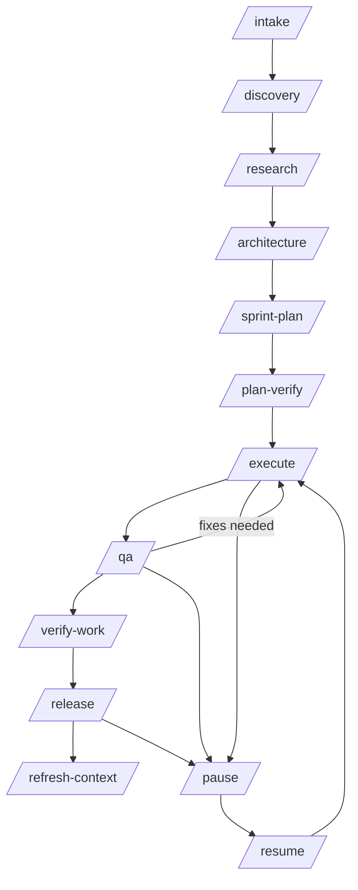
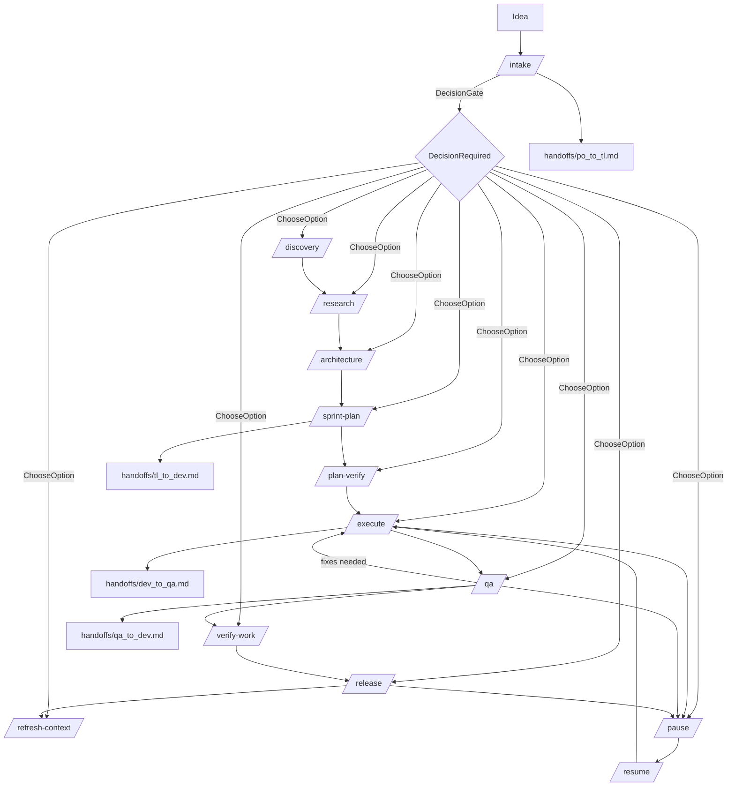
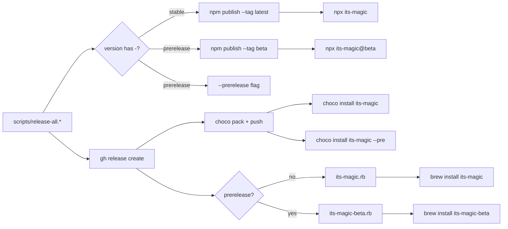
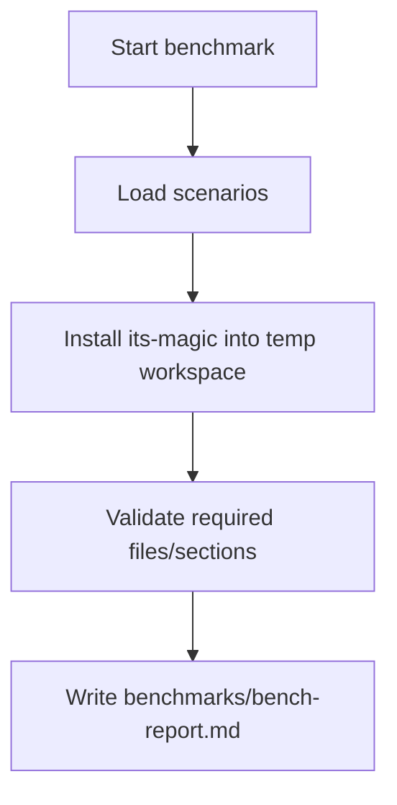
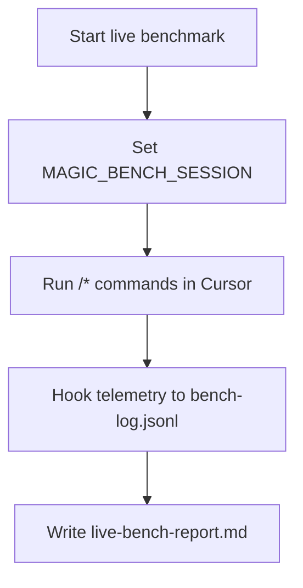
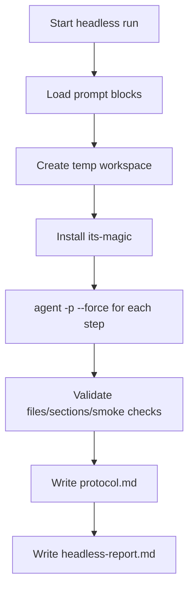

# its-magic — AI dev team

[GitHub Repository](https://github.com/fl0wm0ti0n/its-magic)

Happy coding! Build something awesome.

Drop-in template repo that implements a structured its-magic workflow in Cursor:
intake -> discovery -> architecture -> sprint plan -> execute -> QA -> release,
with pause/resume, decision gates, and persistent artifacts.

## Features (what its-magic can do)

- Structured phase workflow with explicit artifacts.
- Artifact-first memory (state in files, not chat only).
- Decision gate + escalation (`decisions/DEC-xxxx.md`).
- Pause/resume with checkpoints (`handoffs/resume_brief.md`).
- Automated execute/QA loop with safety caps (optional).
- 3-layer quality chain: AI loop → local validate-and-push → CI auto-fix.
- User-visible metadata guard for operator-facing scripts/CLI (`US-0071` / `DEC-0053`):
  `python scripts/check-user-visible-metadata.py` (see `docs/engineering/runbook.md`).
- CI/CD templates driven by `docs/engineering/runbook.md`.
- Team-friendly local overrides (`scratchpad.local.md`).
- Optional remote/docker execution and autonomous installs.
- Built-in benchmarks (live, prompted, headless).
- Multiplatform distribution (npm, Chocolatey, Homebrew).

## Setup

its-magic is an installer you run once per repo. It copies the AI dev team
workflow files (`.cursor/` commands, rules, agents, hooks, skills, plus `docs/`,
`sprints/`, `handoffs/`, etc.) into your project.

Starter artifacts are shipped as clean placeholders (no preloaded sprint/demo
history), so `/intake` starts from your own idea.

### 1) Install its-magic (once)

Pick one method:

| Method | Install command |
|--------|----------------|
| npm    | `npm install -g its-magic` |
| npx    | `npx its-magic --target . --mode missing` |
| Chocolatey | `choco install its-magic` (Admin shell) |
| Homebrew | `brew tap USER/tap && brew install its-magic` |

### Global Linux install: empty `install_include_paths` (CRLF manifest)

If **`its-magic --target <repo> --mode missing`** fails with **`[INSTALL_MANIFEST_ERROR] install_include_paths section is empty`** on Debian/Linux while the packaged manifest still lists paths, the global install likely has **CRLF** line endings in **`installer-owned-paths.manifest`** (visible as **`^M$`** with **`cat -A`**). **Fix in-tree** from **`0.1.2-41`**: **`installer.sh`** strips trailing carriage returns before section matching; **`.gitattributes`** keeps **`*.manifest`** LF; **`prepublishOnly`** runs **`guard_installer_publish`**. **Upgrade**: install a build **≥ `0.1.2-41`** (or reinstall from a fresh **`npm pack`** tarball after pull). Older tarballs such as **`its-magic@0.1.2-40`** may remain broken until republished — see **`docs/engineering/architecture.md`** **`# BUG-0008`**.

### 2) Apply to a repo

New repo:

```bash
mkdir my-project && cd my-project
git init
its-magic --target . --mode missing --create
```

Existing repo (safe merge):

```bash
its-magic --target . --mode missing
```

Existing repo (overwrite + backup):

```bash
its-magic --target . --mode overwrite --backup
```

### Upgrading an existing repo

When you update its-magic to a newer version (`npm update -g its-magic`), run
upgrade mode to update framework files while preserving your project data:

```bash
its-magic --target . --mode upgrade
```

What upgrade does:

- **Framework files** (commands, rules, agents, hooks, skills, CI, scripts) are
  updated to the latest version.
- **User data** (docs, sprints, handoffs, decisions, runbook) is never touched.
- **Mixed files** (`README.md`) are preserved. If the template version has new
  content, a review notice is printed.
- **Scratchpad baseline (DEC-0055 / US-0073, Model B):** `.cursor/scratchpad.md`
  is not copied as a manifest file; the installer **materializes** it from the
  packaged template when missing and validates required merged keys (Python
  required). Legacy repos that already committed `.cursor/scratchpad.md` keep it on
  upgrade (not overwritten).
- A canonical version marker is stored at `its_magic/.its-magic-version` in your repo.
- Installer bootstrap is OS-aware + stack-aware for runbook command defaults
  (`TEST_COMMAND`, optional `LINT_COMMAND`/`TYPECHECK_COMMAND`) and preserves
  explicit user overrides.

Upgrade with backup (backs up framework files before updating):

```bash
its-magic --target . --mode upgrade --backup
```

### 3) Open in Cursor

1. Open the project folder
2. Run `/intake` with your idea
3. Follow the workflow

### CLI quick commands

```bash
# Show banner + help
its-magic

# Show version only
its-magic --version

# Install workflow files into current repo
its-magic --target . --mode missing

# Clean previously installed workflow artifacts
its-magic --clean-repo --target .
```

### Installer options

**Install options**

| Flag | Description |
|------|-------------|
| `--target <path>` | Path to the repository where workflow files are installed. If omitted you are prompted interactively. |
| `--mode missing` | **Default.** Only copy files that do not exist yet. Safe for repos that already have some workflow files. |
| `--mode overwrite` | Replace every file, even if it already exists. Combine with `--backup` to keep a snapshot first. |
| `--mode interactive` | Ask per file whether to overwrite or skip. Useful when you want to cherry-pick updates. |
| `--mode upgrade` | Update framework files (commands, rules, agents, hooks, skills, CI, scripts) while preserving user data (docs, sprints, handoffs, decisions). Use after updating its-magic to a newer version. |
| `--backup` | Before overwriting, save existing files to `backups/<timestamp>/`. Ignored in `missing` mode (nothing gets replaced). |
| `--create` | Create the target directory if it does not exist. |

**Clean options**

| Flag | Description |
|------|-------------|
| `--clean-repo` | Remove installer-owned its-magic workflow artifacts from the target repo (manifest-owned paths including `.cursor`, `docs/product`, `docs/engineering`, `docs/user-guides`, `sprints`, `handoffs`, `decisions`, workflow scripts, CI files, installer metadata in `its_magic/`, and legacy `.its-magic-version`). Your own source code is never touched. |
| `--yes` | Skip the confirmation prompt when cleaning. |

**Info**

| Flag | Description |
|------|-------------|
| `--help`, `-h` | Show banner, version, repo URL, and full usage reference. |
| `--version`, `-v` | Print the installed its-magic version and exit. |

### Lifecycle QA matrix (US-0041)

`its-magic` lifecycle behavior is validated in both installer and CLI paths.
Primary coverage:

| Scenario | Local coverage | CI coverage | Expected evidence |
|---|---|---|---|
| Fresh install (`missing`) | `tests/run-tests.ps1`, `tests/run-tests.sh` | npm/brew/choco jobs | Required files + `its_magic/.its-magic-version` |
| Overwrite + backup | `tests/run-tests.ps1`, `tests/run-tests.sh` | lifecycle subset in CI jobs | Backup snapshot contains overwritten framework file |
| Upgrade lifecycle | `tests/run-tests.ps1`, `tests/run-tests.sh`, npm local package tests | lifecycle subset in CI jobs | Framework file restored, user-data preserved |
| Clean-repo safety | `tests/run-tests.ps1`, `tests/run-tests.sh`, npm local package tests | lifecycle subset in CI jobs | Framework artifacts removed, non-framework marker preserved |
| Negative-path invalid mode/args | `tests/run-tests.ps1`, `tests/run-tests.sh` | lifecycle subset in CI jobs | Non-zero fail-fast behavior |

Run locally:

```bash
sh tests/run-tests.sh
powershell -ExecutionPolicy Bypass -File tests/run-tests.ps1
```

## How-to

### Command usage pattern

- Best practice: use `/<command>` + 1-3 lines context.
- For quick ops (`/pause`, `/resume`, `/refresh-context`) command-only is fine.

### What gets installed

```text
your-project/
  .cursor/commands/          Cursor slash commands
  .cursor/rules/             AI behavior rules
  .cursor/agents/            Subagent definitions
  .cursor/skills/            Reusable skills
  .cursor/hooks/             Automation hooks
  .cursor/scratchpad.md      Materialized shared defaults (Model B; not manifest-copied)
  .cursor/scratchpad.local.example.md   Framework default key catalog
  docs/                      Engineering & product docs, runbook
  sprints/                   Sprint tracking artifacts
  handoffs/                  Phase handoff artifacts
  decisions/                 Decision records
  scripts/validate-and-push.ps1   Local test-fix-push loop (Windows)
  scripts/validate-and-push.sh    Local test-fix-push loop (Linux/Mac)
  .github/workflows/         CI with auto-fix loop
  README.md
```

### Team mode local overrides (recommended)

Use three layers (merge precedence: **local > materialized baseline > example**,
`DEC-0055`):

- Framework catalog: `.cursor/scratchpad.local.example.md` (installed; refreshed on upgrade)
- Shared team baseline: `.cursor/scratchpad.md` (materialized on install when missing; commit as you prefer)
- Personal overrides: `.cursor/scratchpad.local.md` (gitignored; never overwritten by install/upgrade)

Setup:

1. Run `its-magic` — baseline is materialized and merged validation runs (requires Python on PATH for `installer.ps1` / `installer.sh`).
2. Optionally copy `.cursor/scratchpad.local.example.md` to `.cursor/scratchpad.local.md` for personal values (`TEAM_MEMBER`, `ACTIVE_TASK_IDS`, …).

Recovery if `.cursor/scratchpad.md` is missing or merge validation fails:

```bash
python installer.py --scratchpad-postinstall --target . --mode missing
```

Upgrade behavior (US-0057 / DEC-0057):
- Aligns with **DEC-0039** (example vs local ownership), **DEC-0057** (example-first
  ordering relative to baseline materialization), and Model B baseline rules below.

- `.cursor/scratchpad.local.example.md` is framework-owned and always refreshed from
  the shipped template during post-install **before** baseline handling (`DEC-0057` **AC-1..AC-3**).
- `.cursor/scratchpad.local.md` is user-owned and preserved on `--mode upgrade`.
- Existing `.cursor/scratchpad.md` is left untouched on upgrade unless missing (then
  materialized) or `overwrite` / fresh materialize paths apply (Model B).
- Installer output uses `[SCRATCHPAD_LAYER]` lines to distinguish example refresh,
  baseline materialize/skip, and user-local preservation (`DEC-0057` **AC-5**).
- Paired catalog parity (baseline vs `.cursor/scratchpad.local.example.md`, active and
  `template/`): `python scripts/check-scratchpad-pair-parity.py --repo .` (wired into
  `tests/run-tests.ps1` / `tests/run-tests.sh`; **AC-11**).

Deterministic ordering behavior (US-0058):
- Mutable artifacts follow `docs/engineering/artifact-ordering-policy.md`.
- `state.md` checkpoints are append-bottom; `backlog.md` and `acceptance.md`
  remain sorted-canonical by story ID.
- Commands fail closed on ambiguous placement anchors using
  `ARTIFACT_ORDERING_ANCHOR_AMBIGUOUS`.
- Commands fail closed on non-monotonic state checkpoint timestamps using
  `STATE_TIMESTAMP_NON_MONOTONIC`.

Intake runtime safety behavior (US-0059):
- `/intake` requires role-specific `po` capability by default and fails fast with
  `SUBAGENT_CAPABILITY_UNAVAILABLE` when unavailable.
- Silent in-band fallback is disabled by default and only allowed with explicit
  `INTAKE_SUBAGENT_FALLBACK=allow`.
- Drift detection distinguishes self-write updates from external concurrent
  writers; true conflicting external writes fail safe with
  `INTAKE_CONCURRENT_WRITER_DETECTED`.

Runtime QA autopilot behavior (US-0065):
- Generated-project QA must include runtime proof chain:
  `startup -> readiness/connectivity -> log scan -> bounded retry -> verdict`.
- Deterministic runtime fail codes:
  `RUNTIME_STARTUP_FAILED`, `RUNTIME_ENDPOINT_UNREACHABLE`,
  `RUNTIME_LOG_CRITICAL_DETECTED`, `RUNTIME_RETRY_BUDGET_EXHAUSTED`,
  `RUNTIME_STACK_PROFILE_UNRESOLVED`.
- Runtime evidence must include startup command/profile, runtime mode
  (`local|remote`), health result, retry ledger, and log severity summary.
- Stack-aware runtime profile resolution is required for Node/Python/Go/Java/.NET;
  unresolved stacks fail closed (no generic silent PASS fallback).
- For webapp contexts, QA includes browser-surface verification with
  console/network error signals.

Generated test scaffolding + auto-run behavior (US-0066):
- `/execute` resolves stack profile (`node|python|go|java|dotnet`) and generates
  missing baseline unit/integration/acceptance tests only.
- Generation is non-destructive by default: preserve user-authored tests/config,
  fill only missing baseline assets, keep reruns idempotent.
- `TEST_COMMAND` wiring is deterministic:
  - preserve existing non-empty user command,
  - set stack baseline only when command is missing/unset.
- `/qa` automatically runs the generated baseline tests and records deterministic
  evidence (`command`, `result`, `output ref`, `generated paths ref`).
- Fail-closed scaffold diagnostics:
  `TEST_SCAFFOLD_STACK_UNRESOLVED`,
  `TEST_SCAFFOLD_UNSUPPORTED_STACK`,
  `TEST_SCAFFOLD_GENERATION_FAILED`.
- Static baseline test pass does not bypass runtime autopilot; runtime verdict
  remains mandatory for QA PASS.

## Commands and workflow

### Core commands

- `/ask`: ask questions using project context (read-only, no artifacts created).
- `/intake`: capture idea, backlog, acceptance.
- `/discovery`: collect UX/product references.
- `/research`: risks, patterns, dependencies.
- `/architecture`: technical approach and decisions.
- `/sprint-plan`: sprint and task list.
- `/plan-verify`: acceptance coverage check.
- `/execute`: implement tasks.
- `/qa`: test and report findings.
- `/verify-work`: UAT.
- `/release`: release notes + runbook updates.
- `/memory-audit`: read-only memory drift check with advisory report.
- `/pause`, `/resume`, `/refresh-context`.
- `/auto`: orchestration mode that spawns a fresh subagent per phase.

### Guided intake behavior (US-0033)

`/intake` supports two PO interaction modes via `.cursor/scratchpad.md`:

- `INTAKE_GUIDED_MODE=1` (default)
  - asks targeted follow-up only when needed for concrete acceptance
  - presents options/alternatives before recommendation
  - preserves user decision authority
  - runs intake-time research and persists R-xxxx evidence
- `INTAKE_GUIDED_MODE=0` (low-touch)
  - skips proactive follow-up/options/research overhead unless user requests it
  - still performs duplicate/overlap check against backlog

### Intake decomposition + risk-aware questioning (US-0051)

When guided mode is enabled, `/intake` now supports bounded decomposition for
broad/high-risk requests:

- runs deterministic breadth/risk heuristics (feature/workflow count,
  cross-cutting impact, acceptance breadth, unknown dependencies)
- proposes bounded multi-story decomposition when heuristics indicate broad
  scope; keeps single-story default for narrow scope
- enforces vertical-slice/workflow-step split quality (independently valuable,
  testable stories; avoid technical-layer-only splits by default)
- preserves user control before persistence: accept, merge, or adjust split
- asks additional targeted questions on high-risk/high-impact intake (not
  ambiguity-only), but keeps rounds bounded and concise
- keeps low-touch compatibility: no forced decomposition when
  `INTAKE_GUIDED_MODE=0` unless explicitly requested
- records decomposition/questioning evidence in intake artifacts
  (`docs/product/backlog.md`, `docs/product/acceptance.md`,
  `handoffs/po_to_tl.md`)

### Mandatory intake question packs (US-0068)

`/intake` now enforces deterministic minimum questionnaire packs before
backlog/acceptance persistence:

- `first-intake-pack` for first/new/broad requests
- `small-intake-pack` for narrow follow-up requests

Fail-closed coverage behavior:

- required topic answers must be covered for the selected pack before write
- unknown/ambiguous stack cues fail closed to `first-intake-pack`
- persistence blocks with deterministic reason codes when required coverage is
  incomplete and assumptions are not explicitly confirmed

Deterministic reason codes:

- `INTAKE_REQUIRED_TOPIC_MISSING`
- `INTAKE_REQUIRED_PACK_INCOMPLETE`
- `INTAKE_ASSUMPTION_CONFIRMATION_REQUIRED`
- `INTAKE_PERSISTENCE_BLOCKED`

Intake artifacts must persist coverage evidence fields:

- `asked_topics`
- `missing_topics`
- `assumptions_confirmed`

### Interactive intake evidence + validator (US-0078 / DEC-0060)

**US-0078** closes silent persistence: every intake that mutates backlog/acceptance must pass the
deterministic **`intake_evidence`** gate — **`topic_coverage`** with valid **`ie:`** refs,
asked-vs-covered alignment, and **`assumption_confirmation_ref`** when assumptions are affirmative.

- Run `python scripts/intake_evidence_validate.py --self-test` (also exercised via `tests/run-tests.*` §26k).
- **Packaged installs (BUG-0001 / DEC-0063)**: the intake gate modules (`intake_evidence_validate.py`, `intake_evidence_lib.py`, `intake_bug_routing_guard.py`) ship under **`template/scripts/`** and hydrate consumer repos at **`scripts/`** (npm **`files`**, Chocolatey/Homebrew **`template/`** tree, **`installer.ps1` / `installer.sh`** + **`installer-owned-paths.manifest`**). **`--mode upgrade`** treats them as framework files (added/updated like other shipped scripts). CI parity: **`python scripts/check_intake_template_parity.py --repo .`** (`tests/run-tests.*` §26N).
- Operator docs: **`decisions/DEC-0060.md`**, **`docs/engineering/architecture.md`** **`# US-0078`**, runbook section **Interactive intake evidence validation (US-0078 / DEC-0060)**.
- **Guided** and **low-touch** share the **same pre-persistence validation pipeline**; low-touch does not bypass mandatory pack coverage.

### Bug issues + intake routing (US-0079 / DEC-0061)

Defects use **`BUG-####`** under **`docs/product/backlog.md`** **`## Bug issues (canonical)`** with **`OPEN`/`DONE`** only and minimum reproducibility fields. Intake must not silently file defect prose as **`US-xxxx`**: set merged scratchpad **`INTAKE_WORK_ITEM_KIND=bug`** and/or use **`/intake bug`**, then run **`python scripts/intake_bug_routing_guard.py --kind story --file <prose.txt>`** before story allocation when in doubt.

- Validators: `python scripts/bug_issue_validate.py --self-test`; `python scripts/bug_issue_validate.py --backlog docs/product/backlog.md --check-acceptance`.
- Operator docs: **`decisions/DEC-0061.md`**, **`docs/engineering/architecture.md`** **`# US-0079`**, runbook **Bug issues (US-0079 / DEC-0061)**.

### Optional ID namespace bootstrap (US-0052)

Fresh-project ID bootstrap behavior is explicit and default-off:

- `ID_NAMESPACE_BOOTSTRAP=0|1` in `.cursor/scratchpad.md` (default `0`)

When enabled (`1`), workflows use deterministic freshness checks before first ID
creation:

- no `US-` IDs in `docs/product/backlog.md`
- no `DEC-` IDs in `docs/engineering/decisions.md` / `decisions/DEC-*.md`
- no `R-` IDs in `docs/engineering/research.md`

If eligible, first IDs start at `US-0001`, `DEC-0001`, and `R-0001`. If not
eligible (or mode is off), generation continues from highest existing IDs.
Historical IDs are never rewritten or renumbered. Ineligible bootstrap requests
emit deterministic diagnostic `ID_BOOTSTRAP_NOT_FRESH`.

### Context compaction + tiered token profile (US-0053)

Token-cost behavior is controlled by `.cursor/scratchpad.md`:

- `TOKEN_PROFILE=lean|balanced|full` (default `balanced`)

Profile behavior:

- `lean`: reduce non-critical overhead defaults (automation/research/context
  breadth) while keeping mandatory quality gates intact.
- `balanced`: preserve current capabilities with moderate overhead.
- `full`: maximize context breadth/autonomy for high-uncertainty work.

Manual override precedence:

- Explicit scratchpad flag values override profile defaults for that flag.
- Profile mode never disables mandatory `/qa` -> `/verify-work` -> `/release`
  gate semantics.

Compaction behavior:

- `docs/engineering/state.md` is the active hot surface.
- Historical checkpoints move to append-only packs under
  `docs/engineering/state-archive/`.
- `docs/engineering/decisions.md` stays a compact index with bounded summaries
  and canonical links to `decisions/DEC-xxxx.md`.
- Enforced rollover thresholds:
  - `STATE_HOT_MAX_LINES` (default `1200`)
  - `STATE_HOT_MAX_CHECKPOINTS` (default `80`)
  - `PO_TO_TL_HOT_MAX_LINES` (default `800`)
  - `PO_TO_TL_HOT_MAX_SECTIONS` (default `60`)
  - `ARCH_HOT_MAX_LINES` (default `3500`)
  - `ARCH_HOT_MAX_STORY_SECTIONS` (default `120`)
  Triad hot surfaces (`state.md`, `handoffs/po_to_tl.md`,
  `docs/engineering/architecture.md`) must stay within merged scratchpad caps.

### Token-cost measurement and low-cache patterns (US-0080 / DEC-0062)

- Prefer **fresh subagent/chat boundaries** per `/auto` phase spawn (see `.cursor/commands/auto.md`).
- Use explicit **`/auto start-from=<phase>`** when resuming so **`resolved_phase_plan`**
  intersection stays deterministic (**`DEC-0052`**).
- Select **`TOKEN_PROFILE=lean`** when compatible with your work to reduce scratchpad-driven
  breadth; mandatory gates (**`US-0048`**, **`US-0056`**, **`US-0069`**, **`US-0039`**) stay on.
- **Comparable** cache-read baselines require identical **`run_class_hash`**; otherwise
  **`TOKEN_COST_RUN_CLASS_MISMATCH`** (no cross-plan gaming).
- Committed metrics: **`handoffs/token_cost_runs/<orchestrator_run_id>.md`**; link from
  **`docs/engineering/state.md`** via **`token_cost_evidence_ref`**.
- Tooling: **`scripts/token_cost_lib.py`**, **`scripts/token_cost_compare.py`**,
  **`python scripts/check_token_cost_parity.py --repo .`**.
  Use `python scripts/enforce-triad-hot-surface.py --check` before completing a
  phase that mutates them; use `--rollover` to archive oldest material into
  deterministic packs when over cap (DEC-0054).
  Archive verification mismatch fails with
  `STATE_ARCHIVE_VERIFICATION_FAILED`.

### Cross-phase artifact ownership guard (US-0061)

To prevent accidental history loss across workflow phases:

- canonical ownership policy: `docs/engineering/artifact-ownership-policy.md`
- non-authorized phases must not delete or rewrite other-phase owned sections
- `docs/engineering/architecture.md` is history-preserving (append or
  target-section-only mutation)
- deterministic fail-safe diagnostics:
  `PHASE_OWNERSHIP_VIOLATION`,
  `PHASE_OVERRIDE_EVIDENCE_MISSING`,
  `ARCH_HISTORY_DELETION_DETECTED`

`/ask` policy (read-only):

- question-scoped retrieval first
- targeted sections before broad file reads
- bounded expansion only when unresolved
- explicit "not found in artifacts" when still unresolved

### Configurable multi-target publish + confirmation gate (US-0054)

Post-release publish behavior is configurable per repository:

- `RELEASE_PUBLISH_MODE=disabled|confirm|auto` (default `confirm`)
- `RELEASE_TARGETS_FILE=docs/engineering/release-targets.json`
- `RELEASE_TARGETS_DEFAULT=` optional comma-separated default targets

Supported target types include:

- `npm`, `choco`, `brew`, `git`, `docker`, `cloud`
- `custom` (generic command target)
- `ssh` (generic server deployment over SSH)
- Connectivity metadata for remote/local operator context:
  - `runtime.mode` (`local|remote`)
  - endpoint fields (`domainEnv|ipEnv|hostEnv`, `port`, `protocol`)
  - optional Traefik/ingress metadata
  - optional `dockerOverSsh` contract for remote Docker execution over SSH

Safety defaults:

- Mandatory `/release` gates are unchanged and must pass first.
- `confirm` mode enforces explicit operator approval before publish execution.
- Sensitive values are env-referenced (for example `tokenEnv`, `authEnv`), not
  inline literals.
- Remote connectivity config errors fail fast with
  `REMOTE_CONNECTIVITY_CONFIG_INVALID`.
- Release/QA outputs use canonical operator connectivity doc:
  `docs/engineering/runtime-connectivity.md`.

### Deterministic status reconciliation command (US-0055)

Use `/status-reconcile` to normalize status drift between canonical and derived
workflow artifacts before continuation:

- canonical source: `docs/product/backlog.md` story status
- derived targets: `docs/product/acceptance.md`, `docs/engineering/state.md`,
  `handoffs/resume_brief.md`
- deterministic outcomes: apply/no-op/fail-safe reason codes with audit evidence
  in `docs/engineering/status-normalization-report.md`

This command is the bounded repair counterpart to `/memory-audit`
(read-only detection).

### Optional cross-repo observability (US-0034)

Use optional compatibility visibility with default-safe off behavior:

- `CROSS_REPO_OBSERVABILITY=0|1` (default `0`)
- `COMPATIBILITY_GATE_ON_CRITICAL=0|1` (default `1`)
- `COMPATIBILITY_SOURCES=` monitored `repo/module/contract/docs` declarations

When disabled (`0`), workflow adds zero required compatibility overhead.

When enabled (`1`), compatibility signals/findings are tracked in:

- `docs/engineering/compatibility-signals.md`
- `docs/engineering/compatibility-report.md`
- `docs/engineering/manifests/registry.manifest.yaml`
- `docs/engineering/manifests/repo.manifest.yaml`

If unresolved critical findings remain and
`COMPATIBILITY_GATE_ON_CRITICAL=1`, release progression must stop for a
decision gate (`COMPATIBILITY_CRITICAL_OPEN`).

### Optional component-scoped execution (US-0035)

Enable scoped workflow behavior with:

- `COMPONENT_SCOPE_MODE=0|1` (default `0`)
- `TARGET_COMPONENTS=<comma-separated-component-ids>`

When disabled (`0`), workflow adds zero required scope overhead.

When enabled (`1`):

- Scope declaration is tracked in `docs/engineering/component-scope.md`.
- Sprint tasks should declare target components and expected impacted interfaces.
- QA records unaffected-component protection checks in
  `docs/engineering/component-scope-report.md`.
- Unapproved out-of-scope impact must block release via decision gate
  (`COMPONENT_SCOPE_VIOLATION_UNAPPROVED`).

### Optional spec-pack documentation (US-0031)

Optional Design Concept, CRS, and Technical Specification artifacts are
controlled by:

- `SPEC_PACK_MODE=0|1` (default `0`)

When disabled (`0`), intake/architecture/execute/qa/release add no required
spec-pack steps (zero overhead).

When enabled (`1`):

- Canonical paths per story: `docs/engineering/spec-pack/<story_id>-design-concept.md`,
  `docs/engineering/spec-pack/<story_id>-crs.md`,
  `docs/engineering/spec-pack/<story_id>-technical-specification.md`.
- Minimum required sections and ownership are in `docs/engineering/runbook.md`.
- Release gate validates completeness and blocks with `SPEC_PACK_INCOMPLETE` when
  required sections are missing.

### Optional user-guide documentation (US-0032)

Optional per-feature user guides (end-user how-to docs) are controlled by:

- `USER_GUIDE_MODE=0|1` (default `0`)

When disabled (`0`), intake/architecture/sprint-plan/execute/qa/release add no
required user-guide steps or blocking checks (zero overhead).

When enabled (`1`):

- Canonical path per feature story: `docs/user-guides/US-xxxx.md`.
- Minimum required sections: Purpose, Prerequisites, Usage steps, Example,
  Limitations, Troubleshooting (see `docs/engineering/runbook.md` and
  `docs/user-guides/README.md`).
- Release gate validates guide completeness and blocks with `USER_GUIDE_INCOMPLETE`
  when enabled and required sections are missing.
- User guides are end-user only; they do not duplicate spec-pack (US-0031) content.

### Release notes model (US-0040)

Release history is sprint-scoped and queue-backed:

- Canonical sprint notes: `handoffs/releases/Sxxxx-release-notes.md`
- Canonical queue tracker: `handoffs/release_queue.md`
- Legacy compatibility pointer: `handoffs/release_notes.md`

Deterministic release semantics:
- Only target sprint artifacts/queue row may be mutated during one `/release` run.
- Entering release flow sets target row to `unreleased`.
- Successful finalization transitions same row to `released`.
- Unresolved sprint identity or queue/notes mismatch fails closed with reason
  codes and remediation guidance; no destructive reconciliation by default.

### Post-QA release issue workflow (US-0042)

Release gate chain (US-0039): `/release` enforces mandatory gates in order — check-in test, QA completion, UAT completion — then finalization. Blank optional runbook keys (`LINT_COMMAND`, `TYPECHECK_COMMAND`) do not block release; they are reported as skipped.

If a problem appears **after QA** (during `/release`), record it separately from
QA findings:

- Release findings artifact: `sprints/Sxxxx/release-findings.md`
- Release-to-dev handoff: `handoffs/release_to_dev.md`

Boundary:
- QA-phase issues -> `sprints/Sxxxx/qa-findings.md`
- Post-QA release-gate issues -> `sprints/Sxxxx/release-findings.md`

Each blocked release finding should include reason code, evidence refs,
remediation, and rerun criteria.

### Backlog reconciliation invariant (US-0043)

Release completion must not leave stale backlog status for target sprint stories.
At release finalization:

- reconcile target story status to `DONE` using canonical release evidence;
- reconcile target story acceptance checkboxes to checked state;
- mutate only target sprint stories (never unrelated backlog entries);
- fail safe with `BACKLOG_STATUS_DRIFT` if contradiction remains (e.g. released
  sprint but backlog still `OPEN`/unchecked).

### Canonical story status + normalization guard (US-0045)

- `docs/product/backlog.md` is canonical for story `OPEN|DONE` status.
- `docs/product/acceptance.md` and `docs/engineering/state.md` are derived views
  reconciled from canonical backlog status plus release evidence.
- One-time normalization baseline is recorded in
  `docs/engineering/status-normalization-report.md`.
- Contradictory resolution at release/reconciliation boundaries fails safe with:
  - `BACKLOG_STATUS_DRIFT`
  - `CANONICAL_STATUS_CONFLICT`

### Agent isolation model

- Every phase command runs in a fresh agent/subagent context.
- Handoff files are the only cross-phase memory (`handoffs/*.md` + artifact
  files).
- Never rely on "ignore prior chat"; use a new context boundary instead.
- `/auto` is orchestration only: it calls phase subagents and transfers context
  through artifacts.

#### Per-phase isolation evidence (US-0048 / DEC-0029)

Isolation is enforced with auditable evidence written to `docs/engineering/state.md`.
Each phase run appends:

- `phase_id`, `role`, `fresh_context_marker`, `timestamp`, `evidence_ref`

Missing/invalid/stale evidence fails closed with reason codes:
`PHASE_CONTEXT_ISOLATION_MISSING`, `PHASE_CONTEXT_ISOLATION_VIOLATION`,
`ISOLATION_EVIDENCE_STALE`, `ISOLATION_EVIDENCE_INVALID`.

#### Strict runtime proof (US-0056 / DEC-0038)

Per-phase isolation also requires strict runtime attestation tuples at
boundaries (not artifact fields alone):

- `orchestrator_run_id`, `runtime_proof_id`, `phase_id`, `role`
- `proof_issued_at`, `proof_ttl_seconds`, `proof_hash`

Fail-closed reason codes:
`RUNTIME_PROOF_MISSING`, `RUNTIME_PROOF_INVALID`, `RUNTIME_PROOF_REUSED`,
`RUNTIME_PROOF_STALE`, `RUNTIME_PROOF_AMBIGUOUS_LINK`.

`/auto`, `/verify-work`, and `/release` must validate these tuples before
continuation/finalization.

#### `/auto` phase→role enforcement (US-0069 / DEC-0051)

`/auto` uses a deterministic **phase→role matrix** plus scratchpad alternates
(`AUTO_ROLE_RESEARCH`, `AUTO_ROLE_PLAN_VERIFY`, `AUTO_ROLE_REFRESH_CONTEXT`).
Before each phase spawn it runs a **preflight capability gate**; missing
capability stops with `PHASE_ROLE_CAPABILITY_MISSING` (no unrelated-role
substitution). After each phase, isolation `role` and strict-proof `role` must
match the same expected role or the run stops with `PHASE_ROLE_MISMATCH`.
`execute` defaults to `dev`; non-`dev` requires
`AUTO_EXECUTE_ROLE_OVERRIDE=allowed_non_dev_execute` **and**
`EXECUTE_OVERRIDE_GOVERNANCE_REF` pointing to a parseable approved waiver. See
`docs/engineering/runbook.md` and `decisions/DEC-0051.md`.

#### `/auto` phase selection policy (US-0070 / DEC-0052)

`/auto` builds a **resolved phase plan** from scratchpad before spawning phases:
exactly one of `AUTO_PHASE_PLAN` (default `full`), `AUTO_PHASE_EXCLUDE`,
`AUTO_PHASE_INCLUDE`, or `AUTO_PHASE_PROFILE` applies; conflicting selectors
stop with `PHASE_POLICY_CONFLICT`. Non-skippable safety gates (`qa`,
`verify-work`, `release`) and evidence-chain closure reinstate omitted phases
with breadcrumb reasons such as `non_skippable_gate`. `start-from` and resume
anchors **intersect** with the plan (`START_FROM_PHASE_PLAN_EMPTY_INTERSECTION`
when empty). Backlog-drain, bulk execute, and team-mode runs **recompute** the
plan each boundary. See `/auto`, `docs/engineering/runbook.md`, and
`decisions/DEC-0052.md`.

### Lightweight interaction

Use `/ask` when you want to query the project without triggering the workflow:

- "What's the current sprint status?"
- "Which stories are still open?"
- "How does the upgrade mode work?"
- "What decision was made about X?"

`/ask` reads the project artifacts (state, backlog, architecture, decisions, sprint
progress) and answers from them. It never creates or modifies files. If your question
reveals a bug or feature idea, it will suggest running `/intake`.

### Memory drift auditing

Use `/memory-audit` to check whether project memory artifacts still match
repository reality. This is a read-only, non-blocking command that produces an
advisory report at `docs/engineering/memory-drift-report.md`.

**When to run:**

- **Pre-handoff**: before writing any role handoff artifact.
- **Pre-QA**: before `/qa` or `/verify-work`.
- **Pre-release**: before `/release`.
- **Ad-hoc**: after external code changes, long pauses, or whenever artifacts
  feel stale.

**How to interpret output:**

The report contains a severity summary (`high` / `medium` / `low`) and a
findings table with concrete evidence for each inconsistency. High-severity
findings should be resolved before the next handoff or release. Medium and low
findings can be addressed during `/refresh-context` or the next sprint.

The report also includes a reference-only "Template drift" section. Template
drift remediation belongs to US-0017 — `/memory-audit` only flags it for
awareness.

**Follow-up commands:**

- `/refresh-context` — update stale artifacts.
- `/sprint-plan` — if new work is discovered.
- `/verify-work` — if acceptance status needs re-validation.
- `/intake` — if findings reveal a new story or bug.

### Workflow diagrams





### Automation modes

Configure in `.cursor/scratchpad.md`:

- `AUTO_FLOW_MODE=manual|auto_until_decision`  
  - `manual`: you trigger each phase/command yourself.  
  - `auto_until_decision`: `/auto` continues by spawning fresh phase subagents until a decision gate, blocker, or pause boundary.
- `PHASE_MODE=interactive|auto`  
  - `interactive`: agent asks clarifying questions more often.  
  - `auto`: agent minimizes prompts and proceeds with best effort.
- `PERMISSION_MODE=interactive|auto`  
  - `interactive`: ask before routine actions.  
  - `auto`: reduce routine permission prompts.
- `RUN_TESTS_ON_EDIT=0|1`  
  - `1`: runs configured tests after meaningful edits.  
  - `0`: tests only when you explicitly run QA/test phases.
- `LOOP_UNTIL_GREEN=0|1`  
  - `1`: keep iterating fix -> test until green (bounded).  
  - `0`: run one pass and report failures.
- `AUTO_IMPLEMENTATION_LOOP=0|1`  
  - `1`: enables execute -> QA -> execute loop automatically with new Dev/QA subagent instances on each cycle.
- `AUTO_LOOP_MAX_CYCLES=<n>`  
  - safety cap for auto loops (recommended `3-7`, default `5`).
- `AUTO_PAUSE_REQUEST=0|1`  
  - `1`: request graceful stop at next safe boundary.
- `AUTO_PAUSE_POLICY=after_task|after_phase`  
  - `after_task`: faster stop, more frequent boundaries.  
  - `after_phase`: cleaner checkpoints, fewer interruptions.

### Sync policy (US-0038)

Phase-triggered sync is policy-controlled and safe by default.

Scratchpad controls:

- `SYNC_POLICY_MODE=disabled|manual|by_phase|by_milestone|custom_phase_list`
- `SYNC_CUSTOM_PHASES=<comma-separated canonical phases>`
- `ALLOW_AUTO_PUSH=0|1`
- `AUTO_PUSH_BRANCH_ALLOWLIST=<comma-separated branches/patterns>`

Default-safe behavior:

- Default mode is `manual` with `ALLOW_AUTO_PUSH=0` (no automatic push).
- `disabled` and `manual` add near-zero overhead and preserve manual workflows.
- Sync policy is evaluated only at completed phase boundaries.

Guarded auto-push conditions (all must pass):

1. Boundary matches configured mode.
2. Auto-push is explicitly enabled (`ALLOW_AUTO_PUSH=1`).
3. QA-first safety holds (feature work cannot auto-push pre-QA).
4. No unresolved blocking QA findings/critical issues.
5. Branch safety holds (protected/default branches denied unless allowlisted).
6. Check chain passes (`TEST_COMMAND` required; optional lint/typecheck only if configured).

Deterministic reason codes include:
`SYNC_DISABLED`, `MANUAL_MODE_NO_AUTO`, `PRE_QA_AUTOPUSH_FORBIDDEN`,
`BLOCKING_QA_FINDINGS`, `BRANCH_NOT_ALLOWLISTED`, `TEST_COMMAND_MISSING`,
`TEST_FAILED`, `TEST_TIMEOUT`, `OPTIONAL_CHECK_FAILED`, `SYNC_PUSHED`.

### Full scratchpad reference (detailed)

- `MAGIC_CONTEXT_STRICT=0|1`  
  - `1`: enforces context refresh discipline after code edits.
- `DONE=0|1`  
  - `1`: stop hook reminder loops when session is complete.
- `MAGIC_BENCH_SESSION=<id>`  
  - enables live benchmark event logging under one session id.
- `AUTO_INSTALL_DEPS=0|1`  
  - `1`: agent may install dependencies/runtimes automatically.
- `AUTO_RELEASE_NOTES=0|1`  
  - `1`: auto-generate `handoffs/release_notes.md`.
- `REMOTE_EXECUTION=0|1`  
  - `1`: allow remote/docker execution if configured.
- `REMOTE_CONFIG=.cursor/remote.json`  
  - path to remote execution server config.

### Remote execution config (`.cursor/remote.json`)

Remote config is optional and mode-aware:

- `REMOTE_EXECUTION=0` (default): skip remote config checks entirely.
- `REMOTE_EXECUTION=1`: validate `.cursor/remote.json` first and fail fast on
  missing/malformed/invalid or insecure config.

Canonical contract (DEC-0016):

- Required root fields:
  - `version` (integer)
  - `defaultTarget` (string)
  - `targets` (array)
- Required target fields:
  - `id` (string)
  - `type` (`docker|ssh|vm`)
  - `enabled` (boolean)
  - `host` (string)
  - `port` (integer `1..65535`)
  - `workspaceRoot` (string)
- Optional:
  - `auth.mode` (`none|env`)
  - If `auth.mode=env`, use env-var references only (`tokenEnv`,
    `passwordEnv`, `privateKeyPathEnv`, ...).

Two safe target examples are shipped in:

- `.cursor/remote.json` (active repo)
- `template/.cursor/remote.json` (template parity copy)

The examples include:

- `local-docker`: local network/docker-like endpoint.
- `remote-vm-ssh`: remote VM/SSH-like endpoint.

No secrets policy:

- Never commit inline tokens/passwords/private keys in `remote.json`.
- Commit env-var reference names only.

Fail-fast error format:

- `[REMOTE_CONFIG_ERROR] <path>: expected <rule>, got <actual>. Fix: <hint>.`

Troubleshooting quick guide:

- Missing file in remote mode:
  - Create `.cursor/remote.json` from the template copy, or set
    `REMOTE_EXECUTION=0`.
- Invalid enum/type/range:
  - Update the failing field to match allowed values/ranges.
- Malformed JSON:
  - Fix JSON syntax and retry.
- Secret-like inline value detected:
  - Replace literal secret with an env-var reference field.

Team/local (recommended in `.cursor/scratchpad.local.md`):

- `TEAM_MODE=0|1`
- `TEAM_MEMBER=<your-id>`
- `ACTIVE_TASK_IDS=T-12,T-13`

### Automated feature loop (optional)

Enable:

- `AUTO_FLOW_MODE=auto_until_decision`
- `PHASE_MODE=auto`
- `PERMISSION_MODE=auto`
- `RUN_TESTS_ON_EDIT=1`
- `LOOP_UNTIL_GREEN=1`
- `AUTO_IMPLEMENTATION_LOOP=1`
- `AUTO_LOOP_MAX_CYCLES=5`

Then run `/auto`.

Graceful stop (for shutdown/end of day):

1. Set `AUTO_PAUSE_REQUEST=1`
2. Flow stops at next configured boundary (`AUTO_PAUSE_POLICY`)
3. `/pause` artifacts are written
4. Next day run `/resume` or `/auto`

### Recommended profiles

**Max automation (high autonomy):**

- `AUTO_FLOW_MODE=auto_until_decision`
- `PHASE_MODE=auto`
- `PERMISSION_MODE=auto`
- `RUN_TESTS_ON_EDIT=1`
- `LOOP_UNTIL_GREEN=1`
- `AUTO_IMPLEMENTATION_LOOP=1`
- `AUTO_LOOP_MAX_CYCLES=5`
- `AUTO_INSTALL_DEPS=1` (optional, if you trust auto installs)
- `AUTO_PAUSE_POLICY=after_phase`

**Safer automation (recommended for most teams):**

- same as above, but keep:
  - `PERMISSION_MODE=interactive`
  - `AUTO_INSTALL_DEPS=0`
  - `AUTO_PAUSE_POLICY=after_task`

### Quality chain (3-layer auto-fix)

its-magic provides a complete quality chain that catches issues at three levels.
Each layer catches problems the previous layer missed:

```text
┌─────────────────────────────────────────────────────────────────┐
│ Layer 1: Cursor AI loop (in-editor)              OFF by default │
│   AUTO_IMPLEMENTATION_LOOP + LOOP_UNTIL_GREEN                   │
│   execute → QA → fix → execute (bounded by AUTO_LOOP_MAX_CYCLES)│
└──────────────────────────┬──────────────────────────────────────┘
                           │ code ready to push
┌──────────────────────────▼──────────────────────────────────────┐
│ Layer 2: validate-and-push (local pre-push)      MANUAL (run it)│
│   scripts/validate-and-push.sh / .ps1                           │
│   test → format → lint-fix → test → commit + push               │
└──────────────────────────┬──────────────────────────────────────┘
                           │ pushed to GitHub
┌──────────────────────────▼──────────────────────────────────────┐
│ Layer 3: CI auto-fix (GitHub Actions)            OFF by default │
│   .github/workflows/ci.yml                                      │
│   test/lint → auto-fix → commit → re-run (up to 3 retries)     │
└─────────────────────────────────────────────────────────────────┘
```

| Layer | Default | Enable |
|-------|---------|--------|
| 1 - Cursor AI loop | off | Set `AUTO_IMPLEMENTATION_LOOP=1` + `LOOP_UNTIL_GREEN=1` in scratchpad |
| 2 - validate-and-push | manual | Run `scripts/validate-and-push.sh` or `.ps1` before pushing |
| 3 - CI auto-fix | off | Set `CI_AUTO_FIX: true` in `docs/engineering/runbook.md` |

CI itself (tests, lint, typecheck) always runs on push/PR. Only the **auto-fix
retry loop** is gated behind `CI_AUTO_FIX`. When disabled, CI still reports
failures -- it just won't try to fix and commit automatically.

All commands are read from `docs/engineering/runbook.md`. Fill in your
project-specific commands once and every layer uses them:

```text
TEST_COMMAND: npm test
LINT_COMMAND: npx eslint .
LINT_FIX_COMMAND: npx eslint --fix .
FORMAT_COMMAND: npx prettier --write .
CI_AUTO_FIX: true
```

#### Layer 1: Cursor AI loop

Enabled via scratchpad flags (see [Automation modes](#automation-modes)).
The AI runs execute → QA → fix cycles inside Cursor until tests pass or
the safety cap (`AUTO_LOOP_MAX_CYCLES`) is reached.

#### Layer 2: Local validate-and-push

Run before pushing to catch anything the AI loop missed. **Merged scratchpad** (see
`docs/engineering/runbook.md`, **Executable validate-and-push wiring (DEC-0058)**) gates
**`git push`**: default **`SYNC_POLICY_MODE=manual`** and **`ALLOW_AUTO_PUSH=0`** exit early
with a **reason code** (no push). Opt-in push requires an eligible mode, **`ALLOW_AUTO_PUSH=1`**,
a non-empty **branch allowlist** match, passing **runbook** checks, and bounded **QA** rules.

```bash
# Bash (Linux / macOS; bash required for this script)
bash scripts/validate-and-push.sh

# PowerShell (Windows)
powershell scripts/validate-and-push.ps1
powershell scripts/validate-and-push.ps1 -MaxAttempts 3
powershell scripts/validate-and-push.ps1 -DryRun
```

The script:
1. Evaluates merged scratchpad policy via **`python scripts/sync_push_gates.py`** (Python 3 on PATH)
2. Runs `FORMAT_COMMAND` and `LINT_FIX_COMMAND` to auto-fix what it can
3. Runs `LINT_COMMAND`, optional `TYPECHECK_COMMAND`, and `TEST_COMMAND` to verify (with `TEST_TIMEOUT_SECONDS` when `timeout`/`gtimeout` is available on Unix)
4. If checks fail, pauses and waits for you to fix
5. Re-runs (up to 5 attempts, configurable)
6. When green, re-checks allowlist + QA scan, then commits and pushes automatically (unless dry-run / no-commit)

Use `-NoCommit` (PowerShell), **`--dry-run`** first arg (Bash), or `false` as third arg (Bash) to skip **push**.
**Policy-only** interpretation of scratchpad sync flags is **deprecated** for these scripts; see **`decisions/DEC-0058.md`** (policy semantics remain **`DEC-0018`** / **`US-0038`**).

#### Layer 3: CI auto-fix (GitHub Actions)

**Disabled by default.** Set `CI_AUTO_FIX: true` in `docs/engineering/runbook.md`
to enable. When enabled and CI fails after a push, the auto-fix job kicks in:

```text
push / PR  ──>  checks  ──>  PASS  ──>  done
                   │
                  FAIL
                   │
             auto-fix job
                   │
          run LINT_FIX_COMMAND
          run FORMAT_COMMAND
                   │
             changes found?
            ╱              ╲
         yes                no
          │                  │
    commit + push       report failure
          │             (manual fix needed)
     CI re-runs
     (up to 3x)
```

Auto-fix commits appear as `ci: auto-fix attempt N/3`. After 3 retries the
workflow stops and points you to `scripts/validate-and-push` for local fixing.

## Walkthrough examples

### Example 1: New feature from idea

1. `/intake`
2. `/research`
3. `/architecture`
4. `/sprint-plan`
5. `/plan-verify`
6. `/execute`
7. `/qa`
8. `/verify-work`
9. `/release`
10. `/refresh-context`

### Example 2: Mid-flight idea change

1. Set `AUTO_PAUSE_REQUEST=1`
2. Run `/intake` to update story/acceptance
3. Re-run `/sprint-plan` + `/plan-verify`
4. Resume via `/auto`

### Example 3: Pause/resume

1. `/pause`
2. Close work
3. `/resume` next session

### Deterministic `/auto` continuation

When resuming mid-process, `/auto` resolves start phase deterministically:

1. explicit `/auto start-from=<phase>`
2. `handoffs/resume_brief.md`
3. conservative `docs/engineering/state.md` fallback
4. fail-fast (no guessing)

Canonical phases:
`intake`, `discovery`, `research`, `architecture`, `sprint-plan`,
`plan-verify`, `execute`, `qa`, `verify-work`, `release`, `refresh-context`.

Fail-fast message format:
`[AUTO_RESUME_ERROR] <code>: <summary>. Source=<source>. Fix: <action>.`

Compatibility and safety:
- Manual/interactive workflow stays unchanged unless `/auto` continuation is used.
- Existing stop conditions remain enforced (decision gate, missing input,
  pause request, loop max).

### Optional `/auto` backlog-drain mode (US-0044)

If you want `/auto` to continue across multiple planned stories in one run,
enable backlog-drain switches in `.cursor/scratchpad.md`:

- `AUTO_BACKLOG_DRAIN=1`
- `AUTO_BACKLOG_MAX_STORIES=<n>`
- `AUTO_BACKLOG_ON_BLOCK=stop|skip`
- `AUTO_STORY_SELECTION=priority_then_backlog_order`

Default-safe behavior remains unchanged with `AUTO_BACKLOG_DRAIN=0`.

### Explicit `/sprint-plan --bulk` mode (US-0046)

By default, `/sprint-plan` plans one scope at a time. For multi-story planning,
run explicit bulk mode:

- `/sprint-plan --bulk`

Bulk planning remains bounded and deterministic via `.cursor/scratchpad.md`:

- `SPRINT_BULK_MAX_STORIES=<n>`
- `SPRINT_BULK_MAX_SPRINTS=<n>`
- `SPRINT_BULK_SELECTION=priority_then_backlog_order`

Bounded stop reason codes:
`SPRINT_BULK_MAX_STORIES_REACHED`, `SPRINT_BULK_MAX_SPRINTS_REACHED`,
`SPRINT_BULK_NO_ELIGIBLE_STORIES`, `SPRINT_BULK_MISSING_ACCEPTANCE`.

### Explicit `/auto --execute-bulk` mode (US-0047)

Bulk execution is explicit-mode only. Default `/auto` behavior remains unchanged.

Enable either way:

- one-run explicit argument: `/auto --execute-bulk`
- scratchpad switch: `AUTO_EXECUTE_BULK=1`

Deterministic controls in `.cursor/scratchpad.md`:

- `AUTO_EXECUTE_MAX_ITEMS=<n>`
- `AUTO_EXECUTE_ON_BLOCK=stop|skip`
- `AUTO_EXECUTE_SELECTION=planned_then_priority`
- `AUTO_TEAM_SCOPE_ENFORCE=0|1`

Deterministic reason codes:
`EXEC_BULK_MAX_ITEMS_REACHED`, `EXEC_BULK_NO_ELIGIBLE_ITEMS`,
`EXEC_BULK_ITEM_BLOCKED_STOP`, `EXEC_BULK_ITEM_BLOCKED_SKIPPED`,
`EXEC_TEAM_SCOPE_BLOCKED`, `EXEC_TEAM_SCOPE_SKIPPED`.

Team-mode safety:
- In `TEAM_MODE=1`, bulk execute records `TEAM_MODE`, `TEAM_MEMBER`,
  `ACTIVE_TASK_IDS` in state breadcrumbs.
- With `AUTO_TEAM_SCOPE_ENFORCE=1`, out-of-scope tasks are blocked/skipped
  deterministically and never mutated.

### Example 4: Existing project onboarding

1. `/map-codebase`
2. Review generated mapping artifacts
3. Continue with `/intake` or `/architecture`

## Other useful capabilities

### Voice input (multilingual)

Voice is an input layer only; it feeds normal slash commands.

- OS dictation
- Cursor voice (if available)
- Local STT tooling

Reliable pattern:

- bind `/intake ` insertion shortcut
- dictate only the content after the command

### Repository layout (quick orientation)

- `.cursor/`: commands, rules, agents, hooks, skills, scratchpad.
- `docs/`: product + engineering docs.
- `sprints/`: sprint planning/tracking.
- `handoffs/`: role-to-role transfers.
- `decisions/`: decision records.
- `.github/workflows/`: CI/CD templates.

## Developer and release deep-dive

### CI/CD via runbook

Workflows read keys from `docs/engineering/runbook.md`:

- `TEST_COMMAND`
- `LINT_COMMAND`
- `TYPECHECK_COMMAND`
- `DEPLOY_STAGING_COMMAND`
- `DEPLOY_PROD_COMMAND`

Unset keys are skipped. The template ships with empty values for `LINT_COMMAND`,
`FORMAT_COMMAND`, and `TYPECHECK_COMMAND` -- this is intentional. its-magic is a
template/installer project; fill in your project-specific commands after setup.

US-0015 intent contract:
- Empty optional runbook keys are valid defaults for this repository type.
- They must not be treated as missing required configuration.

### Installer internals

- `installer.ps1` (Windows)
- `installer.sh` (macOS/Linux)
- `installer.py` (fallback)

Modes: `missing`, `overwrite`, `interactive`, `upgrade` (+ optional backup).

### Release automation

Unified release scripts:

- Windows: `scripts/release-all.ps1`
- macOS/Linux: `scripts/release-all.sh`

NPM helpers:

- `npm run release:all`
- `npm run release:all:patch|minor|major|beta|dry`
- `npm run release:npm-only|choco-only|brew-only`

Release script flow:

1. bump `package.json` version
2. publish npm
3. create GitHub release
4. update/publish Chocolatey package
5. update/push Homebrew formula (stable or beta)



Prereqs:

- `npm login`
- `gh auth login`
- Chocolatey API key (if choco publish)
- Homebrew tap repo for formula distribution

### Package manager installation matrix

| Manager    | Stable                                    | Beta / Pre-release                          |
|------------|-------------------------------------------|---------------------------------------------|
| npm/npx    | `npx its-magic --target . --mode missing` | `npx its-magic@beta --target . --mode missing` |
| Chocolatey | `choco install its-magic`                 | `choco install its-magic --pre`             |
| Homebrew   | `brew install USER/tap/its-magic`         | `brew install USER/tap/its-magic-beta`      |

### Release package contents

Published npm package includes runtime content only (commands/rules/agents/docs/installers).

Excluded from npm package:

- `benchmarks/`
- `tests/`
- `packaging/`
- `Plan.md`

### Benchmarks

- Main benchmark: `benchmarks/run-bench.ps1` or `benchmarks/run-bench.sh`
- Live benchmark: `benchmarks/live/run-live-bench.*`
- Prompted benchmark: `benchmarks/prompts/run-prompts.*`
- Headless benchmark: `benchmarks/headless/run-headless.*`

Reports:

- `benchmarks/bench-report.md`
- `benchmarks/live/live-bench-report.md`
- `benchmarks/headless/headless-report.md`
- `benchmarks/headless/protocol.md`







### Rules

- `core.mdc`: phase flow, context pack, pause/resume, remote usage.
- `quality.mdc`: small steps, tests/quality, optional auto-install.
- `coding-standards.mdc`: strict language best practices and code quality rules.
- `handoffs.mdc`: handoffs + state updates required.
- `escalation.mdc`: decision gate and stop conditions.

### Hooks

- `beforeShellExecution`: blocks dangerous commands.
- `beforeReadFile`: warns on secret-like files.
- `afterFileEdit`: tracks code edits vs context refresh.
- `stop`: reminds context refresh when needed.

### Artifacts (single source of truth)

- `docs/product/*`: vision, backlog, acceptance.
- `docs/engineering/*`: architecture, decisions, state, runbook.
- `sprints/Sxxxx/*`: sprint scope, tasks, progress, QA findings, summary.
- `decisions/*`: decision records.
- `handoffs/*`: role-to-role transfer notes.

## Purpose

This repository publishes the **its-magic** workflow kit: commands, rules, skills, and
documentation templates that teams install into their own repositories. The goal is a
repeatable, file-backed lifecycle from intake through release.

## Quickstart

Use [Setup](#setup) for install commands. First-time install:

```bash
npx its-magic --target . --mode missing --create
```

## Examples

- Upgrade an existing repo: `its-magic --target . --mode upgrade`
- Run check-in tests: use `TEST_COMMAND` from `docs/engineering/runbook.md` (often `sh tests/run-tests.sh`).

## Related documentation

- Operator commands and gates: `docs/engineering/runbook.md`
- Architecture and story contracts: `docs/engineering/architecture.md`
- Product backlog and acceptance: `docs/product/backlog.md`, `docs/product/acceptance.md`
- Optional spec-pack mode (`SPEC_PACK_MODE=1`): engineering design artifacts under `docs/engineering/` when your team enables it
- Optional user guides (`USER_GUIDE_MODE=1`): `docs/user-guides/` when enabled

## Limitations

- its-magic is a **process and documentation** framework; it does not replace your
  application runtime, hosting, or product-specific compliance work.
- Mixed files such as `README.md` are preserved on upgrade; review notices may appear when
  the template adds new sections.
- Documentation profile validation (`scripts/validate_doc_profile.py`) enforces audience and
  depth choices from the merged scratchpad (`DOC_AUDIENCE_PROFILE`, `DOC_DETAIL_LEVEL`).

## Contributing

Contributor-focused workflow and guardrails live in
[`docs/developer/README.md`](docs/developer/README.md).
